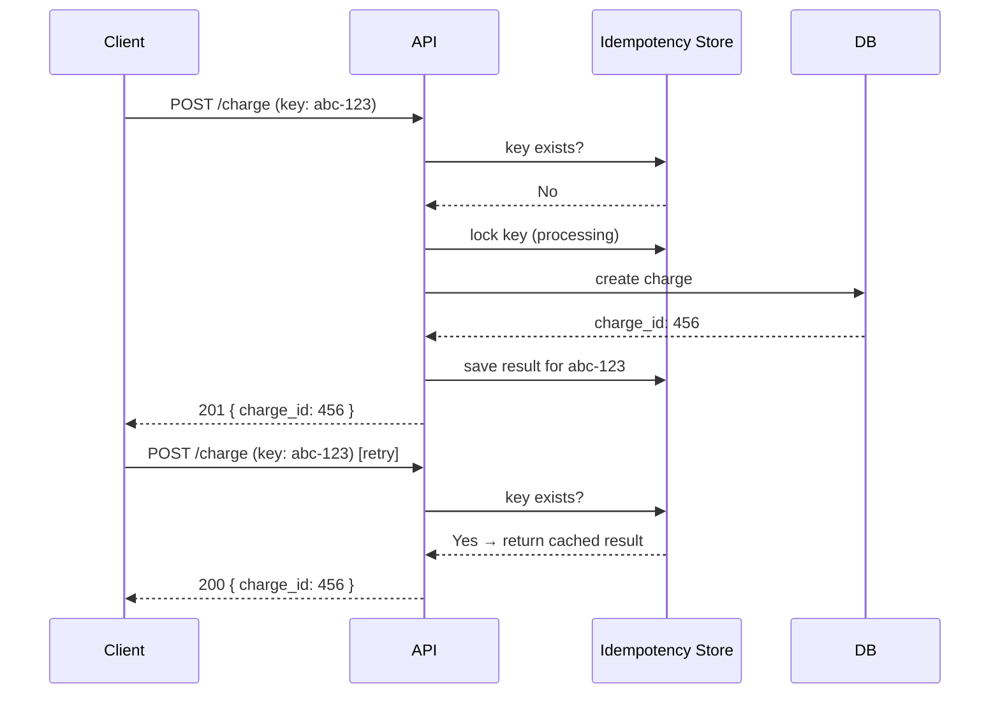

# 1. Idempotency

> **Think:** *"What if user clicks twice?"*

---

## The 4 Questions

| Question | Answer |
|----------|--------|
| **What problem does it solve?** | Duplicate operations — the same request executed more than once produces the same result as executing it once. |
| **What happens if I ignore it?** | Double payment, double booking, double refund, duplicate inventory deduction. |
| **Where would I use it?** | Travel bookings, ecommerce orders, payment systems, webhook handlers, any "create/charge/book" API. |
| **What companies use it?** | Stripe (Idempotency-Key header), Amazon (order deduplication), Uber (trip request dedup), MakeMyTrip/Booking.com (booking confirmation). |

---

## Mental Movie (60 seconds)

User taps **"Pay ₹12,499"**. Network is slow. They tap again. Two requests hit your server milliseconds apart.

**Without idempotency:** Two charges. Two hotel reservations. Support tickets. Refunds. Trust destroyed.

**With idempotency:** Second request sees "already processed for key `abc-123`" and returns the same success response. User sees one confirmation. One charge.

That's the entire concept. Everything else is implementation.

---

## How It Works

An operation is **idempotent** if calling it N times has the same effect as calling it once.

```
Request 1: POST /book  { idempotency_key: "abc-123" }  → 201 Created, booking_id: 789
Request 2: POST /book  { idempotency_key: "abc-123" }  → 200 OK, booking_id: 789 (same)
Request 3: POST /book  { idempotency_key: "abc-123" }  → 200 OK, booking_id: 789 (same)
```

### Common Implementation Pattern



**Key ingredients:**
1. **Client-generated key** — UUID sent with every mutating request
2. **Server-side store** — Redis or DB table mapping key → result
3. **TTL** — keys expire after 24–72 hours (Stripe uses 24h)
4. **Lock during processing** — prevent two parallel requests with same key from both executing

---

## Real-World Examples

### Your Travel Platform

**Scenario:** User books "Delhi → Goa, Jan 15, Treebo Hotel."

```
POST /api/v1/bookings
Headers: Idempotency-Key: 7f3a9c2e-...
Body: { flight_id, hotel_id, passenger, payment_method }
```

If the hotel API times out after payment succeeds, the client retries with the **same key**. Your booking service:
- Checks if `7f3a9c2e` already has a completed booking → return it
- If status is "processing" → return 409 Conflict or wait
- If never seen → proceed

**Without this:** User gets charged twice, two PNRs, one ghost hotel reservation.

### Nykaa

**Scenario:** User applies coupon + places order during a flash sale.

Nykaa must ensure:
- Order placement is idempotent (double-click on "Place Order")
- Inventory deduction happens exactly once
- Coupon is consumed exactly once

Flash sales amplify the problem — thousands of users hammering "Buy Now" on slow networks.

### Amazon

**Scenario:** One-Click ordering.

Amazon's order pipeline uses request deduplication at multiple layers. The "Place your order" button sends a unique request token. If you refresh or double-submit, you don't get two deliveries of the same item (usually).

---

## When To Use It

| Use idempotency when... | Example |
|-------------------------|---------|
| Operation has side effects (money, inventory, booking) | Payment, order creation |
| Client may retry (mobile apps, flaky networks) | Any mobile checkout flow |
| Webhooks may be delivered multiple times | Stripe webhook handler |
| Background jobs may be re-queued | SQS message reprocessing |

## When NOT To Use It

| Skip idempotency when... | Why |
|--------------------------|-----|
| Operation is naturally idempotent (GET, DELETE by ID) | GET /users/123 always returns same user |
| Operation is intentionally repeatable | "Send OTP again" — each call should send a new OTP |
| Read-only analytics events | Duplicate page-view logs are annoying but not catastrophic |
| You're at MVP with 10 users | Over-engineering; fix when you have real double-charge incidents |

---

## Idempotency vs Related Concepts

| Concept | Difference |
|---------|-----------|
| **Retry** | Retry *re-sends* the request; idempotency makes re-sends *safe* |
| **Deduplication** | Often event-level (message queues); idempotency is request-level |
| **Transactions** | ACID ensures atomicity within one DB; idempotency spans requests and time |

**Rule of thumb:** Always pair **retry + idempotency** for any mutating external call.

---

## Implementation Checklist

- [ ] Client generates UUID per user action (not per HTTP attempt — same action = same key)
- [ ] Server stores key → { status, response, created_at }
- [ ] Return cached response on duplicate key (same HTTP status + body)
- [ ] Handle "in-flight" state (second request while first is processing)
- [ ] Set TTL on stored keys
- [ ] Log duplicate attempts for monitoring

---

## Problem Simulation

**Situation:** Your travel platform integrates with a payment gateway. A user books a ₹45,000 international package. The flow:

1. Client sends `POST /payments` with idempotency key `pay-001`
2. Payment gateway charges the card ✅
3. Your server crashes before saving the booking ❌
4. Client retries with same key `pay-001`
5. Payment gateway receives retry...

**Questions:**
1. What should the payment gateway return?
2. What should your booking service do when it comes back online?
3. What if the client generates a *new* key on retry instead of reusing `pay-001`?

<details>
<summary>Answers</summary>

1. Gateway returns cached success (idempotent) — no second charge.
2. Booking service should reconcile: payment exists but no booking → create booking or refund.
3. **Disaster** — new key = new charge. This is why the key must be tied to the *user action*, not the *HTTP attempt*.

</details>

---

## Key Takeaway

Idempotency is not a "nice to have." It's the difference between a retry being a recovery mechanism and a retry being a bug multiplier.

**Next:** [02 — Retry Pattern](./02-retry-pattern.md) — what happens when the first attempt fails?
