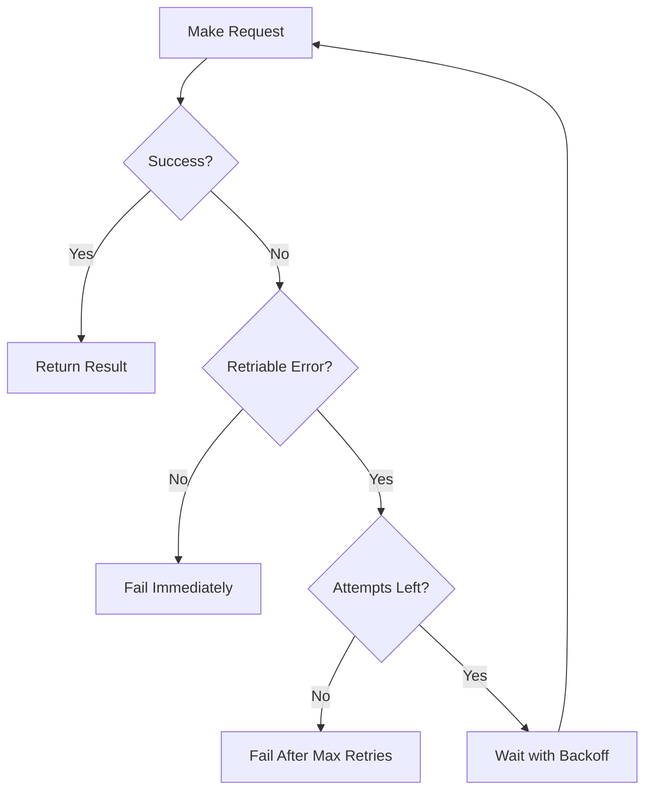
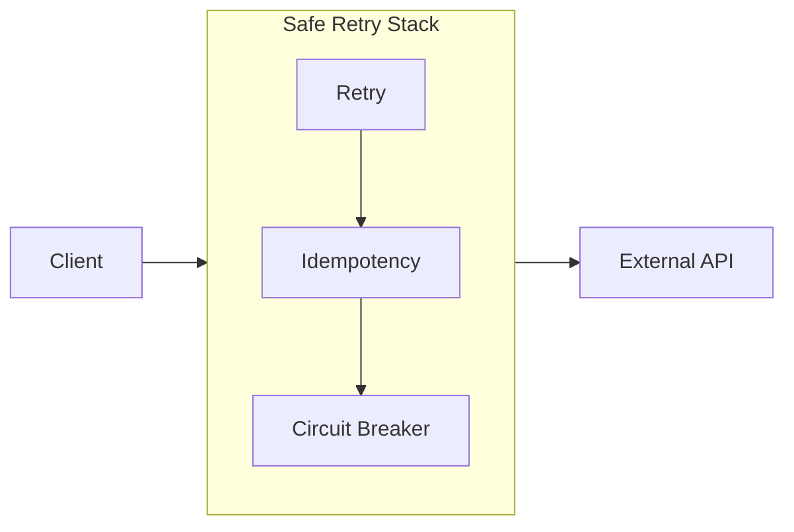

# 2. Retry Pattern

> **Think:** *"Maybe the service is temporarily unavailable."*

---

## The 4 Questions

| Question | Answer |
|----------|--------|
| **What problem does it solve?** | Temporary failures — network blips, timeouts, 503 errors, momentary overload. |
| **What happens if I ignore it?** | Small outages become customer-visible failures. A 2-second network hiccup becomes a failed booking. |
| **Where would I use it?** | External APIs, payment gateways, hotel/flight supplier integrations, email/SMS providers. |
| **What companies use it?** | AWS SDK (built-in retries), Google Cloud client libraries, Stripe, every major SaaS SDK. |

---

## Mental Movie (60 seconds)

Your app calls a hotel supplier API. Request goes out. 5 seconds pass. Timeout.

**Without retry:** User sees "Booking failed." They leave. You lose revenue.

**With retry:** Your code waits 1 second, tries again. Supplier was just restarting. Second attempt succeeds. User never knew there was a problem.

**But wait** — what if the first attempt actually succeeded but the response was lost? That's why retry **requires** idempotency (Topic 1).

---

## How It Works



### Retriable vs Non-Retriable Errors

| Retriable (retry) | Non-Retriable (fail fast) |
|-------------------|---------------------------|
| 408 Timeout | 400 Bad Request |
| 429 Too Many Requests | 401 Unauthorized |
| 500 Internal Server Error | 403 Forbidden |
| 502/503/504 Gateway errors | 404 Not Found |
| Connection reset / DNS failure | 422 Validation Error |

**Rule:** Never retry 4xx errors (except 408, 429). They won't fix themselves.

### Exponential Backoff with Jitter

Blind immediate retries can **amplify** an outage (thundering herd).

```
Attempt 1: immediate
Attempt 2: wait 1s  (+ random 0–500ms jitter)
Attempt 3: wait 2s  (+ jitter)
Attempt 4: wait 4s  (+ jitter)
Attempt 5: wait 8s  (+ jitter) → give up
```

**Jitter** spreads retries across time so 1000 clients don't all retry at the same instant.

```python
import random
import time

def retry_with_backoff(func, max_attempts=5, base_delay=1.0):
    for attempt in range(max_attempts):
        try:
            return func()
        except RetriableError:
            if attempt == max_attempts - 1:
                raise
            delay = base_delay * (2 ** attempt) + random.uniform(0, 0.5)
            time.sleep(delay)
```

---

## Real-World Examples

### Your Travel Platform

**Scenario:** Confirming a hotel room with a third-party supplier (e.g., Hotelbeds, RateHawk).

```
Your API → Supplier API: POST /reserve { room_id, dates, guest }
← 503 Service Unavailable (supplier deploying new version)
```

Your integration layer should:
1. Retry up to 3 times with exponential backoff
2. Use idempotency key so duplicate reserves don't create double bookings
3. If all retries fail → queue for async retry OR show user "confirming your booking..."
4. Alert ops if supplier is down for >5 minutes

### Nykaa

**Scenario:** Placing order triggers 5 downstream calls — inventory, payment, warehouse, notification, analytics.

If the warehouse API returns 503 during a sale:
- Retry warehouse call (idempotent reserve)
- Don't retry payment (already charged — different story)
- Don't retry notification (can be async/queued)

Each downstream service gets its own retry policy.

### Amazon

**Scenario:** Internal service-to-service calls across AWS.

Amazon's internal RPC framework retries automatically with backoff. Engineers set:
- Max attempts
- Which error codes are retriable
- Deadline (total time budget — don't retry forever)

A request might retry 3 times across 200ms total, then fail fast to the caller.

---

## When To Use It

| Use retry when... | Example |
|-------------------|---------|
| Failure is likely transient | Network timeout, 503 |
| Operation is idempotent (or made idempotent) | GET requests, idempotent POSTs |
| User experience benefits from hiding blips | Payment confirmation |
| You have a time budget | Must respond within 30s total |

## When NOT To Use It

| Skip retry when... | Why |
|--------------------|-----|
| Error is permanent (4xx validation) | Retrying won't help |
| Operation is NOT idempotent and can't be made so | Double-charge risk |
| Downstream is clearly down (use circuit breaker instead) | Retries make outage worse |
| Real-time UX requires fast failure | Live flight seat map — show error immediately |
| Total latency budget is exceeded | User already waited 30s |

---

## Retry + Idempotency + Circuit Breaker

These three work as a team:



1. **Retry** — try again on transient failure
2. **Idempotency** — make retries safe
3. **Circuit Breaker** — stop retrying when service is clearly dead

Without idempotency, retry is dangerous.
Without circuit breaker, retry during an outage is destructive.

---

## Common Mistakes

| Mistake | Consequence |
|---------|-------------|
| Retry non-idempotent POST without key | Double charge |
| No max attempts | Infinite loop, hung requests |
| No backoff | Thundering herd amplifies outage |
| Retry on 400 Bad Request | Waste resources, same failure |
| Same retry policy for all services | Payment retried like a health check |
| No deadline/total timeout | User waits forever |

---

## Problem Simulation

**Situation:** Your travel platform calls a flight GDS (Global Distribution System). During peak hours:

1. Request 1: timeout after 10s (unknown if booked)
2. Your code retries immediately (no backoff)
3. Request 2: 503
4. Retries immediately again
5. Request 3: 200 OK — seat booked
6. Request 1's delayed response arrives: 200 OK — **second seat booked**

**Questions:**
1. What two concepts were missing?
2. How would you fix this?
3. What should the user see during steps 1–5?

<details>
<summary>Answers</summary>

1. **Idempotency** (same booking request deduplicated) and **backoff** (don't hammer a struggling GDS).
2. Send idempotency key with every booking attempt. Store in-flight requests. On ambiguous timeout, check booking status before retrying (status poll pattern).
3. "Confirming your seat..." with async confirmation, not instant failure or double booking.

</details>

---

## Key Takeaway

Retry turns temporary failures into invisible recoveries — but only when paired with idempotency and bounded by circuit breakers.

**Next:** [03 — Circuit Breaker](./03-circuit-breaker.md) — when to stop retrying.
