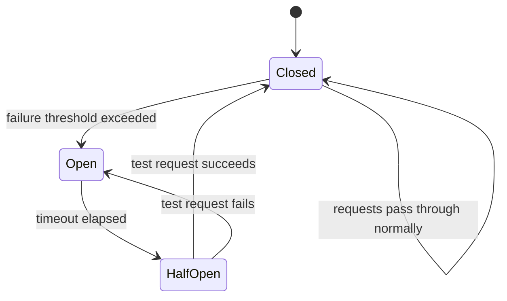
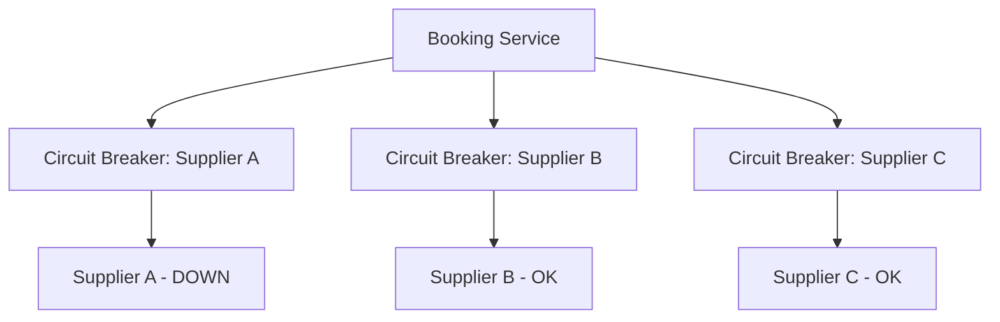

# 3. Circuit Breaker

> **Think:** *"Stop calling the broken service."*

---

## The 4 Questions

| Question | Answer |
|----------|--------|
| **What problem does it solve?** | Failing services causing chain reactions — your app keeps calling a dead dependency, wasting resources and cascading failure. |
| **What happens if I ignore it?** | One bad dependency takes down everything. Thread pools exhaust, latency spikes, healthy services get dragged down. |
| **Where would I use it?** | Third-party APIs, supplier integrations, internal microservices, database connections to flaky replicas. |
| **What companies use it?** | Netflix (Hystrix, now resilience4j), Amazon, Uber, Spotify — any company with microservices at scale. |

---

## Mental Movie (60 seconds)

Your hotel supplier API goes down at 2 AM. Without a circuit breaker:

```
Your App → Supplier (timeout 10s) → fail
Your App → Supplier (timeout 10s) → fail
Your App → Supplier (timeout 10s) → fail
... × 1000 concurrent users ...
```

Every request waits 10 seconds. Thread pool fills up. Your entire booking service freezes. Users can't even book flights (which use a different supplier).

**With circuit breaker:** After 5 failures in 30 seconds, the breaker **opens**. New requests fail instantly (0ms) with a fallback response. Your app stays alive. Supplier gets time to recover. Breaker **half-opens** periodically to test if it's back.

---

## The Three States



| State | Behavior |
|-------|----------|
| **Closed** | Normal operation. Requests pass through. Failures are counted. |
| **Open** | Circuit tripped. Requests fail immediately (no call to dependency). Fallback activated. |
| **Half-Open** | After cooldown, allow ONE test request. Success → Closed. Failure → Open again. |

### Configuration Knobs

```
failure_threshold: 5        # failures before opening
failure_window: 30s          # count failures within this window
open_duration: 60s           # stay open this long before half-open
half_open_max_calls: 1      # test requests in half-open state
success_threshold: 2         # successes needed to close from half-open
```

---

## How It Differs From Retry

| | Retry | Circuit Breaker |
|---|-------|-----------------|
| **Goal** | Recover from transient failure | Protect system from sustained failure |
| **When active** | Per-request | System-wide for a dependency |
| **On failure** | Try again | Stop trying (temporarily) |
| **Risk if misused** | Amplifies load on struggling service | May serve stale/fallback data |

**They complement each other:**
- Retry handles the *occasional* hiccup (within closed circuit)
- Circuit breaker handles the *sustained* outage (opens circuit, stops all calls)

---

## Real-World Examples

### Your Travel Platform

**Scenario:** Hotel supplier API is down. You have 3 hotel providers.



When Supplier A's breaker opens:
- Requests route to B and C automatically
- Users searching hotels still see results (minus Supplier A inventory)
- No 10-second timeouts on every request
- Ops gets alerted: "Supplier A circuit open for 15 min"

**Fallback options:**
- Return cached hotel listings (stale but usable)
- Show "Some hotels temporarily unavailable"
- Queue booking for async processing when supplier returns

### Nykaa

**Scenario:** Payment gateway (Razorpay/PayU) experiencing degraded performance during sale.

Nykaa's circuit breaker on payment service:
- Opens after error rate exceeds threshold
- Switches to secondary payment gateway automatically
- Shows user "Payment processing may take longer" instead of hanging
- Prevents cart abandonment from 30s timeouts

### Amazon

**Scenario:** Product recommendation service is slow.

Amazon doesn't block the entire product page. Circuit breaker on recommendations:
- Opens → page loads without "Customers also bought" section
- Core purchase flow (add to cart, checkout) unaffected
- **Graceful degradation** — less features, not a broken page

---

## When To Use It

| Use circuit breaker when... | Example |
|-----------------------------|---------|
| Dependency failure can cascade | Any external API call |
| You have a fallback or degraded mode | Cached data, alternate supplier |
| Timeouts are expensive (thread pool, user wait) | Sync API calls in request path |
| Dependency has history of outages | Third-party suppliers, legacy systems |

## When NOT To Use It

| Skip circuit breaker when... | Why |
|------------------------------|-----|
| Failure must always propagate | Financial reconciliation — can't silently skip |
| No fallback exists and failure is better than wrong data | Medical dosage calculation |
| Dependency is your own primary database | Use connection pooling + failover instead |
| Call volume is very low | Overhead not worth it for 10 calls/day |
| Early MVP | Add when you have real outage data |

---

## Fallback Strategies

| Strategy | Trade-off |
|----------|-----------|
| **Return cached data** | Fast but possibly stale |
| **Return default/empty** | Graceful degradation (Amazon recommendations) |
| **Route to alternative** | Second supplier, second payment gateway |
| **Queue for later** | Async processing, user gets "pending" status |
| **Fail fast with clear error** | Honest UX when no fallback exists |

---

## Monitoring & Alerts

Track these metrics per circuit:

```
circuit.state                    # closed / open / half-open
circuit.failure_rate               # failures per window
circuit.call_count                 # total calls
circuit.fallback_count             # how often fallback used
circuit.open_duration_seconds      # time spent open
```

**Alert when:** Circuit opens, stays open >5 min, or fallback rate exceeds baseline.

---

## Problem Simulation

**Situation:** Black Friday sale on your travel platform. Flight search API (Supplier X) starts returning 500 errors at 50% rate.

Without circuit breaker:
- 10,000 users searching → each waits 10s timeout → 100,000 seconds of blocked threads
- Your server runs out of connections
- Hotel search (different API) also breaks because server is exhausted

With circuit breaker (threshold: 10 failures in 60s, open for 120s):
1. First 10 requests fail normally (with retry)
2. Circuit opens at request 11
3. Requests 11–10,000 fail in <1ms with fallback: "Flight results temporarily limited"
4. Server stays healthy for hotel search
5. After 120s, half-open test → Supplier X recovered → circuit closes

**Questions:**
1. What would happen to hotel bookings without the circuit breaker?
2. Should you retry inside an open circuit?
3. What fallback makes sense for flight search?

<details>
<summary>Answers</summary>

1. They'd fail too — **cascading failure**. One bad dependency kills unrelated features.
2. **No.** Open circuit = fail fast. Retrying inside open circuit defeats the purpose.
3. Show cached popular routes, limit to one supplier, or honest message with retry button — not a 30s spinner.

</details>

---

## Key Takeaway

A circuit breaker is a fuse for your architecture. It accepts that a dependency *will* fail and ensures that failure stays contained.

**Next:** [04 — High Availability](./04-high-availability.md) — designing so nothing is a single point of failure.
