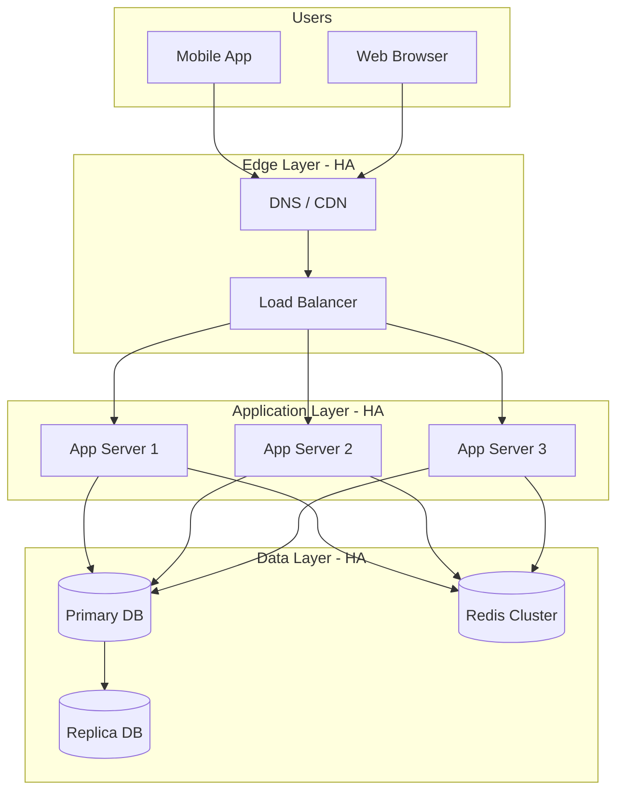

# 4. High Availability (HA)

> **Think:** *"What if this machine disappears?"*

---

## The 4 Questions

| Question | Answer |
|----------|--------|
| **What problem does it solve?** | Downtime — ensuring the system stays operational even when individual components fail. |
| **What happens if I ignore it?** | Single server crash = business down. One bad deploy = full outage. Maintenance window = revenue loss. |
| **Where would I use it?** | Every production system that users depend on — APIs, databases, payment flows, booking engines. |
| **What companies use it?** | Amazon (99.99% SLA targets), Google, Netflix, every bank, MakeMyTrip, IRCTC (aspirationally). |

---

## Mental Movie (60 seconds)

You run your travel platform on one server in one data center.

3 AM: Hard drive fails. Server dies.

6 AM: First customer tries to book a flight. Site is down.

9 AM: You wake up to 200 angry tweets and ₹0 revenue since 3 AM.

**High Availability means:** No single component's failure can take the whole system down. When one server dies, others keep serving. When one data center has issues, another picks up.

---

## What HA Actually Means

HA is not "never goes down." It's:

```
Availability = Uptime / (Uptime + Downtime)
```

| SLA | Downtime/year | Downtime/month |
|-----|---------------|----------------|
| 99% ("two nines") | 3.65 days | 7.2 hours |
| 99.9% ("three nines") | 8.76 hours | 43.8 minutes |
| 99.99% ("four nines") | 52.6 minutes | 4.38 minutes |
| 99.999% ("five nines") | 5.26 minutes | 26 seconds |

**Reality check for a startup:**
- 99.9% is a solid target (43 min/month downtime)
- 99.99% requires serious investment in redundancy, monitoring, automation
- 99.999% is Amazon/Google territory — don't aim here on day one

---

## The Architecture of HA



### Eliminate Single Points of Failure (SPOF)

| Component | SPOF Risk | HA Solution |
|-----------|-----------|-------------|
| App server | One crash = down | Multiple instances behind load balancer |
| Database | One crash = all data inaccessible | Primary + replica(s), automated failover |
| Load balancer | One LB = no routing | Multiple LBs or managed LB (AWS ALB) |
| DNS | DNS failure = unreachable | Multiple DNS providers, low TTL |
| Cache | Redis down = slow or broken | Redis cluster/sentinel |
| Message queue | Queue down = async jobs stop | Clustered queue (Kafka, SQS) |
| External API | Supplier down = feature broken | Circuit breaker + multiple suppliers |

---

## Real-World Examples

### Your Travel Platform

**Minimum HA setup for launch:**

```
                    ┌── App Server 1 (Zone A)
Users → LB ──────── ├── App Server 2 (Zone B)
                    └── App Server 3 (Zone C)

                    ┌── PostgreSQL Primary (Zone A)
App Servers ─────── ├── PostgreSQL Replica (Zone B) [read queries]
                    └── Redis (managed, multi-AZ)

                    ┌── Supplier A (hotels)
Booking Service ─── ├── Supplier B (hotels) [fallback]
                    └── Supplier C (flights)
```

**What this gives you:**
- One app server dies → LB routes to others (zero downtime)
- Primary DB dies → replica promoted (minutes of downtime with automation, hours without)
- One AZ (availability zone) goes down → servers in other zones continue
- One hotel supplier dies → circuit breaker + alternate supplier

### Nykaa

During sale events, Nykaa runs:
- Auto-scaled app servers (10→500 instances)
- Database read replicas for product catalog browsing
- CDN for static assets (product images)
- Multiple payment gateway integrations
- Pre-warmed caches for top SKUs

Their HA challenge is **spiky traffic**, not just component failure. HA + auto-scaling work together.

### Amazon

Amazon's HA philosophy:
- **Everything is redundant** — no single server, rack, or data center is critical
- **Design for failure** — instances are cattle, not pets
- **Multi-AZ by default** — services span availability zones
- **Chaos engineering** — intentionally kill components to verify HA (Chaos Monkey)

---

## HA Patterns

### Active-Active
All instances serve traffic simultaneously.
```
LB → [Server1, Server2, Server3] all handling requests
```
Best for: Stateless app servers, read replicas.

### Active-Passive
One instance serves, others standby.
```
Primary DB (writes) → Replica (standby, promoted on failure)
```
Best for: Databases, single-leader systems.

### Multi-Region (Advanced)
```
Region A (Mumbai) ←→ Region B (Singapore)
Users routed to nearest healthy region
```
Best for: Global products. Expensive. Complex (data consistency across regions).

---

## When To Use It

| Invest in HA when... | Example |
|----------------------|---------|
| Downtime has direct revenue impact | Ecommerce checkout, booking confirmation |
| Users expect 24/7 access | Consumer apps, SaaS products |
| You have paying customers | Post-PMF, not pre-launch |
| Compliance requires uptime SLA | Fintech, healthcare |

## When NOT To Use It (Yet)

| Defer HA when... | Why |
|------------------|-----|
| Pre-product-market-fit MVP | Ship fast, accept downtime |
| Internal tools with 5 users | Downtime is annoying, not costly |
| Batch/offline processing | Can retry tomorrow |
| Budget is ₹0 | HA costs money (2x+ infrastructure) |

**Pragmatic path:** Start with managed services (RDS multi-AZ, managed K8s) that give you HA without building it yourself.

---

## HA vs Disaster Recovery

| | High Availability | Disaster Recovery |
|---|-------------------|-------------------|
| **Goal** | Stay up during component failure | Recover after catastrophic failure |
| **Timeline** | Seconds to minutes | Hours to days |
| **Scope** | Single component | Entire region/data center |
| **Example** | App server crash → LB reroutes | Mumbai DC flood → failover to Singapore |
| **Cost** | Moderate (redundancy) | High (full duplicate infrastructure) |

HA keeps you running. DR brings you back after catastrophe. You need HA first.

---

## Problem Simulation

**Situation:** Your travel platform runs on AWS Mumbai (ap-south-1):

```
- 2 app servers (t3.medium) behind ALB
- RDS PostgreSQL (single-AZ) ← ⚠️
- ElastiCache Redis (single node) ← ⚠️
- S3 for static assets
- 1 hotel supplier integration
```

**Questions:**
1. Identify all single points of failure.
2. A planned RDS maintenance window is scheduled for Sunday 2 AM. What happens?
3. Rank these HA improvements by impact/cost ratio for a startup.

<details>
<summary>Answers</summary>

1. **SPOFs:** Single-AZ RDS, single Redis node, single hotel supplier, possibly single app server if only one is healthy.
2. **Database unavailable for 15–30 min.** All bookings, searches, logins fail. Even with 2 app servers, the DB is the bottleneck.
3. **Best ROI order:**
   1. RDS Multi-AZ (managed, ~2x cost, eliminates biggest SPOF)
   2. Second hotel supplier + circuit breaker (feature redundancy)
   3. Redis cluster (performance + availability)
   4. Multi-region (overkill until global scale)

</details>

---

## Key Takeaway

HA is not one technique — it's a mindset: **assume every component will fail, and design so no single failure is fatal.**

**Next:** [05 — Failover](./05-failover.md) — the automatic handoff when something dies.
