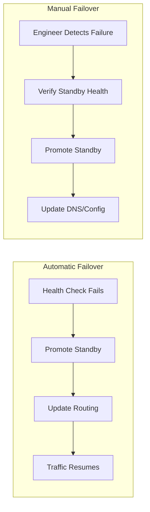
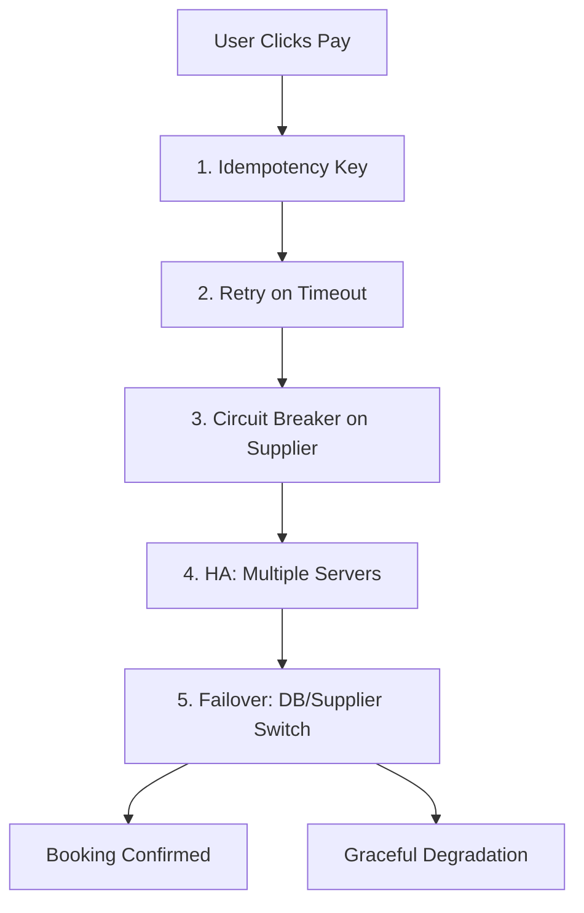

# 5. Failover

> **Think:** *"Who takes over when this fails?"*

---

## The 4 Questions

| Question | Answer |
|----------|--------|
| **What problem does it solve?** | Automatic recovery — when the primary component fails, a secondary takes over without human intervention. |
| **What happens if I ignore it?** | Manual intervention required. 3 AM pager. Engineer SSHes in. 30–60 min downtime while someone promotes a replica. |
| **Where would I use it?** | Databases, load balancers, DNS, message brokers, any stateful primary/standby setup. |
| **What companies use it?** | AWS (RDS Multi-AZ failover), Cloudflare (DNS failover), Kubernetes (pod rescheduling), banks (core banking failover). |

---

## Mental Movie (60 seconds)

Your database primary server crashes.

**Without failover:** Alert fires. On-call engineer wakes up. Logs into AWS console. Manually promotes read replica to primary. Updates connection strings. Restarts app servers. 45 minutes later, site is back.

**With failover:** Primary crashes. Automated health check detects failure in 10 seconds. Replica is promoted in 30 seconds. Load balancer updates routing. App reconnects automatically. Total downtime: ~60 seconds. Engineer reads about it in the morning Slack summary.

---

## Failover vs High Availability

| | High Availability | Failover |
|---|-------------------|----------|
| **Scope** | System design philosophy | Specific mechanism |
| **Question** | "Can the system survive failure?" | "Who takes over, and how fast?" |
| **Relationship** | HA is the goal | Failover is one way to achieve HA |

HA is the *what*. Failover is the *how*.

---

## Types of Failover



### Automatic Failover
- Health checks detect failure
- Standby promoted programmatically
- Routing updated (DNS, LB, service discovery)
- **Downtime:** Seconds to ~2 minutes
- **Risk:** False positives can cause unnecessary failover (split-brain)

### Manual Failover
- Human decides to switch
- Engineer verifies standby is healthy first
- Controlled switchover
- **Downtime:** Minutes to hours
- **Risk:** Slower, but safer for data-critical systems

---

## Failover by Component

### Database Failover

```
Normal:
  App → Primary DB (writes + reads)
  App → Replica DB (reads only)
  Primary ──replication──→ Replica

Primary crashes:
  App → Primary DB ✗
  Health check fails
  Replica promoted → New Primary
  App → New Primary (writes + reads)
```

**Key concerns:**
- **Replication lag** — if replica is 5 seconds behind, promoted DB may miss recent writes
- **Split-brain** — old primary comes back alive and accepts writes (two primaries = data corruption)
- **Connection handling** — apps must reconnect to new primary (connection string, service discovery)

**Managed solution:** AWS RDS Multi-AZ, Google Cloud SQL HA — failover in ~60s, handled for you.

### Load Balancer Failover

```
Normal:
  Users → Primary LB → App Servers
          Standby LB (idle, health-synced)

Primary LB fails:
  DNS/Anycast → Standby LB → App Servers
```

Managed LBs (AWS ALB, GCP LB) handle this internally — you don't see it.

### DNS Failover

```
Normal:
  user.example.com → 203.0.113.1 (Primary DC)

Primary DC fails:
  Health check on 203.0.113.1 fails
  DNS updated: user.example.com → 198.51.100.1 (Secondary DC)
```

**Catch:** DNS TTL means propagation takes time (30s–5min). Use low TTL for critical records.

### Application-Level Failover

```
Normal:
  BookingService → SupplierA (primary)
                 → SupplierB (standby, not called)

SupplierA fails (circuit open):
  BookingService → SupplierB (automatic switch)
```

This is failover at the integration layer — no infrastructure change, just routing logic.

---

## Real-World Examples

### Your Travel Platform

**Database failover plan:**

| Step | Action | Time |
|------|--------|------|
| 0 | Primary DB crashes | T+0s |
| 1 | RDS detects failure via health check | T+10s |
| 2 | Standby promoted to primary | T+30s |
| 3 | DNS/endpoint updated (same endpoint, new backend) | T+35s |
| 4 | App connection pool detects broken connection | T+36s |
| 5 | App reconnects to new primary | T+38s |
| 6 | Service restored | T~60s |

**What you must handle in app code:**
- Connection retry on failure (not just request retry)
- Idempotent operations (in-flight transactions during failover)
- Graceful error during the ~60s window

**Supplier failover:**

```python
SUPPLIERS = [
    {"name": "Hotelbeds", "priority": 1, "circuit": circuit_hotelbeds},
    {"name": "RateHawk", "priority": 2, "circuit": circuit_ratehawk},
]

def search_hotels(query):
    for supplier in sorted(SUPPLIERS, key=lambda s: s["priority"]):
        if supplier["circuit"].is_closed:
            try:
                return supplier["api"].search(query)
            except SupplierError:
                supplier["circuit"].record_failure()
    return cached_results_or_error(query)
```

### Nykaa

During peak sales:
- **Database:** Read traffic automatically routed to replicas. Write failover via managed DB HA.
- **Payment:** If Razorpay degrades → automatic switch to PayU (application-level failover).
- **CDN:** If origin server slow → CDN serves cached product pages (edge failover).
- **Warehouse:** If Warehouse A can't fulfill → route to Warehouse B.

Each layer has its own failover strategy.

### Amazon

Amazon's failover is legendary:
- **DynamoDB:** Multi-AZ replication, automatic leader election
- **S3:** 11 nines durability via cross-AZ replication
- **Route 53:** Health-checked DNS failover across regions
- **Aurora:** Storage layer replicated 6 ways across 3 AZs, failover in ~30s

Their principle: **failover should be boring** — automated, tested, and invisible to users.

---

## When To Use It

| Use failover when... | Example |
|----------------------|---------|
| Component has a clear primary/standby | Database, active-passive LB |
| Downtime cost exceeds redundancy cost | Revenue-generating production systems |
| Recovery time objective (RTO) matters | "Must recover in <5 minutes" |
| Managed failover is available | RDS Multi-AZ, managed K8s |

## When NOT To Use It

| Skip/defer failover when... | Why |
|-----------------------------|-----|
| Stateless services behind LB | LB handles it — just add more instances |
| Data loss during failover is unacceptable without human check | Manual promotion safer |
| System is read-only / can rebuild from scratch | Simpler to restart than failover |
| MVP with SQLite on one machine | Premature — migrate to managed DB first |

---

## Failover Testing

**The only failover that works is one you've tested.**

| Test | How |
|------|-----|
| Database failover | Trigger RDS failover in staging. Measure downtime. |
| Supplier failover | Disable primary supplier in staging. Verify fallback works. |
| AZ failure | Terminate all instances in one AZ. Verify LB routes to others. |
| DNS failover | Point health check to dead IP. Verify DNS switches. |

**Game day:** Schedule quarterly "chaos" exercises. Kill components intentionally. Measure recovery time.

---

## Problem Simulation

**Situation:** Your travel platform at 10 PM on a Saturday (peak booking time):

1. PostgreSQL primary crashes (disk failure)
2. You have RDS Multi-AZ with automatic failover
3. Failover completes in 90 seconds
4. During those 90 seconds, 200 users are mid-booking

**Trace each user's experience:**

| User | Action at T+0 | What happens |
|------|---------------|--------------|
| A | Just clicked "Search flights" | Request fails → retry succeeds after failover |
| B | Mid-payment (payment sent, booking not saved) | ⚠️ Payment succeeded but booking lost |
| C | Viewing hotel details (read-only) | Cached page loads fine |
| D | Clicked "Pay" twice (no idempotency key) | ⚠️⚠️ Double charge possible |

**Questions:**
1. Which Module 1 concepts protect Users A, B, and D?
2. What's your RTO (Recovery Time Objective) and is 90s acceptable?
3. What would you add to prevent User B's scenario?

<details>
<summary>Answers</summary>

1. **A:** Retry pattern. **B:** Idempotency + saga/outbox pattern (not in this module, but critical). **D:** Idempotency.
2. For a travel platform at peak: 90s is borderline. Target <30s with connection pooling + app-level retry on DB reconnect.
3. **Transactional outbox:** Write booking intent to DB *before* calling payment. On recovery, reconcile pending bookings. Never call payment before persisting intent.

</details>

---

## Module 1 Complete — The Full Picture



When someone says:

> *"We need a retry mechanism with idempotent requests behind a load balancer and a queue."*

You now see the movie:

1. **Idempotent requests** — safe to retry without double-charging
2. **Retry mechanism** — handle transient network/API failures
3. **Load balancer** — HA, traffic across healthy servers (Module 2 preview)
4. **Queue** — async processing when sync path fails (Module 5 preview)

That's engineering intuition.

---

## Key Takeaway

Failover is the automatic answer to "who takes over?" — but it only works if you've designed for it, tested it, and built the surrounding concepts (idempotency, retry, circuit breaker, HA) to support it.

**Next module:** [Module 2 — Scale](../module-02-scale/) (coming soon)
