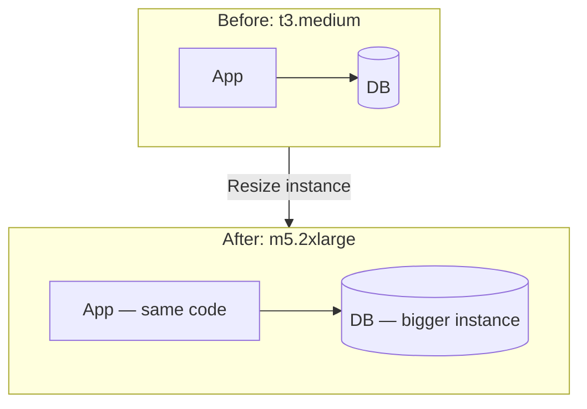

# 6. Vertical Scaling

> **Think:** *"Can I just get a bigger machine?"*

---

## The 4 Questions


| Question                         | Answer                                                                                                                               |
| -------------------------------- | ------------------------------------------------------------------------------------------------------------------------------------ |
| **What problem does it solve?**  | A single server running out of CPU, RAM, or disk — your app is slow or crashing because the box is too small.                        |
| **What happens if I ignore it?** | You hit hard limits: OOM kills, disk full, query timeouts. Or you over-provision a monster machine you don't need yet.               |
| **Where would I use it?**        | Early-stage apps, databases, background workers, any single-node bottleneck before you've earned the complexity of multiple servers. |
| **What companies use it?**       | Every startup on AWS RDS resize, Heroku dyno upgrades, managed Postgres tier bumps — vertical scaling is the default first move.     |


---

## Mental Movie (60 seconds)

Your travel platform runs on one server: 2 vCPU, 4GB RAM. Normal day: 200 searches/minute, everything fine.

**Diwali long weekend:** 4,000 searches/minute. CPU pegged at 100%. JVM garbage collection pauses. Search takes 8 seconds. Users bounce.

**Vertical scaling move:** Resize to 8 vCPU, 32GB RAM. Same code, same deployment, bigger box. Search drops to 1.2 seconds. Crisis averted — for now.

**The ceiling:** You can't buy a 1,000-core machine. Even if you could, one machine is still one failure domain. That's when horizontal scaling (Topic 7) enters.

---

## How It Works

**Vertical scaling** (scale up) means increasing resources on a **single** machine: more CPU cores, more RAM, faster SSD, higher network bandwidth.

```
Before:  t3.medium  →  2 vCPU,  4 GB RAM,  50 GB disk
After:   m5.2xlarge →  8 vCPU, 32 GB RAM, 500 GB NVMe
```

Same application. Same IP (usually). Same deployment process. Just a bigger box.




**Key ingredients:**

1. **Identify the bottleneck** — CPU-bound (compute), memory-bound (caching, sessions), or I/O-bound (disk, network)
2. **Resize the right layer** — app server vs database vs cache; scaling the app won't fix a saturated DB
3. **Plan downtime or use live resize** — some cloud instances require a reboot; RDS often allows online resize
4. **Watch cost curve** — 4× RAM often costs more than 4× linear; diminishing returns kick in fast

---

## Real-World Examples

### Your Travel Platform

**Scenario:** MVP on a single EC2 `t3.medium` running API + Postgres on the same box (not ideal, but common early).

Peak hour symptoms:

- Flight search API p95 latency: 6s (target: <800ms)
- Postgres `shared_buffers` too small — queries spilling to disk
- Node.js heap hitting 3.5GB, GC thrashing

**Vertical scaling path:**

1. Split DB to RDS `db.r6g.large` (16GB RAM) — biggest win
2. Bump API server to `m5.xlarge` (4 vCPU, 16GB)
3. Add Redis on `cache.r6g.large` for search results

**Result:** Handles 10× traffic with zero code changes. Buys 6–12 months before you need multiple app servers.

### Nykaa

**Scenario:** Flash sale on a premium skincare brand. Order service and inventory DB on the same cluster.

Before the sale, Nykaa's ops team vertically scales:

- Primary Postgres: `db.r5.2xlarge` → `db.r5.4xlarge` (more RAM for buffer cache)
- Order service pods: increase memory limits from 2GB → 8GB

This is deliberate — vertical scaling is predictable, fast to execute, and doesn't require re-architecting for statelessness. But they also pre-scale horizontally (more pods) because they know vertical alone won't survive the full spike.

### Amazon

**Scenario:** Early Amazon ran on a single database server. As traffic grew, they upgraded the machine — bigger Sun servers, more RAM, faster disks.

Vertical scaling carried Amazon for years. But every upgrade had a ceiling. Eventually they hit the wall: one database couldn't hold all orders. That forced horizontal scaling (sharding, read replicas) — but vertical scaling was the right first move at each stage.

---

## When To Use It


| Use vertical scaling when...                          | Example                                       |
| ----------------------------------------------------- | --------------------------------------------- |
| You're early stage and traffic is growing predictably | 500 → 5,000 users, one server struggling      |
| Bottleneck is clearly resource-bound on one node      | DB buffer cache too small, CPU at 95%         |
| You need a fix in hours, not weeks                    | Sale starts tomorrow, no time to re-architect |
| Workload doesn't parallelize well                     | Single-threaded legacy app, monolithic DB     |
| Cost of downtime during resize is acceptable          | Maintenance window at 3 AM                    |


## When NOT To Use It


| Skip vertical scaling when...                      | Why                                                                             |
| -------------------------------------------------- | ------------------------------------------------------------------------------- |
| You've already maxed the largest instance size     | AWS `x2idn.32xlarge` still has limits; you need more machines                   |
| Single point of failure is the real problem        | Bigger machine still dies once — HA (Module 1) matters more                     |
| Cost per unit of capacity is worse than horizontal | 32-core box often costs more than 4× 8-core boxes                               |
| You need geographic distribution                   | One big server in Mumbai doesn't help users in London                           |
| Traffic is spiky and unpredictable                 | Paying for peak-sized hardware 24/7 is wasteful; auto-scaling groups are better |


---

## Vertical vs Horizontal Scaling


| Dimension           | Vertical (scale up)               | Horizontal (scale out)                               |
| ------------------- | --------------------------------- | ---------------------------------------------------- |
| **Complexity**      | Low — resize instance             | High — stateless services, load balancing, data sync |
| **Ceiling**         | Hardware max (finite)             | Theoretically unlimited                              |
| **Downtime risk**   | Often requires reboot             | Add nodes with zero downtime                         |
| **Cost efficiency** | Diminishing returns at top tiers  | Linear-ish, pay for what you use                     |
| **When to use**     | First move, DB tuning, quick wins | Sustained growth, HA, global scale                   |


**Rule of thumb:** Vertical first, horizontal when vertical stops working or gets too expensive.

---

## Implementation Checklist

- [ ] Measure before resizing — CPU, memory, disk I/O, network, DB slow queries
- [ ] Resize the actual bottleneck (don't 4× RAM if CPU is the problem)
- [ ] Separate app and database tiers before scaling either
- [ ] Test after resize — latency, throughput, error rate
- [ ] Set alerts for 70% utilization so you know when to scale again
- [ ] Document the ceiling — what's the max instance size and what happens after?

---

## Problem Simulation

**Situation:** Your travel platform runs on one `t3.large` (2 vCPU, 8GB RAM). A travel blogger posts a deal link. Traffic jumps 15× in 30 minutes.

1. CPU hits 100%. Search API returns 504 timeouts.
2. You resize to `m5.2xlarge` (8 vCPU, 32GB RAM). Latency improves.
3. Two hours later, traffic doubles again. CPU at 85%, memory at 70%.
4. A competitor's scraper starts hitting your hotel search API at 500 req/s from one IP.

**Questions:**

1. Did vertical scaling solve the problem permanently?
2. What's the next scaling move for step 3?
3. Will a bigger machine help with step 4?

Answers

1. **No** — it bought time. Traffic can always exceed one machine's capacity. You still have a single point of failure.
2. **Horizontal scaling** — add more API server instances behind a load balancer (Topics 7–8). Consider read replicas for the DB.
3. **No** — that's an abuse/rate-limiting problem (Topic 9), not a capacity problem. A bigger machine just gives the scraper a bigger target.


---

## Key Takeaway

Vertical scaling is the fastest way to survive growth — resize the box, fix the bottleneck, move on. But every machine has a ceiling, and a bigger machine is still one machine.

**Next:** [07 — Horizontal Scaling](./07-horizontal-scaling.md) — when one big box isn't enough.