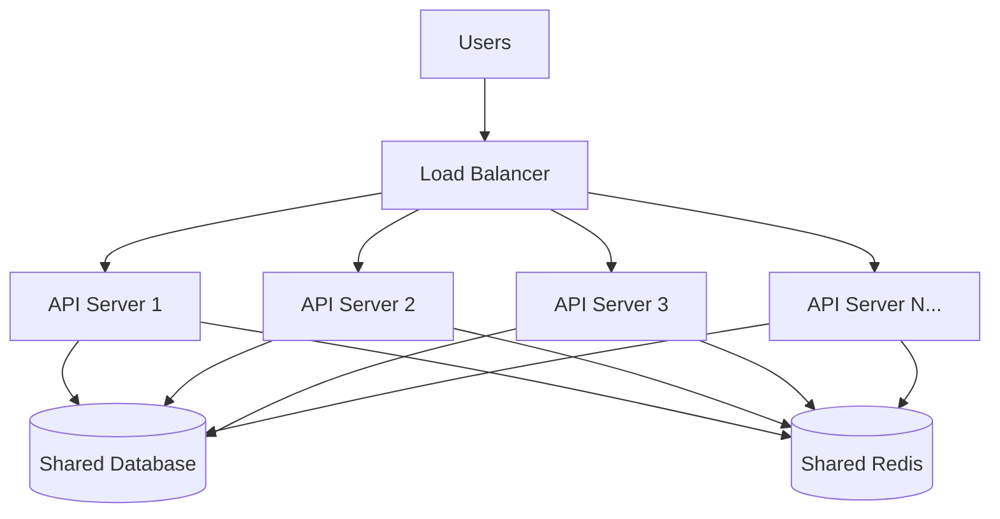

# 7. Horizontal Scaling

> **Think:** *"Can I clone this service?"*

---

## The 4 Questions

| Question | Answer |
|----------|--------|
| **What problem does it solve?** | Traffic or workload that exceeds what any single machine can handle — you need more capacity than vertical scaling can buy. |
| **What happens if I ignore it?** | You hit the largest instance size and still can't serve users. Or you pay for a monster machine that's idle 90% of the time. |
| **Where would I use it?** | API servers, stateless workers, read replicas, CDN edges, queue consumers — anything that can run as identical copies. |
| **What companies use it?** | Netflix (thousands of microservice instances), Amazon (auto-scaling groups), Uber (city-level service pools), every Kubernetes deployment. |

---

## Mental Movie (60 seconds)

Your travel platform survived Diwali on a bigger machine. Now it's year two. 50,000 concurrent users during a long weekend sale.

**One big server:** Even the largest instance chokes. One reboot = entire site down. You're paying for peak capacity 24/7.

**Horizontal scaling:** Spin up 10 identical API servers. Each handles 5,000 users. Traffic spikes? Auto-scale to 30. Sale ends? Scale back to 5. One server dies? The other 9 keep serving.

**The catch:** Your app must be **stateless**. Session data can't live in server memory. Sticky files can't sit on local disk. Every clone must be interchangeable. That's the price of cloning.

---

## How It Works

**Horizontal scaling** (scale out) means adding **more machines** that do the same job, instead of making one machine bigger.

```
Before:  1 API server  →  handles 2,000 req/s
After:   5 API servers →  handles ~10,000 req/s (with load balancer)
```



**Key ingredients:**
1. **Stateless application tier** — no local session state, no local file storage, no in-memory caches that other instances can't see
2. **Shared data layer** — database, Redis, S3 — all instances read/write the same stores
3. **Load distribution** — load balancer or service mesh routes requests (Topic 8)
4. **Auto-scaling policy** — scale on CPU, request rate, or queue depth; scale in when traffic drops
5. **Health checks** — unhealthy instances are removed from rotation automatically

---

## Real-World Examples

### Your Travel Platform

**Scenario:** Search and booking APIs need to handle 20,000 req/s during peak.

**Architecture:**
```
                    ┌─ Search API × 8 instances
ALB (Load Balancer)─┤
                    └─ Booking API × 4 instances
                              │
                    ┌─────────┴─────────┐
              Postgres Primary    Redis Cluster
              + 2 Read Replicas   (sessions, search cache)
```

**What had to change to go horizontal:**
- Sessions moved from in-memory → Redis
- File uploads moved from local disk → S3
- Background jobs moved from cron on one box → SQS + worker fleet
- Database connection pooling via PgBouncer (5,000 connections from 12 app servers would crush Postgres)

**Without statelessness:** User logs in on Server 1, next request hits Server 2, session lost — "Please log in again."

### Nykaa

**Scenario:** Beauty sale — product catalog, cart, and checkout all spike simultaneously.

Nykaa runs horizontally at every layer:
- **Catalog service:** 20+ pods, read-heavy, cached aggressively
- **Cart service:** stateless pods, cart state in Redis
- **Order service:** fewer pods (write-heavy), but still multiple instances
- **Image CDN:** thousands of edge nodes (horizontal scaling at the edge)

They auto-scale catalog pods on request rate. Order pods scale more conservatively — you can't spin up order writers as fast as catalog readers without DB contention.

### Amazon

**Scenario:** Prime Day. Order placement, inventory, payment, shipping — all must scale independently.

Amazon's architecture is horizontal scaling at civilization scale:
- Each service runs on thousands of instances across availability zones
- Auto Scaling Groups replace unhealthy instances in minutes
- DynamoDB and S3 scale horizontally by design — you don't "resize" them
- Teams own services that scale independently; no one "scales Amazon"

The lesson: horizontal scaling isn't one decision — it's how you build every service from day one if you expect to grow.

---

## When To Use It

| Use horizontal scaling when... | Example |
|--------------------------------|---------|
| Vertical scaling hit its ceiling or cost curve | Largest RDS instance still too slow |
| Traffic is spiky or unpredictable | Sale weekends, viral campaigns |
| You need high availability | One instance dies, others absorb traffic |
| Workload parallelizes naturally | API requests, image processing, search indexing |
| You want pay-per-use economics | Scale to zero overnight, burst at peak |

## When NOT To Use It

| Skip horizontal scaling when... | Why |
|---------------------------------|-----|
| App is deeply stateful and refactoring is expensive | Legacy monolith with local file state everywhere |
| Traffic is low and stable | 100 users/day — one small server is fine |
| Strong consistency on every write is critical | Distributed writes are harder than single-node writes |
| You're solving a code bug, not a capacity problem | N+1 queries on 10 servers = N+1 queries × 10 servers |
| Database is the bottleneck and it's a single primary | More app servers just create more DB connections |

---

## Horizontal vs Vertical Scaling

| Dimension | Horizontal (scale out) | Vertical (scale up) |
|-----------|------------------------|---------------------|
| **First move?** | No — try vertical first | Yes — fastest win |
| **Stateless required?** | Yes, for the app tier | No |
| **Failure domain** | One node dies, others survive | One node dies, everything dies |
| **Data layer** | Needs replication, sharding, or managed scale-out DB | Single-node DB often sufficient |
| **Ops complexity** | Deploy pipelines, health checks, LB config | Resize instance, reboot |

**Rule of thumb:** Make the app tier stateless and horizontally scalable early. Vertically scale the database until read replicas or sharding (Module 4) become necessary.

---

## Implementation Checklist

- [ ] App servers are stateless — sessions in Redis, files in object storage
- [ ] Health check endpoint (`/health`) returns 200 only when truly ready
- [ ] Database connection pooling — don't let N servers open N× connections each
- [ ] Auto-scaling policy defined (scale-out threshold, scale-in cooldown)
- [ ] Deployment supports rolling updates — no "take the only server down"
- [ ] Shared cache invalidation strategy — one instance updates, others see it
- [ ] Load balancer in front (Topic 8) — traffic must be distributed

---

## Problem Simulation

**Situation:** Your travel platform has 3 API servers behind a load balancer. During a flash sale:

1. Traffic hits 15,000 req/s. Auto-scaling adds 7 more servers (10 total).
2. Postgres primary CPU hits 95% — all 10 servers hammering the same DB.
3. You add 10 more API servers. DB collapses. Everything times out.
4. A developer stored user search preferences in local server memory "for speed."

**Questions:**
1. Why didn't adding more servers fix step 2?
2. What made step 3 worse instead of better?
3. What's broken about step 4 in a horizontally scaled system?

<details>
<summary>Answers</summary>

1. **The bottleneck moved** — app tier wasn't the problem; the database was. Horizontal scaling the wrong layer wastes money.
2. **More app servers = more DB connections and queries** — you amplified load on the already-saturated primary. Fix: read replicas, caching, or connection pooling first.
3. **Local memory isn't shared** — user hits Server 3, preferences saved; next request goes to Server 7, preferences gone. State must live in Redis/DB.

</details>

---

## Key Takeaway

Horizontal scaling is how real systems grow — clone the service, distribute the load, auto-scale with demand. But it only works when every clone is interchangeable and you've scaled the right layer.

**Next:** [08 — Load Balancer](./08-load-balancer.md) — how traffic reaches those clones.
