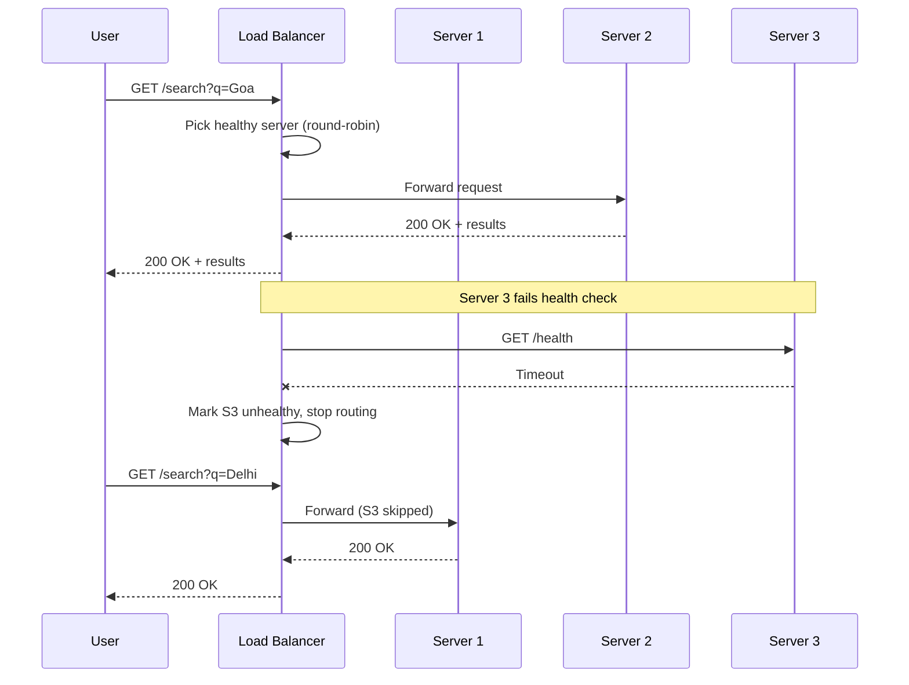

# 8. Load Balancer

> **Think:** *"Which server gets the request?"*

---

## The 4 Questions

| Question | Answer |
|----------|--------|
| **What problem does it solve?** | Uneven traffic distribution — without it, one server gets overwhelmed while others sit idle, or users hit a dead server. |
| **What happens if I ignore it?** | Hot spots, cascading failures on the busiest node, no graceful way to drain a server for deploys, single IP can't fan out to multiple backends. |
| **Where would I use it?** | Any multi-instance service — API servers, web apps, microservices, database read replicas, internal service-to-service calls. |
| **What companies use it?** | AWS ALB/NLB, Nginx, HAProxy, Cloudflare, Google Cloud Load Balancing — every horizontally scaled production system. |

---

## Mental Movie (60 seconds)

You have 5 API servers. Users connect to `api.yourtravel.com`. But which server handles each request?

**Without load balancer:** DNS round-robin — `api` resolves to 5 IPs. Client picks one. Sticky to that IP. Server 3 dies. 20% of users get errors until DNS refreshes. Server 1 is idle. Server 4 is melting.

**With load balancer:** One entry point (`api.yourtravel.com` → load balancer IP). Every request evaluated fresh. Server 4 unhealthy? Traffic stops going there in seconds. New deploy? Drain Server 1, update it, bring it back. Users never know.

That's the entire job: **distribute traffic, detect failures, enable zero-downtime deploys.**

---

## How It Works

A **load balancer** sits between clients and a pool of backend servers. It accepts incoming connections and forwards them to a healthy instance.



### Common Algorithms

| Algorithm | How it works | Best for |
|-----------|--------------|----------|
| **Round Robin** | Rotate through servers in order | Equal-capacity, stateless servers |
| **Least Connections** | Send to server with fewest active connections | Long-lived connections, varying request duration |
| **Weighted Round Robin** | Bigger machines get more traffic | Mixed instance sizes in the same pool |
| **IP Hash** | Same client IP → same server | Session stickiness without cookies |
| **Least Response Time** | Route to fastest-responding server | Latency-sensitive APIs |

### Layer 4 vs Layer 7

| Type | Operates at | Can do | Example |
|------|-------------|--------|---------|
| **L4 (Transport)** | TCP/UDP | IP + port routing, high throughput | AWS NLB, HAProxy TCP mode |
| **L7 (Application)** | HTTP/HTTPS | Path-based routing, headers, SSL termination | AWS ALB, Nginx, Traefik |

```
L7 example:
  /api/search/*  → search-service pool (8 instances)
  /api/book/*    → booking-service pool (4 instances)
  /static/*      → S3 / CDN
```

**Key ingredients:**
1. **Health checks** — HTTP `GET /health` every 10–30s; 2–3 failures = unhealthy
2. **Connection draining** — stop sending new requests to a server before shutdown (deploy, scale-in)
3. **SSL termination** — LB handles HTTPS, backends speak HTTP internally
4. **Sticky sessions** (when needed) — cookie-based affinity so user stays on same server

---

## Real-World Examples

### Your Travel Platform

**Scenario:** 6 search API instances, 4 booking API instances, peak Diwali traffic.

```
                    ┌─ /api/v1/search/*  → search-pool (6 instances)
ALB (HTTPS:443) ────┤
                    └─ /api/v1/book/*    → booking-pool (4 instances)
```

**Deploy flow (zero downtime):**
1. ALB stops sending new requests to `search-api-1` (connection draining)
2. In-flight requests on `search-api-1` complete (30s drain window)
3. Deploy new version to `search-api-1`
4. Health check passes → ALB adds `search-api-1` back to rotation
5. Repeat for instances 2–6

**Health check config:**
```
Path: /health
Interval: 15s
Healthy threshold: 2 consecutive successes
Unhealthy threshold: 3 consecutive failures
Timeout: 5s
```

If `/health` only checks "process is running" but DB is down, LB keeps routing traffic to a broken server. Health checks must verify real dependencies.

### Nykaa

**Scenario:** Product pages served by 30+ frontend pods. Cart and checkout on separate pools.

Nykaa uses L7 load balancing extensively:
- **Ingress controller** routes `/p/*` (product) to catalog pods, `/cart/*` to cart pods
- **Weighted routing** during canary deploys — 95% traffic to stable, 5% to new version
- **Geographic load balancing** — users in South India hit Bangalore edge, North India hits NCR edge
- **WAF integration** — block malicious traffic before it reaches app servers

During flash sales, they pre-warm the load balancer target groups so new pods are healthy before traffic shifts.

### Amazon

**Scenario:** Every `amazon.in` request hits a massive load balancing layer before reaching any service.

Amazon's ELB (Elastic Load Balancing) pioneered cloud load balancing:
- **ALB** routes by URL path to hundreds of microservices
- **NLB** handles ultra-high-throughput, low-latency TCP (internal service mesh)
- **Cross-zone load balancing** — traffic distributed across availability zones for HA
- **Automatic scaling of the LB itself** — the load balancer scales with your traffic

One lesson from Amazon: the load balancer is not optional infrastructure — it's the front door. Every service gets its own target group.

---

## When To Use It

| Use a load balancer when... | Example |
|-----------------------------|---------|
| You have 2+ instances of any service | API servers, web tier, workers |
| You need zero-downtime deploys | Rolling updates with connection draining |
| You want automatic failover | Unhealthy instance removed from pool |
| You need SSL termination in one place | Centralized cert management |
| You route by URL path or header | `/api/*` vs `/admin/*` to different pools |

## When NOT To Use It

| Skip (or simplify) when... | Why |
|----------------------------|-----|
| Single instance, no HA requirement | LB adds cost and complexity for no benefit |
| Client can tolerate DNS-based failover | Some internal batch jobs don't need an LB |
| You need L7 routing but use L4 LB | NLB can't route by URL path — wrong tool |
| Sticky sessions mask statelessness problems | Fix the state issue (Redis) instead of pinning users |
| Health checks are too shallow | False healthy = traffic to broken servers |

---

## Load Balancer vs Related Concepts

| Concept | Difference |
|---------|-----------|
| **DNS Round Robin** | Client picks an IP; no health checks, slow failover, no draining |
| **Reverse Proxy** | Nginx/ALB can be both; reverse proxy is the pattern, LB is the traffic distribution role |
| **Service Mesh** | Load balancing between microservices inside the cluster (Istio, Linkerd) |
| **CDN** | Caches static content at the edge; LB distributes dynamic requests to origin |
| **API Gateway** | Adds auth, rate limiting, request transformation on top of routing |

**Rule of thumb:** Load balancer distributes traffic. API gateway governs traffic. CDN caches traffic.

---

## Implementation Checklist

- [ ] Health check verifies real readiness (DB connection, cache ping — not just `return 200`)
- [ ] Connection draining enabled (30–300s depending on request duration)
- [ ] SSL/TLS terminated at LB with auto-renewing certs (ACM, Let's Encrypt)
- [ ] Cross-zone balancing enabled for HA across availability zones
- [ ] Access logs enabled for debugging traffic patterns
- [ ] Timeouts configured — idle timeout, request timeout, keep-alive
- [ ] Sticky sessions only if truly needed; prefer external session store

---

## Problem Simulation

**Situation:** Your travel platform has an ALB in front of 4 booking API servers. During a deploy:

1. You deploy `booking-api-1` without enabling connection draining.
2. Mid-request users on `booking-api-1` get connection reset — 47 failed payments.
3. You fix draining. Next deploy is clean.
4. Health check is `GET /` (returns 200 even when DB is unreachable).
5. DB goes down. ALB keeps routing traffic. 100% error rate for 4 minutes until someone notices.

**Questions:**
1. What should connection draining have prevented in step 1?
2. What should the health check actually verify?
3. A user completes checkout. Their next request (view booking) lands on a different server. Session is lost. Is this a load balancer problem?

<details>
<summary>Answers</summary>

1. **In-flight request completion** — drain waits for active connections to finish before the instance is removed. Without it, TCP connections are killed mid-payment.
2. **`GET /health` should check DB + Redis connectivity** — return 503 if dependencies are down. ALB stops routing within ~45s (3 failures × 15s interval).
3. **No — it's a statelessness problem** (Topic 7). The LB is doing its job (distributing evenly). Sessions must live in Redis, not server memory. Sticky sessions are a band-aid.

</details>

---

## Key Takeaway

The load balancer is the traffic cop — it decides which server gets each request, pulls unhealthy servers out of rotation, and makes zero-downtime deploys possible. But it's only as smart as your health checks and your app's statelessness.

**Next:** [09 — Rate Limiting](./09-rate-limiting.md) — when traffic itself is the problem.
