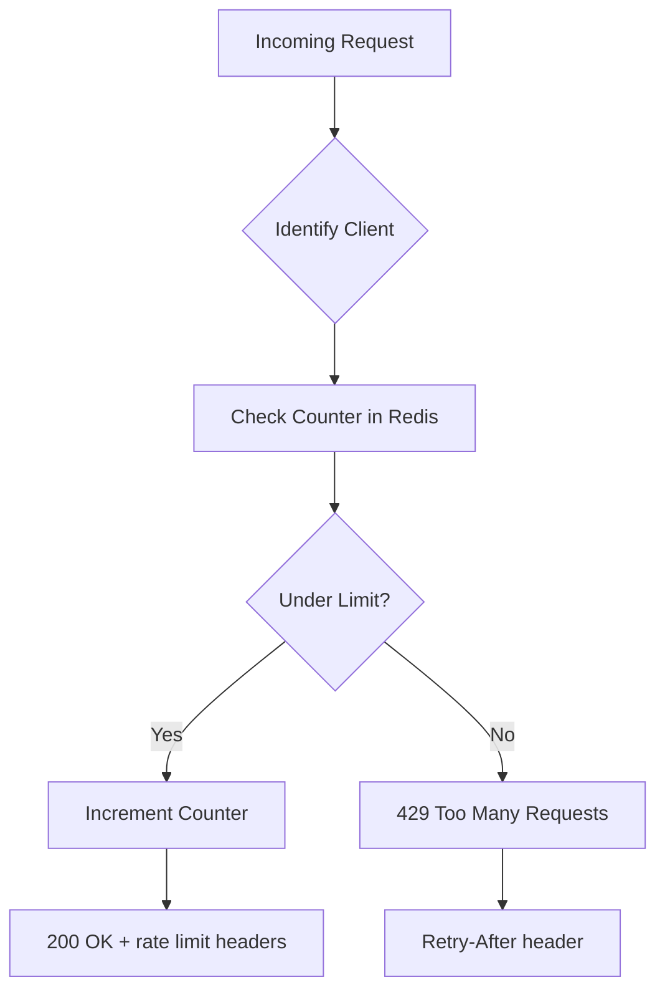

# 9. Rate Limiting

> **Think:** *"How many requests are too many?"*

---

## The 4 Questions

| Question | Answer |
|----------|--------|
| **What problem does it solve?** | Uncontrolled request volume — abusive clients, scrapers, runaway retries, or accidental loops overwhelming your system. |
| **What happens if I ignore it?** | One bad actor takes down the service for everyone. Your own retry storms amplify outages. API costs spike from scraper traffic. |
| **Where would I use it?** | Public APIs, login/signup endpoints, payment APIs, search endpoints, webhook receivers, partner integrations. |
| **What companies use it?** | Stripe (rate limits per API key), Twitter/X API (tiered limits), Cloudflare (DDoS + per-IP limits), AWS API Gateway (throttling). |

---

## Mental Movie (60 seconds)

Your hotel search API is public. A travel aggregator starts scraping every hotel, every city, every date — 2,000 requests/second from one API key.

**Without rate limiting:** Their scraper consumes 80% of your DB connections. Real users searching for Goa hotels get 10-second timeouts. Your cloud bill doubles.

**With rate limiting:** Aggregator hits 100 req/min limit. Gets `429 Too Many Requests` with `Retry-After: 30`. Real users unaffected. Aggregator negotiates a paid tier with higher limits.

Same protection works inward: your booking service retries a failing payment API 50 times/second during an outage — rate limiting on the payment client prevents you from becoming the DDoS attacker.

---

## How It Works

**Rate limiting** caps how many requests a client (user, IP, API key) can make within a time window.

```
Limit: 100 requests per minute per API key

Request 1–100:  200 OK
Request 101:    429 Too Many Requests
                Retry-After: 42
                X-RateLimit-Remaining: 0
                X-RateLimit-Reset: 1704067200
```



### Common Algorithms

| Algorithm | How it works | Pros | Cons |
|-----------|--------------|------|------|
| **Fixed Window** | Count requests per minute/hour; reset at window boundary | Simple | Burst at window boundary (200 at 12:00:59 + 200 at 12:01:00) |
| **Sliding Window** | Count requests in rolling last N seconds | Smoother, no boundary burst | More memory per client |
| **Token Bucket** | Tokens refill at steady rate; each request costs one token | Allows controlled bursts | Slightly more complex |
| **Leaky Bucket** | Requests processed at fixed rate; overflow dropped | Smooth output rate | Doesn't allow bursts at all |

**Token bucket** is the most common in production APIs — allows short bursts (user clicks 5 times fast) while enforcing average rate over time.

### Where to Enforce

| Layer | Example | Protects |
|-------|---------|----------|
| **Edge (CDN/WAF)** | Cloudflare rate limit rules | DDoS, scrapers, before traffic hits origin |
| **API Gateway** | AWS API Gateway throttling | Per-key limits, burst + steady state |
| **Application** | Middleware in your API | Business-logic-aware limits (per user tier) |
| **Downstream client** | Retry policy with max QPS | Your service doesn't flood a failing dependency |

**Key ingredients:**
1. **Client identity** — API key, user ID, IP address, or combination
2. **Counter store** — Redis (fast, atomic INCR with TTL) or in-memory (single instance only)
3. **Clear response** — `429` with `Retry-After` and rate limit headers
4. **Tiered limits** — free tier 100/min, paid tier 10,000/min
5. **Exemptions** — internal services, health checks, webhooks from trusted partners

---

## Real-World Examples

### Your Travel Platform

**Scenario:** Public hotel search API + partner integration + mobile app.

**Rate limit tiers:**

| Client | Limit | Window | Action on exceed |
|--------|-------|--------|------------------|
| Anonymous (IP) | 30 req | per minute | 429, block 60s |
| Logged-in user | 120 req | per minute | 429, soft throttle |
| Partner API key (free) | 1,000 req | per hour | 429 + email alert |
| Partner API key (paid) | 50,000 req | per hour | 429 only |
| Internal services | Unlimited | — | — |

**Critical endpoints get stricter limits:**
```
POST /api/v1/book     → 10 req/min per user (prevent script booking)
POST /api/v1/payments → 5 req/min per user
POST /api/v1/auth/otp → 3 req/5min per phone (prevent OTP spam)
GET  /api/v1/search   → 60 req/min per user
```

**Retry storm protection:** When hotel supplier returns 503, your retry logic (Module 1) must respect the supplier's `Retry-After` header — not blindly retry 10 times/second and become the problem.

### Nykaa

**Scenario:** Flash sale — bots try to scoop limited inventory. Scrapers harvest pricing data.

Nykaa layers rate limiting:
- **Edge (Akamai/Cloudflare):** IP-based limits on product pages during sales
- **Login/signup:** CAPTCHA + rate limit after 3 failed attempts
- **Add to cart:** Per-user limit during flash sales (prevent bot hoarding)
- **Checkout:** Max 2 concurrent checkout attempts per user
- **Partner APIs:** Strict per-key quotas with overage billing

During a major sale, they temporarily tighten limits — better to show "try again" to a few users than crash for everyone.

### Amazon

**Scenario:** AWS API rate limits are the canonical example of production rate limiting.

Every AWS API has limits:
- EC2 `DescribeInstances`: 100 requests/second (varies by API)
- Exceed limit → `ThrottlingException` (equivalent to 429)
- SDKs implement automatic backoff with jitter
- Customers request limit increases via support ticket

Amazon Product Advertising API enforces strict per-associate limits — scrape too fast, lose API access entirely.

**Lesson:** Rate limits are a product feature, not just ops plumbing. They protect the platform and create pricing tiers.

---

## When To Use It

| Use rate limiting when... | Example |
|---------------------------|---------|
| API is public or partner-accessible | Hotel search, pricing API |
| Endpoint is expensive (DB-heavy, external call) | Flight search, payment processing |
| Abuse has clear patterns | OTP spam, credential stuffing on login |
| You have retry logic that could amplify load | Internal services calling a struggling dependency |
| You want tiered API products | Free 1K/day, Pro 100K/day |

## When NOT To Use It

| Skip rate limiting when... | Why |
|----------------------------|-----|
| Internal-only service with trusted callers | Network isolation is sufficient |
| Limits would block legitimate peak traffic | Fix capacity (Topics 6–8) instead of throttling real users |
| You can't identify the client reliably | NAT/shared IP makes per-IP limits unfair (mobile carriers) |
| Single global limit with no per-client breakdown | One bad IP shouldn't throttle everyone — scope the limit |
| You're using rate limiting to avoid fixing O(n²) code | A slow endpoint is still slow at 50 req/min |

---

## Rate Limiting vs Related Concepts

| Concept | Difference |
|---------|-----------|
| **Backpressure** (Topic 10) | Slows producers when consumers are overwhelmed; rate limiting caps ingress regardless of downstream state |
| **Circuit Breaker** (Module 1) | Stops calls to a failing dependency; rate limiting caps calls to any dependency |
| **Throttling** | Often used interchangeably; throttling may queue requests, rate limiting rejects them |
| **DDoS Protection** | Rate limiting at scale with behavioral analysis; CDN/WAF layer |
| **Quota** | Longer time window (per day/month); rate limit is per second/minute |

**Rule of thumb:** Rate limiting protects **your system from clients**. Backpressure protects **your system from itself**.

---

## Implementation Checklist

- [ ] Return `429` with `Retry-After` header (seconds until reset)
- [ ] Include `X-RateLimit-Limit`, `X-RateLimit-Remaining`, `X-RateLimit-Reset` in responses
- [ ] Use Redis (or similar) for distributed counters — in-memory doesn't work across instances
- [ ] Different limits for different endpoints (search vs payment vs auth)
- [ ] Log rate limit hits — spike in 429s = attack, misconfigured client, or under-provisioned capacity
- [ ] Document limits in API docs — partners plan around them
- [ ] Your own retry logic respects `429` and `Retry-After` from upstream services

---

## Problem Simulation

**Situation:** Your travel platform launches a public hotel search API. Within a week:

1. A price-comparison site scrapes 500 req/s with a valid free-tier API key.
2. Your mobile app has a bug — search screen retries on every keystroke, 10 req/s per user.
3. During a supplier outage, your booking service retries payment calls 20 times in 5 seconds per failed booking.
4. A legitimate partner (MakeMyTrip competitor) hits their 1,000/hour limit during a campaign.

**Questions:**
1. Which problem is rate limiting designed to solve?
2. Which problem is your bug, not the client's abuse?
3. What should happen in scenario 4 — block or upgrade?

<details>
<summary>Answers</summary>

1. **Scenario 1** — classic rate limiting case. Free tier exceeded; return 429, offer paid tier.
2. **Scenario 2** — your bug (debounce search input). Rate limiting would mask it by blocking your own users. Fix the client.
3. **Scenario 3** — your retry storm (Module 1). Add client-side rate limiting on outbound calls + respect circuit breaker. You're DDoS-ing your own payment gateway.
4. **Upgrade path** — legitimate business need. Auto-alert sales, offer temporary limit bump, or self-serve tier upgrade. Don't treat paying partners like attackers.

</details>

---

## Key Takeaway

Rate limiting draws a line — this many requests, no more. It protects your system from abuse, scrapers, and your own retry storms. But limits must be tiered, scoped per client, and paired with clear `429` responses so good actors can adapt.

**Next:** [10 — Backpressure](./10-backpressure.md) — when the system needs to slow down from the inside.
