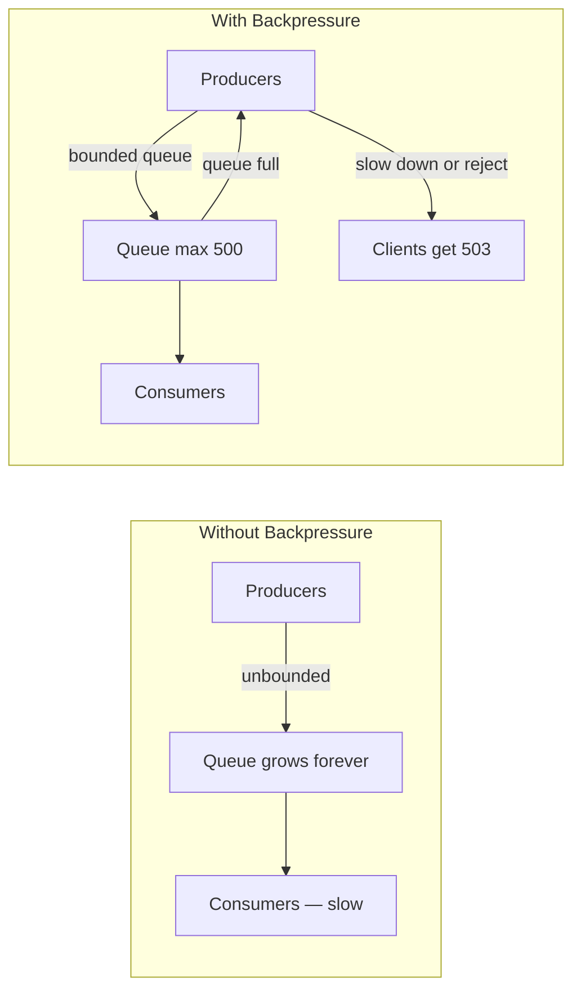

# 10. Backpressure

> **Think:** *"How do I slow incoming work?"*

---

## The 4 Questions

| Question | Answer |
|----------|--------|
| **What problem does it solve?** | Unbounded queues — producers outpacing consumers, memory filling up, latency exploding until the system OOM-crashes. |
| **What happens if I ignore it?** | Queue grows forever. GC pauses stretch to seconds. Eventually: out-of-memory kill, cascading failure across every service feeding the queue. |
| **Where would I use it?** | Message queues, stream processing, thread pools, API gateways, any producer-consumer pipeline where arrival rate can exceed processing rate. |
| **What companies use it?** | Kafka (consumer lag + pause consumption), Reactive Streams (explicit backpressure protocol), gRPC (flow control), Node.js streams, Netflix (bounded queues between pipeline stages). |

---

## Mental Movie (60 seconds)

Your booking service accepts requests instantly. Confirmation emails go to a queue. A worker sends them one by one.

**Normal:** 50 bookings/minute. Queue depth: ~10. Workers keep up.

**Supplier outage:** Bookings still succeed (cached inventory), but confirmation emails slow down because the email provider is throttling. Queue depth: 10 → 1,000 → 50,000. Each booking object sits in RAM. JVM heap fills. GC runs constantly. API latency spikes to 30 seconds. The whole service crashes — not because of bookings, but because of unconsumed emails.

**With backpressure:** When the email queue hits 500, the booking API starts returning `503 Service Unavailable — system busy, retry later`. Queue stops growing. Memory stays stable. Email workers catch up. System recovers.

Backpressure is the system saying: **"I can't accept more work right now. Slow down."**

---

## How It Works

**Backpressure** is a mechanism where a **downstream component signals upstream to reduce the rate of incoming work** when it can't keep up.

Unlike rate limiting (Topic 9), which caps ingress from external clients, backpressure manages **internal flow** between components of your own system.



### Common Mechanisms

| Mechanism | How it works | Example |
|-----------|--------------|---------|
| **Bounded queue** | Queue has max size; producers block or reject when full | `ArrayBlockingQueue(500)` |
| **Drop oldest (shed load)** | Queue full → discard oldest items, accept new | Real-time analytics (stale data worthless) |
| **Drop newest** | Queue full → reject incoming, keep processing existing | Preserve work already in pipeline |
| **Block producer** | Producer thread waits until queue has space | Kafka consumer pause |
| **Return pressure to client** | API returns 503/429 when internal queues are saturated | HTTP-level backpressure |
| **Reactive streams** | Explicit `request(n)` protocol — consumer pulls at its pace | RxJava, Project Reactor, gRPC streaming |

### The Backpressure Signal Chain

```
Client → API Gateway → App Server → Internal Queue → Worker → External API
                ↑           ↑              ↑
         429/503 here   503 here    pause consumption here
```

Each layer should propagate pressure upward. If only the worker slows down but the API keeps accepting requests, the queue between API and worker still grows unbounded.

**Key ingredients:**
1. **Bounded buffers** — every queue has a max size, no unbounded `LinkedList`
2. **Pressure propagation** — saturation at any layer signals upstream
3. **Graceful degradation** — return 503 with `Retry-After`, don't crash
4. **Monitoring** — queue depth, consumer lag, processing rate as primary metrics
5. **Shedding strategy** — decide what to drop when you must (old vs new, low-priority vs high)

---

## Real-World Examples

### Your Travel Platform

**Scenario:** Booking flow is multi-stage: validate → reserve inventory → charge payment → confirm with supplier → send notifications.

```
Booking API → [Queue: booking-jobs, max 1000] → Worker Pool (10 workers)
                                                      │
                                              ┌───────┼───────┐
                                              ▼       ▼       ▼
                                          Payment  Hotel   Email
                                          Gateway  API    Service
```

**Backpressure policies:**

| Queue | Max Size | When Full | Rationale |
|-------|----------|-----------|-----------|
| `booking-jobs` | 1,000 | API returns 503 | Bookings are revenue — reject rather than lose |
| `notification-jobs` | 5,000 | Drop oldest notifications | Email can be late; booking cannot |
| `analytics-events` | 500 | Drop all new events | Analytics is best-effort |
| `payment-retries` | 100 | Block + alert ops | Money must not be lost |

**Consumer lag monitoring:**
```
booking-jobs queue depth > 500 for 2 min  → scale workers (auto-scale)
booking-jobs queue depth > 900 for 1 min  → enable backpressure (503 to clients)
payment-retries queue depth > 50          → page on-call (money at risk)
```

### Nykaa

**Scenario:** Order placement during flash sale. Orders/sec >> inventory confirmation rate.

Nykaa implements backpressure at multiple stages:
- **Cart service:** When order queue depth exceeds threshold, "Place Order" button shows "High demand — please wait" instead of accepting more orders into a doomed queue
- **Inventory service:** Reservation requests are shed — return "out of stock" rather than queue 100K pending reservations that will mostly fail
- **Notification pipeline:** SMS/email notifications are deprioritized during peak — orders process first, notifications catch up later
- **Search indexing:** Product catalog updates to Elasticsearch are batched; if ES is slow, indexing pauses rather than crashing the catalog service

The product decision: **fail fast on orders you can't fulfill** rather than accept everything and collapse.

### Amazon

**Scenario:** Black Friday order pipeline — millions of orders/hour through placement, payment, fulfillment, shipping.

Amazon's pipeline uses backpressure everywhere:
- **SQS queues** with visibility timeouts — if a consumer can't process, message returns to queue (not lost, not duplicated infinitely)
- **Kinesis streams** — consumers track lag; if lag exceeds SLA, auto-scale consumers or shed to dead letter queue
- **DynamoDB throttling** — when capacity exceeded, SDK backs off (built-in backpressure); provisioned capacity is the bound
- **Load shedding at the edge** — during extreme events, Amazon may show a "wish list" page instead of checkout to shed load before it enters the order pipeline

Amazon's lesson: **every buffer in the system must be bounded, monitored, and have a shedding strategy.**

---

## When To Use It

| Use backpressure when... | Example |
|--------------------------|---------|
| Producers and consumers run at different speeds | API accepts fast, DB writes slow |
| Traffic spikes are unpredictable | Flash sales, viral events |
| Downstream dependency is degrading | Supplier API slowing down, queue backing up |
| Memory is finite (it always is) | Unbounded queue = eventual OOM |
| You have tiered priority work | Orders > notifications > analytics |
| Pipeline has multiple stages with different throughput | Ingest → process → store → notify |

## When NOT To Use It

| Skip backpressure when... | Why |
|---------------------------|-----|
| System is synchronous end-to-end | Request waits for response; queue doesn't exist |
| You can scale consumers faster than producers arrive | Auto-scaling solves it without explicit pressure |
| Dropping work is never acceptable | Payment queue — don't drop; block and alert instead |
| Queue depth is tiny and bounded by design | Max 10 items by business logic |
| You're using backpressure to hide under-provisioned capacity | Fix capacity first; backpressure is a safety net, not a capacity plan |

---

## Backpressure vs Related Concepts

| Concept | Difference |
|---------|-----------|
| **Rate Limiting** (Topic 9) | Caps external request rate regardless of internal state; backpressure reacts to internal saturation |
| **Circuit Breaker** (Module 1) | Stops calling a failing dependency; backpressure slows the flow, doesn't stop it entirely |
| **Load Balancer** (Topic 8) | Distributes across instances; doesn't slow producers when all instances are busy |
| **Throttling** | Often overlaps; throttling may slow producers proactively, backpressure is reactive to consumer state |
| **Auto-scaling** | Adds capacity to match demand; backpressure protects while scaling catches up |

**Rule of thumb:** Rate limiting is the bouncer at the door. Backpressure is the kitchen telling the waitstaff to stop seating tables.

---

## Implementation Checklist

- [ ] Every internal queue has a maximum size — audit for unbounded collections
- [ ] Queue depth is a monitored metric with alerts (not just CPU/memory)
- [ ] Saturation triggers a visible response — 503 to clients, pause to producers
- [ ] Shedding policy is explicit per queue — what gets dropped, what never gets dropped
- [ ] Consumer lag tracked (Kafka lag, SQS approximate message count)
- [ ] Auto-scaling tied to queue depth, not just CPU
- [ ] Load test with slow consumers — verify backpressure kicks in before OOM

---

## Problem Simulation

**Situation:** Your travel platform's booking pipeline during a viral campaign:

1. Bookings arrive at 500/min. Workers process at 200/min. Queue grows by 300/min.
2. At 10,000 queued bookings, server RAM hits 90%. API latency goes from 200ms to 15s.
3. You add backpressure: API returns 503 when queue > 2,000. Queue stabilizes at 2,000.
4. Hotel supplier API slows to 50 confirmations/min. Payment workers finish but confirmation workers back up.
5. Users who got 503 retry immediately (no backoff). Queue refills in 30 seconds.

**Questions:**
1. Why did step 2 happen even though CPU was only at 60%?
2. Did backpressure in step 3 solve the problem?
3. What's missing in step 5 that turns backpressure into a retry storm?

<details>
<summary>Answers</summary>

1. **Memory, not CPU** — 10,000 booking objects in the queue consumed RAM. GC pressure caused latency spikes. CPU looked fine while the system was dying.
2. **Partially** — it stopped the OOM crash, but throughput is still 200/min vs 500/min demand. You also need to scale consumers or shed load at the source (close bookings temporarily).
3. **Client retry backoff** — 503 without `Retry-After` + client retrying immediately = retry storm (Module 1). Clients must respect `Retry-After: 30` and use exponential backoff. Pair backpressure with rate limiting on retries.

</details>

---

## Key Takeaway

Backpressure is the system's immune response — when downstream can't keep up, upstream must slow down. Unbounded queues are a time bomb. Every buffer needs a max size, a monitoring alert, and a plan for what happens when it's full.

**Next:** [Module 3 — Performance](../module-03-performance/README.md) — now that you can survive the load, make it fast.
