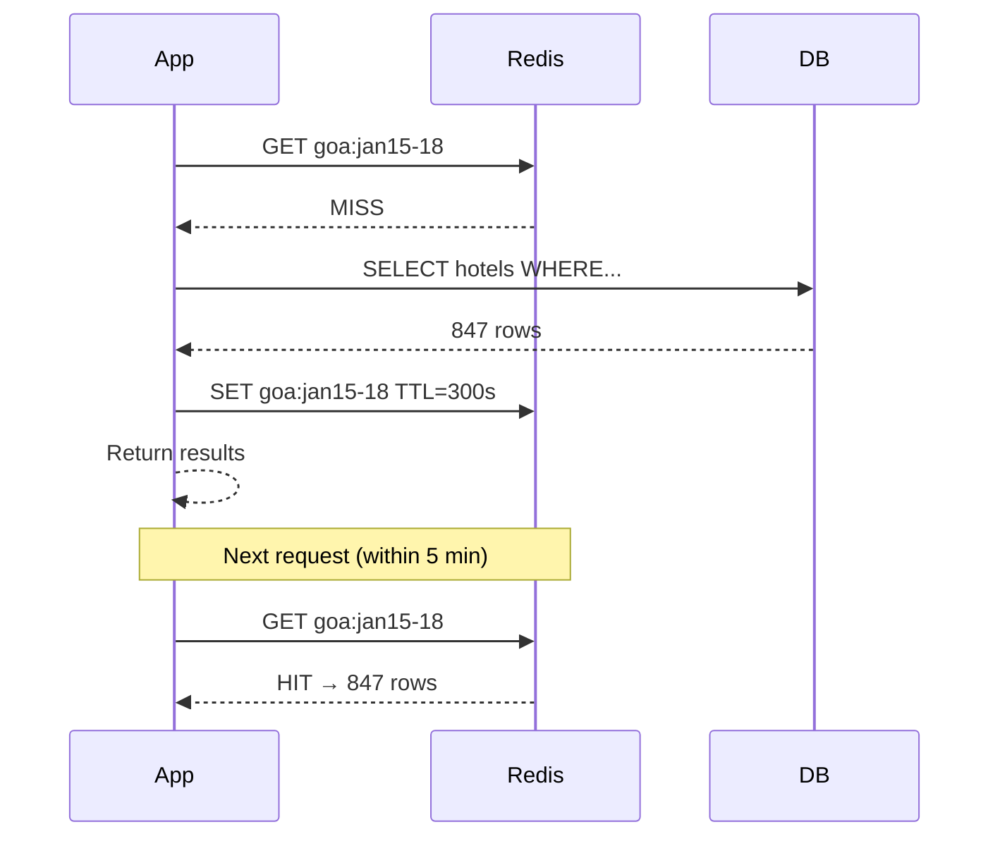

# 11. Caching

> **Think:** *"Can I remember this answer?"*

---

## The 4 Questions

| Question | Answer |
|----------|--------|
| **What problem does it solve?** | Repeated expensive work — DB queries, API calls, computed aggregations — by storing results in fast memory for reuse. |
| **What happens if I ignore it?** | Every request hits the database. Page loads spike from 50ms to 500ms+. DB becomes the bottleneck before you have real scale. |
| **Where would I use it?** | Product catalogs, search results, user sessions, API rate-limit counters, config/settings, flight fare lookups. |
| **What companies use it?** | Amazon (ElastiCache for product pages), Nykaa (Redis for cart and catalog), MakeMyTrip (cached fare rules), Cloudflare (edge caching). |

---

## Mental Movie (60 seconds)

A user searches "Goa hotels, Jan 15–18." Your server runs a complex query: join hotels, availability, pricing, reviews. Takes 400ms. Hits PostgreSQL.

Ten seconds later, another user searches the **same** dates and destination. Your server runs the **same** 400ms query again.

**Without caching:** 400ms × 10,000 searches/hour = your DB melts.

**With caching:** First search stores `goa:jan15-18 → [hotel list]` in Redis for 5 minutes. Next 9,999 searches read Redis in 2ms. DB breathes.

That's caching. Remember the answer so you don't recompute it.

---

## How It Works

```
Request → Check cache → Hit? Return cached value (fast)
                     → Miss? Compute → Store in cache → Return
```

### Cache-Aside Pattern (most common)



**Key ingredients:**
1. **Cache key** — unique identifier for the data (`user:123:profile`, `product:456:price`)
2. **TTL (Time To Live)** — how long cached data stays valid (60s for stock counts, 24h for static config)
3. **Invalidation** — delete or update cache when source data changes
4. **Eviction policy** — what to remove when cache is full (LRU = least recently used)

### Cache Layers

| Layer | Speed | Example |
|-------|-------|---------|
| Browser cache | Fastest | `Cache-Control` headers on static assets |
| CDN edge | Very fast | Product images, JS bundles |
| Application cache (Redis) | Fast | Search results, session data |
| In-process cache | Fastest for single server | Config, hot lookup tables |

---

## Real-World Examples

### Your Travel Platform

**Scenario:** Flight search "DEL → BOM, tomorrow."

```
Cache key:  flights:DEL:BOM:2026-01-20:v3
TTL:        120 seconds (fares change frequently)
Value:      JSON array of 47 flight options
```

When a user refreshes search results within 2 minutes, they get instant results. When an airline pushes a fare update, your ingestion service invalidates matching keys.

**Without caching:** Every search hits the GDS/supplier API + your DB. Supplier rate limits you. Users see spinners.

### Nykaa

**Scenario:** Product detail page for a bestselling lipstick.

Nykaa caches:
- Product metadata (name, brand, images) — longer TTL
- Inventory count — short TTL (30–60s) or write-through on stock change
- Personalized recommendations — per-user cache key

During flash sales, catalog cache prevents the product DB from being hammered by millions of identical reads.

### Amazon

**Scenario:** Product page for a popular item.

Amazon caches aggressively at every layer:
- CDN for images and static assets
- ElastiCache (Redis/Memcached) for product details, reviews summary, "frequently bought together"
- Edge locations worldwide

A product page might serve 99% of reads from cache. The DB sees writes and cache misses only.

---

## When To Use It

| Use caching when... | Example |
|---------------------|---------|
| Data is read far more than written | Product catalog, hotel listings |
| Computation is expensive | Aggregated analytics, search facets |
| Stale data is acceptable for a window | "47 rooms left" can be 60 seconds old |
| External API calls are slow or rate-limited | Flight supplier fare lookups |
| Same query runs repeatedly | Homepage "top deals" section |

## When NOT To Use It

| Skip caching when... | Why |
|----------------------|-----|
| Data must always be fresh | Real-time stock for last 3 units in flash sale |
| Data is unique per request | One-time payment tokens, OTPs |
| Dataset is tiny and query is fast | `SELECT * FROM config WHERE key='app_name'` — 1ms anyway |
| You can't invalidate correctly | Stale prices shown after discount ends = angry users |
| You're at MVP with 50 users | Premature optimization; DB handles it fine |

---

## Caching vs Related Concepts

| Concept | Difference |
|---------|------------|
| **CDN** | Caches static files at edge; caching stores dynamic/computed data in memory |
| **Database indexing** | Makes DB reads faster; caching avoids DB reads entirely |
| **Replication** | Copies DB for read scaling; cache is a separate fast store with TTL |
| **Materialized views** | Pre-computed DB tables; cache is in-memory with faster invalidation |

**Rule of thumb:** Cache what's expensive to compute and safe to be slightly stale. Invalidate aggressively on writes that matter.

---

## Problem Simulation

**Situation:** Your travel platform caches hotel search results in Redis with a 10-minute TTL. Key: `hotels:goa:jan15-18`.

1. At 2:00 PM, Treebo drops their price by 40%. Your DB is updated immediately.
2. At 2:03 PM, a user searches Goa hotels for those dates.
3. At 2:08 PM, another user searches the same.

**Questions:**
1. What price does the 2:03 PM user see for Treebo?
2. What should happen at 2:10 PM when the cache expires?
3. How would you fix the stale-price problem without removing caching entirely?

<details>
<summary>Answers</summary>

1. **Old price** — cache hit returns data from 2:00 PM (or earlier), before the price drop.
2. At 2:10 PM, TTL expires. Next search is a cache miss → fresh DB query → correct new price gets cached.
3. **Cache invalidation on write:** When Treebo's price updates, delete `hotels:goa:*` keys (or publish invalidation event). Alternatively, use a shorter TTL for price-sensitive data (60s) while caching static hotel metadata longer (1 hour).

</details>

---

## Key Takeaway

Caching trades freshness for speed. The hard part isn't storing data in Redis — it's knowing **when to invalidate** so users don't see yesterday's price.

**Next:** [12 — CDN](./12-cdn.md) — what if the content itself could live closer to the user?
