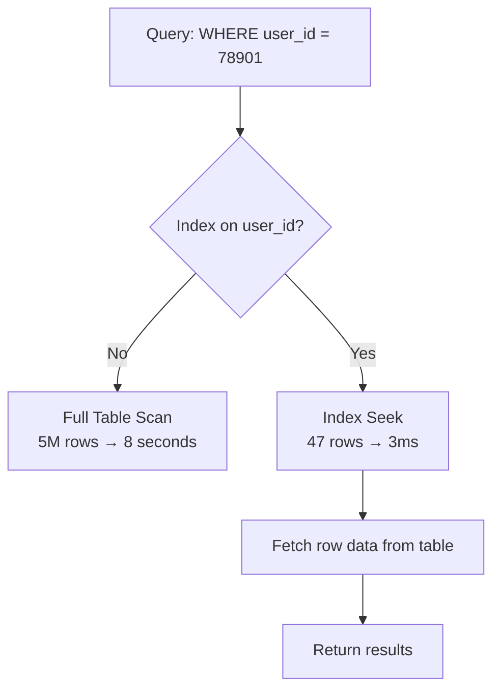

# 13. Database Indexing

> **Think:** *"How can database find data faster?"*

---

## The 4 Questions

| Question | Answer |
|----------|--------|
| **What problem does it solve?** | Full table scans — without indexes, the DB reads every row to find matches. At 10 million rows, that's seconds instead of milliseconds. |
| **What happens if I ignore it?** | Queries that worked fine at 10K rows take 30 seconds at 10M rows. DB CPU spikes. Everything slows down. |
| **Where would I use it?** | Columns in WHERE, JOIN, ORDER BY clauses — `user_id`, `order_status`, `created_at`, `email`, foreign keys. |
| **What companies use it?** | Every production database — Amazon (DynamoDB GSIs), Nykaa (PostgreSQL indexes on product SKU, category), any app with more than 100K rows. |

---

## Mental Movie (60 seconds)

Your `orders` table has 5 million rows. A user opens "My Orders."

```sql
SELECT * FROM orders WHERE user_id = 78901 ORDER BY created_at DESC;
```

**Without index:** PostgreSQL reads all 5 million rows, checks each `user_id`, keeps matches. 8 seconds. User abandons.

**With index on `user_id`:** Database uses a B-tree — jumps directly to rows for user 78901. 47 rows found in 3ms.

An index is like the index at the back of a textbook. You don't read every page to find "circuit breaker."

---

## How It Works

### B-Tree Index (most common)

```
                    [50]
                   /    \
              [25]        [75]
             /   \       /   \
          [10] [30]  [60] [90]
           |    |     |    |
         rows rows  rows rows
```

Database walks the tree to find matching keys in O(log n) time instead of O(n) full scan.



**Key ingredients:**
1. **Indexed column(s)** — the lookup key(s)
2. **Index type** — B-tree (range queries), Hash (exact match), GIN (JSON/full-text)
3. **Composite index** — multiple columns: `(user_id, created_at)` for filtered + sorted queries
4. **Covering index** — includes all columns the query needs, avoiding table lookup

### EXPLAIN Is Your Friend

```sql
EXPLAIN ANALYZE
SELECT * FROM orders WHERE user_id = 78901;

-- Bad:  Seq Scan on orders  (cost=0..125000 rows=5M)
-- Good: Index Scan using idx_orders_user_id  (cost=0..50 rows=47)
```

---

## Real-World Examples

### Your Travel Platform

**Scenario:** Search bookings by PNR and date range.

```sql
-- Slow without index
SELECT * FROM bookings
WHERE departure_date BETWEEN '2026-01-15' AND '2026-01-20'
  AND status = 'confirmed';

-- Fix: composite index
CREATE INDEX idx_bookings_date_status
ON bookings (departure_date, status);
```

Also index `pnr` (unique lookups) and `user_id` (order history). A missing index on `departure_date` turns a popular search into a full scan across millions of past bookings.

### Nykaa

**Scenario:** Product search filtered by category and brand.

Nykaa's product catalog table (millions of SKUs) needs indexes on:
- `category_id` — browse "Lipsticks"
- `brand_id` — filter by "Maybelline"
- `sku` — exact product lookup
- Composite `(category_id, is_active, sort_rank)` — category pages with sorting

Without indexes, category pages during sales become full table scans. DB replicas can't keep up.

### Amazon

**Scenario:** Order lookup by customer ID, order ID, and date.

Amazon's order systems index aggressively:
- Primary key on `order_id` (exact lookup)
- Index on `customer_id + order_date` (order history)
- Global Secondary Indexes in DynamoDB for alternate access patterns

At Amazon's scale, a missing index isn't slow — it's an outage.

---

## When To Use It

| Add an index when... | Example |
|----------------------|---------|
| Column appears in WHERE frequently | `WHERE user_id = ?` |
| Column used in JOINs | `orders.user_id = users.id` |
| Column used in ORDER BY | `ORDER BY created_at DESC` |
| Query is slow and EXPLAIN shows Seq Scan | Any production slow query |
| Unique constraint needed | `email`, `pnr`, `sku` |

## When NOT To Use It

| Skip or remove index when... | Why |
|------------------------------|-----|
| Table has < 10K rows | Full scan is fast enough |
| Column has very low cardinality | `gender` on a 50/50 table — index barely helps |
| Table is write-heavy, rarely read | Every index slows INSERT/UPDATE/DELETE |
| You index every column "just in case" | Indexes consume disk and slow writes |
| Query returns most of the table | Index scan + table fetch slower than seq scan |

---

## Indexing vs Related Concepts

| Concept | Difference |
|---------|------------|
| **Query optimization** | Writing better SQL; indexing gives the DB a fast lookup structure |
| **Caching** | Avoids DB entirely; indexing makes DB reads faster |
| **Partitioning** | Splits table physically; indexes speed lookups within partitions |
| **Denormalization** | Duplicates data to avoid joins; indexes make joins cheaper instead |

**Rule of thumb:** Index columns you filter, join, or sort on. Verify with `EXPLAIN ANALYZE`. Remove indexes that aren't used.

---

## Problem Simulation

**Situation:** Your travel platform's `bookings` table has 8 million rows. Two queries run constantly:

```sql
-- Query A (support dashboard): 50,000 times/day
SELECT * FROM bookings WHERE pnr = 'ABC123';

-- Query B (analytics): 10 times/day
SELECT COUNT(*) FROM bookings WHERE notes LIKE '%refund%';
```

You have an index on `pnr`. Someone suggests adding an index on `notes` for Query B.

**Questions:**
1. Should you add an index on `notes`?
2. Query A is still slow despite the `pnr` index. What's one common cause?
3. You add `INDEX (user_id, created_at)`. Which query does it help most?

<details>
<summary>Answers</summary>

1. **No** — `LIKE '%refund%'` with leading wildcard can't use a standard B-tree index efficiently. Query B runs 10x/day; the index would slow 8M writes for negligible read benefit.
2. **SELECT *** — fetching all columns when you only need a few. Or the index exists but query casts `pnr` (`WHERE UPPER(pnr) = ...`) preventing index use. Or table bloat / outdated statistics.
3. `SELECT * FROM bookings WHERE user_id = ? ORDER BY created_at DESC` — composite index covers filter + sort in one seek.

</details>

---

## Key Takeaway

Indexes turn "read every row" into "jump to the right rows." They're not free — every index costs write performance and disk. Add them for real slow queries, verify with EXPLAIN, remove ones you don't use.

**Next:** [14 — Query Optimization](./14-query-optimization.md) — even with indexes, can you ask for data smarter?
