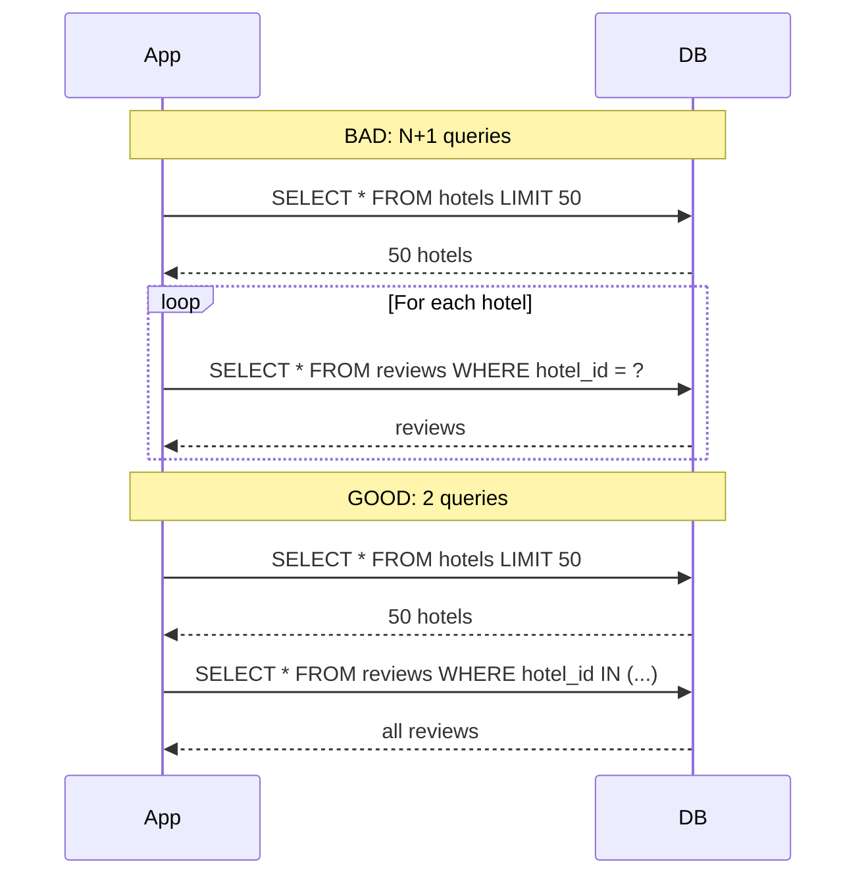

# 14. Query Optimization

> **Think:** *"Can I ask for data smarter?"*

---

## The 4 Questions

| Question | Answer |
|----------|--------|
| **What problem does it solve?** | Wasteful database access — fetching too much data, too many round trips, or running the same query hundreds of times (N+1). |
| **What happens if I ignore it?** | Pages make 200 DB queries instead of 3. APIs return 5MB JSON when 50KB would do. Indexes exist but queries still crawl. |
| **Where would I use it?** | ORM-heavy apps, list/detail pages, dashboards, search APIs, any endpoint slower than 200ms at the DB layer. |
| **What companies use it?** | Every scaled engineering team — Amazon (query review in code review), Nykaa (ORM N+1 fixes in catalog), Datadog/New Relic exist partly because of this problem. |

---

## Mental Movie (60 seconds)

Your hotel search API returns 50 hotels. For each hotel, your ORM lazy-loads reviews, amenities, and photos.

**Without optimization:** 1 query for hotels + 50 × 3 = **151 queries**. Page takes 2 seconds.

**With optimization:** 1 query for hotels + 1 JOIN for reviews + 1 batch for photos = **3 queries**. Page takes 80ms.

Same data. Same indexes. Smarter questions to the database.

---

## How It Works

### The N+1 Problem



### Common Optimization Techniques

| Technique | Before | After |
|-----------|--------|-------|
| **Select only needed columns** | `SELECT *` | `SELECT id, name, price` |
| **Eager loading / JOIN** | N+1 lazy loads | `JOIN` or `IN (...)` batch |
| **Pagination** | Return 10,000 rows | `LIMIT 20 OFFSET 0` |
| **Avoid functions on indexed columns** | `WHERE YEAR(date) = 2026` | `WHERE date >= '2026-01-01'` |
| **Exists vs Count** | `COUNT(*)` for boolean check | `EXISTS (SELECT 1 ...)` |
| **Denormalize hot reads** | 4-table JOIN every time | Store `hotel_name` on `booking` row |

### Read the Query Plan

```sql
EXPLAIN ANALYZE
SELECT h.name, AVG(r.rating)
FROM hotels h
JOIN reviews r ON r.hotel_id = h.id
WHERE h.city = 'Goa'
GROUP BY h.id, h.name;
```

Look for: `Seq Scan`, high `rows` estimates, `Nested Loop` on large tables, `Sort` on unindexed columns.

---

## Real-World Examples

### Your Travel Platform

**Scenario:** Package detail page — flight + hotel + activities.

**Bad:**
```python
package = Package.get(id)           # 1 query
package.flight                      # +1 (lazy)
package.hotel                       # +1 (lazy)
for activity in package.activities: # +N
    activity.supplier               # +N more
# Total: 2N + 3 queries
```

**Good:**
```python
package = Package.select_related(
    'flight', 'hotel'
).prefetch_related(
    'activities__supplier'
).get(id=id)
# Total: 3-4 queries regardless of activity count
```

**Without optimization:** 200ms page at 10 activities becomes 2s at 50 activities.

### Nykaa

**Scenario:** Category page — 48 products with brand name, rating, price, primary image.

Nykaa optimizes by:
- Single query with JOINs instead of per-product lookups
- Selecting only columns needed for the grid (not full product descriptions)
- Pre-aggregated `avg_rating` and `review_count` on product row (denormalized)
- Cursor-based pagination instead of `OFFSET 10000` (which scans skipped rows)

A category page query budget might be < 50ms at the DB layer.

### Amazon

**Scenario:** "Customers who bought this also bought" carousel.

Amazon doesn't run a complex JOIN on every product page load. They:
- Pre-compute recommendations offline (batch jobs)
- Store results in a fast lookup table or cache
- Query: `SELECT recommended_ids FROM also_bought WHERE product_id = ?` — one indexed lookup

The optimization isn't a cleverer JOIN — it's not running the JOIN at request time at all.

---

## When To Use It

| Optimize queries when... | Example |
|--------------------------|---------|
| Endpoint is slow and DB time dominates | APM shows 80% time in SQL |
| EXPLAIN shows Seq Scan on large tables | Missing index or bad query shape |
| ORM generates N+1 queries | List pages with relations |
| API returns huge payloads | Full user objects when you need `id, name` |
| Dashboard runs aggregations on every load | Pre-compute or materialize |

## When NOT To Use It

| Don't over-optimize when... | Why |
|-----------------------------|-----|
| Table has 500 rows | Any query is fast enough |
| Query runs once a day (batch report) | 30 seconds offline is fine |
| Premature denormalization at MVP | Joins are correct; optimize when measured slow |
| You micro-optimize before measuring | Profile first; fix the biggest query |
| Readability suffers for 2ms gain | Maintainability matters |

---

## Query Optimization vs Related Concepts

| Concept | Difference |
|---------|------------|
| **Database indexing** | Gives DB fast lookup paths; optimization reduces how much data you ask for |
| **Caching** | Skips the query entirely; optimization makes the query cheaper |
| **Denormalization** | Schema change to avoid joins; optimization is often query/code change |
| **Connection pooling** | Reuses connections; optimization reduces work per connection |

**Rule of thumb:** Measure first (slow query log, APM, EXPLAIN). Fix N+1 and `SELECT *` before buying bigger hardware.

---

## Problem Simulation

**Situation:** Your travel platform order history endpoint:

```python
orders = Order.filter(user_id=123).order_by('-created_at')[:20]
return [{
    'id': o.id,
    'total': o.total,
    'hotel_name': o.hotel.name,        # lazy load
    'items': [i.name for i in o.items] # lazy load each order
} for o in orders]
```

User has 2,000 orders. Endpoint takes 4 seconds. DB shows 41 queries per request.

**Questions:**
1. How many queries does the loop cause for 20 orders with avg 3 items each?
2. What's the fix?
3. User scrolls to page 50 (`OFFSET 980`). Why does it get slower?

<details>
<summary>Answers</summary>

1. 1 (orders) + 20 (hotels) + 20 (items collections) = **41 queries**. Classic N+1.
2. `select_related('hotel').prefetch_related('items')` on the initial queryset. Or denormalize `hotel_name` onto the order row.
3. **OFFSET penalty** — `OFFSET 980` forces DB to scan and discard 980 rows before returning 20. Fix: cursor-based pagination (`WHERE created_at < last_seen ORDER BY created_at DESC LIMIT 20`).

</details>

---

## Key Takeaway

Indexes help the DB find data fast. Query optimization means you ask for **less data, fewer times**. The N+1 problem is the most common silent killer in ORM apps — always check your query count.

**Next:** [15 — Connection Pooling](./15-connection-pooling.md) — even fast queries hurt if you open a new connection every time.
