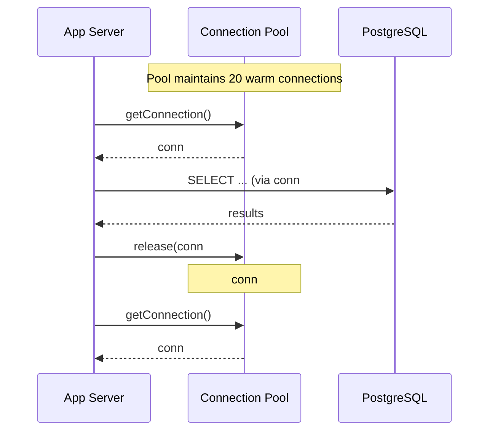

# 15. Connection Pooling

> **Think:** *"Can connections be reused?"*

---

## The 4 Questions

| Question | Answer |
|----------|--------|
| **What problem does it solve?** | Connection overhead — opening a new TCP + TLS + database authentication handshake for every request is slow (50–200ms) and exhausts DB connection limits. |
| **What happens if I ignore it?** | Under load, your app opens 5,000 connections. PostgreSQL maxes at 100–500. New requests fail with "too many connections." |
| **Where would I use it?** | Every app server talking to PostgreSQL, MySQL, Redis, or any external service with connection setup cost. |
| **What companies use it?** | PgBouncer (used everywhere), HikariCP (Java), SQLAlchemy pool, Prisma pool, AWS RDS Proxy, Amazon's internal connection multiplexers. |

---

## Mental Movie (60 seconds)

Your API gets 1,000 requests/second. Each request needs the database.

**Without pooling:** Each request opens a new connection (100ms handshake), runs a 5ms query, closes connection. You're spending 95% of time on connections, not queries. DB hits max connections at 200 concurrent users.

**With pooling:** App starts with 20 warm connections in a pool. Request borrows one, runs query, returns connection to pool. Handshake happens once. 1,000 req/s share 20–50 connections efficiently.

Connection pooling = a car rental, not buying a new car for every trip.

---

## How It Works

```
Request → Borrow connection from pool → Run query → Return connection to pool
                  ↑                                           |
                  └──────────── reuse ────────────────────────┘
```



**Key ingredients:**
1. **Pool size** — min/max connections (e.g., 5–20 per app instance)
2. **Idle timeout** — close connections unused for N minutes
3. **Max wait** — how long a request waits if pool is exhausted
4. **Health checks** — validate connection before handing it out (stale connection detection)

### Sizing Rule of Thumb

```
Total DB connections = (app_instances × pool_max) + admin/migration overhead
Must be < database max_connections (often 100–500 on RDS)
```

Example: 10 app servers × 20 pool max = 200 connections. Leave headroom for replicas and admin.

---

## Real-World Examples

### Your Travel Platform

**Scenario:** 8 Node.js API servers, each with a PostgreSQL connection pool.

```
Pool config:
  min: 2
  max: 15
  idleTimeout: 30s
  connectionTimeout: 5s

Total max: 8 × 15 = 120 connections (RDS limit: 200)
```

During peak booking hours, connections are reused thousands of times per minute. Without pooling, each `/search` request would pay a 80ms connection tax on top of a 20ms query.

**PgBouncer** sits between app servers and RDS when you scale to 50+ instances — multiplexes thousands of app connections onto ~100 real DB connections.

### Nykaa

**Scenario:** Microservices architecture — catalog, cart, order, payment each talk to databases.

Each service has its own connection pool. Common failure mode during sales:
- Cart service pool max too high → exhausts shared DB
- Connection leak (forgot to release) → pool drains → cascading timeouts

Nykaa likely uses RDS Proxy or PgBouncer at the infrastructure layer to centralize connection management across hundreds of pods.

### Amazon

**Scenario:** Thousands of service instances hitting shared datastore clusters.

Amazon built connection multiplexing into their infrastructure:
- Internal proxy layers between services and databases
- Strict pool size limits per service enforced in deployment configs
- Connection storms during deploys are a known incident category — pools prevent them

At scale, connection management is infrastructure, not application detail.

---

## When To Use It

| Use connection pooling when... | Example |
|--------------------------------|---------|
| App makes multiple DB requests per second | Any production API |
| Connection setup is expensive (TLS, auth) | Cloud DB with SSL |
| You have multiple app instances | Horizontal scaling |
| DB has a connection limit | RDS PostgreSQL default ~100–5000 depending on instance |
| Using serverless with DB | RDS Proxy for Lambda → RDS |

## When NOT To Use It

| Skip or simplify when... | Why |
|--------------------------|-----|
| Single long-running batch job | One connection for hours is fine |
| Embedded SQLite (file-based) | No network handshake |
| Prototype script that runs once | `psql` CLI doesn't need a pool |
| Pool max × instances > DB limit | Misconfigured pool is worse than no pool |

---

## Connection Pooling vs Related Concepts

| Concept | Difference |
|---------|------------|
| **Query optimization** | Reduces work per query; pooling reduces connection overhead per query |
| **Load balancer** | Distributes HTTP requests across servers; pool distributes DB connections within a server |
| **Caching** | Avoids DB calls; pooling makes remaining DB calls cheaper to initiate |
| **Read replicas** | Scales read capacity; each replica still needs pooled connections |

**Rule of thumb:** Default pool size is small (10–20 per instance). Use a connection proxy (PgBouncer, RDS Proxy) when instances × pool size threatens DB limits.

---

## Problem Simulation

**Situation:** Your travel platform runs 20 Kubernetes pods. Each pod has `pool.max = 50`. PostgreSQL RDS `max_connections = 500`. During a traffic spike, users see random "connection timeout" errors.

**Questions:**
1. What's the math problem?
2. Why do errors appear randomly, not on every request?
3. What's the fix?

<details>
<summary>Answers</summary>

1. 20 pods × 50 max = **1,000 potential connections** > 500 limit. Pods compete; some can't get connections.
2. Pool hands out connections until DB limit hit. Early requests succeed; later requests wait and timeout. Depends on which pod and timing.
3. Lower per-pod `max` to ~20 (20 × 20 = 400, under 500). Add **PgBouncer** or **RDS Proxy** to multiplex. Monitor `pg_stat_activity` for connection count.

</details>

---

## Key Takeaway

Opening a database connection is expensive. Pools keep warm connections ready for reuse. Size pools so `(instances × max)` stays under your database limit — or use a connection proxy.

**Next:** [16 — Lazy Loading](./16-lazy-loading.md) — even with a pooled connection, do you need to fetch everything upfront?
