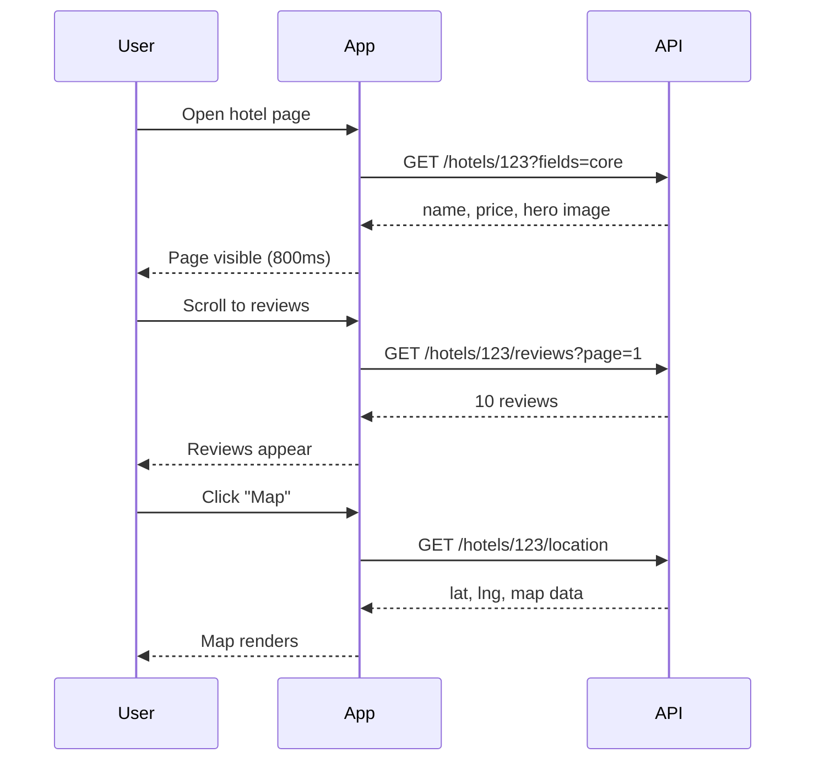

# 16. Lazy Loading

> **Think:** *"Do I need this right now?"*

---

## The 4 Questions

| Question | Answer |
|----------|--------|
| **What problem does it solve?** | Over-fetching — loading data the user may never see wastes bandwidth, memory, and initial load time. |
| **What happens if I ignore it?** | Homepage loads 5MB of data for tabs the user never clicks. Mobile users on 3G abandon. Server memory spikes. |
| **Where would I use it?** | Below-the-fold content, modals, tabs, infinite scroll feeds, related products, user profile sections, image galleries. |
| **What companies use it?** | Amazon (reviews load on click), Nykaa (product zoom images), Instagram/Twitter (infinite scroll), React `lazy()` / dynamic imports. |

---

## Mental Movie (60 seconds)

User opens a hotel detail page on your travel app.

**Without lazy loading:** Page fetches hotel info, 200 reviews, 40 photos, map tiles, similar hotels, weather forecast, and airport transfer options — all before showing anything. 4 seconds on 4G. User leaves.

**With lazy loading:** Page fetches hotel name, price, hero image, and "Book Now" — renders in 0.8 seconds. Reviews load when user scrolls to them. Map loads when they tap "Location." Similar hotels load in background.

User books. They never saw 60% of the data you used to fetch upfront.

---

## How It Works

```
Initial load:  Only critical data → fast first paint
User action:   Scroll / click / expand → fetch more
```



### Types of Lazy Loading

| Type | Where | Example |
|------|-------|---------|
| **Data lazy loading** | API/backend | Fetch reviews only when section is visible |
| **Image lazy loading** | Frontend | `loading="lazy"` — images load when near viewport |
| **Code splitting** | Frontend bundles | `React.lazy(() => import('./Admin'))` |
| **ORM lazy loading** | Database | Load `order.items` only when accessed (watch for N+1!) |
| **Route-based splitting** | SPA | Each page loads its own JS chunk |

### Lazy Loading vs Eager Loading

| Lazy | Eager |
|------|-------|
| Faster initial load | Slower initial load |
| Latency on first access to deferred content | Everything ready immediately |
| Less memory/bandwidth | More memory/bandwidth |
| Good for large optional sections | Good for small, always-needed data |

---

## Real-World Examples

### Your Travel Platform

**Scenario:** Booking confirmation page with itinerary, invoice, hotel voucher, and travel tips.

```
Initial render:
  GET /bookings/789/summary     → PNR, dates, status, total

On expand "Download voucher":
  GET /bookings/789/voucher.pdf

On expand "Travel tips for Goa":
  GET /destinations/goa/tips
```

User who just wants their PNR doesn't wait for PDF generation or tips content.

### Nykaa

**Scenario:** Product detail page.

Nykaa lazy-loads:
- High-resolution zoom images (only when user pinches/zooms)
- "Ingredients" and "How to use" tabs (on tab click)
- Review photos (when user scrolls to reviews)
- "Complete the look" recommendations (below fold, intersection observer)

Above-the-fold: product name, price, add-to-cart, primary image — loads in < 1 second on mobile.

### Amazon

**Scenario:** Product page with Q&A, reviews, specifications, video.

Amazon's page architecture:
- Core product data in initial HTML (SEO + fast paint)
- Reviews paginated — first 5 visible, "See all" loads more
- Video player script loads only if product has video
- "Sponsored products" carousel loads via separate async request

The page *feels* instant because critical path is minimal.

---

## When To Use It

| Use lazy loading when... | Example |
|--------------------------|---------|
| Content is below the fold | Reviews, related products |
| User may never need the data | Admin panel on consumer app |
| Payload is large | Image galleries, PDF downloads |
| Feature is behind user action | Modal, tab, accordion |
| Code bundle is huge | Split admin dashboard from storefront |

## When NOT To Use It

| Skip lazy loading when... | Why |
|---------------------------|-----|
| Data is needed immediately | Checkout payment form fields |
| Lazy load causes visible loading spinners everywhere | Bad UX — feels slower, not faster |
| ORM lazy loading causes N+1 queries | Use eager loading instead (Topic 14) |
| Content is tiny | Extra HTTP round trip costs more than sending it upfront |
| SEO needs full content in initial HTML | Client-only lazy load hides content from crawlers |

---

## Lazy Loading vs Related Concepts

| Concept | Difference |
|---------|------------|
| **Pagination** | Loads data in chunks over time; lazy loading defers until needed |
| **Caching** | Stores fetched data for reuse; lazy loading controls *when* to fetch |
| **Query optimization** | Fetches less per query; lazy loading fetches fewer queries upfront |
| **CDN** | Serves static assets fast; lazy loading delays requesting those assets |

**Rule of thumb:** Load what's needed for the first meaningful paint. Defer everything else until the user shows intent (scroll, click, expand).

---

## Problem Simulation

**Situation:** Your travel app's trip detail page uses ORM lazy loading:

```python
trip = Trip.get(id=456)  # loads trip row only
# Template renders:
trip.flights      # query 1
trip.hotels       # query 2
for day in trip.itinerary:  # query 3
    day.activities            # query 4, 5, 6...
```

Page has 3 flights, 2 hotels, 7-day itinerary with 3 activities/day = 24 queries. Initial HTML takes 1.2 seconds.

**Questions:**
1. Is this "lazy loading" good here?
2. What's the better approach for the initial page load?
3. When would lazy loading *data* (separate API calls) still make sense?

<details>
<summary>Answers</summary>

1. **No** — ORM lazy loading here causes N+1. User always sees flights, hotels, and itinerary on this page. Nothing is deferred.
2. **Eager load** with `prefetch_related` for the initial view — 3-4 queries total. Use lazy loading only for sections user might skip (e.g., "Travel insurance upsell" loaded on expand).
3. Separate API for **optional** sections: weather forecast, local events, visa requirements — content user may never scroll to.

</details>

---

## Key Takeaway

Lazy loading is about deferring work until it's needed — faster initial experience, less waste. But ORM lazy loading is a trap: it defers queries to the worst possible moment (render time). Be intentional about *what* you defer and *how*.

**Next:** [17 — Pagination](./17-pagination.md) — when you do need the data, can you load it in smaller chunks?
