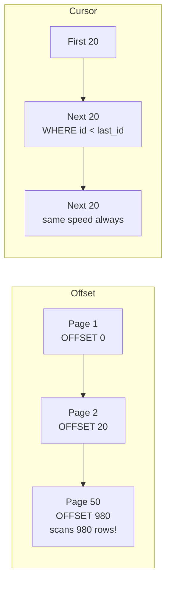

# 17. Pagination

> **Think:** *"Can I show smaller chunks?"*

---

## The 4 Questions

| Question | Answer |
|----------|--------|
| **What problem does it solve?** | Unbounded result sets — returning 50,000 rows in one response overwhelms DB, network, memory, and UI rendering. |
| **What happens if I ignore it?** | Order history API returns 2,000 orders as 15MB JSON. Browser freezes. DB query times out. Mobile app crashes. |
| **Where would I use it?** | Search results, order history, admin tables, social feeds, notification lists, any list that can grow unbounded. |
| **What companies use it?** | Amazon (order history paginated), Nykaa (product search pages), Twitter/Instagram (cursor-based feeds), every REST API with `?page=` or `?cursor=`. |

---

## Mental Movie (60 seconds)

User opens "My Orders" on your travel platform. They have 1,847 bookings over 5 years.

**Without pagination:** API runs `SELECT * FROM orders WHERE user_id = 123` — returns all 1,847 rows. 12MB JSON. 6 seconds. App runs out of memory on older phones.

**With pagination:** API returns 20 orders per page. First page loads in 200ms. User scrolls → page 2 loads. Most users only look at the last 5 orders anyway.

Pagination = serving a buffet one plate at a time, not dumping the entire kitchen on the table.

---

## How It Works

### Offset Pagination (page numbers)

```
GET /orders?user_id=123&page=1&limit=20   → orders 1–20
GET /orders?user_id=123&page=2&limit=20   → orders 21–40
```

```sql
SELECT * FROM orders
WHERE user_id = 123
ORDER BY created_at DESC
LIMIT 20 OFFSET 0;   -- page 1

LIMIT 20 OFFSET 20;  -- page 2
```

### Cursor Pagination (better at scale)

```
GET /orders?user_id=123&limit=20                          → first 20
GET /orders?user_id=123&limit=20&cursor=2025-06-01T10:00:00Z  → next 20 after this timestamp
```

```sql
SELECT * FROM orders
WHERE user_id = 123
  AND created_at < '2025-06-01T10:00:00Z'
ORDER BY created_at DESC
LIMIT 20;
```



**Key ingredients:**
1. **Page size (limit)** — 20–50 for UI lists, 100–500 for admin/export
2. **Sort key** — consistent ordering (`created_at DESC`, `id DESC`)
3. **Total count** — optional; `COUNT(*)` on large tables is expensive
4. **Next cursor / has_more flag** — tells client if more data exists

### Offset vs Cursor

| | Offset | Cursor |
|---|--------|--------|
| **UX** | "Page 5 of 92" — jump to any page | Infinite scroll, "Load more" |
| **Deep pages** | Slow (scans skipped rows) | Consistent speed |
| **Data changes** | Duplicates/skips if data shifts | Stable if keyed on immutable field |
| **Implementation** | Simple | Slightly more complex |

---

## Real-World Examples

### Your Travel Platform

**Scenario:** Hotel search returns 3,400 properties in Goa.

```
GET /api/hotels?city=goa&checkin=2026-01-15&limit=24&offset=0
Response:
{
  "hotels": [...24 items...],
  "total": 3400,
  "page": 1,
  "has_more": true
}
```

Map view loads first 24. User scrolls list → page 2. Never send 3,400 hotel objects in one response.

For **order history** (power users with 2,000+ bookings), switch to cursor pagination on `created_at` — page 50 with offset would scan 980 rows for nothing.

### Nykaa

**Scenario:** "Lipstick" search — 2,400 results.

Nykaa paginates search results:
- 48 products per page (grid layout)
- Filters applied server-side before pagination
- Infinite scroll on mobile uses cursor (`last_product_id`) not offset
- Total count shown as "2,400+ results" — approximate count OK for UX

During sales, pagination protects the DB from single queries returning millions of rows.

### Amazon

**Scenario:** Order history, search results, review pages.

Amazon uses:
- **Search:** Page-based with offset for first ~10 pages, then cursor-like "load more"
- **Order history:** Paginated by year/month sections
- **Reviews:** "Page 1 of 47" with 10 reviews per page
- **APIs:** Strict max page size (usually 10–100) enforced server-side

Amazon learned early: unbounded lists don't scale.

---

## When To Use It

| Use pagination when... | Example |
|------------------------|---------|
| Result set can grow without limit | Order history, search results |
| UI shows a list or table | Admin dashboards |
| Mobile clients have memory limits | App order list |
| API is public-facing | Prevent abuse (max 100 per page) |
| Export needs batching | CSV export 10K rows at a time |

## When NOT To Use It

| Skip pagination when... | Why |
|-------------------------|-----|
| Result is always small and bounded | `SELECT * FROM countries` — 195 rows |
| You need all data for computation | Batch job processing entire dataset offline |
| Real-time stream | Use WebSocket/SSE feed instead of pages |
| Dropdown with 5 options | Overkill |
| Client needs full dataset for local filter | Consider server-side filter instead |

---

## Pagination vs Related Concepts

| Concept | Difference |
|---------|------------|
| **Lazy loading** | Defers fetching until needed; pagination fetches in chunks when user requests more |
| **Query optimization** | `LIMIT` is both — pagination is the user-facing pattern |
| **Caching** | Can cache page 1 of popular searches; pagination defines cache keys |
| **Compression** | Shrinks each page; pagination reduces how much you send per request |

**Rule of thumb:** Default to pagination on every list endpoint. Use cursor pagination for infinite scroll and large datasets. Never trust the client to set a reasonable limit — enforce max server-side.

---

## Problem Simulation

**Situation:** Your travel platform order API:

```
GET /api/orders?user_id=123&page=47&limit=20
```

User has 3,000 orders. Query:

```sql
SELECT * FROM orders WHERE user_id = 123
ORDER BY created_at DESC
LIMIT 20 OFFSET 920;
```

Takes 4 seconds. Meanwhile, a new order is placed while user is on page 47.

**Questions:**
1. Why is OFFSET 920 slow?
2. What UX bug might the user see?
3. Rewrite using cursor pagination.

<details>
<summary>Answers</summary>

1. DB must **scan and discard 920 rows** before returning 20. No index helps skip — it still walks 940 rows.
2. **Duplicate or missing order** — new order shifts the list. Item from page 46 might appear again on page 47, or one item gets skipped.
3. `GET /api/orders?user_id=123&limit=20&cursor=2024-03-15T08:30:00Z` → `WHERE user_id = 123 AND created_at < '2024-03-15T08:30:00Z' ORDER BY created_at DESC LIMIT 20`. Constant time regardless of depth.

</details>

---

## Key Takeaway

Never return unbounded lists. Offset pagination is fine for shallow pages; cursor pagination wins for infinite scroll and deep lists. Always enforce a server-side max limit.

**Next:** [18 — Compression](./18-compression.md) — even with 20 items per page, can you send less data per item?
