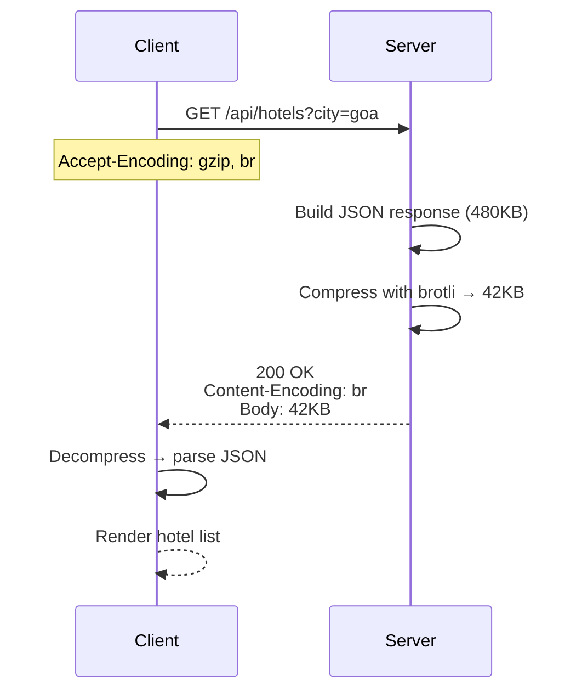

# 18. Compression

> **Think:** *"Can I send less data?"*

---

## The 4 Questions

| Question | Answer |
|----------|--------|
| **What problem does it solve?** | Large payloads — JSON, HTML, CSS, and JS travel uncompressed over the network, especially painful on mobile and slow connections. |
| **What happens if I ignore it?** | A 500KB API response on 3G takes 4 seconds to download. Users blame your app, not their network. Bandwidth bills spike. |
| **Where would I use it?** | HTTP responses (gzip/brotli), API JSON payloads, static assets, log shipping, database backups, image formats (WebP/AVIF). |
| **What companies use it?** | Every major web property — Cloudflare (brotli by default), Nginx/Apache (gzip), Amazon (compressed API responses), Nykaa (compressed mobile API + WebP images). |

---

## Mental Movie (60 seconds)

Your travel app's search API returns a JSON array of 50 hotels with descriptions, amenities, and images metadata. Uncompressed: **480KB**.

A user on Mumbai local train with spotty 4G downloads at 500 Kbps. 480KB = ~8 seconds just for the download. Plus parse time. Page feels dead.

**With gzip compression:** Same JSON compresses to **~45KB** — 10x smaller. Download in under a second. User sees results while the train is still at the station.

Compression = vacuum-packing your luggage. Same stuff, smaller bag.

---

## How It Works

```
Server: JSON (480KB) → gzip compress → wire (45KB) → Client decompress → JSON (480KB)
```



**Key ingredients:**
1. **Algorithm** — gzip (universal), brotli (better compression, modern browsers), zstd (emerging)
2. **Content-Encoding header** — tells client how to decompress
3. **Accept-Encoding** — client advertises supported algorithms
4. **Compression threshold** — don't compress tiny responses (< 1KB); overhead isn't worth it
5. **Pre-compression** — CDN/nginx compresses once; store pre-compressed static assets

### Compression Ratios (typical)

| Content Type | Uncompressed | gzip | brotli |
|--------------|-------------|------|--------|
| JSON API | 100KB | ~15KB | ~12KB |
| HTML page | 80KB | ~12KB | ~10KB |
| JS bundle | 500KB | ~150KB | ~120KB |
| Already compressed (JPEG, PNG) | — | No gain | No gain |

---

## Real-World Examples

### Your Travel Platform

**Scenario:** Mobile app hotel search API.

```
Request headers:
  Accept-Encoding: gzip, br
  Accept: application/json

Response headers:
  Content-Encoding: br
  Content-Type: application/json
  Vary: Accept-Encoding
```

Nginx or API gateway compresses responses > 1KB. JSON with repeated keys (`"hotel_name"`, `"amenities"`) compresses extremely well.

**Additional wins:**
- Strip null fields and whitespace from JSON in development
- Use short field names in high-volume mobile APIs (`n` vs `hotel_name`) — controversial but effective
- WebP images instead of JPEG (separate from gzip — image compression)

### Nykaa

**Scenario:** Product listing API on mobile during sale.

Nykaa compresses:
- API responses (gzip/brotli at CDN or API gateway)
- Static JS/CSS bundles (pre-compressed at build time, brotli + gzip variants)
- Product images as WebP (smaller than JPEG at same quality)

A 200KB uncompressed product grid response becomes ~25KB compressed. On millions of requests per hour, that's massive bandwidth savings and faster loads.

### Amazon

**Scenario:** Product search and detail pages.

Amazon compresses at multiple layers:
- **CloudFront** serves brotli/gzip compressed HTML, CSS, JS
- **API responses** compressed between services and to clients
- **Internal RPC** often uses Protocol Buffers (binary, inherently compact) instead of JSON

Amazon's product pages would be unusable globally without compression — they're heavy on text-heavy HTML and JSON.

---

## When To Use It

| Use compression when... | Example |
|-------------------------|---------|
| Response is text-based (JSON, HTML, CSS, JS) | API endpoints, web pages |
| Payload > 1–2KB | Below threshold, compression overhead > savings |
| Users on mobile or emerging markets | India, Southeast Asia mobile traffic |
| Bandwidth costs matter | Cloud egress charges |
| Static assets served repeatedly | JS bundles cached at CDN |

## When NOT To Use It

| Skip compression when... | Why |
|--------------------------|-----|
| Content is already compressed | JPEG, PNG, MP4, ZIP — gzip adds CPU, zero size gain |
| Response is tiny (< 1KB) | Compression header overhead > savings |
| CPU is the bottleneck, not network | Compression costs CPU; profile first |
| End-to-end encrypted payloads that can't be inspected | Some security proxies need uncompressed |
| Real-time binary protocols | WebSocket video streams — use codec compression instead |

---

## Compression vs Related Concepts

| Concept | Difference |
|---------|------------|
| **CDN** | Caches and serves from edge; compression shrinks what travels over the wire |
| **Pagination** | Sends fewer items; compression makes each item smaller on the wire |
| **Lazy loading** | Defers fetching; compression reduces size of what you do fetch |
| **Image optimization** | WebP/AVIF resize/compress images; gzip compresses text responses |

**Rule of thumb:** Enable brotli + gzip for all text responses at the reverse proxy or CDN. Compress static assets at build time. Don't gzip JPEGs.

---

## Problem Simulation

**Situation:** Your travel platform API returns hotel search results. Uncompressed JSON: 620KB. You enable gzip at Nginx. Mobile app still feels slow. Investigation shows:

1. Response is 620KB uncompressed, 58KB gzip compressed
2. Download time improved (good)
3. App still takes 3 seconds to show results
4. APM shows 2.4 seconds in `JSON.parse()` on the client

**Questions:**
1. Did compression solve the problem?
2. What else should you optimize?
3. Would brotli help the parse time issue?

<details>
<summary>Answers</summary>

1. **Partially** — compression fixed network time, but the bottleneck moved to client-side parsing of a massive JSON object.
2. **Pagination** (20 hotels, not 200), **field selection** (`?fields=id,name,price,image`), remove redundant nested data, **lazy load** descriptions and amenities.
3. **No** — brotli only helps wire size. Parse time is proportional to JSON size after decompression. Fix the payload shape, not the compression algorithm.

</details>

---

## Key Takeaway

Compression is a free win for text responses — enable it everywhere by default. But it doesn't replace smart API design. A 10KB response beats a 500KB response compressed to 50KB.

**Next:** [Module 4 — Data Systems](../module-04-data-systems/) — performance gets data fast; Module 4 asks how data stays *correct*.
