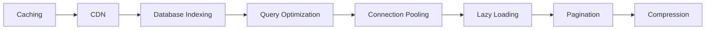

# Module 3: Performance

These concepts make your product fast.

> **Think like this:** *"Can I remember this answer? Can I send less? Can I ask smarter?"*

## Topics

| # | Topic | One-line mental model | Read time |
|---|-------|----------------------|-----------|
| 11 | [Caching](./11-caching.md) | "Can I remember this answer?" | ~12 min |
| 12 | [CDN](./12-cdn.md) | "Can content be closer to users?" | ~12 min |
| 13 | [Database Indexing](./13-database-indexing.md) | "How can database find data faster?" | ~12 min |
| 14 | [Query Optimization](./14-query-optimization.md) | "Can I ask for data smarter?" | ~12 min |
| 15 | [Connection Pooling](./15-connection-pooling.md) | "Can connections be reused?" | ~12 min |
| 16 | [Lazy Loading](./16-lazy-loading.md) | "Do I need this right now?" | ~12 min |
| 17 | [Pagination](./17-pagination.md) | "Can I show smaller chunks?" | ~12 min |
| 18 | [Compression](./18-compression.md) | "Can I send less data?" | ~12 min |

## Suggested Learning Order

These eight concepts stack from "remember answers" to "ship less over the wire":



1. **Caching** — remember expensive answers in fast memory
2. **CDN** — put static assets near users globally
3. **Database Indexing** — help the DB find rows without scanning everything
4. **Query Optimization** — ask the database smarter questions
5. **Connection Pooling** — reuse expensive connections
6. **Lazy Loading** — fetch only what you need, when you need it
7. **Pagination** — return data in manageable chunks
8. **Compression** — shrink payloads before they cross the network

## Module Simulation

After finishing all 8 topics, run this scenario (answers at bottom of each topic doc):

> **Saturday 10 AM.** Nykaa flash sale. 50,000 users open the homepage in Mumbai. Search results for "lipstick" take 8 seconds. Product images load slowly. Order history page times out for power users with 2,000 past orders. Your travel platform's hotel search returns 10,000 properties in one JSON blob.

Trace the slowness through each concept. Where would caching help? Where would a missing index hurt? What happens if you skip pagination?

## Next Module

**Module 4: Data Systems** — how data stays correct, available, and fast.

→ [Module 4: Data Systems](../module-04-data-systems/) (ACID, Transactions, Replication, Sharding…)

## PDFs

Generated PDFs live in [pdf/](./pdf/). Regenerate:

```bash
python3 md_to_pdf.py --dir learning/module-03-performance --force
```
