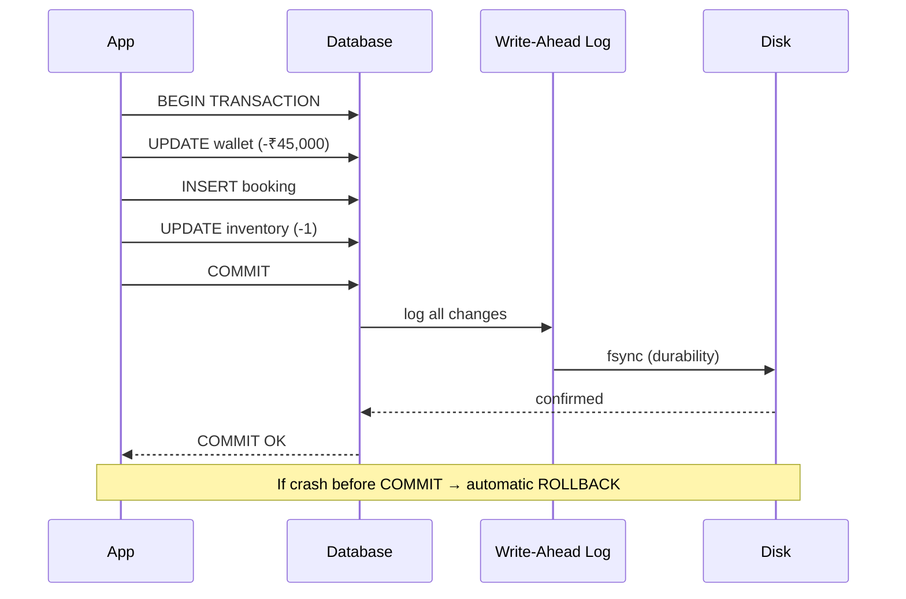

# 19. ACID

> **Think:** *"Either everything succeeds or nothing does."*

---

## The 4 Questions

| Question | Answer |
|----------|--------|
| **What problem does it solve?** | Partial or corrupt data — a write that stops halfway, two users seeing different balances, or data lost after a crash. |
| **What happens if I ignore it?** | Money deducted but order not created. Double bookings. Inventory counts that don't add up. Auditors find gaps you can't explain. |
| **Where would I use it?** | Payments, bookings, inventory, ledger systems — anywhere correctness matters more than raw speed. |
| **What companies use it?** | PostgreSQL, MySQL (InnoDB), Oracle, SQL Server — all ACID-compliant relational databases. Stripe's ledger, bank core systems, Amazon order DB. |

---

## Mental Movie (60 seconds)

A user pays ₹45,000 for a Delhi → Goa package. Your code runs three steps:

1. Deduct ₹45,000 from wallet
2. Create booking record
3. Reduce hotel room inventory by 1

Step 1 succeeds. Step 2 succeeds. Server crashes before step 3.

**Without ACID:** User is charged. Booking exists. Hotel still shows 1 room available. Another user books the same room. Overbooking chaos.

**With ACID:** The entire transaction rolls back. No charge, no booking, inventory unchanged. User retries. Everything succeeds together or nothing changes.

That's ACID. Four guarantees wrapped around a transaction.

---

## How It Works

**ACID** = Atomicity + Consistency + Isolation + Durability

| Property | What it means | Plain English |
|----------|---------------|---------------|
| **Atomicity** | All operations in a transaction succeed or all fail | "All or nothing" |
| **Consistency** | Database moves from one valid state to another | Rules (constraints) are never broken |
| **Isolation** | Concurrent transactions don't interfere with each other | Your read isn't polluted by someone else's half-finished write |
| **Durability** | Once committed, data survives crashes | Write to disk (or WAL) before saying "done" |

```
BEGIN TRANSACTION
  UPDATE wallets SET balance = balance - 45000 WHERE user_id = 101;  -- step 1
  INSERT INTO bookings (user_id, package_id) VALUES (101, 789);       -- step 2
  UPDATE inventory SET rooms = rooms - 1 WHERE hotel_id = 55;         -- step 3
COMMIT;  -- all three visible together, or none of them are
```



**Key ingredients:**
1. **Transaction boundary** — `BEGIN` / `COMMIT` / `ROLLBACK`
2. **Write-ahead log (WAL)** — log changes before applying them (durability)
3. **Locks or MVCC** — prevent dirty reads during concurrent writes (isolation)
4. **Constraints** — foreign keys, unique indexes, check constraints (consistency)

---

## Real-World Examples

### Your Travel Platform

**Scenario:** User books flight + hotel + airport transfer in one checkout.

```
BEGIN;
  INSERT INTO payments (user_id, amount) VALUES (101, 45000);
  INSERT INTO flight_bookings (...) VALUES (...);
  INSERT INTO hotel_bookings (...) VALUES (...);
  INSERT INTO transfer_bookings (...) VALUES (...);
  UPDATE hotel_inventory SET available = available - 1 WHERE hotel_id = 55;
COMMIT;
```

If the hotel inventory update fails (sold out), the entire checkout rolls back — no orphan payment, no flight PNR without a hotel.

**Without ACID:** User has a flight PNR, payment charged, but no hotel. Support nightmare.

### Nykaa

**Scenario:** User applies a ₹500 coupon and places an order for 3 items.

Nykaa's order DB must atomically:
- Create the order
- Deduct inventory for each SKU
- Mark coupon as consumed
- Record payment

If inventory for one SKU hits zero mid-transaction, the whole order fails — not a partial order with 2 of 3 items charged.

During flash sales, isolation matters too. Two users buying the last unit shouldn't both succeed.

### Amazon

**Scenario:** One-Click order places item, charges card, reserves warehouse inventory.

Amazon's order pipeline uses transactional storage for the critical path. The "Place your order" action is atomic at the database level — you don't get charged without an order record, and inventory isn't decremented without a matching order line.

---

## When To Use It

| Use ACID when... | Example |
|------------------|---------|
| Money or inventory is involved | Payments, wallets, stock counts |
| Partial state is worse than no state | Booking without payment, payment without booking |
| You need audit-grade correctness | Financial ledgers, compliance reports |
| Operations are tightly coupled in one service | Single checkout spanning 3 tables |

## When NOT To Use It

| Skip ACID when... | Why |
|-------------------|-----|
| Data is eventually fine being slightly stale | Product view counts, "last seen" timestamps |
| System spans multiple services over a network | ACID doesn't cross microservices easily — use sagas (Module 5) |
| Write throughput is the bottleneck | Strong consistency has a cost; consider eventual consistency |
| You're storing logs, events, or analytics | Append-only data doesn't need transactional rollback |

---

## ACID vs Related Concepts

| Concept | Difference |
|---------|-----------|
| **Transactions** | The mechanism; ACID is the guarantee transactions provide |
| **Eventual Consistency** | Opposite trade-off — availability over immediate correctness |
| **Idempotency** | Makes retries safe across requests; ACID makes multi-step writes safe within one DB |
| **BASE** | Basically Available, Soft state, Eventual consistency — the NoSQL alternative mindset |

**Rule of thumb:** Use ACID inside a single database for money and inventory. Use eventual consistency across services when you need scale and can tolerate brief disagreement.

---

## Implementation Checklist

- [ ] Wrap related writes in explicit transactions (`BEGIN` / `COMMIT`)
- [ ] Define database constraints (foreign keys, unique, NOT NULL, check)
- [ ] Choose isolation level appropriate to your workload (READ COMMITTED vs SERIALIZABLE)
- [ ] Ensure WAL/fsync is enabled on production databases (don't disable durability for speed)
- [ ] Keep transactions short — long transactions hold locks and kill throughput
- [ ] Never mix transactional and non-transactional side effects in one flow without a plan

---

## Problem Simulation

**Situation:** Your travel platform processes a ₹1,20,000 group booking. The transaction:

1. Deducts ₹1,20,000 from corporate wallet ✅
2. Creates 4 flight bookings ✅
3. Creates 2 hotel bookings ✅
4. Crashes while updating loyalty points ❌

The database has no explicit transaction wrapper — each step auto-commits.

**Questions:**
1. What state is the database in?
2. What does the user see on their dashboard?
3. How would ACID change the outcome?
4. What's the support team's nightmare scenario?

<details>
<summary>Answers</summary>

1. Wallet deducted, 4 flights booked, 2 hotels booked, loyalty points unchanged. Partial, inconsistent state.
2. User sees confirmed bookings but wrong wallet balance and missing loyalty points. May try to book again.
3. With ACID, the crash triggers ROLLBACK — wallet untouched, no bookings created. User retries cleanly.
4. User demands refund for "duplicate" bookings, finance can't reconcile wallet vs bookings, loyalty team has no audit trail.

</details>

---

## Key Takeaway

ACID is the contract your database makes: *"I will never leave you in a half-finished state."* When money, inventory, or bookings are on the line, that contract is non-negotiable.

**Next:** [20 — Transactions](./20-transactions.md) — how do you actually group operations into one atomic unit?
