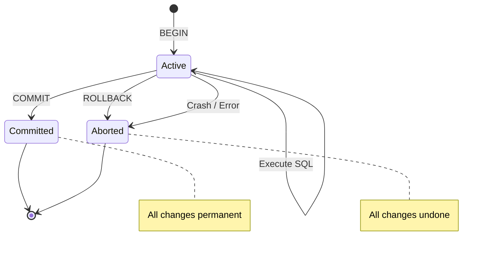

# 20. Transactions

> **Think:** *"What if operation stops halfway?"*

---

## The 4 Questions

| Question | Answer |
|----------|--------|
| **What problem does it solve?** | Partial updates — multiple related writes where some succeed and others fail, leaving data in an impossible state. |
| **What happens if I ignore it?** | Payment captured but order missing. Inventory deducted but shipment not created. Refund issued but original charge still pending. |
| **Where would I use it?** | Any multi-step write in a single database: checkout, wallet transfer, inventory reservation, account registration. |
| **What companies use it?** | Every bank, Stripe (balance transactions), Shopify (order creation), Uber (trip + payment), MakeMyTrip (multi-supplier booking orchestration at the DB layer). |

---

## Mental Movie (60 seconds)

You're transferring ₹10,000 from User A's wallet to User B's wallet.

```
Step 1: Deduct ₹10,000 from A  →  success
Step 2: Add ₹10,000 to B       →  CRASH
```

**Without a transaction:** ₹10,000 vanished. A is poorer. B didn't get richer. Your finance team finds a ₹10,000 hole with no explanation.

**With a transaction:** Database sees the crash, rolls back step 1. A still has ₹10,000. B still has ₹0. Nobody lost money.

A transaction is a **bundle** — the database treats multiple operations as one unit.

---

## How It Works

```
┌─────────────────────────────────────────┐
│              TRANSACTION                │
│  ┌─────────┐ ┌─────────┐ ┌─────────┐   │
│  │ Step 1  │ │ Step 2  │ │ Step 3  │   │
│  │ Deduct  │ │ Insert  │ │ Update  │   │
│  │ wallet  │ │ order   │ │ stock   │   │
│  └─────────┘ └─────────┘ └─────────┘   │
│                                         │
│  COMMIT → all visible    ROLLBACK → none│
└─────────────────────────────────────────┘
```



### Isolation Levels (how concurrent transactions interact)

| Level | What you might see | Use when |
|-------|-------------------|----------|
| **READ UNCOMMITTED** | Dirty reads (other's uncommitted data) | Almost never |
| **READ COMMITTED** | Only committed data (default in PostgreSQL) | Most web apps |
| **REPEATABLE READ** | Same query returns same rows in one transaction | Reports, analytics |
| **SERIALIZABLE** | Transactions run as if one at a time | Financial systems, inventory |

**Key ingredients:**
1. **Explicit boundaries** — don't rely on auto-commit for multi-step logic
2. **Short duration** — long transactions block other writes
3. **Right isolation level** — SERIALIZABLE prevents race conditions but kills throughput
4. **Error handling** — always `ROLLBACK` on failure, never leave an open transaction

---

## Real-World Examples

### Your Travel Platform

**Scenario:** Package booking — flight + hotel + insurance in one checkout.

```sql
BEGIN;

-- Reserve payment
UPDATE wallets SET balance = balance - 85000 WHERE user_id = 42;

-- Create master booking
INSERT INTO bookings (id, user_id, total, status) VALUES ('bk-991', 42, 85000, 'confirmed');

-- Child records
INSERT INTO flight_segments (booking_id, ...) VALUES ('bk-991', ...);
INSERT INTO hotel_stays (booking_id, ...) VALUES ('bk-991', ...);
INSERT INTO insurance_policies (booking_id, ...) VALUES ('bk-991', ...);

-- Decrement inventory
UPDATE hotel_rooms SET available = available - 1 WHERE hotel_id = 12 AND date = '2026-01-15';

COMMIT;
```

If hotel inventory is 0, the `UPDATE` affects 0 rows → your app detects this → `ROLLBACK`. User isn't charged. Clean failure message: "Hotel sold out."

### Nykaa

**Scenario:** Order with 5 items, 2 warehouses, 1 coupon.

Nykaa wraps order creation in a transaction:
- Insert order header
- Insert 5 order line items
- Decrement inventory per warehouse per SKU
- Mark coupon as used
- Record payment reference

If any SKU is out of stock, the entire order fails atomically. User doesn't get charged for 3 of 5 items.

During peak sale, Nykaa may use `SELECT ... FOR UPDATE` inside the transaction to lock inventory rows and prevent overselling.

### Amazon

**Scenario:** Subscribe & Save order with multiple items from different sellers.

Amazon's order placement transaction (at the storage layer) ensures:
- Order record created
- Payment authorized
- Inventory reserved per fulfillment center

If payment authorization fails, no inventory is reserved. If one FC can't fulfill, the transaction scope determines whether the whole order fails or partial fulfillment logic kicks in — but the payment + order record stay consistent.

---

## When To Use It

| Use transactions when... | Example |
|--------------------------|---------|
| Multiple tables must update together | Order + line items + inventory |
| Failure of any step invalidates all steps | Transfer money between accounts |
| You need to prevent race conditions on shared rows | Last-item-in-stock purchase |
| Business logic says "all or nothing" | Booking package components together |

## When NOT To Use It

| Skip transactions when... | Why |
|---------------------------|-----|
| Steps span different databases or services | No single ACID boundary — use saga pattern |
| Side effects include external APIs | Can't roll back a sent email or charged card via DB rollback alone |
| Read-only operations | No writes to protect |
| Long-running workflows (hours/days) | Holding a transaction open for a hotel API callback will deadlock your DB |
| High-throughput append-only logs | Events don't need rollback semantics |

---

## Transactions vs Related Concepts

| Concept | Difference |
|---------|-----------|
| **ACID** | The guarantees; transactions are how you get them |
| **Saga** | Distributed alternative — compensating actions instead of rollback |
| **Idempotency** | Protects against duplicate requests; transactions protect against partial writes |
| **Two-Phase Commit (2PC)** | Coordinates transactions across multiple databases — slow, rarely used in microservices |

**Rule of thumb:** Transaction for multi-table writes in **one database**. Saga for multi-service workflows across **many databases**.

---

## Implementation Checklist

- [ ] Wrap multi-step writes in `BEGIN` / `COMMIT` / `ROLLBACK`
- [ ] Use `try/catch/finally` — rollback in catch, never leak open transactions
- [ ] Keep transactions under 100ms when possible
- [ ] Use `SELECT FOR UPDATE` or optimistic locking for contested resources
- [ ] Don't call external APIs inside a transaction
- [ ] Log transaction failures with enough context to reconcile manually

---

## Problem Simulation

**Situation:** Nykaa flash sale. 1,000 users try to buy the last 50 units of a lipstick SKU simultaneously.

Your code:
```sql
BEGIN;
SELECT available FROM inventory WHERE sku = 'LIP-442';  -- returns 1
-- [50ms network delay — another transaction buys this unit]
UPDATE inventory SET available = available - 1 WHERE sku = 'LIP-442';
INSERT INTO order_items (sku, qty) VALUES ('LIP-442', 1);
COMMIT;
```

50 users "succeed." Inventory shows -48.

**Questions:**
1. What went wrong?
2. Which isolation level would prevent this?
3. What's the trade-off of using that level during a flash sale?
4. What's an alternative that doesn't require SERIALIZABLE?

<details>
<summary>Answers</summary>

1. **Lost update** — two transactions read `available = 1`, both decrement, both insert. No locking between read and write.
2. **SERIALIZABLE** or at minimum use `SELECT ... FOR UPDATE` (pessimistic locking) or `UPDATE ... WHERE available >= 1` and check `rows affected`.
3. SERIALIZABLE serializes all conflicting transactions — massive contention, timeouts, failed transactions under 1000 concurrent buyers. Throughput drops.
4. **Optimistic locking** — `UPDATE inventory SET available = available - 1 WHERE sku = 'LIP-442' AND available >= 1`; if 0 rows affected, retry or fail. Or atomic `UPDATE ... RETURNING`.

</details>

---

## Key Takeaway

A transaction is a safety net for multi-step writes. If your operation has more than one database write that must succeed together, you need a transaction — or you'll eventually ship a bug that loses money.

**Next:** [21 — Eventual Consistency](./21-eventual-consistency.md) — what happens when you can't keep every copy in perfect sync?
