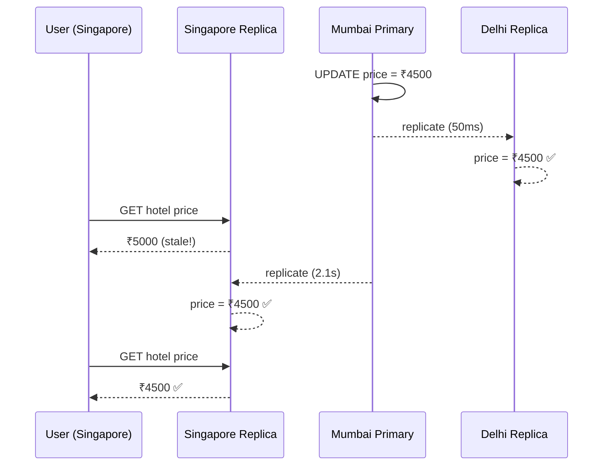

# 21. Eventual Consistency

> **Think:** *"Everyone agrees eventually."*

---

## The 4 Questions

| Question | Answer |
|----------|--------|
| **What problem does it solve?** | The CAP trade-off — you can't have strong consistency, high availability, and partition tolerance all at once across distributed nodes. Eventual consistency picks availability. |
| **What happens if I ignore it?** | You either build a system that goes down when replicas disagree, or you pretend replicas are always in sync and ship bugs when they're not. |
| **Where would I use it?** | Product catalogs, search indexes, analytics, social feeds, CDN caches, cross-region replicas — anywhere brief staleness is acceptable. |
| **What companies use it?** | Amazon DynamoDB, Cassandra, DNS, Facebook's social graph, Instagram likes count, Nykaa product search index, Uber driver location updates. |

---

## Mental Movie (60 seconds)

You update a hotel's price from ₹5,000 to ₹4,500 on your travel platform. The write hits the primary database in Mumbai. Three read replicas exist — Delhi, Bangalore, Singapore.

**With strong consistency:** Every read worldwide returns ₹4,500 immediately. But if Singapore can't reach Mumbai (network partition), reads fail or writes block. Availability suffers.

**With eventual consistency:** Singapore replica still shows ₹5,000 for 2 seconds. Then it catches up. A user in Singapore briefly sees the old price. Annoying, but the site stays up.

"Eventually" everyone agrees on ₹4,500. The question is: *how long is "eventually" acceptable for your use case?*

---

## How It Works

```
Time →
Primary (Mumbai):  ₹5000 ──write──► ₹4500 ──replicate──► ...
Replica (Delhi):   ₹5000 ────────────────lag──────────► ₹4500
Replica (Singapore): ₹5000 ──────────lag───────────────► ₹4500
                   │◄── stale window ──►│
```



### Consistency Spectrum

| Model | Guarantee | Latency | Availability |
|-------|-----------|---------|--------------|
| **Strong** | Always latest write | Higher | Lower during partitions |
| **Eventual** | Converges over time | Lower | Higher |
| **Causal** | Related events stay ordered | Medium | Medium |
| **Read-your-writes** | You see your own updates | Medium | Medium |

**Key ingredients:**
1. **Replication** — changes propagate asynchronously to copies
2. **Conflict resolution** — what if two nodes accept conflicting writes? (last-write-wins, vector clocks, CRDTs)
3. **Staleness budget** — define acceptable lag (200ms? 5s? 5min?)
4. **User-facing design** — show "prices may vary" or read from primary after your own write

---

## Real-World Examples

### Your Travel Platform

**Scenario:** User searches "Goa hotels under ₹3000." Results come from Elasticsearch, fed by a CDC stream from PostgreSQL.

Flow:
1. Hotel partner updates price in your admin panel → PostgreSQL primary
2. CDC event published to Kafka
3. Search indexer consumes event (200ms–3s later)
4. User searches — may see old price for a few seconds

**Design choice:** Search results are eventually consistent. Checkout uses the primary DB (strong consistency) for the actual booking price.

**Without this split:** Either search is slow (always hits primary) or bookings use stale prices (disaster).

### Nykaa

**Scenario:** New lipstick shade goes live. Product appears in:
- PostgreSQL (source of truth)
- Redis cache (product page)
- Elasticsearch (search/filter)
- CDN (product images)

Each layer updates at different speeds. A user might find the product via search before the product page cache warms up. Nykaa accepts this — "eventual" across layers is fine for catalog browsing. Order placement hits the authoritative inventory DB.

During sales, Nykaa shows "Only 3 left!" from a slightly stale count. Occasionally oversells by 1–2 units; compensates with waitlist or auto-refund.

### Amazon

**Scenario:** You update your delivery address. You immediately see the new address on the account page (read-your-writes). But the warehouse system might ship from the old address if the order was already in the fulfillment pipeline.

Amazon uses eventual consistency pervasively:
- Product reviews take seconds to appear
- "Only 2 left in stock" can be approximate
- Cross-region data converges asynchronously

Critical paths (payment, order placement) use stronger consistency within a single region's primary.

---

## When To Use It

| Use eventual consistency when... | Example |
|----------------------------------|---------|
| Brief staleness is acceptable | Product catalog, search results |
| You need high availability across regions | Global read replicas |
| Write volume exceeds single-node capacity | Sharded NoSQL (DynamoDB, Cassandra) |
| System is naturally asynchronous | Analytics pipelines, recommendation engines |
| Users don't notice 1–5 second lag | Social media likes, view counts |

## When NOT To Use It

| Skip eventual consistency when... | Why |
|-----------------------------------|-----|
| Money, inventory, or bookings at commit time | Overselling, double charges |
| User expects immediate read-after-write | "I just saved my profile — why is it blank?" |
| Legal/regulatory requires exact state | Financial reporting, audit trails |
| Conflicts are hard to resolve automatically | Two users editing the same document simultaneously |
| "Eventually" could mean hours | Not eventual — it's broken |

---

## Eventual Consistency vs Related Concepts

| Concept | Difference |
|---------|-----------|
| **ACID / Strong Consistency** | Immediate agreement; eventual trades this for availability |
| **Replication** | The mechanism; eventual consistency is often a consequence of async replication |
| **Caching** | Another source of staleness; cache invalidation is a consistency problem |
| **CAP Theorem** | You can pick 2 of Consistency, Availability, Partition tolerance — eventual consistency picks AP |

**Rule of thumb:** Strong consistency for writes that move money. Eventual consistency for reads that display information.

---

## Implementation Checklist

- [ ] Classify each data path: strong vs eventual
- [ ] Measure replication lag in production (p50, p99)
- [ ] Implement read-your-writes for user-facing mutations (route to primary or use session token)
- [ ] Design UI for staleness ("Price confirmed at checkout")
- [ ] Define conflict resolution strategy for concurrent writes
- [ ] Monitor and alert when lag exceeds your staleness budget

---

## Problem Simulation

**Situation:** Your travel platform. User in Bangalore books the last room at Treebo Goa for Jan 15.

1. Booking writes to Mumbai primary — success, inventory = 0
2. User sees confirmation page (reads from Bangalore replica)
3. Bangalore replica still shows inventory = 1 (3-second lag)
4. Another user in Bangalore searches, sees "1 room available," starts checkout

**Questions:**
1. Can the second user complete the booking?
2. What should happen if they try?
3. How do you prevent this at the search layer vs the booking layer?
4. Is eventual consistency wrong here, or is the architecture wrong?

<details>
<summary>Answers</summary>

1. **Depends on architecture.** If checkout reads from replica → possible double booking. If checkout hits primary with transactional inventory check → second user fails with "sold out."
2. Second user should get a clean "sold out" at checkout, even if search was stale. Never trust replica for inventory decrement.
3. **Search layer:** Accept staleness, show "availability confirmed at checkout." **Booking layer:** Always read/write primary with `SELECT FOR UPDATE` or atomic decrement.
4. Eventual consistency isn't wrong — using it for **inventory commits** is wrong. Catalog browsing can be eventual; booking must be strong.

</details>

---

## Key Takeaway

Eventual consistency isn't laziness — it's a deliberate trade. The art is knowing *which* data can be briefly wrong and *which* data must never be.

**Next:** [22 — Replication](./22-replication.md) — how do copies of your data actually get created and kept in sync?
