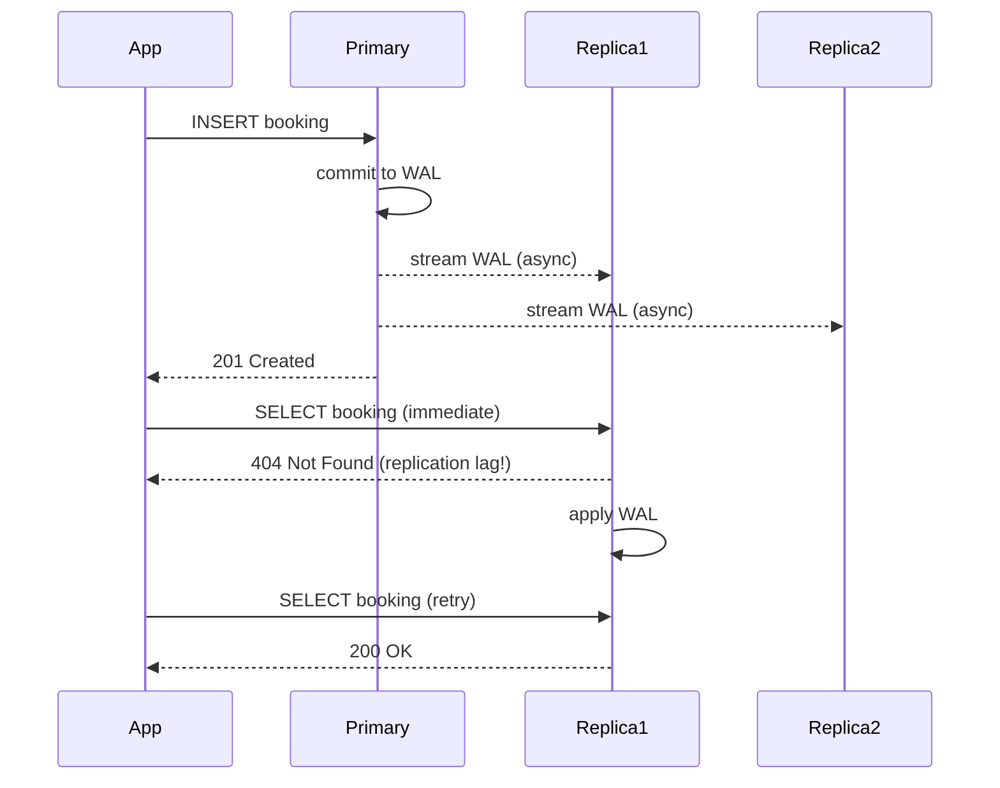

# 22. Replication

> **Think:** *"Can copies help?"*

---

## The 4 Questions

| Question | Answer |
|----------|--------|
| **What problem does it solve?** | Single database bottleneck and single point of failure — one machine can't serve all reads and dies alone. |
| **What happens if I ignore it?** | DB becomes the ceiling on traffic. One disk failure = total data loss. Maintenance means downtime. |
| **Where would I use it?** | Any system outgrowing one database server: read-heavy apps, multi-region deployments, disaster recovery. |
| **What companies use it?** | Amazon RDS read replicas, PostgreSQL streaming replication, MySQL replicas, MongoDB replica sets, Redis Sentinel, Cloudflare's anycast edge copies. |

---

## Mental Movie (60 seconds)

Your travel platform's database handles 10,000 queries/second. 95% are reads — hotel search, booking history, user profiles. 5% are writes — new bookings, payments.

One PostgreSQL server is melting. CPU at 98%. Queries queue. Users see spinners.

**Without replication:** Buy a bigger machine (vertical scaling). Works until it doesn't. ₹50 lakh server, still one point of failure.

**With replication:** Primary handles writes. Three read replicas handle searches and profile loads. Traffic spreads. One replica dies — others keep serving. You promote a replica if primary dies.

Copies help. But copies **lag**. That's the price.

---

## How It Works

### Primary-Replica (Leader-Follower)

```
         ┌──────────┐
  Writes │ Primary  │
  ──────►│ (Master) │
         └────┬─────┘
              │ replicate (async/sync)
     ┌────────┼────────┐
     ▼        ▼        ▼
┌─────────┐┌─────────┐┌─────────┐
│Replica 1││Replica 2││Replica 3│
│ (reads) ││ (reads) ││ (reads) │
└─────────┘└─────────┘└─────────┘
```



### Sync vs Async Replication

| Mode | Behavior | Trade-off |
|------|----------|-----------|
| **Async** | Primary commits, replicates later | Fast writes, replicas may lag |
| **Sync** | Primary waits for replica ACK before commit | No data loss on failover, slower writes |
| **Semi-sync** | At least one replica must ACK | Balance of safety and speed |

### Multi-Primary (Leader-Leader)

Multiple nodes accept writes. Harder — conflicts when two primaries update the same row. Used for multi-region (user in EU writes to EU primary, user in US writes to US primary).

**Key ingredients:**
1. **Write-ahead log (WAL) streaming** — primary ships changes to replicas
2. **Replication lag monitoring** — alert when lag > threshold
3. **Read routing** — send reads to replicas, writes to primary
4. **Failover plan** — promote replica to primary when primary dies

---

## Real-World Examples

### Your Travel Platform

**Scenario:** Architecture for 50K concurrent users browsing Goa packages.

```
                    ┌─────────────┐
   Bookings/Pay ──► │   Primary   │ (Mumbai, ap-south-1)
                    │  PostgreSQL │
                    └──────┬──────┘
                           │
              ┌────────────┼────────────┐
              ▼            ▼            ▼
         Read Replica  Read Replica  Read Replica
         (Mumbai)      (Delhi)       (Singapore)
              ▲            ▲            ▲
    Search/Browse    Search/Browse   APAC users
```

- **Writes:** Bookings, payments, inventory updates → primary only
- **Reads:** Hotel listings, reviews, booking history → nearest replica
- **Failover:** If primary dies, promote Mumbai replica (RTO: 2–5 min with RDS)

**Risk:** User books on primary, immediately checks "My Trips" on replica — booking not visible for 1–2 seconds. Fix: read-your-writes routing for session after booking.

### Nykaa

**Scenario:** Product catalog serving millions of product page views during sale.

Nykaa runs:
- Primary DB for orders and inventory (writes)
- Multiple read replicas for product browsing
- Separate search cluster (Elasticsearch) fed by replication/CDC

During Diwali sale, read replicas scale horizontally. Write primary is protected — only order flow hits it. Replica lag monitored; if lag > 5s, some replicas pulled from rotation.

### Amazon

**Scenario:** Global e-commerce with regional data centers.

Amazon replicates data across AZs (Availability Zones) within a region synchronously for durability, and across regions asynchronously for disaster recovery. Product catalog is heavily replicated and cached. Order data stays in the region where the order was placed (with cross-region backup).

DynamoDB (Amazon's NoSQL) uses replication as a core primitive — multi-AZ by default, global tables for cross-region.

---

## When To Use It

| Use replication when... | Example |
|-------------------------|---------|
| Reads dominate writes (80%+ reads) | Product catalogs, news feeds |
| You need fault tolerance | Database HA without downtime |
| Users are geographically distributed | Read replicas in EU, US, APAC |
| You need backups without stopping writes | Replica used for pg_dump |
| Reporting/analytics would slow production | Replica dedicated to BI queries |

## When NOT To Use It

| Skip replication when... | Why |
|--------------------------|-----|
| Writes are 90%+ of traffic | Replicas don't help write scaling — shard instead |
| You can't tolerate any staleness on reads | Replicas always lag (even if milliseconds) |
| Dataset is tiny and traffic is low | One DB is simpler and cheaper |
| You haven't solved failover automation | Replica you can't promote is just a backup |
| Conflicts from multi-primary are unmanageable | Stick to single-primary |

---

## Replication vs Related Concepts

| Concept | Difference |
|---------|-----------|
| **Eventual Consistency** | The guarantee replicas provide under async replication |
| **Sharding** | Splits data horizontally; replication copies the same data |
| **Caching** | Faster but disposable copy; replication is durable copy of truth |
| **Failover** | The action when primary dies; replication enables it |
| **CDC (Change Data Capture)** | Streams changes to search indexes, warehouses — replication's cousin |

**Rule of thumb:** Replication scales **reads** and adds **fault tolerance**. Sharding scales **writes** and **data size**.

---

## Implementation Checklist

- [ ] Single primary for writes (unless you truly need multi-primary)
- [ ] Monitor replication lag (seconds behind primary)
- [ ] Route reads to replicas via connection pooler (PgBouncer, RDS Proxy)
- [ ] Implement read-your-writes for post-mutation reads
- [ ] Test failover quarterly — untested failover = no failover
- [ ] Don't run heavy analytics on production replicas without dedicated replica

---

## Problem Simulation

**Situation:** Black Friday on your travel platform. Primary CPU: 40%. Replica CPU: 95%. Replication lag: 45 seconds and climbing.

Ops team adds 2 more replicas. Lag drops to 30 seconds but doesn't stabilize. Users report "I booked but My Trips is empty."

**Questions:**
1. Why didn't adding replicas fix the lag?
2. What's likely overloading the replicas?
3. What immediate fix stops user-facing pain?
4. What's the long-term fix?

<details>
<summary>Answers</summary>

1. More replicas = more copies to keep in sync = more WAL shipping load on primary. Doesn't fix the root cause of replica slowness.
2. Likely heavy queries on replicas (search, "My Trips" listing) without proper indexes, or analytics jobs running on replicas.
3. **Immediate:** Route post-booking reads to primary for 30 seconds (read-your-writes). Show "Booking processing..." instead of empty state.
4. **Long-term:** Add indexes for hot queries, dedicated analytics replica, cache hot reads in Redis, consider read-through cache for hotel listings.

</details>

---

## Key Takeaway

Replication gives you read scale and survival insurance. It does not give you write scale, and it introduces lag you must design around.

**Next:** [23 — Sharding](./23-sharding.md) — what happens when one database can't hold all the data?
