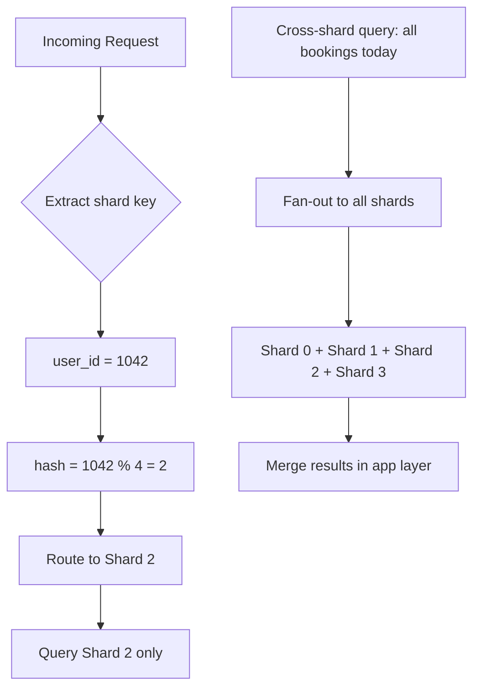

# 23. Sharding

> **Think:** *"Can I split data?"*

---

## The 4 Questions

| Question | Answer |
|----------|--------|
| **What problem does it solve?** | Single database limits — disk full, write throughput maxed, one machine can't index 2 billion rows fast enough. |
| **What happens if I ignore it?** | Vertical scaling hits a wall. Migrations take days. One table scan kills the whole platform. You can't grow past one machine. |
| **Where would I use it?** | Massive scale: user data by user_id, orders by tenant, messages by conversation, IoT events by device. |
| **What companies use it?** | Instagram (sharded PostgreSQL), Uber (sharded MySQL), Discord (trillions of messages sharded), Amazon DynamoDB (built-in sharding), Slack (sharded Vitess). |

---

## Mental Movie (60 seconds)

Your travel platform has 50 million users. The `bookings` table has 800 million rows. Queries that used to take 50ms now take 8 seconds. The database disk is 90% full.

**Without sharding:** One giant database. You keep buying bigger machines. Eventually nothing is big enough. Adding an index takes 18 hours and locks the table.

**With sharding:** Split users across 4 databases by `user_id % 4`.
- Shard 0: users 0, 4, 8, 12...
- Shard 1: users 1, 5, 9, 13...
- Shard 2: users 2, 6, 10, 14...
- Shard 3: users 3, 7, 11, 15...

Each shard holds 200M bookings. Queries are fast again. You can add more shards as you grow.

**Cost:** A query across all users ("total revenue today") now hits 4 databases and merges results. Cross-shard joins are painful.

---

## How It Works

```
                    ┌──────────────┐
                    │  App / Router│
                    │ (shard key)  │
                    └──────┬───────┘
           ┌───────────────┼───────────────┐
           ▼               ▼               ▼
    ┌────────────┐  ┌────────────┐  ┌────────────┐
    │  Shard 0   │  │  Shard 1   │  │  Shard 2   │
    │ users A-F  │  │ users G-M  │  │ users N-S  │
    │ 200M rows  │  │ 200M rows  │  │ 200M rows  │
    └────────────┘  └────────────┘  └────────────┘
```



### Choosing a Shard Key

| Shard Key | Good for | Bad because |
|-----------|----------|-------------|
| **user_id** | User-scoped data (profiles, orders) | Hot users overload one shard |
| **tenant_id** | Multi-tenant SaaS | One big tenant dominates a shard |
| **geo_region** | Data locality (GDPR) | Uneven distribution (Mumbai >> Goa) |
| **order_id** | Write distribution | Can't query "all orders for user" without secondary index |
| **hashed(user_id)** | Even distribution | Lose range query benefits |

**Key ingredients:**
1. **Shard key** — determines which shard owns a row (choose carefully — hard to change later)
2. **Routing layer** — app or proxy (Vitess, Citus) directs queries to correct shard
3. **Resharding plan** — how to split shards when one gets too big
4. **Cross-shard query strategy** — avoid them; scatter-gather when unavoidable

---

## Real-World Examples

### Your Travel Platform

**Scenario:** 50M users, sharding `bookings` and `payments` by `user_id`.

```python
def get_shard(user_id: int) -> str:
    return f"shard_{user_id % 8}"

# User 1042's booking history — single shard, fast
shard = get_shard(1042)
db = connections[shard]
bookings = db.query("SELECT * FROM bookings WHERE user_id = 1042")

# Admin dashboard: "total bookings today" — fan-out, slow
totals = []
for shard in all_shards:
    totals.append(shard.query("SELECT COUNT(*) FROM bookings WHERE date = today"))
total = sum(totals)
```

**Design decisions:**
- User's bookings always on same shard as user → no cross-shard joins for "My Trips"
- Hotel inventory stays on a **non-sharded** DB (shared resource) or uses a separate sharding strategy
- Admin analytics moved to a data warehouse (CDC from all shards)

### Nykaa

**Scenario:** Hundreds of millions of orders, tens of millions of users.

Nykaa likely shards order data by `user_id` or `order_id` hash. Product catalog may remain unsharded (smaller, read-heavy, cached). Inventory is a coordination challenge — can't simply shard by user because inventory is shared per SKU.

During sales, hot SKUs create write contention on inventory rows regardless of sharding. Sharding helps order write throughput; inventory needs separate strategies (reservation service, per-SKU partitioning).

### Amazon

**Scenario:** DynamoDB tables with trillions of items.

Amazon's approach: sharding is built into the storage layer. You pick a partition key; DynamoDB distributes partitions across nodes automatically. Hot partitions (celebrity product launch) are the sharding failure mode — one partition key gets all traffic.

Amazon order data is sharded by customer ID or order ID. Cross-customer queries don't exist at the storage layer — they're handled by separate analytics systems.

---

## When To Use It

| Use sharding when... | Example |
|----------------------|---------|
| Single DB exceeds ~1–2 TB or write ceiling | Orders, events, messages at billions of rows |
| Vertical scaling and replication aren't enough | Write-heavy, not just read-heavy |
| Data is naturally partitionable by a key | User-scoped data, tenant-scoped data |
| You have engineering capacity to operate it | Sharding ops are complex |

## When NOT To Use It

| Skip sharding when... | Why |
|-----------------------|-----|
| Data fits comfortably on one DB (< 500GB) | Premature optimization |
| Most queries are cross-shard | "Join all users' orders with all hotels" — sharding makes this worse |
| Team is small and DB is not the bottleneck | Fix indexes, caching, query optimization first |
| Shard key is unclear | Wrong key = re-shard migration nightmare |
| You haven't exhausted partitioning + replication | Simpler tools first |

---

## Sharding vs Related Concepts

| Concept | Difference |
|---------|-----------|
| **Partitioning** | Splits within one database; sharding splits across databases |
| **Replication** | Copies same data; sharding splits different data |
| **Vertical Scaling** | Bigger machine; sharding is horizontal at the DB level |
| **Federation** | Sharding by function (users DB, orders DB) vs by key within one table |

**Rule of thumb:** Partition first (one DB). Replicate for reads. Shard when one DB can't hold the data or writes.

---

## Implementation Checklist

- [ ] Choose shard key based on access patterns (not just even distribution)
- [ ] Co-locate related data on same shard (user + their orders)
- [ ] Build routing layer early — don't scatter shard logic across codebase
- [ ] Plan for resharding before you need it (consistent hashing helps)
- [ ] Move cross-shard analytics to a warehouse, not application queries
- [ ] Monitor per-shard size, QPS, and hot spots

---

## Problem Simulation

**Situation:** Your travel platform shards by `user_id % 4`. A corporate client (user_id 8800) books 5,000 employee trips in one hour for a conference.

All 5,000 employees have sequential user IDs: 8801–12800. All land on the same shard (8801 % 4 = 1, 8802 % 4 = 2... wait, let's recalculate).

Actually: 8800 % 4 = 0. Employees 8801–12800 spread across shards. But the **corporate admin dashboard** queries all 5,000 bookings in one request.

**Questions:**
1. What happens to the admin dashboard query?
2. Would hashing `user_id` instead of modulo help the hot-shard problem?
3. Corporate bookings are tied to `corp_id`, not individual `user_id`. Better shard key?
4. When is sharding the wrong tool for this problem?

<details>
<summary>Answers</summary>

1. **Fan-out query** — must hit all 4 shards, merge 5,000 results. Slow, spiky load on every shard simultaneously.
2. Hashing helps **even distribution** but doesn't fix cross-shard admin queries. Same fan-out problem.
3. **`corp_id` as shard key** — all corporate bookings on one shard. Fast admin queries, but hot shard if one corp is huge.
4. If the real problem is one corporate dashboard, use a **separate read model** (materialized view, warehouse) rather than resharding. Sharding solves scale, not query pattern mismatch.

</details>

---

## Key Takeaway

Sharding is how you outgrow one database. Pick your shard key like you're picking a marriage partner — changing it later is expensive, painful, and everyone involved will suffer.

**Next:** [24 — Partitioning](./24-partitioning.md) — can you split data within one database before going full shard?
