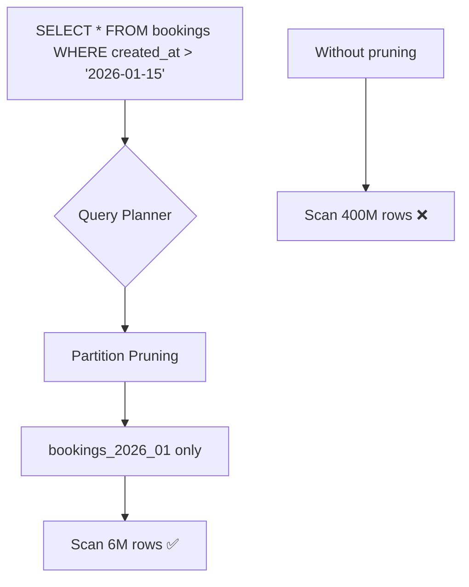

# 24. Partitioning

> **Think:** *"Can data be grouped?"*

---

## The 4 Questions

| Question | Answer |
|----------|--------|
| **What problem does it solve?** | Large tables that slow down — queries scan billions of rows, indexes bloat, maintenance (VACUUM, backups) takes hours. |
| **What happens if I ignore it?** | A single 500M-row table makes every query slower over time. Dropping old data requires deleting row-by-row. Index rebuilds lock the table. |
| **Where would I use it?** | Time-series data (logs, events, orders), large tables with clear partition boundaries, data with natural expiry. |
| **What companies use it?** | PostgreSQL declarative partitioning, MySQL partitioning, BigQuery partitioned tables, TimescaleDB, Uber's trip data by date, Stripe's events by month. |

---

## Mental Movie (60 seconds)

Your `bookings` table has 400 million rows spanning 5 years. A query for "bookings last week" scans the entire table because the index is huge.

**Without partitioning:** One monolithic table. PostgreSQL must navigate a 400M-row index even to find 10,000 rows from last week.

**With partitioning:** Split the table by month:
- `bookings_2025_01` — 8M rows
- `bookings_2025_06` — 12M rows
- `bookings_2026_01` — 6M rows (current)

Query for "bookings last week" hits only `bookings_2026_01` — 6M rows, not 400M. Query planner skips irrelevant partitions automatically.

Drop data older than 2 years? `DROP TABLE bookings_2024_01` — instant, no row-by-row delete.

---

## How It Works

### Range Partitioning (most common)

```
bookings (parent table)
├── bookings_2025_10  (Oct 2025)
├── bookings_2025_11  (Nov 2025)
├── bookings_2025_12  (Dec 2025)
└── bookings_2026_01  (Jan 2026)  ← queries for Jan only hit this
```

```sql
CREATE TABLE bookings (
    id          BIGINT,
    user_id     BIGINT,
    created_at  TIMESTAMP,
    ...
) PARTITION BY RANGE (created_at);

CREATE TABLE bookings_2026_01
    PARTITION OF bookings
    FOR VALUES FROM ('2026-01-01') TO ('2026-02-01');
```



### Partitioning Strategies

| Strategy | Split by | Best for |
|----------|----------|----------|
| **Range** | Date ranges, ID ranges | Time-series, orders by month |
| **List** | Discrete values | `region IN ('IN', 'US', 'EU')` |
| **Hash** | Hash of key | Even distribution when no natural boundary |
| **Composite** | Range + sub-partition | Massive time-series with hot spots |

**Key ingredients:**
1. **Partition key** — column in every query's WHERE clause for pruning to work
2. **Partition pruning** — database skips irrelevant partitions automatically
3. **Partition maintenance** — create future partitions, drop old ones
4. **Indexes per partition** — smaller, faster indexes on each chunk

---

## Real-World Examples

### Your Travel Platform

**Scenario:** `bookings` table growing 2M rows/month.

```sql
-- Query: user's recent bookings (hits only recent partitions)
SELECT * FROM bookings
WHERE user_id = 1042
  AND created_at > '2026-01-01';

-- Partition pruning: scans bookings_2026_01 only
-- Without partitioning: scans all 400M rows
```

**Retention policy:**
```sql
-- Archive and drop data older than 3 years
DROP TABLE bookings_2023_01;  -- instant, frees disk
```

**Gotcha:** Query without partition key:
```sql
SELECT * FROM bookings WHERE user_id = 1042;  -- scans ALL partitions!
```
Fix: Always include `created_at` range, or use a separate `user_bookings` index table.

### Nykaa

**Scenario:** `orders` and `order_events` tables — millions of orders per month during sales.

Nykaa partitions order events by month for:
- Fast recent-order queries (customer support, "where is my order?")
- Cheap data archival (move old partitions to cold storage)
- Parallel maintenance (VACUUM one partition without locking others)

Product catalog (`products` table) is **not** partitioned — it's smaller and updated in place. Different access pattern.

### Amazon

**Scenario:** Order history for a customer.

Amazon stores recent orders in hot storage (fast queries). Orders older than 2 years move to cold/archive partitions or separate storage. Your "order history" page loads recent partitions quickly; "view 2019 order" may take longer.

AWS services like S3 partition by prefix (`s3://logs/year=2026/month=01/day=15/`), Athena queries prune partitions the same way relational DBs do.

---

## When To Use It

| Use partitioning when... | Example |
|--------------------------|---------|
| Table exceeds 50–100M rows and growing | Orders, events, logs |
| Queries mostly hit recent data | "Last 30 days" dashboards |
| You need cheap data retention/deletion | Drop old monthly partitions |
| Maintenance windows are too long | VACUUM per partition |
| Natural partition boundary exists | Date, region, tenant |

## When NOT To Use It

| Skip partitioning when... | Why |
|---------------------------|-----|
| Table is small (< 10M rows) | Overhead without benefit |
| Queries don't filter on partition key | No pruning = scan everything anyway |
| Frequent cross-partition updates | Rows moving between partitions are expensive |
| You need global unique constraints across partitions | Hard to enforce |
| Team isn't ready for partition maintenance | Missing future partitions = insert failures |

---

## Partitioning vs Related Concepts

| Concept | Difference |
|---------|-----------|
| **Sharding** | Splits across multiple databases; partitioning splits within one database |
| **Indexing** | Complementary — indexes per partition stay small and fast |
| **Archival** | Partitioning makes archival trivial (DROP vs DELETE) |
| **Sharding** | Next step when one partitioned DB still isn't enough |

**Rule of thumb:** Partition within one DB first. Shard across DBs when one machine can't hold the data or write load.

---

## Implementation Checklist

- [ ] Choose partition key aligned with query patterns (usually date)
- [ ] Automate creation of future partitions (cron job or pg_partman)
- [ ] Automate archival/dropping of old partitions
- [ ] Verify partition pruning with `EXPLAIN` — confirm only relevant partitions scanned
- [ ] Index each partition (or use local indexes)
- [ ] Document queries that must include partition key

---

## Problem Simulation

**Situation:** Your travel platform partitions `bookings` by month on `created_at`. A user calls support: "I booked a trip in December but I don't see it."

Support agent runs:
```sql
SELECT * FROM bookings
WHERE user_id = 5599
  AND status = 'confirmed';
```

Query takes 45 seconds. Returns the December booking. Agent is confused why it was slow and why it appeared at all.

**Questions:**
1. Why was the query slow?
2. Why did it still find the December booking?
3. How should the support query be rewritten?
4. Should you partition by `user_id` instead of `created_at`?

<details>
<summary>Answers</summary>

1. **No partition pruning** — query lacks `created_at` filter, so PostgreSQL scans all monthly partitions (5 years × 12 = 60 partitions).
2. Partitioning doesn't hide data — it only affects *how* data is stored and which chunks are scanned. All partitions are part of the same logical table.
3. Add date range: `WHERE user_id = 5599 AND created_at BETWEEN '2025-12-01' AND '2025-12-31'`. Or maintain a support tool that defaults to last 90 days.
4. **Partition by user_id (hash)?** Helps user-scoped queries but hurts time-range analytics ("bookings this month"). For travel platform, `created_at` range partitioning is correct — fix the queries, not the partition key.

</details>

---

## Key Takeaway

Partitioning is decluttering for your database — group related rows together so queries touch only what they need. It's the step before sharding, and often the step that delays needing sharding by years.

**Next:** [25 — Normalization](./25-normalization.md) — how do you design tables so data isn't duplicated everywhere?
