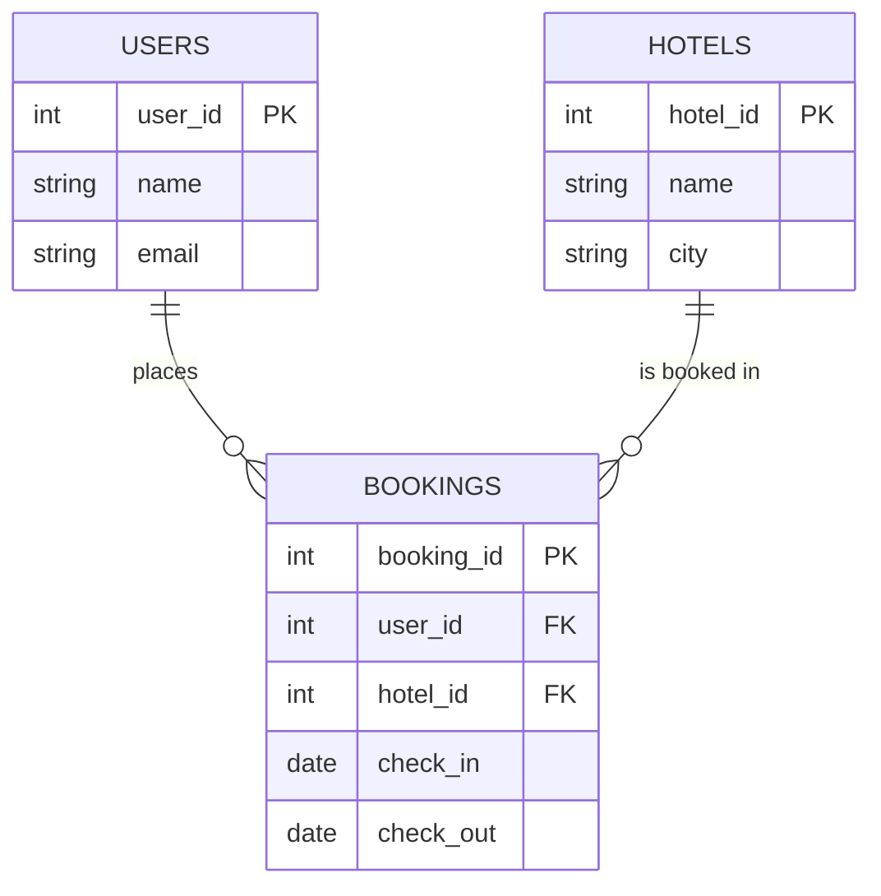

# 25. Normalization

> **Think:** *"Can I reduce redundancy?"*

---

## The 4 Questions

| Question | Answer |
|----------|--------|
| **What problem does it solve?** | Data redundancy — the same fact stored in multiple places, getting out of sync when updated. |
| **What happens if I ignore it?** | Customer changes email → update 50 order rows. Miss one → wrong shipping address. Storage bloat. Update anomalies everywhere. |
| **Where would I use it?** | OLTP systems (transactions, bookings, orders) where writes are frequent and correctness matters. |
| **What companies use it?** | Every relational database design at early stage — Stripe's schema, Shopify orders, bank account systems, your travel platform's core booking DB. |

---

## Mental Movie (60 seconds)

You store bookings like this:

```
bookings table:
| booking_id | user_name    | user_email           | hotel_name      | hotel_city |
|------------|--------------|----------------------|-----------------|------------|
| 1          | Rahul Sharma | rahul@email.com      | Treebo Goa      | Goa        |
| 2          | Rahul Sharma | rahul@email.com      | Taj Mumbai      | Mumbai     |
| 3          | Priya Patel  | priya@email.com        | Treebo Goa      | Goa        |
```

Rahul changes his email. You update 2 rows. What if you miss booking #1? Rahul doesn't get his confirmation for the Goa trip.

**Normalized design:**

```
users:     | user_id | name          | email           |
hotels:    | hotel_id | name         | city            |
bookings:  | booking_id | user_id | hotel_id | dates   |
```

Change Rahul's email in **one place**. All bookings reflect it via join.

That's normalization — each fact lives in exactly one place.

---

## How It Works

### Normal Forms (simplified)

| Form | Rule | Example violation |
|------|------|-------------------|
| **1NF** | Atomic values, no repeating groups | `phone_numbers: "9876543210, 9123456789"` → separate row or table |
| **2NF** | No partial dependencies on composite key | Order line stores `product_name` when key is `(order_id, product_id)` — name depends only on product_id |
| **3NF** | No transitive dependencies | `booking` stores `hotel_city` when it stores `hotel_id` — city depends on hotel, not booking |
| **BCNF** | Every determinant is a candidate key | Stricter 3NF — rarely needed to think about explicitly |



### The Anomalies Normalization Prevents

| Anomaly | What happens | Normalized fix |
|---------|--------------|----------------|
| **Insert** | Can't add hotel until someone books it | Separate `hotels` table |
| **Update** | Change email in 50 rows, miss one | Email in `users` only |
| **Delete** | Delete last booking → lose hotel info | Hotel in `hotels` table survives |

**Key ingredients:**
1. **Entity identification** — what are your nouns? (users, hotels, bookings)
2. **Relationships** — foreign keys, not duplicated data
3. **Single source of truth** — each fact in one table
4. **Joins at read time** — pay the cost when querying, not when writing

---

## Real-World Examples

### Your Travel Platform

**Scenario:** Designing the core schema.

**Bad (denormalized):**
```
package_bookings:
  user_name, user_phone, user_email,
  flight_number, airline_name, departure_city,
  hotel_name, hotel_address, hotel_star_rating,
  transfer_driver_name, transfer_vehicle_number
```

One booking row = 15 fields, many duplicated across bookings.

**Good (normalized):**
```
users          → user_id, name, email, phone
airlines       → airline_id, name, code
flights        → flight_id, airline_id, number, route
hotels         → hotel_id, name, address, rating
drivers        → driver_id, name, vehicle
bookings       → booking_id, user_id, status, total
booking_items  → booking_id, item_type, item_id (flight/hotel/transfer)
```

**Benefit:** Hotel updates address once. Airline rebrands — one update. User changes phone — one update.

**Cost:** "Get full booking details" requires 4–5 joins. Fine for checkout; painful for "My Trips" listing at scale (→ denormalization, Topic 26).

### Nykaa

**Scenario:** Product catalog with brands, categories, variants.

```
brands       → brand_id, name, logo_url
categories   → category_id, name, parent_id
products     → product_id, brand_id, category_id, name
variants     → variant_id, product_id, sku, shade, size, price
orders       → order_id, user_id, ...
order_items  → order_id, variant_id, qty, price_at_purchase
```

`price_at_purchase` on `order_items` is **intentionally denormalized** — price changes daily but order history must show what user paid. Normalization for live catalog; snapshot for historical orders.

Brand name appears once in `brands`, referenced by `products`. If Nykaa renames a brand, one update propagates via joins.

### Amazon

**Scenario:** Product catalog with millions of ASINs.

Amazon's catalog is normalized at the storage layer:
- `products` — core attributes
- `categories` — taxonomy tree
- `sellers` — marketplace seller info
- `offers` — seller-specific price and condition per ASIN

A product description change happens once. Search indexes and product pages pull via joins/CDC. Order history snapshots price and title at purchase time (denormalized for immutability).

---

## When To Use It

| Use normalization when... | Example |
|---------------------------|---------|
| Data is updated frequently | User profiles, product catalog, inventory |
| Consistency on writes matters | Booking system, payment ledger |
| Storage efficiency matters | Avoid storing "Mumbai" 10 million times |
| Schema is still evolving | Normalized schemas are easier to change |
| Team is building OLTP core | Orders, accounts, transactions |

## When NOT To Use It

| Skip normalization when... | Why |
|----------------------------|-----|
| Read performance is critical and joins are slow | Denormalize for hot read paths |
| Data is append-only and never updated | Logs, events — redundancy doesn't cause update anomalies |
| You're building analytics/reporting tables | Star schemas deliberately denormalize |
| Every query needs 8 joins | Consider materialized views or read models |
| Historical snapshots needed | Store `price_at_purchase`, not just `product_id` |

---

## Normalization vs Related Concepts

| Concept | Difference |
|---------|-----------|
| **Denormalization** | Deliberate reversal for read speed — Topic 26 |
| **ACID** | Normalization reduces update anomalies; ACID ensures atomic multi-table writes |
| **CQRS** | Separate write model (normalized) and read model (denormalized) |
| **Star Schema** | Denormalized by design — for analytics warehouses |

**Rule of thumb:** Normalize on write. Denormalize on read when joins hurt.

---

## Implementation Checklist

- [ ] Identify entities (nouns) and relationships (verbs)
- [ ] Apply at least 3NF for core transactional tables
- [ ] Use foreign keys to enforce relationships
- [ ] Store historical snapshots where values must be frozen (`price_at_purchase`)
- [ ] Document which tables are normalized vs intentionally denormalized
- [ ] Measure join performance before denormalizing — indexes often fix the problem

---

## Problem Simulation

**Situation:** Your travel platform stores hotel info directly on every booking row:

```
bookings: hotel_name, hotel_address, hotel_phone, hotel_star_rating, hotel_city
```

The Treebo Goa changes phone number. Ops updates `hotels` table (yes, you have both). But 15,000 historical booking rows still have the old phone. Support calls Treebo using the number on the booking — it's disconnected.

**Questions:**
1. What normalization mistake was made?
2. Should historical bookings show the old or new phone number?
3. How do you fix the schema?
4. Is storing `hotel_name` on the booking row ever correct?

<details>
<summary>Answers</summary>

1. **Transitive dependency** — `hotel_phone` depends on `hotel_id`, not `booking_id`. Phone stored redundantly on 15,000 rows instead of once in `hotels`.
2. **Depends on use case.** For support calling the hotel *now*: join to current `hotels` table. For "what hotel did I book?": `hotel_name` snapshot is fine (hotel could be renamed). Phone for contact should be current, not snapshot.
3. Remove hotel fields from `bookings`. Keep `hotel_id` FK. Join to `hotels` for current details. Optionally snapshot `hotel_name` at booking time for display immutability.
4. **Yes** — if the hotel rebrands after booking, user should still see "Treebo Goa" on their confirmation, not the new name. Snapshot display fields; reference FK for live contact info.

</details>

---

## Key Takeaway

Normalization is about discipline — each fact has one home, updates happen in one place, and anomalies disappear. It's the default for any system where writes matter.

**Next:** [26 — Denormalization](./26-denormalization.md) — when do you deliberately break the rules for speed?
