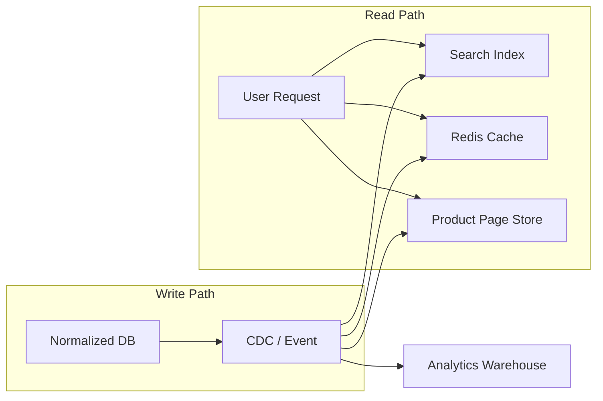

# 26. Denormalization

> **Think:** *"Can I duplicate data for speed?"*

---

## The 4 Questions

| Question | Answer |
|----------|--------|
| **What problem does it solve?** | Slow reads — joins across 5 tables add latency. At scale, a normalized schema can't serve product pages in 50ms. |
| **What happens if I ignore it?** | Every page load runs 6 joins. DB CPU spikes. You add caching everywhere to paper over bad schema. P99 latency kills conversion. |
| **Where would I use it?** | Hot read paths: product pages, order summaries, feeds, dashboards, search results — anywhere reads dominate and speed matters. |
| **What companies use it?** | Amazon (product page denormalized document), Nykaa (product cache with embedded brand/category), Instagram (feed pre-computed), Uber (trip summary with driver name/photo). |

---

## Mental Movie (60 seconds)

Nykaa product page needs: product name, brand, category, price, shades, reviews count, average rating, offer badge, delivery estimate.

**Normalized query:**
```sql
SELECT p.*, b.name, c.name, AVG(r.rating), COUNT(r.id), o.discount
FROM products p
JOIN brands b ON ...
JOIN categories c ON ...
LEFT JOIN reviews r ON ...
LEFT JOIN offers o ON ...
WHERE p.id = 44291
GROUP BY ...
```
6 joins. 200ms on a good day. 2 seconds during sale.

**Denormalized `product_page` document:**
```json
{
  "product_id": 44291,
  "name": "Matte Lipstick - Ruby Rush",
  "brand_name": "Nykaa Cosmetics",
  "category": "Lips > Lipstick",
  "price": 599,
  "avg_rating": 4.3,
  "review_count": 12847,
  "offer": "Buy 2 Get 1",
  "in_stock": true
}
```
One read. 3ms from Redis. Page loads instantly.

**Cost:** Brand renamed? Update 500 product documents. Price changed? Update cache + search index + product page doc. More writes, more sync logic.

---

## How It Works

### Common Denormalization Patterns

| Pattern | What you duplicate | Why |
|---------|-------------------|-----|
| **Embedded document** | Related fields in one row/document | Single-read product page |
| **Redundant column** | `customer_name` on `orders` table | Avoid join on order history |
| **Materialized view** | Pre-computed join result | Dashboard metrics |
| **Summary table** | `product_id → review_count, avg_rating` | Avoid COUNT/AVG on every page load |
| **Snapshot column** | `price_at_purchase` on order line | Historical immutability |
| **Read model (CQRS)** | Entire denormalized projection | Separate write and read schemas |



**Key ingredients:**
1. **Source of truth** — normalized DB remains authoritative for writes
2. **Sync mechanism** — CDC, triggers, or application events update denormalized copies
3. **Staleness tolerance** — define acceptable lag (eventual consistency, Topic 21)
4. **Invalidation strategy** — what triggers an update to cached/denormalized data?

---

## Real-World Examples

### Your Travel Platform

**Scenario:** "My Trips" page shows upcoming bookings with hotel image, name, city, dates, status.

**Normalized (slow at scale):**
```sql
SELECT b.*, h.name, h.city, h.image_url, f.flight_number, f.departure
FROM bookings b
JOIN hotels h ON b.hotel_id = h.hotel_id
JOIN flights f ON b.flight_id = f.flight_id
WHERE b.user_id = 1042 AND b.status = 'upcoming';
```

**Denormalized `trip_summaries` table:**
```
trip_summaries:
  booking_id, user_id, display_title, hotel_name, hotel_image,
  city, check_in, check_out, flight_number, status, total_paid
```

Populated on booking creation. Updated on status change. "My Trips" = single table scan, no joins. 5ms.

**Sync:** When hotel changes image, do you update old trip summaries? No — show the image at time of booking. When booking status changes to "cancelled" → update `trip_summaries.status`.

### Nykaa

**Scenario:** Category page showing 48 products with brand, price, rating, offer.

Nykaa denormalizes heavily for browse pages:
- Elasticsearch documents embed brand name, category path, price, rating, stock status
- Redis caches hot product page JSON
- PostgreSQL remains normalized source of truth

On price update:
1. Write to PostgreSQL (authoritative)
2. CDC publishes `PriceUpdated` event
3. Worker updates Elasticsearch doc, invalidates Redis key

During flash sale, 10,000 price updates/minute flood the sync pipeline. Nykaa accepts 1–3 second staleness on browse pages. Checkout always reads live price from primary DB.

### Amazon

**Scenario:** Product detail page (the most optimized page on the internet).

Amazon's product page is a denormalized document assembled from:
- Product catalog (name, description, images)
- Offer service (price, seller, Prime eligibility)
- Review service (rating, count)
- Inventory service (in stock, delivery estimate)

No single join at request time. Services push updates to a page assembly layer. Page renders from pre-fetched fragments in milliseconds.

Search results are fully denormalized — each result row contains everything needed to render a search card without additional lookups.

---

## When To Use It

| Use denormalization when... | Example |
|-----------------------------|---------|
| Read latency is a product requirement | Product page < 100ms |
| Joins are the proven bottleneck (indexes didn't help) | 5+ table joins on hot path |
| Read:write ratio is extreme (100:1 or more) | Catalog browsing |
| You have sync infrastructure (CDC, queues) | Can keep copies updated |
| Historical snapshots are needed anyway | `price_at_purchase` |

## When NOT To Use It

| Skip denormalization when... | Why |
|------------------------------|-----|
| Schema is still changing rapidly | Every field change = update 5 denormalized copies |
| Write consistency is critical on every read | Money, inventory at checkout — read from primary |
| Data fits in one table with good indexes | Join of 2 indexed tables is fast enough |
| Team can't maintain sync pipelines | Stale denormalized data is worse than slow joins |
| You're pre-optimizing at MVP scale | Normalize first; denormalize when metrics prove need |

---

## Denormalization vs Related Concepts

| Concept | Difference |
|---------|-----------|
| **Normalization** | The default write schema; denormalization optimizes reads |
| **Caching** | Temporary denormalized copy with TTL; denormalization is durable duplication |
| **Materialized View** | Database-managed denormalization, refreshed on schedule |
| **CQRS** | Architectural pattern — separate write model (normalized) and read model (denormalized) |
| **Replication** | Full copy of data; denormalization is reshaped copy for specific queries |

**Rule of thumb:** Normalize first. Measure. Denormalize the proven hot paths. Never denormalize your source of truth.

---

## Implementation Checklist

- [ ] Keep normalized schema as source of truth
- [ ] Identify hot read paths with profiling (EXPLAIN, APM traces)
- [ ] Build sync pipeline before denormalizing (CDC, events, workers)
- [ ] Define staleness budget per denormalized copy
- [ ] Snapshot immutable fields (`price_at_purchase`, `hotel_name_at_booking`)
- [ ] Monitor sync lag between source and denormalized copies
- [ ] Document which copies exist and what triggers their update

---

## Problem Simulation

**Situation:** Your travel platform denormalizes hotel name, city, and star rating onto `trip_summaries` for fast "My Trips." A hotel upgrades from 3-star to 5-star. Marketing runs a campaign: "All your booked hotels are 5-star!"

A user sees their old 3-star booking now showing 5 stars. They call support demanding an upgrade or refund.

**Questions:**
1. What went wrong in the denormalization design?
2. Which fields should be snapshotted at booking time vs joined live?
3. How do you fix the data model without losing read performance?
4. When is live-joined data actually better than a snapshot?

<details>
<summary>Answers</summary>

1. **Mutable attribute snapshotted without intent** — `star_rating` was copied to `trip_summaries` and either updated on hotel change (wrong for history) or inconsistently maintained.
2. **Snapshot at booking:** `hotel_name`, `star_rating`, `price_paid` (what user booked). **Join live:** `hotel_phone`, `hotel_address` (current contact info for support).
3. Add `hotel_star_rating_at_booking` snapshot column. Populate once at booking creation, never update. Keep denormalized `trip_summaries` for display speed but treat snapshots as immutable.
4. When accuracy of *current* state matters more than historical — support contact info, cancellation policy (if it can change), real-time booking status.

</details>

---

## Key Takeaway

Denormalization is a scalpel, not a default. Duplicate data deliberately on proven hot paths, keep one source of truth, and build the sync pipeline before you need it.

**Next:** [Module 5 — Distributed Systems](../module-05-distributed-systems/) — message queues, pub/sub, CQRS, event sourcing, and sagas for when your data spans many services.
