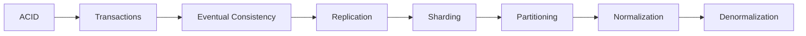

# Module 4: Data Systems

How data stays correct, available, and fast.

> **Think like this:** *"What if the write stops halfway? What if two servers disagree? What if one database can't hold it all?"*

## Topics

| # | Topic | One-line mental model | Read time |
|---|-------|----------------------|-----------|
| 19 | [ACID](./19-acid.md) | "Either everything succeeds or nothing does." | ~12 min |
| 20 | [Transactions](./20-transactions.md) | "What if operation stops halfway?" | ~12 min |
| 21 | [Eventual Consistency](./21-eventual-consistency.md) | "Everyone agrees eventually." | ~12 min |
| 22 | [Replication](./22-replication.md) | "Can copies help?" | ~12 min |
| 23 | [Sharding](./23-sharding.md) | "Can I split data?" | ~12 min |
| 24 | [Partitioning](./24-partitioning.md) | "Can data be grouped?" | ~12 min |
| 25 | [Normalization](./25-normalization.md) | "Can I reduce redundancy?" | ~12 min |
| 26 | [Denormalization](./26-denormalization.md) | "Can I duplicate data for speed?" | ~12 min |

## Suggested Learning Order

These eight concepts stack on each other:



1. **ACID** — the guarantees a database promises for correctness
2. **Transactions** — grouping operations so partial failure is impossible
3. **Eventual Consistency** — what happens when you can't have ACID everywhere
4. **Replication** — copies for reads and fault tolerance
5. **Sharding** — splitting data across multiple databases
6. **Partitioning** — splitting data within one database
7. **Normalization** — clean schema, no redundant data
8. **Denormalization** — duplicate data deliberately for read speed

## Module Simulation

After finishing all 8 topics, run this scenario (answers at bottom of each topic doc):

> **Diwali sale.** Nykaa launches a flash sale. 2 million users hit the product page simultaneously. Orders spike 50×. Your travel platform runs a parallel "Winter Getaway" campaign. A user books flight + hotel + cab in one checkout. Payment succeeds. Hotel inventory updates on a replica that's 3 seconds behind. A shard in Mumbai goes down mid-checkout.

Trace the failure through each concept. Where does ACID save you? Where does replication lag hurt you? When would you shard vs partition? When does denormalization help the product page load in 200ms?

## PDFs

Generated PDFs live in [pdf/](./pdf/). Regenerate:

```bash
python3 md_to_pdf.py --dir learning/module-04-data-systems --force
```

## Next Module

**[Module 5: Distributed Systems](../module-05-distributed-systems/)** — Message queues, pub/sub, CQRS, event sourcing, sagas, and the patterns that tie services together across the network.
