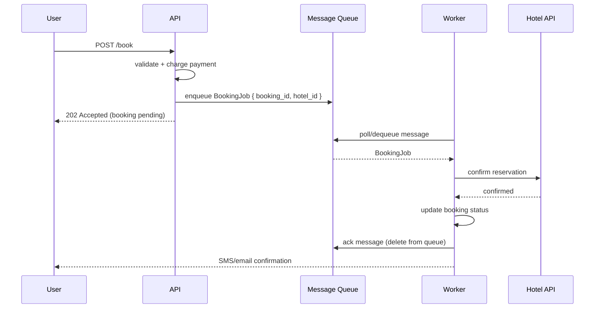

# 27. Message Queue

> **Think:** *"Can work happen later?"*

---

## The 4 Questions

| Question | Answer |
|----------|--------|
| **What problem does it solve?** | Synchronous coupling — when the producer must wait for the consumer to finish. Queues decouple "accept the request" from "do the work," absorbing traffic spikes and hiding slow downstream services. |
| **What happens if I ignore it?** | Timeouts during peak traffic, cascading failures when one slow service blocks everything upstream, lost orders when your API crashes mid-processing, and no way to retry failed work without the user resubmitting. |
| **Where would I use it?** | Order confirmation emails, payment reconciliation, search index updates, image processing, webhook delivery, booking confirmations with multiple suppliers. |
| **What companies use it?** | Amazon (SQS), Uber (Kafka for trip events), Airbnb (RabbitMQ/SQS for booking workflows), MakeMyTrip (async supplier confirmation), Nykaa (order fulfillment pipeline). |

---

## Mental Movie (60 seconds)

User clicks **"Book Now"** on your travel platform. ₹45,000 package. Peak hour.

**Without a queue:** Your API synchronously calls payment → flight → hotel → email → analytics. Hotel API takes 8 seconds. User sees a spinner. Three more users hit "Book" — your server runs out of threads. Timeouts everywhere. Some payments succeed but bookings fail. Chaos.

**With a queue:** API validates input, charges payment, drops a `BookingRequested` job on the queue, returns **"Booking in progress — we'll confirm in 2 minutes."** Workers pick up jobs at their own pace. Hotel API slow? Queue grows, but the API stays fast. Worker retries failed hotel calls. User gets an SMS when done.

That's the entire concept. The queue is a buffer between "I accepted this" and "I finished this."

---

## How It Works

A **message queue** is a durable buffer. Producers push messages; consumers pull and process them. One message is typically consumed by **one** worker (competing consumers).

```
Producer → [Queue: job1, job2, job3, ...] → Consumer A (picks job1)
                                         → Consumer B (picks job2)
```

### Common Implementation Pattern



**Key ingredients:**
1. **Durable storage** — messages survive broker restarts (SQS, RabbitMQ, Kafka)
2. **At-least-once delivery** — message may be delivered more than once; consumers must be idempotent
3. **Visibility timeout** — if worker crashes mid-processing, message reappears for retry
4. **Dead letter queue** — messages that fail repeatedly go to a parking lot (see Topic 33)
5. **Backpressure** — queue depth is a signal that consumers can't keep up

---

## Real-World Examples

### Your Travel Platform

**Scenario:** User books flight + hotel + cab for a weekend trip.

```
POST /api/v1/bookings → 202 Accepted { booking_id: "BK-789", status: "processing" }
```

Behind the scenes:
1. Payment charged synchronously (user must know immediately if card fails)
2. Three jobs enqueued: `ConfirmFlight`, `ConfirmHotel`, `BookCab`
3. Workers process each supplier call independently
4. Booking status updates as each completes
5. User gets push notification when all three are done

**Without a queue:** One slow cab API blocks the entire booking. User waits 30 seconds or times out.

### Nykaa

**Scenario:** Flash sale — 50,000 orders in 5 minutes.

Nykaa's order pipeline:
- Checkout API accepts order, enqueues `OrderCreated` job
- Workers handle inventory deduction, payment capture, warehouse pick-list, SMS
- Queue absorbs the spike; workers scale horizontally to drain the backlog
- Order confirmation may arrive 30–60 seconds later — acceptable during a sale

### Amazon

**Scenario:** One-Click order placed.

Amazon doesn't synchronously update inventory, send email, trigger recommendations, and notify the warehouse in one HTTP request. The order lands on internal queues. Fulfillment centers pull work. Your "order placed" screen appears in 200ms because the heavy lifting is async.

---

## When To Use It

| Use a message queue when... | Example |
|-----------------------------|---------|
| Work can happen asynchronously | Send confirmation email after booking |
| Downstream is slow or unreliable | Third-party hotel API with 5s latency |
| You need to absorb traffic spikes | Flash sale, festival travel rush |
| You need retry without user involvement | Reconcile failed payment with supplier |
| Multiple steps don't need to be atomic | Update search index after product change |

## When NOT To Use It

| Skip a queue when... | Why |
|----------------------|-----|
| User needs immediate synchronous answer | "Is this seat available right now?" — can't queue that |
| Operation is simple and fast (<100ms end-to-end) | Queue adds latency and operational complexity |
| You have 100 orders/day | Direct API calls are fine; queue is premature optimization |
| Strong consistency required across steps | Queue = eventual consistency; use transactions instead |
| Ordering across all messages is critical | Standard queues don't guarantee global order (use Kafka partitions or FIFO queues) |

---

## Message Queue vs Related Concepts

| Concept | Difference |
|---------|-----------|
| **Pub/Sub** | Queue = one consumer per message; Pub/Sub = every subscriber gets a copy |
| **Event-Driven Architecture** | Queue is a transport; EDA is an architectural style that often uses queues |
| **Background Jobs** | Same idea, often in-process (Sidekiq, Bull); message queue is distributed and durable |
| **Backpressure** | Queue depth *is* the backpressure signal — producers keep enqueueing, consumers catch up |

**Rule of thumb:** If the user can wait (seconds to minutes) and the work is retryable, put it on a queue.

---

## Implementation Checklist

- [ ] Choose durability requirements (SQS standard vs FIFO vs Kafka)
- [ ] Design message schema with idempotency key and correlation ID
- [ ] Set visibility timeout > max processing time
- [ ] Configure dead letter queue after N failed attempts
- [ ] Make consumers idempotent (same message twice = same result)
- [ ] Monitor queue depth, age of oldest message, consumer lag
- [ ] Scale consumers based on queue depth, not CPU

---

## Problem Simulation

**Situation:** Your travel platform launches a "Monsoon Getaway" sale. Expected traffic: 10× normal. Architecture:

1. Booking API enqueues jobs to SQS after payment
2. 5 worker instances process hotel confirmations
3. At peak, 2,000 bookings/minute arrive
4. Hotel supplier API degrades to 3-second responses
5. Queue depth grows from 0 to 15,000 in 10 minutes
6. One worker instance crashes (OOM)

**Questions:**
1. Should the booking API slow down or keep accepting orders?
2. What happens to the messages the crashed worker was processing?
3. A user calls support: "I paid but no confirmation email after 20 minutes." What do you check first?
4. Should you add more API servers or more workers?

<details>
<summary>Answers</summary>

1. **Keep accepting** — that's the point of the queue. API stays fast; backlog is a worker scaling problem. Apply rate limiting only if queue age exceeds SLA (e.g., 30 min).
2. **Visibility timeout** — unacknowledged messages reappear on the queue after timeout. Another worker picks them up. Idempotency prevents double-booking.
3. Check in order: (a) payment status, (b) booking record in DB, (c) queue position / worker lag, (d) dead letter queue for poison messages, (e) supplier confirmation status.
4. **More workers** — API is already fast (202 Accepted). Bottleneck is hotel API throughput. Scale workers until diminishing returns; may also need circuit breaker on supplier.

</details>

---

## Key Takeaway

A message queue turns "everything must happen now in one request" into "accept fast, finish reliably." It's the first tool for surviving growth without rewriting your architecture.

**Next:** [28 — Pub/Sub](./28-pub-sub.md) — what if *many* services need to hear about the same event?
