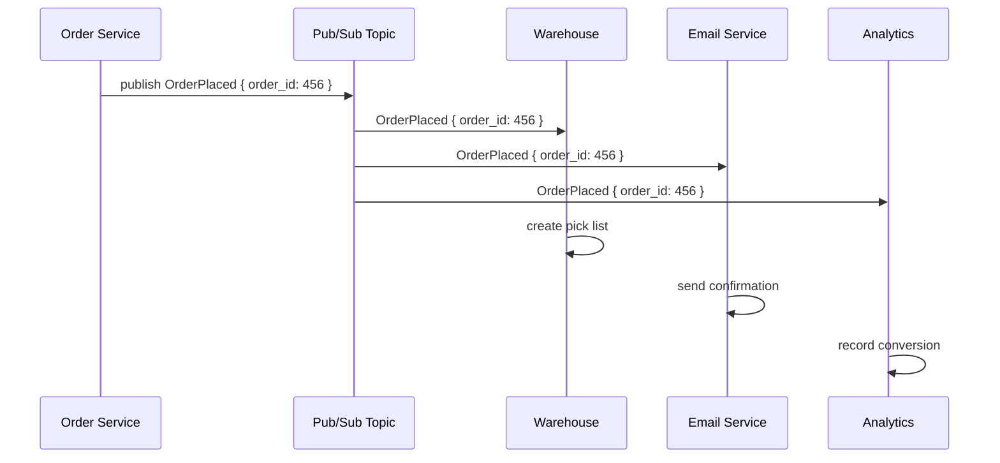

# 28. Pub/Sub

> **Think:** *"Who cares about this event?"*

---

## The 4 Questions

| Question | Answer |
|----------|--------|
| **What problem does it solve?** | Fan-out — one event needs to reach multiple independent consumers without the producer knowing who they are or how many exist. |
| **What happens if I ignore it?** | Spaghetti integrations — booking service directly calls email, SMS, analytics, loyalty, and warehouse APIs. Add a new subscriber? Change booking code. One subscriber slow? Everyone waits. |
| **Where would I use it?** | Order placed → notify inventory, email, analytics, recommendations, fraud detection. User registered → welcome email, CRM, analytics, referral program. |
| **What companies use it?** | Google (Pub/Sub), Amazon (SNS), Uber (Kafka topics), Netflix (event bus for recommendations), Stripe (webhook events to merchants). |

---

## Mental Movie (60 seconds)

User completes a **₹8,500 Nykaa order**. Five systems care:

1. Warehouse — pick and pack
2. Email — order confirmation
3. Analytics — conversion funnel
4. Loyalty — award beauty points
5. Fraud — check for suspicious pattern

**Without pub/sub:** Order service has a list of 5 HTTP calls after checkout. Loyalty API is down → order service retries → checkout slows → user sees spinner. You add a 6th system (push notifications) → you edit order service code and redeploy.

**With pub/sub:** Order service publishes `OrderPlaced { order_id, user_id, total }`. Five subscribers each get their own copy. Loyalty is down? Others proceed. Add push notifications? New subscriber, zero changes to order service.

That's the entire concept. Publish once; subscribers decide if they care.

---

## How It Works

**Publish/Subscribe** is a messaging pattern where publishers emit events to a **topic** without targeting specific recipients. Subscribers register interest in topics and receive every message published to those topics.

```
Publisher → [Topic: order.placed] → Subscriber A (warehouse)
                                 → Subscriber B (email)
                                 → Subscriber C (analytics)
```

Unlike a queue, **each subscriber gets a copy**. They don't compete for messages.

### Common Implementation Pattern



**Key ingredients:**
1. **Topic** — named channel (e.g., `booking.confirmed`, `order.placed`)
2. **Publisher** — emits events, knows nothing about subscribers
3. **Subscriber** — registers for topics, processes independently
4. **Decoupling** — add/remove subscribers without touching publisher
5. **Delivery guarantees** — at-least-once is common; exactly-once is hard

---

## Real-World Examples

### Your Travel Platform

**Scenario:** Booking confirmed for Delhi → Goa.

```
publish("booking.confirmed", {
  booking_id: "BK-789",
  user_id: "U-123",
  destination: "Goa",
  total: 42499
})
```

Subscribers react independently:
- **Notification service** → SMS + email with itinerary
- **Analytics** → record booking funnel completion
- **Loyalty** → award 425 travel points
- **Insurance partner** → trigger policy issuance (if opted in)
- **Cab service** → schedule airport pickup

Booking service doesn't know or care how many subscribers exist.

### Nykaa

**Scenario:** User places order during Pink Friday sale.

`OrderPlaced` event fans out to:
- Inventory service (reserve stock)
- Payment service (capture authorized amount)
- Recommendation engine (update purchase history)
- Marketing (trigger "complete your routine" email 3 days later)
- Fraud detection (velocity check on payment method)

Each team owns their subscriber. No cross-team deploys to add a new reaction.

### Amazon

**Scenario:** Package delivered.

Amazon's internal event fabric publishes `PackageDelivered`. Dozens of downstream systems react: update order status, trigger review request email, adjust inventory, update delivery metrics, bill the seller, update "Buy Again" recommendations. No single service orchestrates all of this synchronously.

---

## When To Use It

| Use pub/sub when... | Example |
|---------------------|---------|
| One event triggers multiple independent actions | Order placed → email + warehouse + analytics |
| Subscribers change frequently | Add fraud detection without touching order service |
| Subscribers have different SLAs | Analytics can lag; payment cannot |
| You want loose coupling between teams | Each team owns their subscriber |
| Event history matters | Kafka retains events for replay |

## When NOT To Use It

| Skip pub/sub when... | Why |
|----------------------|-----|
| Only one consumer needs the message | Use a simple queue — pub/sub adds complexity |
| You need request/response | Pub/sub is one-way; use HTTP/gRPC for queries |
| Strict ordering across all subscribers | Each subscriber processes at its own pace |
| You need transactional guarantees across subscribers | Pub/sub is fire-and-forget; use saga for coordination |
| Team is 3 people building an MVP | Direct function calls are fine |

---

## Pub/Sub vs Related Concepts

| Concept | Difference |
|---------|-----------|
| **Message Queue** | Queue = work distribution (one worker per job); Pub/Sub = event broadcast (every subscriber gets a copy) |
| **Webhooks** | Webhooks are HTTP-based pub/sub to external systems |
| **Event-Driven Architecture** | Pub/sub is the transport layer; EDA is the full architectural pattern |
| **SNS + SQS fan-out** | AWS pattern: SNS topic → multiple SQS queues (one per subscriber) |

**Rule of thumb:** Queue = "who does this job?" Pub/Sub = "who should know this happened?"

---

## Implementation Checklist

- [ ] Define event schema with version field (e.g., `OrderPlaced.v2`)
- [ ] Use correlation ID to trace across subscribers
- [ ] Subscribers must be idempotent (same event delivered twice)
- [ ] Don't put large payloads in events — publish IDs, subscribers fetch details
- [ ] Monitor per-subscriber lag and error rates
- [ ] Document topic catalog — what events exist, who publishes, who subscribes
- [ ] Plan for schema evolution (additive changes only, or versioned topics)

---

## Problem Simulation

**Situation:** Your travel platform publishes `BookingConfirmed` to a pub/sub topic. Four subscribers:

1. Email service — sends itinerary (usually 2s)
2. Loyalty service — awards points (usually 1s)
3. Analytics — writes to data warehouse (usually 5s)
4. Insurance partner webhook — external API (usually 10s, sometimes 60s+)

A festival weekend causes 5× booking volume. The insurance partner's API starts returning 503 errors.

**Questions:**
1. Do the other three subscribers stop working?
2. Should the booking service wait for all subscribers before returning success to the user?
3. Insurance partner is down for 2 hours. How do you handle missed events?
4. You want to add SMS notifications. What changes in the booking service?

<details>
<summary>Answers</summary>

1. **No** — subscribers are independent. Email, loyalty, and analytics proceed normally. Only the insurance subscriber fails/retries.
2. **No** — booking is already confirmed synchronously (payment + supplier). Pub/sub reactions are async side effects. User gets confirmation immediately; insurance policy may arrive later.
3. **Retry with backoff** on the insurance subscriber. If still failing, dead letter queue + manual replay when partner recovers. Event log (Kafka) allows replay from offset.
4. **Nothing** — deploy a new SMS subscriber that listens to `BookingConfirmed`. Zero changes to booking service. That's the decoupling win.

</details>

---

## Key Takeaway

Pub/sub answers "who cares?" so your core service never has to maintain a guest list. Publish the event; let subscribers opt in.

**Next:** [29 — Event-Driven Architecture](./29-event-driven-architecture.md) — what happens when events *become* the system?
