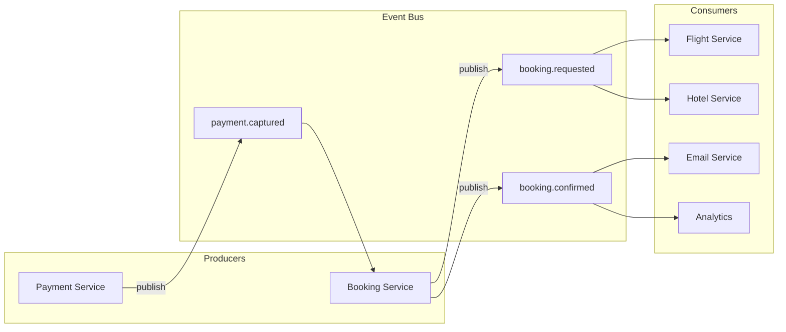

# 29. Event-Driven Architecture

> **Think:** *"Can events drive behavior?"*

---

## The 4 Questions

| Question | Answer |
|----------|--------|
| **What problem does it solve?** | Tight coupling in microservices — when Service A must synchronously call B, C, and D, creating fragile dependency chains, cascading failures, and slow deploys. |
| **What happens if I ignore it?** | Monolithic orchestration logic, cascading timeouts, impossible-to-trace bugs ("who updated this field?"), and teams blocked on each other's deploy schedules. |
| **Where would I use it?** | E-commerce order flows, ride-hailing (trip lifecycle), booking platforms, fintech (payment → ledger → notification), any system with 5+ services reacting to state changes. |
| **What companies use it?** | Uber (trip events), Netflix (viewing events → recommendations), Amazon (order lifecycle), Zomato (order state machine), LinkedIn (activity feed). |

---

## Mental Movie (60 seconds)

User books a **flight + hotel** package on your travel platform.

**Synchronous (orchestrated):**
```
Booking API → Payment Service → Flight Service → Hotel Service → Email Service → Analytics
     ↓ 8 seconds, any failure = partial booking, hard to debug
```

**Event-driven:**
```
Booking API → publishes BookingRequested
  → Payment Service hears it → publishes PaymentCaptured
    → Flight Service hears it → publishes FlightConfirmed
    → Hotel Service hears it → publishes HotelConfirmed
      → (both confirmed) → Booking Service publishes BookingConfirmed
        → Email, Analytics, Loyalty each react independently
```

No central orchestrator owns the whole flow. Each service listens for events it cares about and publishes events when it completes its job.

That's the entire concept. Behavior is driven by events, not by a master controller calling everyone.

---

## How It Works

**Event-Driven Architecture (EDA)** is a style where services communicate by producing and consuming **events** — immutable records of something that happened. Services are loosely coupled: they don't know about each other, only about event types.

### Event Types

| Type | Example | Use |
|------|---------|-----|
| **Domain event** | `OrderPlaced`, `PaymentFailed` | Business state changes |
| **Integration event** | `SyncInventoryToWarehouse` | Cross-system coordination |
| **Notification event** | `SendEmailRequested` | Trigger side effects |

### Common Implementation Pattern



**Key ingredients:**
1. **Event bus** — Kafka, SNS, RabbitMQ, or cloud event bridge
2. **Event schema** — versioned, documented, owned by producer
3. **Idempotent consumers** — same event processed twice = same result
4. **Correlation ID** — trace a booking across 10 services
5. **Eventual consistency** — state converges over time, not instantly

---

## Real-World Examples

### Your Travel Platform

**Scenario:** Package booking with flight, hotel, and cab.

Event flow:
```
1. BookingRequested     → Payment service charges card
2. PaymentCaptured      → Flight + Hotel services confirm in parallel
3. FlightConfirmed      → Booking service tracks progress
4. HotelConfirmed       → Booking service tracks progress
5. BookingConfirmed     → Email, SMS, Loyalty, Analytics react
6. CabScheduled         → Cab partner confirms pickup
```

If hotel fails:
```
7. HotelFailed          → Booking service publishes BookingFailed
8. FlightCancelled      → Compensating action (saga — see Topic 32)
9. PaymentRefunded      → Compensating action
```

No single service contains all this logic. Each service owns its slice.

### Nykaa

**Scenario:** Order lifecycle during a sale.

Events drive the entire order state machine:
- `CartCheckedOut` → inventory reservation
- `InventoryReserved` → payment authorization
- `PaymentAuthorized` → order creation
- `OrderCreated` → warehouse pick-list, email, analytics
- `OrderShipped` → tracking SMS, loyalty points
- `OrderDelivered` → review request, return window starts

Each transition is an event. The order service doesn't call the warehouse — it publishes `OrderCreated` and the warehouse subscribes.

### Amazon

**Scenario:** One-Click purchase to delivery.

Amazon's order pipeline is a decades-long evolution of event-driven design. `OrderPlaced` triggers a cascade: inventory allocation, payment capture, fulfillment center assignment, shipping label, carrier pickup, delivery, return window. Hundreds of services react to events. No monolith orchestrates the full lifecycle.

---

## When To Use It

| Use EDA when... | Example |
|-----------------|---------|
| Multiple services react to the same state change | Order placed → 6 downstream actions |
| Teams deploy independently | Add fraud detection without touching order service |
| Peak traffic requires async processing | Flash sale order pipeline |
| Audit trail is important | "What happened to booking BK-789?" |
| System will grow beyond 5–10 services | Microservices at scale |

## When NOT To Use It

| Skip EDA when... | Why |
|------------------|-----|
| Simple CRUD app with 2–3 services | Direct HTTP calls are simpler |
| You need strong consistency everywhere | EDA is eventually consistent by nature |
| Team lacks observability tooling | Debugging "event went where?" without tracing is painful |
| No clear domain boundaries | Events without bounded contexts = chaos |
| Synchronous user-facing queries | "Show my order status now" still needs a read API |

---

## Event-Driven Architecture vs Related Concepts

| Concept | Difference |
|---------|-----------|
| **Pub/Sub** | Pub/sub is the transport; EDA is the full architectural pattern using events as the integration mechanism |
| **Message Queue** | Queues often carry commands ("process this job"); EDA events are facts ("this happened") |
| **Saga Pattern** | Sagas coordinate multi-step workflows in EDA when you need failure handling |
| **CQRS** | Often paired with EDA — commands write, events update read models |
| **Event Sourcing** | EDA can use current-state DBs; event sourcing stores events as the source of truth |

**Rule of thumb:** EDA when services need to react to each other without knowing about each other.

---

## Implementation Checklist

- [ ] Define event naming convention (`domain.entity.action`, e.g., `booking.payment.captured`)
- [ ] Version event schemas; never break existing consumers
- [ ] Correlation ID on every event for distributed tracing
- [ ] Idempotent event handlers (store processed event IDs)
- [ ] Dead letter queues for failed consumers
- [ ] Event catalog documentation (who publishes, who subscribes, schema)
- [ ] Observability: event lag, consumer error rates, end-to-end latency per flow
- [ ] Design for failure: what if event is lost? Duplicate? Out of order?

---

## Problem Simulation

**Situation:** Your travel platform is event-driven. A user books a package. Event sequence:

1. `BookingRequested` published ✅
2. Payment service processes, publishes `PaymentCaptured` ✅
3. Flight service confirms, publishes `FlightConfirmed` ✅
4. Hotel service times out — never publishes `HotelConfirmed` ❌
5. Booking service waits for both confirmations...

Meanwhile, analytics received `PaymentCaptured` and recorded revenue. Email service never heard `BookingConfirmed`.

**Questions:**
1. How does the booking service know the hotel failed vs. is still processing?
2. Should analytics have recorded revenue before booking is fully confirmed?
3. How do you debug this without logs in one monolithic service?
4. What's the compensating action?

<details>
<summary>Answers</summary>

1. **Timeout + status polling** — booking service sets a deadline (e.g., 5 min). If no `HotelConfirmed` or `HotelFailed` by then, query hotel service directly or publish `HotelConfirmationTimedOut` and trigger compensation.
2. **Ideally no** — analytics should listen to `BookingConfirmed`, not `PaymentCaptured`. This is a classic EDA mistake: reacting to intermediate events. Fix: subscribe to the right event or use a "confirmed revenue" vs "authorized revenue" distinction.
3. **Distributed tracing** — correlation ID `corr-abc` on every event. Trace: BookingRequested → PaymentCaptured → FlightConfirmed → (missing HotelConfirmed). Tools: Jaeger, Datadog APM, or CloudWatch with correlation ID in logs.
4. **Saga compensation** — publish `HotelBookingFailed` → flight service publishes `FlightCancelled` → payment service publishes `PaymentRefunded` → booking service publishes `BookingFailed`. User notified.

</details>

---

## Key Takeaway

Event-driven architecture trades "I call you directly" for "something happened, react if you care." It scales teams and traffic — but demands observability, idempotency, and comfort with eventual consistency.

**Next:** [30 — CQRS](./30-cqrs.md) — should reads and writes follow different paths?
