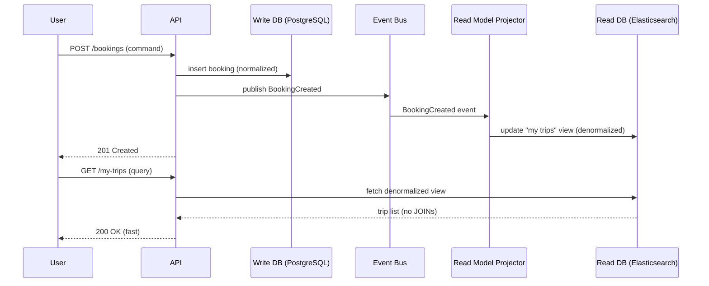

# 30. CQRS

> **Think:** *"Should reads and writes be separate?"*

---

## The 4 Questions

| Question | Answer |
|----------|--------|
| **What problem does it solve?** | Read/write contention — when the same data model is optimized for both writing (normalized, consistent) and reading (denormalized, fast), neither performs well at scale. |
| **What happens if I ignore it?** | Slow product pages under load, complex JOIN queries on write-optimized schemas, write operations blocked by heavy read traffic, and inability to scale reads and writes independently. |
| **Where would I use it?** | High-traffic product catalogs, order history dashboards, search-heavy platforms, booking availability displays, any system where reads vastly outnumber writes. |
| **What companies use it?** | Microsoft (originated the term), Amazon (product catalog reads vs order writes), LinkedIn (feed reads vs activity writes), Uber (trip history reads vs trip creation writes). |

---

## Mental Movie (60 seconds)

Your travel platform's **hotel search page** gets 10,000 requests/second. Your **booking write API** gets 50 requests/second.

**Without CQRS:** Same PostgreSQL tables serve both. Search needs denormalized data (hotel + reviews + pricing + availability in one row). Writes need normalized data (separate tables for inventory, pricing rules, blackout dates). Every schema change risks breaking both paths. Read replicas help but JOINs are still slow.

**With CQRS:**
- **Write side:** Normalized schema. `CreateBooking` command → validate → write to bookings DB → publish `BookingCreated` event.
- **Read side:** Denormalized "search view" in Elasticsearch/Redis. Event consumer updates the read model. Search queries never touch the write DB.

Writes stay correct. Reads stay fast. Scale each side independently.

That's the entire concept. Separate models for commands (writes) and queries (reads).

---

## How It Works

**CQRS** (Command Query Responsibility Segregation) splits an application into:

| Side | Responsibility | Optimized for |
|------|----------------|---------------|
| **Command side** | Create, update, delete — mutates state | Consistency, validation, business rules |
| **Query side** | Read data — never mutates state | Speed, denormalization, caching |

The two sides may use **different databases**, **different schemas**, and **different scaling strategies**.

### Common Implementation Pattern



**Key ingredients:**
1. **Commands** — imperative ("BookHotel"), validated, transactional on write side
2. **Queries** — declarative ("ShowMyTrips"), served from read-optimized store
3. **Sync mechanism** — events, CDC (Change Data Capture), or polling to update read models
4. **Eventual consistency** — read model may lag write model by milliseconds to seconds
5. **Independent scaling** — 10 read replicas, 2 write nodes

---

## Real-World Examples

### Your Travel Platform

**Scenario:** Hotel search vs booking creation.

**Write model (PostgreSQL):**
```
hotels, rooms, pricing_rules, blackout_dates, bookings, payments
```
Normalized. ACID transactions. Booking creation validates inventory atomically.

**Read model (Elasticsearch):**
```
hotel_search_doc: {
  hotel_name, location, star_rating, price_range,
  amenities[], review_score, availability_count, thumbnail_url
}
```
Denormalized. One document per hotel. Search returns in 50ms with filters, facets, geo-sort.

When a booking is created, `BookingCreated` event updates `availability_count` in the search index.

**User experience:** Search is instant. Booking is correct. A hotel may show "2 rooms left" for 1–2 seconds after someone else booked — acceptable for travel.

### Nykaa

**Scenario:** Product listing page vs order placement.

**Write side:** Order service writes to normalized order DB. Inventory service decrements stock atomically.

**Read side:** Product catalog served from a denormalized cache (Redis/CDN). Product page includes: name, price, images, reviews, "X people viewing," stock status — all pre-joined.

During Pink Friday sale:
- Read side scales to 100 cache nodes
- Write side scales to 20 order-processing nodes
- Different bottlenecks, different solutions

### Amazon

**Scenario:** Product page (read) vs Add to Cart (write).

Amazon's product page is one of the most read-heavy pages on the internet. The read path is heavily cached, denormalized, and served from edge locations. The write path (cart, order) goes through a different pipeline with inventory locks and payment validation. CQRS at planetary scale.

---

## When To Use It

| Use CQRS when... | Example |
|------------------|---------|
| Read:write ratio is >10:1 | Product catalog, search, dashboards |
| Read and write have different performance needs | Fast search + correct booking |
| You need to scale reads and writes independently | Flash sale reads vs order writes |
| Complex queries would slow down writes | Dashboard with 12 JOINs |
| Multiple read representations of same data | Admin view vs user view vs analytics view |

## When NOT To Use It

| Skip CQRS when... | Why |
|-------------------|-----|
| Simple CRUD with low traffic | Two data stores = 2× operational burden |
| Reads must be instantly consistent with writes | CQRS introduces replication lag |
| Team is small (<5 engineers) | Complexity outweighs benefit |
| Domain is simple (todo app, blog) | Single model is fine |
| You can't invest in sync/reconciliation | Stale read models without monitoring = bugs |

---

## CQRS vs Related Concepts

| Concept | Difference |
|---------|-----------|
| **Read Replicas** | Replicas copy the same schema; CQRS uses *different* schemas optimized for each purpose |
| **Caching** | Cache is a speed layer on same model; CQRS read model is structurally different |
| **Event Sourcing** | Often paired — events rebuild read models; but CQRS doesn't require event sourcing |
| **Denormalization** | CQRS read side is often denormalized; denormalization alone doesn't split command/query paths |
| **Event-Driven Architecture** | CQRS frequently uses events to sync read models; EDA doesn't require separate models |

**Rule of thumb:** CQRS when reads and writes fight over the same schema.

---

## Implementation Checklist

- [ ] Identify read:write ratio and hot query patterns
- [ ] Design write model for correctness (normalized, transactional)
- [ ] Design read model for query patterns (denormalized, indexed)
- [ ] Choose sync mechanism (events, CDC, or scheduled ETL)
- [ ] Define acceptable read staleness (1s? 5s? 30s?)
- [ ] Monitor lag between write and read models
- [ ] Handle read model rebuild (replay events from scratch)
- [ ] UI handles stale reads gracefully ("availability updating...")

---

## Problem Simulation

**Situation:** Your travel platform uses CQRS. Write DB is PostgreSQL. Read model is Elasticsearch for hotel search.

1. User A searches "Goa hotels" — Treebo shows **3 rooms available**
2. User B books the last 3 rooms — write DB updated, `BookingCreated` event published
3. Elasticsearch projector is 4 seconds behind (lag spike during festival sale)
4. User A clicks "Book Treebo" based on search results showing 3 rooms
5. Write side validates inventory → **0 rooms available** → booking fails

**Questions:**
1. Is this a CQRS failure or expected behavior?
2. How do you prevent User A's frustration?
3. Should you read inventory from the write DB for the booking step?
4. Projector lag hits 30 seconds during peak. What's your ops response?

<details>
<summary>Answers</summary>

1. **Expected behavior** — CQRS trades strong read consistency for read performance. Stale search results are the known trade-off.
2. **Graceful UX** — show "Checking availability..." on book click. Write side is authoritative. If unavailable, suggest alternatives. Optionally show "Prices and availability updated X seconds ago."
3. **Yes, for the write path** — CQRS doesn't mean *never* touching the write DB for reads. Critical consistency checks (inventory, payment) always go to the write model. Only the *browsing/search* path uses the read model.
4. **Scale projectors** (more consumer instances), alert on lag SLA breach, temporarily increase cache TTL on write-side availability for book-click validation, consider circuit breaker on search if lag > 60s (show "search temporarily unavailable").

</details>

---

## Key Takeaway

CQRS says: optimize writes for correctness, optimize reads for speed — and stop forcing one schema to do both. The cost is complexity and eventual consistency on the read side.

**Next:** [31 — Event Sourcing](./31-event-sourcing.md) — what if events aren't just messages, but the database?
