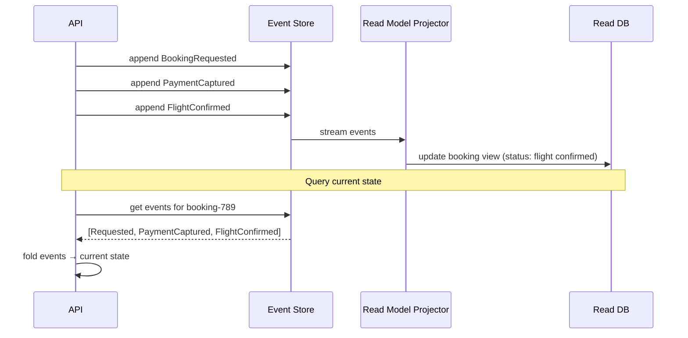

# 31. Event Sourcing

> **Think:** *"Can events become the source of truth?"*

---

## The 4 Questions

| Question | Answer |
|----------|--------|
| **What problem does it solve?** | Lost history — when you only store current state, you can't answer "what did this look like yesterday?", "who changed this?", or "replay from a bug." Event sourcing stores every state change as an immutable event. |
| **What happens if I ignore it?** | No audit trail, impossible debugging ("balance was ₹5000, now ₹3000 — what happened?"), can't rebuild state after corruption, and no time-travel for compliance or analytics. |
| **Where would I use it?** | Banking ledgers, order state machines, inventory systems, booking lifecycle, anywhere audit/compliance requires full history. |
| **What companies use it?** | LMAX (trading — pioneered it), Netflix (certain workflows), Uber (trip state), banks (account ledgers), Shopify (order events). |

---

## Mental Movie (60 seconds)

A user's **booking status** is "Confirmed." How did it get there?

**Traditional (current-state only):**
```
bookings table: { id: 789, status: "confirmed", hotel: "Treebo", total: 12499 }
```
That's it. You know the end state. You don't know it was Pending → PaymentProcessing → FlightConfirmed → HotelConfirmed → Confirmed. If status is wrong, you can't replay.

**Event sourcing:**
```
Event 1: BookingRequested    { hotel: Treebo, flight: AI-202, total: 12499 }
Event 2: PaymentCaptured     { amount: 12499, txn_id: pay-456 }
Event 3: FlightConfirmed     { pnr: ABC123 }
Event 4: HotelConfirmed      { confirmation: HT-789 }
Event 5: BookingConfirmed    { }
```
Current state = replay all events. Full history. Time-travel: replay up to Event 3 to see state after flight confirmed but before hotel.

That's the entire concept. Events are the database. Current state is a projection.

---

## How It Works

**Event sourcing** stores all changes to application state as a sequence of **immutable events** in an **event store**. The current state of an entity is derived by replaying its events.

```
Traditional:  state = row in database
Event Sourced: state = fold(all events for entity)
```

### Common Implementation Pattern



**Key ingredients:**
1. **Event store** — append-only log (EventStoreDB, Kafka, custom table)
2. **Events** — immutable, named past-tense (`PaymentCaptured`, not `CapturePayment`)
3. **Aggregates** — entity rebuilt by replaying its event stream
4. **Snapshots** — periodic state cache to avoid replaying 10,000 events
5. **Projections** — read models built by consuming the event stream (pairs with CQRS)

---

## Real-World Examples

### Your Travel Platform

**Scenario:** Booking lifecycle with full audit trail.

Event stream for `booking-789`:
```
1. BookingRequested     { user_id, package_id, passengers[] }
2. PaymentAuthorized    { amount: 45000, gateway_ref }
3. PaymentCaptured      { txn_id: txn-111 }
4. FlightConfirmed      { pnr: DEL-GOA-456, airline: IndiGo }
5. HotelConfirmed       { confirmation: TBO-789, check_in: Jan 15 }
6. CabScheduled         { pickup: 6 AM, provider: Ola }
7. BookingConfirmed     { }
--- 2 days later ---
8. CancellationRequested { reason: "change of plans", user_initiated: true }
9. HotelCancelled       { refund_policy: partial }
10. FlightCancelled     { cancellation_charge: 2500 }
11. RefundProcessed     { amount: 38500 }
12. BookingCancelled    { }
```

Support agent can replay events to answer: "Why was my refund ₹38,500 not ₹45,000?" Compliance can prove every state transition. Engineering can replay events to a test environment to reproduce a bug.

### Nykaa

**Scenario:** Order state machine with returns.

Nykaa's order events:
```
OrderPlaced → InventoryReserved → PaymentCaptured → OrderShipped →
OrderDelivered → ReturnRequested → ReturnApproved → RefundProcessed
```

Each event is immutable. If a bug causes wrong refund amount, engineers replay events to staging, fix the projection logic, and rebuild the read model — without touching production data.

### Amazon

**Scenario:** Account balance / gift card ledger.

Amazon's internal ledger systems are event-sourced. Every credit and debit is an event. Current balance = sum of all events. This is how banks work too — you don't "update balance to ₹5000"; you append `Deposit ₹3000` and `Withdrawal ₹1000` events.

---

## When To Use It

| Use event sourcing when... | Example |
|----------------------------|---------|
| Full audit trail is required | Banking, healthcare, compliance |
| You need time-travel debugging | "What was inventory at 3 PM yesterday?" |
| State is a sequence of transitions | Order status, booking lifecycle |
| Multiple read models from same events | User view, admin view, analytics |
| Replay/rebuild is valuable | Fix projection bug, migrate to new schema |

## When NOT To Use It

| Skip event sourcing when... | Why |
|-----------------------------|-----|
| Simple CRUD with no history needs | Massive complexity for no benefit |
| GDPR right-to-erasure conflicts | Immutable events are hard to delete |
| Team has no experience with it | Steep learning curve, subtle bugs |
| Queries are simple point lookups | "Get user by email" doesn't need events |
| Event store operational burden is too high | Another critical system to run |

---

## Event Sourcing vs Related Concepts

| Concept | Difference |
|---------|-----------|
| **Event-Driven Architecture** | EDA uses events for communication; event sourcing uses events as the *source of truth* for state |
| **CQRS** | Natural pairing — events update read models; but CQRS doesn't require event sourcing |
| **Audit Log** | Audit log is a side effect; event sourcing *is* the primary data store |
| **Change Data Capture (CDC)** | CDC captures DB changes as events; event sourcing never had a "current state" table as source of truth |
| **Transactions** | Event sourcing achieves consistency within an aggregate; cross-aggregate needs sagas |

**Rule of thumb:** Event sourcing when history *is* the data, not just a log of the data.

---

## Implementation Checklist

- [ ] Define aggregate boundaries (what entity owns which events)
- [ ] Events are immutable and past-tense named
- [ ] Version event schemas for evolution
- [ ] Implement snapshots for aggregates with long event streams
- [ ] Build projections for queryable read models
- [ ] Plan event retention and GDPR deletion strategy
- [ ] Idempotent projections (replay-safe)
- [ ] Monitor event store size, projection lag, snapshot frequency

---

## Problem Simulation

**Situation:** Your travel platform event-sources bookings. A bug in the `RefundProcessed` projection causes read model to show refund of ₹45,000 (full) when event says ₹38,500 (partial after cancellation charges).

1. 200 users see wrong refund amount in "My Trips"
2. Support gets 50 tickets: "Where's my remaining ₹6,500?"
3. The event store is correct — events say ₹38,500
4. Only the read model projection is wrong

**Questions:**
1. Do you fix the events or the projection?
2. How do you fix the read model for all 200 users?
3. How do you prevent this class of bug in the future?
4. A regulator asks: "Prove booking BK-789's refund calculation." What do you show?

<details>
<summary>Answers</summary>

1. **Fix the projection** — events are immutable and correct. Never mutate events to fix read model bugs.
2. **Replay events** — fix projection code, then replay all `RefundProcessed` events from the event store (or from a known good offset) to rebuild the read model. All 200 users fixed in one batch job.
3. **Test projections against event fixtures**, monitor projection vs event store reconciliation, run projection in staging with production event replay before deploy.
4. Show the event stream: `CancellationRequested` → `HotelCancelled { refund_policy: partial }` → `FlightCancelled { charge: 2500 }` → `RefundProcessed { amount: 38500 }`. Full auditable chain.

</details>

---

## Key Takeaway

Event sourcing makes your system's history a first-class citizen. Current state becomes a cache of the past — rebuildable, auditable, and replayable.

**Next:** [32 — Saga Pattern](./32-saga-pattern.md) — how do you coordinate failures across services?
