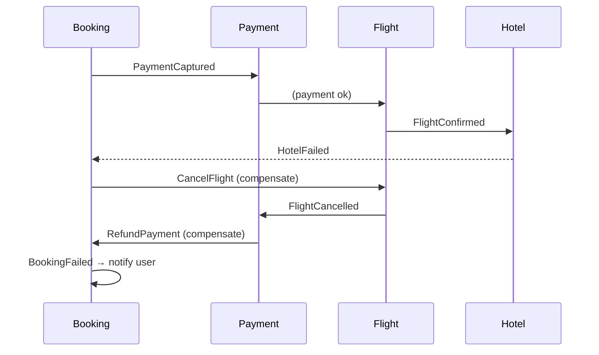
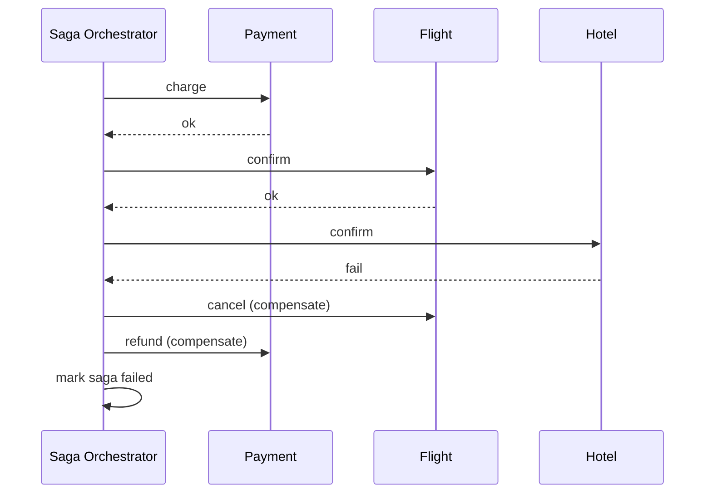

# 32. Saga Pattern

> **Think:** *"How do I undo distributed failures?"*

---

## The 4 Questions

| Question | Answer |
|----------|--------|
| **What problem does it solve?** | Distributed transactions — when a business operation spans multiple services (book flight, book hotel, charge payment), and one step fails after others succeeded, you need a way to undo or compensate without a single ACID database. |
| **What happens if I ignore it?** | Orphan bookings (flight confirmed, hotel failed, payment charged), manual cleanup by support, revenue leakage from unrefunded failed bookings, and data inconsistency across services. |
| **Where would I use it?** | Multi-step checkout (travel, ecommerce), order fulfillment pipelines, payment + inventory + shipping, any workflow crossing 3+ services. |
| **What companies use it?** | Uber (trip lifecycle), Amazon (order fulfillment), Airbnb (booking + payment + host notification), MakeMyTrip (multi-supplier packages), banks (transfer workflows). |

---

## Mental Movie (60 seconds)

User books **flight + hotel** on your travel platform. ₹32,000.

**Step 1:** Payment charged ✅  
**Step 2:** Flight confirmed ✅  
**Step 3:** Hotel API returns 503 ❌

Now what? You can't roll back a PostgreSQL transaction across three different services. The flight is booked. The money is captured. The hotel isn't.

**Without saga:** Support ticket. Manual refund. Manual flight cancellation. 48-hour resolution. User furious.

**With saga:** Automated compensation:
```
HotelFailed → trigger compensation:
  1. CancelFlight (compensating action for FlightConfirmed)
  2. RefundPayment (compensating action for PaymentCaptured)
  3. NotifyUser ("Booking failed, refund in 3-5 days")
```

Each step has a defined **compensating transaction** that semantically undoes the forward action.

That's the entire concept. Sagas coordinate multi-service workflows with explicit failure recovery.

---

## How It Works

A **saga** is a sequence of **local transactions**, each in a different service. If any step fails, previously completed steps run **compensating transactions** to restore consistency.

### Two Orchestration Styles

| Style | How it works | Trade-off |
|-------|--------------|-----------|
| **Choreography** | Each service listens for events and decides next step | Decoupled, but hard to trace |
| **Orchestration** | Central saga coordinator directs each step | Easier to reason about, single point of logic |

### Choreography Saga



### Orchestration Saga



**Key ingredients:**
1. **Compensating actions** — every forward step has a semantic undo (`CancelFlight`, `RefundPayment`)
2. **Saga state** — track which steps completed (saga log or orchestrator state machine)
3. **Idempotency** — compensation may run twice; must be safe
4. **Timeouts** — if step hangs, trigger compensation
5. **Not ACID** — eventual consistency; brief window where state is inconsistent

---

## Real-World Examples

### Your Travel Platform

**Scenario:** Package booking — flight + hotel + cab + insurance.

Forward saga:
```
1. AuthorizePayment     → 2. ConfirmFlight → 3. ConfirmHotel →
4. BookCab → 5. IssueInsurance → 6. ConfirmBooking
```

If step 3 fails:
```
Compensate: CancelFlight → RefundPayment → NotifyUser
```

If step 5 fails (insurance API down):
```
Compensate: CancelCab → CancelHotel → CancelFlight → RefundPayment
```

Each compensating action is idempotent. `CancelFlight` on an already-cancelled flight returns success.

### Nykaa

**Scenario:** Order with payment + inventory + warehouse.

Forward:
```
ReserveInventory → CapturePayment → CreatePickList → ConfirmOrder
```

If payment fails after inventory reserved:
```
Compensate: ReleaseInventory
```

If warehouse can't fulfill (item damaged):
```
Compensate: RefundPayment → ReleaseInventory → NotifyUser
```

Nykaa uses orchestration for checkout (deterministic flow) and choreography for post-order events (shipping updates, returns).

### Amazon

**Scenario:** Multi-item order from different sellers.

Amazon's fulfillment saga:
```
PlaceOrder → AllocateInventory (per seller) → ChargePayment →
CreateShipments → NotifySellers
```

If one seller can't fulfill:
```
Compensate: PartialCancel → PartialRefund → SplitShipment
```

Amazon doesn't use 2PC across sellers. Each seller is an independent saga branch with its own compensation.

---

## When To Use It

| Use sagas when... | Example |
|-------------------|---------|
| Business operation spans 3+ services | Travel package booking |
| You need failure recovery, not just retry | Hotel fails after flight confirmed |
| Distributed 2PC is too slow or unavailable | Cross-cloud supplier APIs |
| Each step has a clear semantic undo | Cancel booking, refund payment |
| Long-running workflows (minutes to days) | Order → ship → deliver → return window |

## When NOT To Use It

| Skip sagas when... | Why |
|--------------------|-----|
| All steps in one database | Use ACID transactions instead |
| No compensating action exists | "Send email" can't be unsent — design for idempotency instead |
| Strong consistency is mandatory | Sagas are eventually consistent |
| 2-step flow with sync APIs | Simple rollback logic may suffice |
| Team can't define compensation for every step | Incomplete saga = worse than no saga |

---

## Saga Pattern vs Related Concepts

| Concept | Difference |
|---------|-----------|
| **Distributed Transactions (2PC)** | 2PC locks resources until all agree; saga compensates after failure |
| **Event-Driven Architecture** | Sagas often implemented via events (choreography) |
| **Event Sourcing** | Saga state can be event-sourced; but sagas don't require it |
| **Retry** | Retry re-attempts the same step; saga compensates and moves to undo |
| **Idempotency** | Required for saga steps — compensation may run multiple times |

**Rule of thumb:** Saga when you need "all or nothing" across services, but can't use one database transaction.

---

## Implementation Checklist

- [ ] Define forward steps and compensating action for each
- [ ] Choose choreography vs orchestration (orchestration for complex flows)
- [ ] Saga state persistence (survive orchestrator crash)
- [ ] Idempotent forward and compensating actions
- [ ] Timeouts per step with automatic compensation trigger
- [ ] Monitor: saga completion rate, compensation rate, stuck sagas
- [ ] User-facing status during saga ("Confirming your booking...")
- [ ] Manual intervention path for stuck compensations

---

## Problem Simulation

**Situation:** Your travel platform runs an orchestrated saga for package bookings:

1. `ChargePayment` ✅
2. `ConfirmFlight` ✅
3. `ConfirmHotel` ❌ (503 timeout)
4. Saga triggers `CancelFlight` ✅
5. Saga triggers `RefundPayment` — payment gateway times out ❌
6. Saga orchestrator crashes during retry

User sees: "Booking failed." Bank statement shows: ₹32,000 charged. No flight PNR (cancelled). No hotel. Support ticket opened.

**Questions:**
1. What state is the saga in when the orchestrator crashes?
2. How does the system recover after orchestrator restart?
3. Should `RefundPayment` retry or is there a different strategy?
4. What does the user see, and what's the SLA?

<details>
<summary>Answers</summary>

1. **Partially compensated** — saga log shows: payment charged, flight confirmed, hotel failed, flight cancelled, refund pending/failed. This is a "stuck saga."
2. **Saga log replay** — orchestrator reads persisted saga state on startup, resumes from last incomplete step. Idempotent `RefundPayment` retry proceeds.
3. **Retry with exponential backoff** — refunds are critical but not instant. Also run a **reconciliation job** that periodically checks "charged but no confirmed booking" and triggers refund. Never rely solely on saga retry.
4. User sees: "Booking could not be completed. Refund of ₹32,000 initiated — expect 3–5 business days." SLA: auto-refund within 1 hour of detection; support escalation if refund not initiated within 24 hours.

</details>

---

## Key Takeaway

Sagas are distributed undo. They accept that failures happen mid-flow and define exactly how to roll back — service by service, with compensating actions instead of a magic rollback button.

**Next:** [33 — Dead Letter Queue](./33-dead-letter-queue.md) — where do messages go when compensation itself fails?
