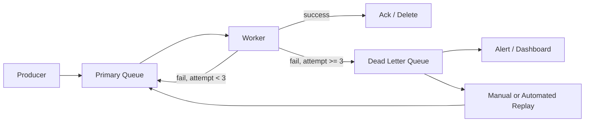

# 33. Dead Letter Queue

> **Think:** *"Where do failed jobs go?"*

---

## The 4 Questions

| Question | Answer |
|----------|--------|
| **What problem does it solve?** | Poison messages — jobs that fail repeatedly (bad data, code bug, incompatible schema) and block or slow the entire queue if retried forever. |
| **What happens if I ignore it?** | One bad message retries infinitely, consuming worker capacity, inflating queue lag, and hiding the real failure until a human notices hours later. |
| **Where would I use it?** | Any message queue consumer — order processing, webhook delivery, email sending, supplier API calls, event projections. |
| **What companies use it?** | Amazon (SQS DLQ), Azure (Service Bus dead lettering), Google (Pub/Sub dead letter topics), every serious queue-based system. |

---

## Mental Movie (60 seconds)

Your travel platform processes **500 booking confirmations/minute** via SQS. Workers call hotel APIs and update booking status.

A deployment introduces a bug: for hotels with `country_code: null`, the worker throws `NullPointerException`. Every affected message fails. SQS retries. Visibility timeout expires. Message returns. Worker picks it up. Fails again.

**Without DLQ:** That one poison message cycles forever. Worker spends 100% of its time failing on the same message. The other 499 bookings/minute pile up. Queue depth: 50,000. Users wait 2 hours for confirmation.

**With DLQ:** After 3 failed attempts, SQS moves the message to the Dead Letter Queue. Worker moves on to healthy messages. Alert fires: "DLQ depth > 0." Engineer inspects the poison message, fixes the bug, replays messages from DLQ.

That's the entire concept. DLQ is the parking lot for messages that can't be processed.

---

## How It Works

A **Dead Letter Queue (DLQ)** is a separate queue where messages land after exceeding a configured **max receive count** (retry limit) on the primary queue.

```
Primary Queue → Worker tries (attempt 1) → fail
             → Worker tries (attempt 2) → fail
             → Worker tries (attempt 3) → fail
             → Message moved to DLQ → Worker processes next message
```

### Common Implementation Pattern



**Key ingredients:**
1. **Max receive count** — typically 3–5 retries before DLQ
2. **Visibility timeout** — must be longer than max processing time
3. **Separate DLQ per primary queue** — don't mix poison messages from different flows
4. **Alerting** — DLQ depth > 0 should page someone
5. **Replay tooling** — move messages from DLQ back to primary after fix
6. **Poison message inspection** — log message body, error, stack trace on DLQ arrival

---

## Real-World Examples

### Your Travel Platform

**Scenario:** `ConfirmHotel` worker processes booking jobs.

Configuration:
```
Primary queue: hotel-confirmation-queue
DLQ: hotel-confirmation-dlq
Max receive count: 3
Visibility timeout: 60s
```

Poison message example:
```json
{
  "booking_id": "BK-4521",
  "hotel_id": "H-999",
  "check_in": "2025-13-45"  // invalid date — will never succeed
}
```

After 3 failures → DLQ. Alert to `#booking-alerts` Slack channel. Engineer sees invalid date, contacts user, fixes data, replays or discards.

### Nykaa

**Scenario:** Order fulfillment pipeline during sale.

Nykaa processes millions of order events. Common DLQ triggers:
- **Schema mismatch** — new event field after deploy, old consumer crashes
- **Downstream timeout** — warehouse API down for 30 min, all messages exhaust retries
- **Data corruption** — order with negative quantity from a race condition

DLQ dashboard shows: queue name, message count, oldest message age, sample payload. On-call engineer triages within 15 minutes during sale events.

### Amazon

**Scenario:** SQS-based internal service.

Amazon's operational practice: every SQS queue has a DLQ. CloudWatch alarm on `ApproximateNumberOfMessagesVisible > 0` on DLQ. Automated replay pipelines exist for known failure classes (transient downstream outage). Unknown failures go to human triage.

---

## When To Use It

| Use a DLQ when... | Example |
|---------------------|---------|
| You use any message queue | SQS, RabbitMQ, Kafka, Pub/Sub |
| Messages can fail permanently | Bad payload, missing reference data |
| Retries alone aren't enough | Bug won't fix itself on retry 47 |
| You need visibility into failures | DLQ = failure inbox |
| Workers must not block on poison messages | Keep processing healthy messages |

## When NOT To Use It

| Skip DLQ when... | Why |
|------------------|-----|
| Failure is always transient | Pure retry with backoff may suffice (but DLQ is still cheap insurance) |
| You process synchronously (no queue) | DLQ is a queue concept |
| Messages are ephemeral / loss is acceptable | Real-time metrics where gaps are OK |
| You have no replay or triage process | DLQ without monitoring = messages disappear into a black hole |

---

## Dead Letter Queue vs Related Concepts

| Concept | Difference |
|---------|-----------|
| **Retry** | Retry gives another chance; DLQ is where retries give up |
| **Circuit Breaker** | Circuit breaker stops calling a broken *service*; DLQ isolates a broken *message* |
| **Poison Message** | The problem; DLQ is the solution |
| **Saga compensation failure** | Failed compensation jobs should also go to DLQ for manual intervention |
| **Error queue / parking lot** | Same concept, different names |

**Rule of thumb:** Every production queue gets a DLQ. No exceptions.

---

## Implementation Checklist

- [ ] DLQ configured for every primary queue
- [ ] Max receive count set (3–5 typical)
- [ ] Visibility timeout > p99 processing time
- [ ] CloudWatch/monitoring alert on DLQ depth > 0
- [ ] Log message body + error on DLQ arrival (watch PII)
- [ ] Replay script or admin UI to move messages back to primary
- [ ] Runbook: "DLQ alert fired — what to do"
- [ ] Periodic DLQ review (weekly) even if no alerts

---

## Problem Simulation

**Situation:** Your travel platform's `ConfirmHotel` queue during Diwali rush:

- Primary queue depth: 8,000
- DLQ depth: 0
- Processing rate: 200/min
- You deploy a new worker version with a regression bug
- 15% of messages fail (hotels with special characters in name)
- Max receive count: 3

After 30 minutes:
- Primary queue depth: 12,000 (growing)
- DLQ depth: 1,200
- Users complaining: "Booked 45 minutes ago, no confirmation"

**Questions:**
1. Should you roll back the deploy immediately?
2. The 1,200 DLQ messages — are those bookings lost?
3. How do you recover after fixing the bug?
4. Should max receive count be 3 or 10?

<details>
<summary>Answers</summary>

1. **Yes, immediately** — roll back worker to previous version. 15% failure rate during rush is catastrophic. DLQ prevents total blockage but 1,200 failed bookings is unacceptable.
2. **No** — bookings exist in DB (payment charged, status "processing"). DLQ messages are *jobs*, not bookings. But those 1,200 bookings are stuck until jobs are replayed.
3. **Fix bug → deploy → replay DLQ to primary queue** (or dedicated replay worker that processes DLQ directly). Monitor replay rate. Send proactive SMS to affected users: "Confirmation delayed, we're processing."
4. **3 is fine** — with a bug, retry 10 vs 3 doesn't help; both end up in DLQ. Higher count just wastes worker cycles. For transient failures (supplier 503), 3–5 with exponential backoff is standard.

</details>

---

## Key Takeaway

A dead letter queue is your safety valve — poison messages get quarantined so the healthy pipeline keeps running. But a DLQ without alerts and replay is just a slower way to lose data.

**Next:** [34 — Distributed Transactions](./34-distributed-transactions.md) — the nuclear option most teams avoid.
