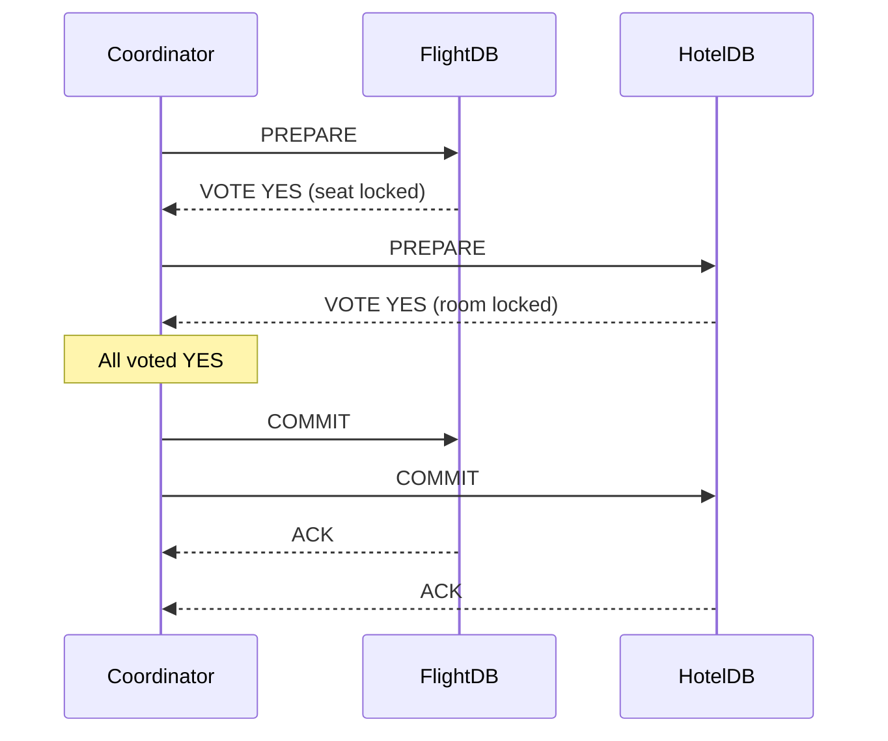

# 34. Distributed Transactions

> **Think:** *"How do multiple systems agree?"*

---

## The 4 Questions

| Question | Answer |
|----------|--------|
| **What problem does it solve?** | Cross-service consistency — when a single business operation must update multiple independent databases atomically ("all succeed or all fail"). |
| **What happens if I ignore it?** | Inconsistent state across services — money deducted but order not created, inventory decremented but payment failed, flight booked but hotel not. |
| **Where would I use it?** | Rarely in modern microservices. Sometimes within tightly coupled systems, legacy integrations, or financial core ledgers. Most teams use sagas + eventual consistency instead. |
| **What companies use it?** | Google (Spanner — global transactions), banks (core banking on single DB or 2PC), legacy enterprise (Java EE XA transactions). Amazon, Uber, Netflix largely **avoid** 2PC in favor of sagas. |

---

## Mental Movie (60 seconds)

User books **flight + hotel**. Two separate databases: FlightDB and HotelDB. You need both to commit or neither.

**The dream:** One transaction across both.
```
BEGIN GLOBAL TRANSACTION
  FlightDB: reserve seat 12A
  HotelDB: reserve room 305
COMMIT  -- both or neither
```

**The reality of 2PC (Two-Phase Commit):**
```
Phase 1 — Prepare:
  FlightDB: "Can you commit?" → "Yes, I've locked seat 12A"
  HotelDB: "Can you commit?" → "Yes, I've locked room 305"

Phase 2 — Commit:
  Coordinator: "COMMIT" → FlightDB commits, HotelDB commits
```

Sounds perfect. But:
- FlightDB holds a **lock** during Phase 1. HotelDB holds a **lock**.
- HotelDB is slow (network partition). FlightDB's lock waits. Other users can't book seat 12A.
- Coordinator crashes between Phase 1 and Phase 2. Both DBs are **blocked** until coordinator recovers.
- At scale: locks + coordinator = latency, availability risk, and operational nightmare.

**What most companies do instead:** Saga pattern (Topic 32) — charge payment, confirm flight, confirm hotel, compensate on failure. Eventual consistency, not atomic consistency.

That's the entire concept. Distributed transactions are possible but expensive; most architectures deliberately avoid them.

---

## How It Works

### Two-Phase Commit (2PC)

The classic distributed transaction protocol:

| Phase | What happens |
|-------|--------------|
| **Phase 1: Prepare** | Coordinator asks all participants "Can you commit?" Participants lock resources and vote YES/NO |
| **Phase 2: Commit/Abort** | If all YES → COMMIT everywhere. If any NO → ROLLBACK everywhere |



### Why 2PC Fails at Scale

| Problem | Impact |
|---------|--------|
| **Blocking** | Participants hold locks during prepare; slow participant blocks everyone |
| **Coordinator SPOF** | Coordinator crash leaves participants in limbo (in-doubt state) |
| **Latency** | Two round-trips minimum across network |
| **Availability** | CAP theorem — partition tolerance forces a choice; 2PC chooses consistency over availability |
| **No cross-cloud** | Suppliers (hotel APIs) will never participate in your 2PC |

### Modern Alternatives

| Approach | Consistency | Availability | Complexity |
|----------|-------------|--------------|------------|
| **2PC / XA** | Strong | Low (blocking) | Medium |
| **Saga** | Eventual | High | Medium |
| **TCC (Try-Confirm-Cancel)** | Eventual | High | High |
| **Single DB** | Strong | Medium | Low |
| **Spanner / CockroachDB** | Strong (global) | High | Very high (infra) |

---

## Real-World Examples

### Your Travel Platform

**Scenario:** Book flight + hotel + charge payment.

**Don't do this:**
```
BEGIN DISTRIBUTED TRANSACTION
  payment_db.charge(32000)
  flight_api.confirm(seat)
  hotel_api.confirm(room)
COMMIT
```
Hotel API is a third-party REST service. It will never join your 2PC.

**Do this (saga):**
```
1. ChargePayment (local transaction in payment_db)
2. ConfirmFlight (local transaction + API call)
3. ConfirmHotel (local transaction + API call)
-- on failure at step 3:
   Compensate: CancelFlight → RefundPayment
```

Each step is a **local transaction** in one service. Cross-service consistency is eventual, not atomic.

### Nykaa

**Scenario:** Order placement with inventory and payment.

Nykaa does NOT run 2PC across inventory, payment, and order services. Instead:
- Inventory reserved in inventory service (local ACID)
- Payment captured in payment service (local ACID)
- Order created in order service (local ACID)
- Saga orchestrator ensures compensation if any step fails
- Brief window where inventory is reserved but payment fails → compensation releases inventory

At their scale, 2PC would create lock contention across millions of concurrent checkouts.

### Amazon

**Scenario:** Order with items from 3 sellers.

Amazon does not use a global distributed transaction across seller inventory systems. Each seller's allocation is independent. Partial fulfillment, partial cancellation, and partial refunds are normal. The order service tracks overall state; sagas handle per-seller branches.

**Exception:** Amazon's internal systems on **DynamoDB** use conditional writes and idempotent operations within a single service boundary — not cross-service 2PC.

**Google Spanner** is the counter-example: globally distributed ACID transactions — but that's Google-level infrastructure investment, not a pattern for a startup travel platform.

---

## When To Use It

| Use distributed transactions when... | Example |
|--------------------------------------|---------|
| All participants are your own databases | Internal microservices on PostgreSQL with XA (rare) |
| Strong consistency is legally required | Core banking ledger (and even then, often single DB) |
| You have Spanner/CockroachDB | Global ACID without 2PC coordinator pain |
| Low throughput, high correctness | Financial settlement between two internal systems |

## When NOT To Use It

| Avoid distributed transactions when... | Why |
|----------------------------------------|-----|
| External APIs are involved | Third parties won't join your transaction |
| High throughput required | Locks don't scale |
| Microservices across teams | Coupling + availability risk |
| You can accept eventual consistency | Sagas are simpler and more available |
| You're building a travel/ecommerce platform | Saga + idempotency + DLQ is the industry standard |

---

## Distributed Transactions vs Related Concepts

| Concept | Difference |
|---------|-----------|
| **ACID Transactions** | ACID is within one database; distributed transactions span multiple |
| **Saga Pattern** | The practical alternative — compensate instead of rollback |
| **Eventual Consistency** | What you get when you avoid distributed transactions |
| **Idempotency** | Makes saga compensation safe; doesn't replace transactions |
| **TCC** | Try-Confirm-Cancel — business-level 2PC variant; still complex |

**Rule of thumb:** If you can solve it with a saga, don't use distributed transactions.

---

## Implementation Checklist

- [ ] Question whether you truly need cross-service atomicity (usually no)
- [ ] Prefer single-database transactions where possible
- [ ] If cross-service: implement saga with compensating actions
- [ ] Idempotent steps and compensations
- [ ] Reconciliation jobs for stuck/inconsistent states
- [ ] Monitor: orphaned transactions, compensation failures, DLQ depth
- [ ] Document consistency guarantees per user flow ("booking confirmed within 2 min")
- [ ] Only consider 2PC/Spanner if saga genuinely cannot meet requirements

---

## Problem Simulation

**Situation:** Your CTO proposes: "Let's use 2PC across our payment DB, flight service, and hotel service for atomic package bookings."

Architecture review questions:

1. The hotel supplier is a third-party REST API. Can they participate in 2PC?
2. During Diwali rush, 2,000 bookings/minute. What happens to flight seat locks during the prepare phase?
3. Your coordinator service crashes. Flight DB has locked seat 12A, hotel DB voted YES, coordinator is down. What can users book?
4. What's your counter-proposal?

<details>
<summary>Answers</summary>

1. **No** — external APIs don't support XA/2PC. This alone kills the proposal for travel platforms.
2. **Seat locks pile up** — each booking holds locks during prepare. Throughput collapses. Timeouts cascade. Users see "seat unavailable" for seats that are locked but not committed.
3. **In-doubt state** — seat 12A is locked but not committed. Other users can't book it. It stays locked until coordinator recovers and completes or aborts. This is the classic 2PC blocking problem.
4. **Saga orchestration:** (a) charge payment locally, (b) confirm flight, (c) confirm hotel, (d) compensate on failure. Pair with idempotency (Module 1), DLQ for stuck compensations, reconciliation job for "charged but not confirmed after 10 min." Accept eventual consistency with clear user messaging.

</details>

---

## Key Takeaway

Distributed transactions promise "all or nothing" across services — but the cost is locks, latency, and availability risk. The industry consensus: use local transactions + sagas + eventual consistency. Reserve distributed transactions for the rare case where you own every participant and can afford the trade-offs.

**Next:** [Module 6 — Infrastructure](../module-06-infrastructure/) — DNS, containers, and the plumbing that runs all of this in production.
