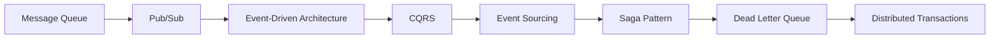

# Module 5: Distributed Systems

The magic behind Uber, Amazon, Airbnb.

> **Think like this:** *"Can work happen later? Who cares about this event? How do multiple systems agree when they can't share one database?"*

## Topics

| # | Topic | One-line mental model | Read time |
|---|-------|----------------------|-----------|
| 27 | [Message Queue](./27-message-queue.md) | "Can work happen later?" | ~12 min |
| 28 | [Pub/Sub](./28-pub-sub.md) | "Who cares about this event?" | ~12 min |
| 29 | [Event-Driven Architecture](./29-event-driven-architecture.md) | "Can events drive behavior?" | ~12 min |
| 30 | [CQRS](./30-cqrs.md) | "Should reads and writes be separate?" | ~12 min |
| 31 | [Event Sourcing](./31-event-sourcing.md) | "Can events become the source of truth?" | ~12 min |
| 32 | [Saga Pattern](./32-saga-pattern.md) | "How do I undo distributed failures?" | ~12 min |
| 33 | [Dead Letter Queue](./33-dead-letter-queue.md) | "Where do failed jobs go?" | ~12 min |
| 34 | [Distributed Transactions](./34-distributed-transactions.md) | "How do multiple systems agree?" | ~12 min |

## Suggested Learning Order

These eight concepts stack on each other:



1. **Message Queue** — decouple producers from consumers; process work asynchronously
2. **Pub/Sub** — one event, many interested subscribers
3. **Event-Driven Architecture** — services react to events instead of chaining synchronous calls
4. **CQRS** — separate read and write models for different optimization goals
5. **Event Sourcing** — store state changes as an immutable event log
6. **Saga Pattern** — coordinate multi-service workflows with compensating actions
7. **Dead Letter Queue** — isolate poison messages that block the pipeline
8. **Distributed Transactions** — the hard problem of consistency across services (and why most teams avoid it)

## Module Simulation

After finishing all 8 topics, run this scenario (answers at bottom of each topic doc):

> **Saturday 9 AM.** A user books a Delhi → Bali package on your travel platform: flight, hotel, airport transfer, travel insurance. Payment succeeds. The flight API confirms. The hotel API times out. Meanwhile, Nykaa runs a flash sale — 500K orders in 10 minutes. Amazon's warehouse system processes a return that must update inventory, refund payment, and notify the seller — all across different services.

Trace the flow through each concept. Where does a message queue absorb the spike? Where does pub/sub fan out notifications? Where would a saga compensate for the failed hotel booking? Where does a dead letter queue catch the poison message? Why wouldn't you use a distributed transaction for the whole checkout?

## PDFs

Generated PDFs live in [pdf/](./pdf/). Regenerate:

```bash
python3 md_to_pdf.py --dir learning/module-05-distributed-systems --force
```

## Next Module

**[Module 6: Infrastructure](../module-06-infrastructure/)** — DNS, reverse proxy, SSL/TLS, containers, orchestration, and CI/CD — the plumbing that keeps distributed systems running in production.
