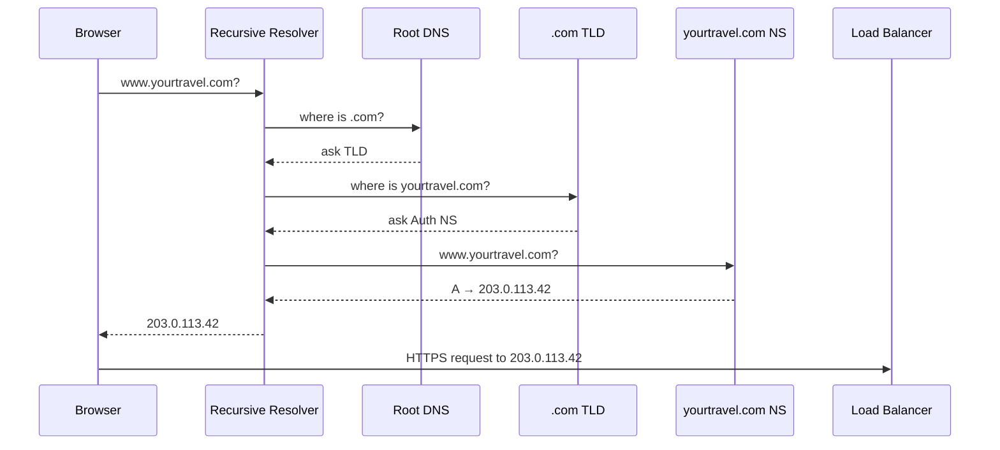

# 35. DNS

> **Think:** *"How does a domain find a server?"*

---

## The 4 Questions

| Question | Answer |
|----------|--------|
| **What problem does it solve?** | Humans remember names (`makemytrip.com`), computers need IP addresses (`103.21.244.0`). DNS is the phonebook of the internet — it translates domain names to the servers that actually run your application. |
| **What happens if I ignore it?** | Users can't reach your site after a server migration. Failover takes hours instead of minutes. CDN and load balancer changes require telling every customer your new IP. One wrong TTL and you're debugging "it works on my machine" globally. |
| **Where would I use it?** | Every public website, API, mobile app backend, email delivery (MX records), CDN routing, multi-region failover, staging vs production environments. |
| **What companies use it?** | Cloudflare (DNS + security), AWS Route 53 (health-checked routing), Google (public DNS resolver), GoDaddy/Namecheap (registrar + DNS hosting), Amazon (Route 53 for aws.amazon.com failover). |

---

## Mental Movie (60 seconds)

User types **`www.yourtravel.com`** in Chrome. They don't type an IP address. They shouldn't have to.

**Behind the scenes:** Browser asks "what IP is `www.yourtravel.com`?" DNS responds `203.0.113.42`. Browser connects to that IP. Your reverse proxy receives the request.

**You migrate servers** from `203.0.113.42` to `198.51.100.10`. You update one DNS A record. Within minutes (or hours, depending on TTL), every user worldwide starts hitting the new server. No app update. No email to users.

**You get it wrong:** TTL is 24 hours. Half your users still hit the old dead server until tomorrow. Support tickets flood in. "Site is down" — but only for some people, in some cities.

That's DNS. Invisible when it works. Painful when it doesn't.

---

## How It Works

**DNS (Domain Name System)** is a distributed hierarchy that maps human-readable names to machine-readable records.

```
User types: www.yourtravel.com
     ↓
Browser cache → OS cache → Recursive resolver (ISP/8.8.8.8)
     ↓
Root (.com) → TLD nameserver → yourtravel.com nameserver
     ↓
Answer: A record → 203.0.113.42
```

### Common Record Types

| Record | Purpose | Example |
|--------|---------|---------|
| **A** | Domain → IPv4 address | `www` → `203.0.113.42` |
| **AAAA** | Domain → IPv6 address | `www` → `2001:db8::1` |
| **CNAME** | Alias to another name | `api` → `lb.aws.example.com` |
| **MX** | Mail server | `@` → `mail.google.com` |
| **TXT** | Verification, SPF, DKIM | Domain ownership proof |
| **NS** | Which nameservers are authoritative | `ns1.cloudflare.com` |

### Common Resolution Flow



**Key ingredients:**
1. **TTL (Time To Live)** — how long resolvers cache the answer (60s–86400s). Low TTL = faster changes, more DNS queries.
2. **Authoritative nameservers** — the source of truth for your domain's records
3. **Recursive resolver** — does the lookup chain on behalf of the client (Google 8.8.8.8, Cloudflare 1.1.1.1)
4. **Health-checked routing** — Route 53 / Cloudflare can return different IPs based on endpoint health
5. **GeoDNS** — return different IPs based on user location (India users → Mumbai, US users → Virginia)

---

## Real-World Examples

### Your Travel Platform

**Scenario:** You run `yourtravel.com` on AWS Mumbai. Peak season hits. You add a CDN and a load balancer.

```
Before:  www.yourtravel.com  →  A  →  203.0.113.42 (single EC2)
After:   www.yourtravel.com  →  CNAME → d1234.cloudfront.net
         api.yourtravel.com  →  CNAME → your-alb.ap-south-1.elb.amazonaws.com
```

When you scale from 2 to 20 servers behind the ALB, **DNS doesn't change** — only the load balancer's internal targets change. Users always hit the same domain.

**Failover scenario:** Primary region dies. You update Route 53 health checks to route `api.yourtravel.com` to the Singapore DR region. TTL of 60 seconds means most users recover within 2 minutes.

### Nykaa

**Scenario:** Flash sale — 10× traffic. Nykaa uses CDN + DNS to route users to edge servers.

- `www.nykaa.com` resolves to CDN edge nodes (not origin servers)
- DNS geo-routing sends North India users to Delhi edge, South to Bangalore
- Origin servers stay hidden behind CNAMEs — attackers can't DDoS the raw IP

During a sale, DNS is the first line of defense. Wrong TTL during a CDN migration = partial outage for hours.

### Amazon

**Scenario:** `amazon.in` must survive datacenter failures globally.

Amazon uses sophisticated DNS:
- Multiple A/AAAA records with health checks
- Latency-based routing (user gets fastest region)
- Failover policies (primary unhealthy → secondary region)
- Internal DNS (Route 53 Private Hosted Zones) for service-to-service discovery inside AWS

When you see "amazon.in is down" on Twitter but it works for you — that's often DNS propagation, regional routing, or CDN edge cache differences.

---

## When To Use It

| Use DNS thoughtfully when... | Example |
|------------------------------|---------|
| You have a public-facing product | Any website or API |
| You need failover between regions | DR switch from Mumbai to Singapore |
| You integrate CDN or load balancer | CNAME to CloudFront / ALB |
| You run multiple environments | `staging.yourtravel.com` vs `www.yourtravel.com` |
| You need email deliverability | MX, SPF, DKIM TXT records |

## When NOT To Use It

| Skip over-engineering DNS when... | Why |
|-----------------------------------|-----|
| You're on a single server with no failover plans | Default registrar DNS is fine for MVP |
| You need sub-millisecond service discovery inside a cluster | Use Kubernetes services / Consul, not public DNS |
| You're trying to do A/B testing at DNS layer | DNS is coarse and cached — use reverse proxy or feature flags |
| You change infrastructure hourly | DNS TTL caching makes rapid switching painful |
| Internal microservices talk to each other | Service mesh or internal DNS, not public A records |

---

## DNS vs Related Concepts

| Concept | Difference |
|---------|-----------|
| **CDN** | DNS points users to CDN edge; CDN fetches from origin. DNS is the pointer, CDN is the cache. |
| **Load Balancer** | DNS often points to LB hostname; LB distributes to backends. DNS = one address, LB = many servers. |
| **Reverse Proxy** | Sits at the IP DNS resolves to. DNS gets you there; proxy routes inside. |
| **Failover** | DNS failover reroutes at the name level; app failover handles logic after connection. |

**Rule of thumb:** DNS is for **naming and routing users to the front door**. Don't use it for fine-grained traffic shaping — that's the reverse proxy's job.

---

## Implementation Checklist

- [ ] Use a managed DNS provider (Route 53, Cloudflare) — not your web server's DNS
- [ ] Set TTL based on change frequency (300s for prod that may failover; 60s during migrations)
- [ ] Point `www` via CNAME to load balancer/CDN, not direct server IP
- [ ] Configure health checks for multi-region failover
- [ ] Document all records (MX, TXT for email; don't break mail during migrations)
- [ ] Use separate subdomains for staging (`staging.api.yourtravel.com`)
- [ ] Monitor DNS resolution time and propagation after changes

---

## Problem Simulation

**Situation:** Your travel platform migrates from a single EC2 instance to an AWS Application Load Balancer. Current DNS:

```
www.yourtravel.com  →  A  →  203.0.113.42  (TTL: 86400)
```

You update to:

```
www.yourtravel.com  →  CNAME  →  your-alb.ap-south-1.elb.amazonaws.com  (TTL: 86400)
```

At 2 PM you make the change. By 3 PM, support reports: "Half our users see the old site, half see errors."

**Questions:**
1. Why are only *some* users affected?
2. What should you have done with TTL *before* the migration?
3. A user in Delhi resolves to the old IP. Your old server is shut down. What error do they see?
4. Should you flush DNS cache globally? Can you?

<details>
<summary>Answers</summary>

1. **DNS caching** — TTL of 86400 (24 hours) means resolvers worldwide cache the old A record. Users who looked up the domain recently still have `203.0.113.42` cached.
2. **Lower TTL to 60–300 seconds** at least 24–48 hours *before* the migration. Wait for old TTL to expire, then make the change. Fast propagation on switch day.
3. **Connection refused / timeout** — browser connects to a dead IP. No SSL error, no 404 — the TCP connection itself fails. Looks like "site is down."
4. **No** — you cannot flush global DNS caches. You control only your authoritative records and TTL. Fix: keep old server running as a redirect/proxy until old TTL expires, or accept gradual migration.

</details>

---

## Key Takeaway

DNS is the internet's address book. Every request starts here. Get TTL, failover, and CNAME structure right once — or spend every migration firefighting "it works for me but not for my customer in Chennai."

**Next:** [36 — Reverse Proxy](./36-reverse-proxy.md) — who stands in front of your application once DNS delivers the user?
