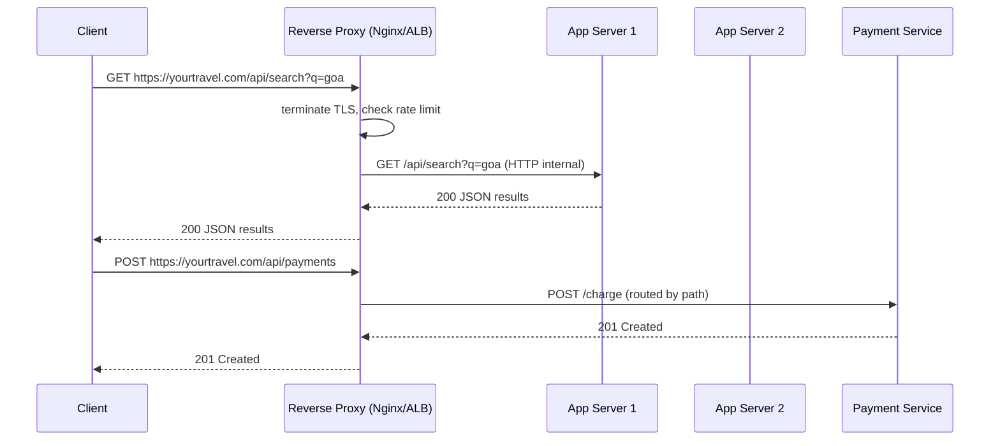

# 36. Reverse Proxy

> **Think:** *"Who stands in front of my application?"*

---

## The 4 Questions

| Question | Answer |
|----------|--------|
| **What problem does it solve?** | Clients shouldn't talk directly to your app servers. A reverse proxy sits in front — terminating SSL, routing requests, load balancing, caching, rate limiting, and hiding your internal architecture. |
| **What happens if I ignore it?** | Every app server handles SSL, routing, and security independently. You expose internal IPs. Scaling means reconfiguring clients. One slow endpoint blocks the whole server. No central place to enforce rate limits or WAF rules. |
| **Where would I use it?** | Any production web app or API with multiple backend instances — Nginx, AWS ALB/NLB, Cloudflare, HAProxy, Envoy, API Gateway. |
| **What companies use it?** | Netflix (Zuul/Envoy), Cloudflare (global reverse proxy + CDN), Amazon (ALB in front of every service), Nykaa (CDN + load balancer in front of origin), Uber (Envoy service mesh at edge). |

---

## Mental Movie (60 seconds)

A million users hit **`www.yourtravel.com`**. Behind the scenes you have 12 app servers, a payments microservice, and a static assets bucket.

**Without a reverse proxy:** Each server needs its own SSL cert. Users somehow need to know which server to hit. `/api/payments` and `/api/search` live on different machines — how does the browser know?

**With a reverse proxy:** Every request goes to **one front door** (the proxy). The proxy:
- Terminates HTTPS
- Routes `/api/payments/*` → payment service pool
- Routes `/api/search/*` → search service pool
- Serves `/static/*` from cache
- Blocks request #101 from a scraper in 1 second

Your app servers only see internal HTTP. They don't know or care how many users exist.

That's the entire concept. The proxy is the bouncer, traffic cop, and receptionist.

---

## How It Works

A **reverse proxy** receives client requests on behalf of backend servers. "Reverse" because it proxies *toward* servers (vs a forward proxy that proxies *for* clients, like a corporate VPN).

```
Client → Reverse Proxy → Backend Server 1
                      → Backend Server 2
                      → Backend Server 3
```

### Common Implementation Pattern



**Key ingredients:**
1. **SSL/TLS termination** — proxy handles HTTPS; backends use plain HTTP on private network
2. **Path/host-based routing** — `/api/*` → API cluster, `www.*` → web cluster
3. **Load balancing** — round-robin, least-connections, or weighted across healthy backends
4. **Health checks** — proxy stops sending traffic to dead backends
5. **Caching** — serve static assets and cacheable API responses without hitting origin
6. **Security** — WAF, DDoS protection, IP allowlists, request size limits

---

## Real-World Examples

### Your Travel Platform

**Scenario:** Architecture after Series A — 8 API servers, 2 payment servers, Redis, PostgreSQL.

```
Internet → AWS ALB → Target Group "api" (8 instances)
                  → Target Group "payments" (2 instances, stricter rate limits)
                  → S3 (static assets via CloudFront)
```

Nginx/ALB config conceptually:
- `yourtravel.com/api/v1/search` → search pool (stateless, scales to 20)
- `yourtravel.com/api/v1/book` → booking pool (fewer instances, circuit breaker on supplier calls)
- `yourtravel.com/health` → returns 200 without hitting DB (used by ALB health check)

**Without reverse proxy:** You'd expose 8 public IPs. SSL cert on each. No path-based routing. Nightmare.

### Nykaa

**Scenario:** Product catalog images + checkout API.

Nykaa's edge stack:
- Cloudflare/CDN reverse proxy caches product images (millions of requests never hit origin)
- Dynamic cart/checkout routes bypass cache, hit origin through load balancer
- Rate limiting at proxy layer during flash sales — abusive IPs throttled before touching databases

The reverse proxy is why Nykaa can serve a product page in 200ms while the origin would take 2 seconds.

### Amazon

**Scenario:** `amazon.in` product page request.

Your browser hits Amazon's edge (CloudFront + custom proxy layer). The reverse proxy:
- Routes to the correct regional origin
- Applies bot detection
- May serve cached fragments (product image, static HTML shell)
- Forwards dynamic parts (price, availability) to internal services

Amazon runs thousands of backend services. Users never connect to any of them directly — always through layers of proxies and gateways.

---

## When To Use It

| Use a reverse proxy when... | Example |
|-----------------------------|---------|
| You have more than one backend instance | Load balance across 3+ app servers |
| You need SSL termination in one place | One cert on Nginx, not on every pod |
| Different paths go to different services | `/api` vs `/admin` vs `/static` |
| You want caching at the edge | Product images, JS bundles |
| You need centralized rate limiting / WAF | Block scrapers before they hit your DB |
| You want to hide internal topology | Backend IPs never exposed to internet |

## When NOT To Use It

| Skip a reverse proxy when... | Why |
|------------------------------|-----|
| Single local dev server | `localhost:3000` doesn't need Nginx |
| Internal service-to-service calls inside a VPC | Use service mesh or direct internal DNS |
| Ultra-low-latency HFT-style systems | Extra hop adds milliseconds |
| You're adding a proxy "just because" with one server | YAGNI until you need routing or SSL centralization |
| WebSocket-heavy app without proper proxy config | Need sticky sessions or WebSocket-aware proxy |

---

## Reverse Proxy vs Related Concepts

| Concept | Difference |
|---------|-----------|
| **Load Balancer** | Often the same box — ALB is a reverse proxy + load balancer. Pure LB may only distribute; proxy adds routing, caching, SSL. |
| **CDN** | CDN is a reverse proxy optimized for caching static content at edge locations globally. |
| **API Gateway** | Specialized reverse proxy for APIs — auth, throttling, request transformation, API keys. |
| **Forward Proxy** | Sits in front of *clients* (corporate proxy). Reverse proxy sits in front of *servers*. |

**Rule of thumb:** If users hit your infrastructure on the public internet, something should stand in front of your app servers. That something is a reverse proxy.

---

## Implementation Checklist

- [ ] Terminate TLS at the proxy (not on every backend)
- [ ] Configure health check endpoints (`/health`, `/ready`)
- [ ] Set appropriate timeouts (proxy timeout > app timeout > DB timeout)
- [ ] Enable access logs for debugging and security audits
- [ ] Configure rate limiting for public APIs
- [ ] Set `X-Forwarded-For` / `X-Real-IP` headers so backends know real client IP
- [ ] Don't cache personalized or authenticated responses by default
- [ ] Test WebSocket/SSE if your app uses them

---

## Problem Simulation

**Situation:** Your travel platform runs 6 API servers behind an AWS ALB. Deployment day: you deploy v2.3 to all 6 servers. v2.3 has a bug — `/api/v1/search` returns 500 for any query containing Hindi characters.

1. ALB health check: `GET /health` → 200 (doesn't exercise search)
2. Traffic is round-robin across all 6 servers
3. 40% of your users search in Hindi

**Questions:**
1. Why does the ALB still consider all servers "healthy"?
2. What should the health check do instead?
3. A product manager asks: "Can we route Hindi searches to v2.2 servers only?" Is that a reverse proxy concern?
4. How would a reverse proxy help you roll back in 60 seconds?

<details>
<summary>Answers</summary>

1. **Shallow health check** — `/health` doesn't test the broken code path. Servers pass health check but fail real user requests.
2. **Deep health checks** or **synthetic monitoring** — periodically run representative queries (including Hindi search) and mark unhealthy on failure. Or use canary requests in health check.
3. **Yes, path/header-based routing** — proxy can route based on `Accept-Language`, query params, or headers. Unusual for rollback but valid for canary testing. Better: route 5% traffic to canary pool.
4. **Drain and swap** — deregister v2.3 targets from ALB, register v2.2 targets (or switch target group). Proxy stops sending traffic to bad backends within seconds. Without proxy, you'd need DNS changes or client updates.

</details>

---

## Key Takeaway

The reverse proxy is your application's front door. It handles the cross-cutting concerns — SSL, routing, load balancing, caching, protection — so your app code can focus on business logic.

**Next:** [37 — SSL/TLS](./37-ssl-tls.md) — how is communication protected between the user and that front door?
