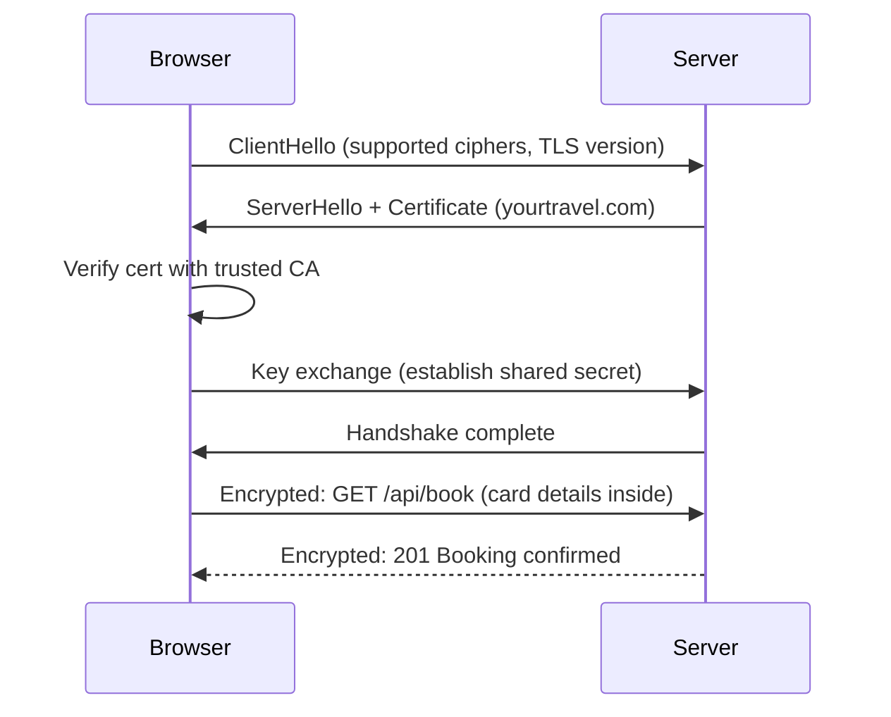

# 37. SSL/TLS

> **Think:** *"How is communication protected?"*

---

## The 4 Questions

| Question | Answer |
|----------|--------|
| **What problem does it solve?** | Data traveling over the internet can be intercepted, read, or modified. SSL/TLS encrypts the connection between client and server so passwords, payment details, and session tokens can't be stolen in transit. |
| **What happens if I ignore it?** | Browsers show "Not Secure." Users abandon checkout. PCI-DSS compliance fails. Man-in-the-middle attacks steal credentials on public WiFi. Google downranks your site. Regulators fine you for mishandling personal data. |
| **Where would I use it?** | Every production website, API, mobile app backend, admin panel, webhook endpoint — anywhere user data or authentication crosses a network. |
| **What companies use it?** | Let's Encrypt (free automated certs), Cloudflare (universal SSL), Amazon (ACM for AWS services), Stripe (TLS 1.2+ required for all API calls), every bank and ecommerce site on earth. |

---

## Mental Movie (60 seconds)

User connects to café WiFi at Mumbai airport. They log into **yourtravel.com** and enter card details for a ₹62,000 Bali package.

**Without TLS (HTTP):** Every byte — email, password, card number — travels as plain text. Anyone on the same WiFi with Wireshark sees everything. A rogue hotspot impersonates your site. User has no way to know.

**With TLS (HTTPS):** Connection starts with a cryptographic handshake. Browser verifies the server's certificate ("yes, this is really yourtravel.com"). All data encrypted. Even if intercepted, it's gibberish. Browser shows the padlock.

User doesn't think about it. They shouldn't have to. But without it, your travel platform is one coffee-shop session away from a data breach headline.

---

## How It Works

**TLS (Transport Layer Security)** — successor to SSL — encrypts data in transit and authenticates the server (and optionally the client).

```
HTTP  = Hypertext Transfer Protocol        (plain text)
HTTPS = HTTP over TLS                      (encrypted)
```

### The TLS Handshake (simplified)



**Key ingredients:**
1. **Certificate** — proves server identity, issued by a Certificate Authority (CA)
2. **Public/private key pair** — asymmetric crypto for handshake; symmetric key for bulk data
3. **Certificate chain** — your cert → intermediate CA → root CA (browser trusts root)
4. **TLS version** — use TLS 1.2 or 1.3; disable SSLv3, TLS 1.0, TLS 1.1
5. **Cipher suites** — algorithms for encryption; prefer strong, modern ciphers
6. **Certificate expiry** — certs expire (typically 90 days with Let's Encrypt); auto-renewal is mandatory

### Where TLS Terminates

```
Option A: Browser → TLS → App Server (TLS on every backend)
Option B: Browser → TLS → Reverse Proxy → HTTP → App Server (common in production)
Option C: Browser → TLS → CDN → TLS → Origin (end-to-end or CDN-to-origin)
```

---

## Real-World Examples

### Your Travel Platform

**Scenario:** Launching payments for international packages.

Requirements:
- HTTPS on `www.yourtravel.com` and `api.yourtravel.com`
- TLS 1.2+ (payment gateway requirement)
- Valid certificate trusted by all browsers
- HSTS header to prevent downgrade attacks

Setup with AWS:
```
ACM (AWS Certificate Manager) → free cert for *.yourtravel.com
ALB terminates TLS → backends use HTTP on private subnet
Auto-renewal handled by ACM
```

**Common mistake:** Cert expires on a Saturday. Nobody gets paged. Site shows `NET::ERR_CERT_DATE_INVALID`. Bookings drop to zero until someone manually renews.

### Nykaa

**Scenario:** Millions of users enter addresses, phone numbers, and payment info daily.

Nykaa enforces:
- HTTPS everywhere (HTTP redirects to HTTPS)
- HSTS preload (browser always uses HTTPS, even on first visit)
- PCI-DSS compliance for card data — TLS is table stakes, not optional
- Certificate managed at CDN/load balancer layer, not on individual app servers

During a cert misconfiguration (wrong intermediate chain), **Android browsers break while desktop works** — support chaos until fixed.

### Amazon

**Scenario:** Every Amazon page, API call, and Alexa request uses TLS.

Amazon's practices:
- ACM and internal PKI for millions of certificates
- TLS 1.3 preferred for performance (fewer round trips)
- Certificate transparency logs for monitoring unauthorized certs
- mTLS (mutual TLS) for internal service-to-service communication in AWS

When you see a phishing site "amazonn.in" — it may have HTTPS too (anyone can get a cert). TLS encrypts the connection; it doesn't prove the site is legitimate. Users must check the domain name.

---

## When To Use It

| Use TLS when... | Example |
|-----------------|---------|
| Any user data crosses a network | Login, checkout, profile pages |
| You handle payments | PCI-DSS requires encrypted transmission |
| You have authentication cookies | Prevent session hijacking |
| APIs are called over the internet | Mobile app → backend API |
| SEO matters | Google ranks HTTPS sites higher |
| Regulatory compliance applies | GDPR, RBI guidelines for fintech |

## When NOT To Use It

| TLS nuance (not "skip entirely")... | Why |
|-------------------------------------|-----|
| Internal service-to-service in a trusted VPC | May use plain HTTP or mTLS depending on threat model — still encrypt in zero-trust setups |
| Local development | `localhost` HTTP is fine; use self-signed or mkcert for HTTPS testing |
| High-throughput internal east-west traffic | TLS adds CPU overhead — terminate at mesh boundary, not every hop |
| Legacy embedded devices that can't do TLS 1.2 | Real constraint in IoT — use gateway or firmware updates |

**Note:** "When NOT to use" doesn't mean "ship HTTP to users." It means understand where encryption terminates.

---

## SSL/TLS vs Related Concepts

| Concept | Difference |
|---------|-----------|
| **SSL** | Older protocol (SSL 3.0 deprecated). People say "SSL" but mean TLS. |
| **HTTPS** | HTTP wrapped in TLS. The user-visible version. |
| **mTLS** | Both client and server present certificates. Used for service-to-service auth. |
| **DNS** | Gets user to your IP. TLS secures the connection after they arrive. |
| **Reverse Proxy** | Often where TLS terminates in production architectures. |

**Rule of thumb:** If a user can see it in a browser or mobile app, it's HTTPS. No exceptions in production.

---

## Implementation Checklist

- [ ] HTTPS on all public endpoints (redirect HTTP → HTTPS)
- [ ] Use TLS 1.2+ only; disable weak protocols and ciphers
- [ ] Automated certificate renewal (Let's Encrypt + certbot, or ACM)
- [ ] Enable HSTS (`Strict-Transport-Security` header)
- [ ] Full certificate chain configured (leaf + intermediates)
- [ ] Monitor cert expiry (alert 30 days before)
- [ ] Use strong key size (RSA 2048+ or ECDSA P-256)
- [ ] For APIs: enforce HTTPS, reject plain HTTP at load balancer

---

## Problem Simulation

**Situation:** Your travel platform's SSL certificate expires tonight at midnight. The DevOps engineer is on vacation. At 12:01 AM:

1. Users see browser warning: "Your connection is not private"
2. Mobile app API calls fail (app pins certificate or rejects invalid cert)
3. Google Ads disapproves landing pages
4. Payment gateway webhooks to `https://api.yourtravel.com/webhooks/stripe` fail

**Questions:**
1. Why do mobile apps break harder than browsers?
2. Can Cloudflare or your CDN keep the site up if origin cert expires?
3. What's the minimum fix at 12:30 AM?
4. What process prevents this from ever happening again?

<details>
<summary>Answers</summary>

1. **Certificate pinning** — mobile apps may embed expected cert/public key. Browsers let users click "proceed anyway" (some do); apps often hard-fail. Webhooks from Stripe also reject invalid certs.
2. **Depends on setup** — if CDN terminates TLS with its own valid cert (Cloudflare proxy mode), users may still reach CDN but origin fetch may fail for dynamic content. Not a reliable safety net.
3. **Emergency cert issuance** — use ACM (instant for AWS) or Let's Encrypt certbot on the load balancer. Deploy new cert. Takes 15–30 min if you know the process. No code deploy needed.
4. **Automated renewal** (ACM, certbot cron) + **expiry monitoring** (PagerDuty alert 30 days out) + **runbook** documented + **staging environment** that uses same cert pipeline.

</details>

---

## Key Takeaway

TLS is not a feature — it's the baseline. Users trust you with their data. HTTPS is how you earn that trust on the wire. Automate cert renewal or it *will* expire at the worst possible time.

**Next:** [38 — Containers](./38-containers.md) — can your application run the same everywhere once the connection is secure?
