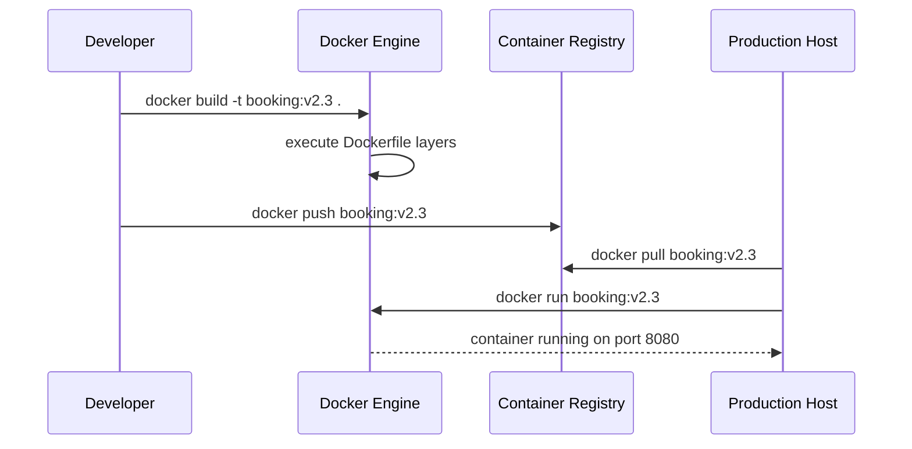

# 38. Containers

> **Think:** *"Can software run the same everywhere?"*

---

## The 4 Questions

| Question | Answer |
|----------|--------|
| **What problem does it solve?** | "It works on my machine" — dev runs Python 3.11, staging has 3.9, production has 3.10. Dependencies conflict. Containers package your app + runtime + libraries into one portable unit that runs identically everywhere. |
| **What happens if I ignore it?** | Deployments break due to environment drift. Onboarding takes days ("install these 14 things"). Scaling means manual server setup. Rollbacks are "hope the old server still exists." Reproducing production bugs locally is guesswork. |
| **Where would I use it?** | Microservices, CI/CD pipelines, cloud deployments, local dev that mirrors production — any team shipping software to multiple environments. |
| **What companies use it?** | Docker (the standard format), Amazon (ECS/EKS run containers), Google (GKE, everything at Google runs in containers), Spotify (Helm + Kubernetes), Nykaa and most Indian unicorns post-2018. |

---

## Mental Movie (60 seconds)

Your travel platform's booking service runs on a developer's MacBook. Works perfectly. They deploy to the staging server. **Crash** — `libpq.so.5: cannot open shared object file`.

**The old way:** SSH into server. Install packages. Pray versions match. Document in a wiki nobody reads.

**With containers:** Developer writes a `Dockerfile`:

```
FROM python:3.11-slim
COPY requirements.txt .
RUN pip install -r requirements.txt
COPY . /app
CMD ["uvicorn", "main:app", "--host", "0.0.0.0"]
```

Build once → image `booking-service:v2.3`. Run on laptop, CI server, staging, production — **same image, same behavior**.

That's the entire concept. The container is a shipping crate for your software.

---

## How It Works

A **container** is a lightweight, isolated process that shares the host OS kernel but has its own filesystem, network, and process space.

```
┌─────────────────────────────────────┐
│  Container: booking-service:v2.3    │
│  ┌───────────────────────────────┐  │
│  │ App code + Python 3.11        │  │
│  │ + pip packages + config       │  │
│  └───────────────────────────────┘  │
└─────────────────────────────────────┘
           Host OS Kernel (Linux)
```

**Container vs Virtual Machine:**

| | Container | Virtual Machine |
|---|-----------|-----------------|
| **Includes** | App + dependencies | App + full OS |
| **Startup** | Seconds | Minutes |
| **Size** | MBs | GBs |
| **Isolation** | Process-level | Hardware-level |
| **Use case** | App packaging | Multi-tenant, different OS |

### Build and Run Flow



**Key ingredients:**
1. **Dockerfile** — recipe to build the image (base image, install deps, copy code, start command)
2. **Image** — immutable snapshot (layers cached for fast rebuilds)
3. **Container** — running instance of an image
4. **Registry** — storage for images (Docker Hub, ECR, GCR)
5. **Volume** — persistent storage mounted into container (DB data survives container restart)
6. **Environment variables** — config without baking secrets into the image

---

## Real-World Examples

### Your Travel Platform

**Scenario:** Microservices — search, booking, payments, notifications.

```
travel-platform/
├── search-service/Dockerfile
├── booking-service/Dockerfile
├── payments-service/Dockerfile
└── docker-compose.yml  (local dev: all services + Postgres + Redis)
```

Local dev:
```bash
docker compose up
# → search on :8001, booking on :8002, postgres on :5432
```

Production: same images pushed to ECR, deployed to ECS/EKS. Developer laptop and production run **identical artifacts**.

**Without containers:** "Works locally" bugs consume 30% of sprint time.

### Nykaa

**Scenario:** 50+ microservices — catalog, cart, inventory, warehouse, recommendations.

Nykaa's pipeline:
- Each service has a Dockerfile in its repo
- CI builds and pushes image on every merge to main
- Same image promoted: dev → staging → prod (no rebuild per environment)
- Config differs via env vars (`DATABASE_URL`, `REDIS_HOST`), not different code

Flash sale scaling: spin up 50 more cart-service containers from the same image. No manual server provisioning.

### Amazon

**Scenario:** Amazon deploys every few seconds across tens of thousands of services.

Amazon pioneered container-style isolation internally (before Docker existed) and now runs massive container fleets on ECS/EKS and internal orchestrators. Every Lambda function is essentially a container under the hood.

Key principle: **immutable infrastructure** — you don't patch running servers, you deploy a new image version.

---

## When To Use It

| Use containers when... | Example |
|------------------------|---------|
| Multiple services with different dependencies | Python API + Node worker + Java search |
| You want dev/prod parity | `docker compose up` mirrors production |
| CI/CD deploys artifacts, not code | Build image in CI, promote same image |
| You need horizontal scaling | Run 10 copies of the same image |
| Team is growing (>5 engineers) | Onboarding = install Docker, pull repo, compose up |

## When NOT To Use It

| Skip containers when... | Why |
|-------------------------|-----|
| Single monolith, solo founder, MVP | `git pull && systemctl restart` is fine for 100 users |
| Windows desktop app or mobile app | Containers are for server-side workloads |
| Stateful legacy app that can't be containerized | Mainframe, apps hardcoded to local disk paths |
| Team has zero DevOps capacity and no managed platform | Raw Docker without orchestration creates new problems |
| Extreme performance-sensitive bare-metal workloads | Container overhead is tiny but non-zero |

---

## Containers vs Related Concepts

| Concept | Difference |
|---------|-----------|
| **Virtual Machine** | VM emulates hardware; container shares kernel. VM = house, container = apartment. |
| **Container Orchestration** | Containers on one machine are easy; orchestration manages thousands (Kubernetes). |
| **CI/CD** | CI builds the image; CD deploys it. Containers are the artifact CD moves. |
| **Serverless (Lambda)** | Platform runs containers for you; you don't manage the image lifecycle. |

**Rule of thumb:** Containerize when you have more than one environment or more than one service. The Dockerfile is your deployment contract.

---

## Implementation Checklist

- [ ] One Dockerfile per service (keep it small — use slim base images)
- [ ] Multi-stage builds (build in one stage, copy binary to minimal runtime image)
- [ ] Never bake secrets into images (use env vars or secret managers)
- [ ] Pin base image versions (`python:3.11.4-slim`, not `python:latest`)
- [ ] Add `.dockerignore` (exclude `node_modules`, `.git`, secrets)
- [ ] Run as non-root user inside container
- [ ] Health check endpoint exposed (`/health`)
- [ ] Store images in a private registry (ECR, not public Docker Hub for prod)

---

## Problem Simulation

**Situation:** Your travel platform's booking service is containerized. Friday deploy:

1. Developer builds image locally on Mac (Apple Silicon ARM)
2. Pushes to ECR as `booking:v2.4`
3. Production runs on AWS Graviton (ARM) — works fine
4. New hire builds on Intel Mac, pushes `booking:v2.5` without CI
5. Production deploy fails: `exec format error`

Meanwhile, staging uses `booking:v2.4` with `LOG_LEVEL=debug`. Production uses `booking:v2.4` with `LOG_LEVEL=info` but someone manually set `DATABASE_URL` to the staging database last week.

**Questions:**
1. What caused the `exec format error`?
2. Why is production writing to the staging database?
3. Should devs push images from laptops?
4. How do containers help with rollback?

<details>
<summary>Answers</summary>

1. **Architecture mismatch** — image built for wrong CPU architecture (amd64 vs arm64). CI should build for target platform (`docker buildx --platform linux/arm64`) or use multi-arch builds.
2. **Config drift** — container image is immutable but **runtime config** (env vars) was changed manually on the host/orchestrator. Containers don't prevent misconfigured env vars. Use infrastructure-as-code and separate configs per environment.
3. **No** — CI should build, scan, and push images. Developers push code; pipeline produces artifacts. Prevents "works on my machine" images.
4. **Instant rollback** — redeploy previous image tag (`booking:v2.3`). No reinstalling dependencies. Image is the rollback unit. Takes seconds with orchestration.

</details>

---

## Key Takeaway

Containers turn "deploy code" into "deploy a known-good artifact." They solve environment drift — the #1 source of "it broke in production" bugs. But they're packaging, not magic: you still need orchestration, config management, and CI to run them at scale.

**Next:** [39 — Container Orchestration](./39-container-orchestration.md) — who manages thousands of these containers in production?
