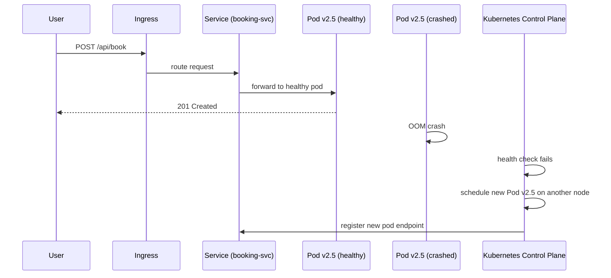

# 39. Container Orchestration

> **Think:** *"Who manages thousands of containers?"*

---

## The 4 Questions

| Question | Answer |
|----------|--------|
| **What problem does it solve?** | Running 3 containers with `docker run` is fine. Running 3,000 across 200 machines — who starts them, restarts crashed ones, scales on traffic, rolls out new versions, routes traffic, and manages secrets? Orchestration automates all of it. |
| **What happens if I ignore it?** | Manual SSH deploys don't scale. One crashed container stays dead until someone notices. Traffic spikes overwhelm available instances. Deployments require downtime. Rolling back means panic and manual commands. |
| **Where would I use it?** | Any production system with multiple containerized services — Kubernetes (K8s), AWS ECS, Google Cloud Run, managed K8s (EKS, GKE, AKS). |
| **What companies use it?** | Google (created Kubernetes), Spotify, Airbnb, Uber, Nykaa (EKS/GKE), Amazon (EKS + internal orchestration), every major tech company post-2016. |

---

## Mental Movie (60 seconds)

Monday morning. Your travel platform has 12 services, 80 containers, 15 EC2 instances. Peak booking hour starts.

**Without orchestration:** Monitoring alerts: "booking-service-7 is down." Engineer SSHs in, runs `docker start`. Meanwhile, search-service is at 95% CPU. No auto-scale. Users see slow searches. Deploying v2.5 means stopping all booking containers manually — 4 minutes of downtime.

**With Kubernetes:** booking-service pod crashes. K8s detects failed health check, starts a new pod in 8 seconds. HPA (Horizontal Pod Autoscaler) sees CPU > 70%, adds 4 more pods. Deploy v2.5: rolling update replaces pods one by one — zero downtime. Bad deploy? `kubectl rollout undo` — back to v2.4 in 30 seconds.

That's orchestration. An operating system for your data center.

---

## How It Works

**Container orchestration** automates deployment, scaling, networking, and lifecycle management of containers across a cluster of machines.

### Kubernetes Core Concepts

| Concept | What it is |
|---------|-----------|
| **Cluster** | Group of machines (nodes) managed together |
| **Node** | One machine (VM or bare metal) running containers |
| **Pod** | Smallest deployable unit — one or more containers sharing network/storage |
| **Deployment** | Desired state for pods (replicas, image version, rollout strategy) |
| **Service** | Stable network endpoint for a set of pods (load balances internally) |
| **Ingress** | External HTTP routing into the cluster |
| **HPA** | Auto-scale pods based on CPU, memory, or custom metrics |

### Deployment and Self-Healing



**Key ingredients:**
1. **Desired state declarative config** — YAML says "I want 5 replicas of booking:v2.5"; K8s makes it so
2. **Scheduler** — places pods on nodes with available resources
3. **Health checks** — liveness (restart if dead) and readiness (don't send traffic until ready)
4. **Service discovery** — services find each other by DNS name (`booking-svc.default.svc.cluster.local`)
5. **Rolling updates** — replace pods gradually with configurable surge/unavailability limits
6. **Secrets and ConfigMaps** — inject config without rebuilding images

---

## Real-World Examples

### Your Travel Platform

**Scenario:** 6 microservices on EKS (managed Kubernetes).

```yaml
# booking-deployment.yaml (simplified)
apiVersion: apps/v1
kind: Deployment
metadata:
  name: booking-service
spec:
  replicas: 5
  template:
    spec:
      containers:
      - name: booking
        image: ecr.aws/booking:v2.5
        resources:
          requests: { cpu: "250m", memory: "512Mi" }
          limits:   { cpu: "500m", memory: "1Gi" }
        livenessProbe:
          httpGet: { path: /health, port: 8080 }
```

Peak season: HPA scales booking-service from 5 → 20 pods. Diwali ends: scales back to 5. You pay for what you use.

**Without orchestration:** You'd manually start 15 more EC2 instances and hope your deploy script works.

### Nykaa

**Scenario:** Flash sale — cart and inventory services need 10× capacity for 2 hours.

Nykaa on Kubernetes:
- Pre-warm: scale cart-service to 100 pods before sale starts
- HPA watches queue depth and CPU during sale
- Post-sale: scale down automatically
- Node autoscaler adds EC2 nodes when pods can't be scheduled

One platform team manages infrastructure for 50+ product teams. Each team deploys their own services — orchestration handles the plumbing.

### Amazon

**Scenario:** Tens of thousands of services, millions of containers.

Amazon runs internal orchestration systems (and EKS for customers). Key patterns:
- **Cell-based architecture** — clusters partitioned for blast radius containment
- **Immutable deploys** — new task definition, old tasks drained
- **Automatic rollback** — if error rate spikes after deploy, orchestrator reverts
- **Bin packing** — scheduler maximizes node utilization to reduce cost

Amazon's "two-pizza teams" own services; orchestration platforms let small teams operate independently at massive scale.

---

## When To Use It

| Use orchestration when... | Example |
|---------------------------|---------|
| You run 3+ containerized services in production | Microservices architecture |
| You need auto-scaling and self-healing | Crash recovery without human intervention |
| Multiple teams deploy independently | Platform team runs K8s, product teams deploy apps |
| Zero-downtime deploys are required | Rolling updates, canary deploys |
| You outgrow ECS/Fargate simplicity | Need custom scheduling, service mesh, operators |

## When NOT To Use It

| Skip orchestration when... | Why |
|----------------------------|-----|
| 1–2 services, <5 containers total | AWS ECS Fargate or even Docker Compose on one VM |
| Team has no Kubernetes expertise and no managed service | K8s complexity will consume your engineering bandwidth |
| MVP with 50 daily active users | Managed PaaS (Railway, Render, Heroku) is simpler |
| Batch jobs that run once a day | AWS Batch or a cron job, not a full cluster |
| You need Kubernetes "because Netflix uses it" | Operational cost is real — 0.5–2 platform engineers minimum |

---

## Container Orchestration vs Related Concepts

| Concept | Difference |
|---------|-----------|
| **Docker** | Packages apps. Orchestration runs and manages Docker containers at scale. |
| **CI/CD** | CI builds images; orchestration deploys and runs them. CD often triggers `kubectl apply` or Helm upgrade. |
| **Blue-Green / Rolling Deploy** | Deployment strategies implemented *by* the orchestrator. |
| **Serverless** | Abstracts orchestration entirely — you submit code, platform handles containers. |
| **Service Mesh (Istio)** | Adds observability, mTLS, traffic splitting on top of orchestration. |

**Rule of thumb:** Containers are the package. Orchestration is how you run the package at scale. Use managed K8s (EKS/GKE) to reduce operational pain.

---

## Implementation Checklist

- [ ] Use managed Kubernetes (EKS, GKE) unless you have a platform team
- [ ] Set resource requests and limits on every pod (prevent one service from starving others)
- [ ] Configure liveness and readiness probes
- [ ] Use Deployments (not bare Pods) for stateless services
- [ ] Store secrets in Kubernetes Secrets or external vault (not in YAML git repo)
- [ ] Enable cluster autoscaling (nodes) and HPA (pods)
- [ ] Use namespaces to separate staging/production or team workloads
- [ ] Monitor: pod restarts, scheduling failures, resource utilization, deploy success rate

---

## Problem Simulation

**Situation:** Your travel platform runs on EKS. Tuesday 8 PM — peak booking window.

1. `payments-service` Deployment: 3 replicas, image `payments:v3.1`
2. One node (EC2) has a hardware failure — 2 pods die (booking + payments)
3. HPA for booking-service is scaling up (CPU at 85%)
4. Cluster Autoscaler is adding a new node (takes 3 minutes)
5. New node joins — but booking pods schedule immediately, payments pods are **Pending**

**Questions:**
1. Why are payments pods Pending while booking pods started?
2. What happens to user payment requests during this window?
3. The payments pod that survived is handling 3× normal traffic. Risk?
4. What should you have configured to prevent this?

<details>
<summary>Answers</summary>

1. **Resource constraints** — Pending means no node has enough CPU/memory. Booking HPA consumed available capacity. New node not ready yet. Possibly payments has higher resource requests and can't fit on remaining nodes.
2. **Depends on service design** — if payments-service has only 1 healthy pod, it's a bottleneck. Circuit breaker and queue (from Module 5) absorb some load. Users may see slow payments or timeouts. Idempotency prevents double charges on retry.
3. **OOM crash or latency spike** — single pod overloaded may hit memory limit and get killed, making things worse. Cascading failure.
4. **Pod Disruption Budgets** (min available replicas), **priority classes** (payments > analytics), **over-provisioned node pool**, **faster cluster autoscaler**, **separate node groups** for critical services, **multi-AZ** so one node failure doesn't take multiple pods.

</details>

---

## Key Takeaway

Containers package your app. Orchestration keeps it alive, scaled, and updated across a fleet of machines. Start with managed Kubernetes or ECS — don't run your own control plane until you have a platform team. The goal is: deploy on Friday evening and go home.

**Next:** [40 — CI/CD](./40-ci-cd.md) — how do new container images reach the cluster safely?
