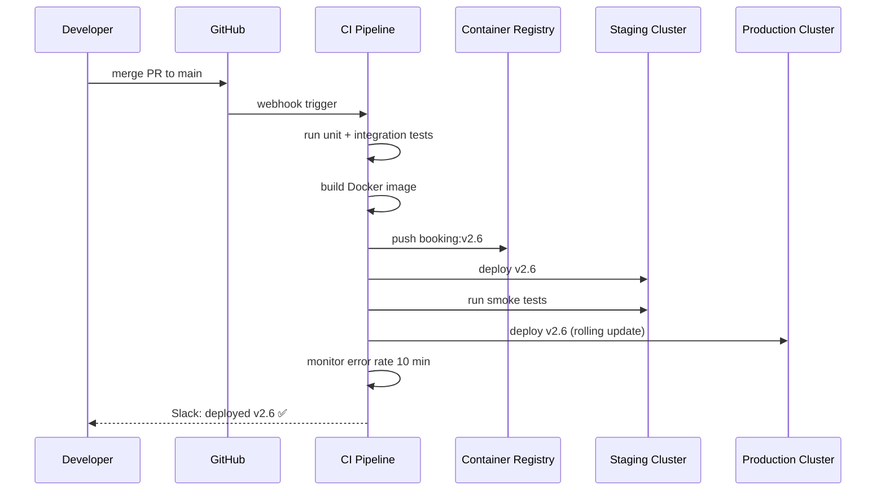

# 40. CI/CD

> **Think:** *"How do changes reach production safely?"*

---

## The 4 Questions

| Question | Answer |
|----------|--------|
| **What problem does it solve?** | Manual deploys are slow, error-prone, and inconsistent. "Works on my machine" reaches production via someone's SSH session at 11 PM. CI/CD automates build, test, and deploy — every change goes through the same pipeline with gates before users see it. |
| **What happens if I ignore it?** | Deployments take hours and require heroics. Bugs ship because tests weren't run. Rollbacks are panic. Nobody knows what's in production. Friday deploys become "deploy and pray." Team velocity dies under deployment fear. |
| **Where would I use it?** | Every software team shipping to production — GitHub Actions, GitLab CI, Jenkins, CircleCI, AWS CodePipeline, ArgoCD for GitOps deploys. |
| **What companies use it?** | Amazon (deploys every 11.7 seconds), Netflix (Spinnaker), Google (Bazel + internal CI), Spotify, Nykaa (Jenkins/GitHub Actions → EKS), every mature engineering org. |

---

## Mental Movie (60 seconds)

Developer merges PR: **"Add visa status check to booking flow."**

**Without CI/CD:** Developer pings DevOps on Slack. DevOps SSHs to staging, pulls code, runs `pip install` (different versions), restarts service. "Looks fine." SSHs to production Friday 6 PM. Typo in env var. Site breaks. Rollback = find the old tarball on someone's laptop.

**With CI/CD:** Merge triggers pipeline automatically:
1. **Build** — Docker image `booking:v2.6` created
2. **Test** — unit tests, integration tests, lint
3. **Stage** — deploy to staging, run smoke tests
4. **Approve** — team lead clicks "promote to prod" (or auto-deploy if tests pass)
5. **Deploy** — rolling update to production Kubernetes
6. **Verify** — health checks pass, error rate normal

Developer goes home. Production has the same artifact that passed all tests.

---

## How It Works

**CI (Continuous Integration)** — merge code frequently; each merge triggers automated build and test.

**CD (Continuous Delivery/Deployment)** — every passing build is deployable; deployment to production is automated (Delivery = one-click; Deployment = fully automatic).

```
Code Push → Build → Test → Security Scan → Deploy Staging → Smoke Test → Deploy Prod → Monitor
                ↑                    ↑                              ↑
           fail = stop          fail = stop                   fail = rollback
```

### Typical Pipeline



**Key ingredients:**
1. **Source control trigger** — every merge to `main` starts the pipeline
2. **Automated tests** — unit, integration, e2e; pipeline stops on failure
3. **Immutable artifacts** — build once, promote same image through environments
4. **Environment parity** — staging mirrors production (same K8s, same config shape)
5. **Deployment gates** — manual approval, canary analysis, or automated health checks
6. **Rollback mechanism** — redeploy previous image tag or `kubectl rollout undo`
7. **Observability** — post-deploy monitoring for error rate, latency spikes

---

## Real-World Examples

### Your Travel Platform

**Scenario:** GitHub Actions pipeline for booking-service.

```yaml
# .github/workflows/deploy.yml (conceptual)
on:
  push:
    branches: [main]

jobs:
  test-and-deploy:
    steps:
      - run: pytest tests/
      - run: docker build -t ecr/booking:${{ github.sha }} .
      - run: docker push ecr/booking:${{ github.sha }}
      - run: deploy to staging
      - run: ./smoke-tests.sh staging.api.yourtravel.com
      - run: deploy to production (requires approval on main)
```

Every commit to `main` is tested. Only green builds reach staging. Production requires approval (or auto if you're confident).

**Bug caught in CI:** Integration test fails — new visa check breaks existing booking flow for domestic trips. Developer fixes before any user sees it.

### Nykaa

**Scenario:** 50 microservices, hundreds of deploys per day.

Nykaa's pipeline:
- PR triggers: lint, unit tests, security scan (SAST)
- Merge to main: build image, deploy to staging, automated regression suite
- Production: canary deploy (5% traffic), monitor 15 minutes, full rollout
- Feature flags decouple deploy from release (code ships dark, PM enables flag)

Flash sale week: deploy freeze except hotfixes. CI/CD still runs — just the production gate is locked.

### Amazon

**Scenario:** Thousands of deploys per hour across the globe.

Amazon's deployment culture:
- **Pipeline ownership** — teams own their pipeline end-to-end
- **Automated rollback** — if CloudWatch alarms fire post-deploy, pipeline reverts
- **Blast radius limits** — deploy to one availability zone first, then region, then global
- **No manual SSH** — immutable infrastructure; you never "fix prod" by SSH

The famous stat: Amazon deploys every 11.7 seconds. That's CI/CD at civilization scale.

---

## When To Use It

| Use CI/CD when... | Example |
|-------------------|---------|
| More than one developer ships code | Prevent "who broke prod?" |
| You deploy more than once a month | Automation pays for itself quickly |
| You have containers or deployable artifacts | Build once, promote everywhere |
| Compliance requires audit trail | Pipeline logs who deployed what when |
| You want to move fast without breaking things | Tests + gates = confidence |

## When NOT To Use It

| Skip full CI/CD when... | Why |
|-------------------------|-----|
| Solo founder, MVP, deploy once a week | GitHub Actions free tier + simple deploy script is enough; don't build Spinnaker |
| No automated tests exist yet | CI without tests is just "Continuous Delivery of bugs" — write tests first |
| Pipeline takes 45 minutes and devs bypass it | Fix pipeline speed before adding more stages |
| Team deploys manually but reliably with 2 people | Don't over-automate until pain is real |

**Note:** Even MVPs benefit from CI (run tests on PR). Full CD can wait.

---

## CI/CD vs Related Concepts

| Concept | Difference |
|---------|-----------|
| **Blue-Green Deployment** | A deployment *strategy* — CI/CD is the pipeline that executes it |
| **Rolling Deployment** | Another strategy — orchestrator replaces instances gradually |
| **GitOps** | CD variant — git repo is source of truth; changes to YAML trigger deploys (ArgoCD, Flux) |
| **Feature Flags** | Decouple deploy (code ships) from release (users see it). Complements CI/CD. |
| **Containers** | CI builds container images; CD deploys them |

**Rule of thumb:** CI catches bugs before production. CD removes human error from deployment. Together they let you ship daily instead of monthly.

---

## Implementation Checklist

- [ ] Pipeline triggers on every PR and merge to main
- [ ] Tests run in CI — pipeline fails if tests fail
- [ ] Build artifact once (Docker image tagged with git SHA)
- [ ] Same artifact promoted: staging → production (no rebuild)
- [ ] Secrets managed via vault/CI secrets, not in repo
- [ ] Staging environment mirrors production topology
- [ ] Post-deploy smoke tests and monitoring alerts
- [ ] Documented rollback procedure (previous image tag or `rollout undo`)
- [ ] Pipeline completes in <15 minutes (faster = developers actually use it)

---

## Problem Simulation

**Situation:** Your travel platform's CI/CD pipeline:

1. Developer merges PR at 5:55 PM Friday
2. Unit tests pass (45 seconds)
3. Integration tests pass (3 minutes) — but they mock the payment gateway
4. Image `booking:v2.7` deploys to production at 6:02 PM
5. At 6:15 PM: payment error rate jumps from 0.1% to 12%
6. Root cause: payment gateway changed API response format today; mocks didn't reflect it

**Questions:**
1. Did CI/CD fail?
2. What test would have caught this?
3. Should the pipeline have auto-rolled back?
4. What's the fix for next Friday?

<details>
<summary>Answers</summary>

1. **CI/CD worked as designed** — it deployed what passed tests. The tests were wrong/incomplete. CI/CD is only as good as your test suite.
2. **Contract test or staging integration test** against real (or sandbox) payment gateway. Pact tests for API schema. Staging environment that mirrors production dependencies.
3. **Yes** — if error rate > threshold for 5 minutes post-deploy, pipeline should auto-rollback and page on-call. Requires observability wired to deployment pipeline.
4. **Deploy freeze after 4 PM Friday** (cultural), **canary deploy** (5% traffic first), **contract tests** for external APIs, **staging that uses sandbox payment gateway**, **automated rollback on SLO breach**.

</details>

---

## Key Takeaway

CI/CD is how modern teams ship fast without shipping garbage. It's not the deployment strategy — it's the conveyor belt that delivers tested artifacts to production. Invest in tests and pipeline speed; the pipeline is worthless if developers bypass it.

**Next:** [41 — Blue-Green Deployment](./41-blue-green-deployment.md) — can deployment happen without downtime?
