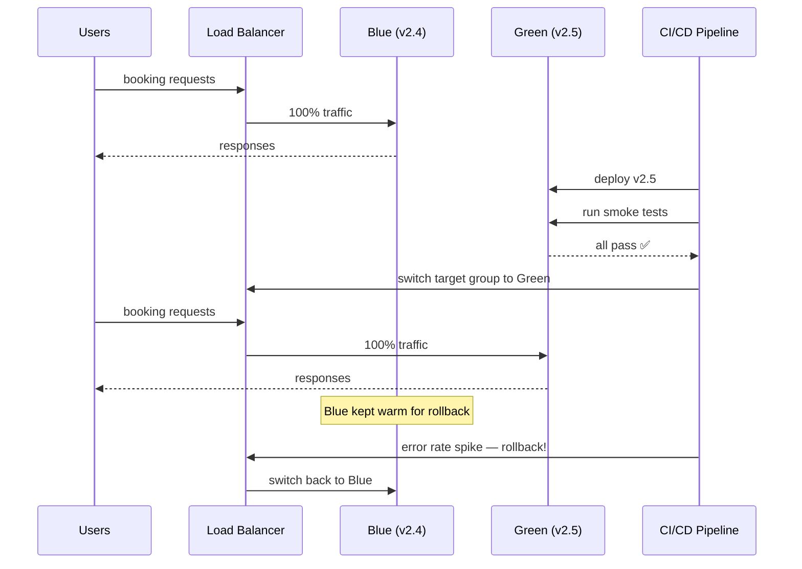

# 41. Blue-Green Deployment

> **Think:** *"Can deployment happen without downtime?"*

---

## The 4 Questions

| Question | Answer |
|----------|--------|
| **What problem does it solve?** | Deploying new code traditionally means stopping the old version, starting the new one — downtime. Blue-green runs two identical production environments. Deploy to the idle one, switch traffic, keep the old one for instant rollback. |
| **What happens if I ignore it?** | Users see 502 errors during deploys. Maintenance windows at 3 AM. Fear of deploying on Fridays. Rollback means redeploying old code (5–15 minutes) while the site is broken. |
| **Where would I use it?** | Production systems where downtime is unacceptable — ecommerce checkout, payment APIs, booking flows. AWS ALB target group swap, Kubernetes with two Deployments, Spinnaker pipelines. |
| **What companies use it?** | Netflix (Spinnaker blue-green), Amazon (CodeDeploy), Shopify (zero-downtime deploys), financial services, Nykaa (ALB swap during major releases), any SLA-driven platform. |

---

## Mental Movie (60 seconds)

Your travel platform serves 10,000 concurrent users booking flights. **Blue** environment runs `booking:v2.4` — live traffic.

You want to deploy `booking:v2.5`.

**Old way:** Stop v2.4 servers. Start v2.5. 2–4 minutes of 502 Bad Gateway. Users abandon carts. Revenue lost.

**Blue-green way:**
1. **Green** environment (idle) gets `booking:v2.5` deployed and warmed up
2. Run smoke tests against green (real DB, real dependencies)
3. Flip the load balancer: traffic → green
4. Blue sits idle — if v2.5 has bugs, flip back to blue in **seconds**

Users never see an error page. They don't even know a deploy happened.

---

## How It Works

**Blue-green deployment** maintains two identical production environments. Only one serves live traffic at a time.

```
Phase 1 (Blue live):          Phase 2 (Switch):           Phase 3 (Green live):
┌─────────┐                   ┌─────────┐                 ┌─────────┐
│  BLUE   │ ← 100% traffic    │  BLUE   │                 │  BLUE   │ (standby)
│  v2.4   │                   │  v2.4   │                 │  v2.4   │
└─────────┘                   └─────────┘                 └─────────┘
┌─────────┐                   ┌─────────┐                 ┌─────────┐
│  GREEN  │ (idle)            │  GREEN  │ ← 100% traffic    │  GREEN  │ ← 100% traffic
│  v2.5   │                   │  v2.5   │                 │  v2.5   │
└─────────┘                   └─────────┘                 └─────────┘
```

### Traffic Switch Flow



**Key ingredients:**
1. **Two identical environments** — same infra, same config, same database connections
2. **Load balancer / DNS switch** — the only thing that changes is where traffic goes
3. **Pre-warm green** — run smoke tests before switching; no cold-start surprises
4. **Database compatibility** — new code must work with current DB schema (expand-contract pattern)
5. **Instant rollback** — switch LB back to blue; no rebuild, no redeploy
6. **2× infrastructure cost** — you run double capacity during deploy window (or always, if you keep both warm)

---

## Real-World Examples

### Your Travel Platform

**Scenario:** Deploy new visa-check feature to booking-service.

AWS setup:
```
ALB Target Group "blue"  → 5 ECS tasks (booking:v2.4)
ALB Target Group "green" → 5 ECS tasks (booking:v2.5)  [deployed, no traffic]

Switch: ALB listener rule changes default action from blue → green
Rollback: change rule back to blue (30 seconds)
```

**Database consideration:** v2.5 adds a `visa_status` column. Migration runs *before* switch (additive column, nullable). Both v2.4 and v2.5 work with the schema. v2.4 ignores the new column.

**Without blue-green:** Deploy during 2 AM maintenance window. Asian users (peak hour) see downtime.

### Nykaa

**Scenario:** Major platform upgrade before Diwali sale.

Nykaa can't afford checkout downtime during peak season:
- Green environment fully tested with load tests (simulated 5× traffic)
- Switch happens in minutes, monitored by war room
- Blue kept for 24 hours post-switch — if cart abandonment spikes, instant rollback
- Database migrations are backward-compatible (old code still works on new schema)

Diwali with a broken checkout = crores in lost revenue. Blue-green is insurance.

### Amazon

**Scenario:** Deploy pricing engine change globally.

Amazon's approach (simplified):
- Deploy to green fleet in one availability zone
- Canary: 1% traffic to green, monitor error rate and business metrics
- Full switch per AZ, then per region
- Blue fleet remains for instant rollback for hours after switch

Pricing bugs are catastrophic — wrong price displayed, orders at ₹0. Blue-green + canary + automated rollback = defense in depth.

---

## When To Use It

| Use blue-green when... | Example |
|------------------------|---------|
| Downtime is unacceptable | Ecommerce checkout, payment APIs |
| You need instant rollback | Financial services, booking platforms |
| Deploys are infrequent but high-risk | Major version upgrades, schema migrations |
| You can afford 2× infra during deploy | Enterprise SLAs justify the cost |
| Database changes are backward-compatible | Both versions run against same DB |

## When NOT To Use It

| Skip blue-green when... | Why |
|-------------------------|-----|
| You deploy 20 times a day to small services | Rolling deploy is simpler and cheaper |
| Infrastructure cost is critical | Running 2× production is expensive at scale |
| Stateful services with local disk | Two environments can't share ephemeral state easily |
| Database schema is incompatible between versions | Blue and green can't run against same DB without migration strategy |
| Team of 2 with 1 server | Overkill — use rolling restart |

---

## Blue-Green vs Related Concepts

| Concept | Difference |
|---------|-----------|
| **Rolling Deployment** | Replaces instances gradually; both versions run simultaneously during rollout. Cheaper, slower rollback. |
| **Canary Deployment** | Sends small % of traffic to new version first. Blue-green is "all or nothing" switch. |
| **CI/CD** | Pipeline that builds and deploys; blue-green is the strategy it executes. |
| **Feature Flags** | Code is live but feature hidden; blue-green switches entire application version. |

**Rule of thumb:** Blue-green for high-stakes, low-frequency deploys where rollback speed matters more than infra cost.

---

## Implementation Checklist

- [ ] Two target groups / deployments (blue and green) with identical config
- [ ] Load balancer supports instant traffic switch
- [ ] Smoke tests run against idle environment before switch
- [ ] Database migrations are backward-compatible (expand-contract)
- [ ] Monitor error rate, latency, business metrics for 15–30 min post-switch
- [ ] Keep old environment warm for rollback window (1–24 hours)
- [ ] Automate switch and rollback in CI/CD pipeline
- [ ] Document which environment is "live" (avoid confusion)

---

## Problem Simulation

**Situation:** Your travel platform blue-green deploy of `booking:v3.0`:

1. Blue (v2.9) serves 100% traffic — 8 pods, healthy
2. Green (v3.0) deployed — 8 pods, smoke tests pass
3. Traffic switched to green at 3:00 PM
4. At 3:12 PM: support tickets spike — "I booked but confirmation page is blank"
5. Error rate: 0.2% → 3%. Only affects users who book international packages (new code path)
6. Blue environment still running v2.9

**Questions:**
1. What do you do at 3:13 PM?
2. Why did smoke tests miss this?
3. After rollback, what happens to the 47 bookings made on v3.0 in those 12 minutes?
4. How would you deploy v3.0 again next week?

<details>
<summary>Answers</summary>

1. **Rollback immediately** — switch LB back to blue. 30 seconds. Error rate drops. Post-mortem later.
2. **Smoke tests didn't cover international booking path** — tested domestic only. Need test suite that covers all critical user journeys, not just `/health`.
3. **Depends on data compatibility** — if v3.0 wrote new fields v2.9 doesn't understand, you have a problem. If DB changes were additive and v2.9 ignores new fields, bookings are fine. This is why backward-compatible migrations matter.
4. **Fix the bug**, add international booking to smoke tests, deploy to green again, **canary first** (route 5% traffic to green, monitor 30 min), then full switch. Consider feature flag for international path.

</details>

---

## Key Takeaway

Blue-green deployment trades infrastructure cost for deploy confidence. Two environments, one switch, instant rollback. Use it when downtime costs more than running double capacity for an hour.

**Next:** [42 — Rolling Deployment](./42-rolling-deployment.md) — what if you can't afford two full environments?
