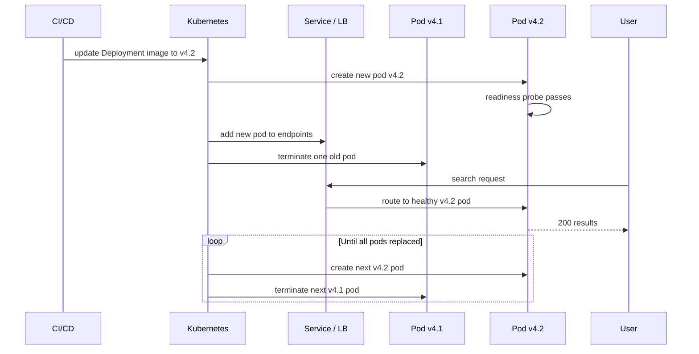

# 42. Rolling Deployment

> **Think:** *"Can changes be released gradually?"*

---

## The 4 Questions

| Question | Answer |
|----------|--------|
| **What problem does it solve?** | You need to deploy new code without downtime, but running two full environments (blue-green) is too expensive. Rolling deployment replaces instances one at a time — old and new versions run side by side during the rollout until all instances are updated. |
| **What happens if I ignore it?** | You either accept downtime (stop all, start all) or pay 2× infrastructure for blue-green. Without a rolling strategy, one bad deploy takes down all instances simultaneously. |
| **Where would I use it?** | Kubernetes default deploy strategy, AWS ECS rolling updates, most microservices with frequent deploys — anywhere you want zero-downtime without double capacity. |
| **What companies use it?** | Kubernetes (default RollingUpdate), AWS ECS, Google Cloud Run, Spotify, Uber, Nykaa (daily service deploys), virtually every containerized microservice fleet. |

---

## Mental Movie (60 seconds)

Your travel platform's search-service runs on 10 pods. Current version: `search:v4.1`. You want `search:v4.2`.

**Stop-all-then-start:** Kill all 10 pods. Deploy 10 new ones. 30–60 seconds where search is down. Users see "Search unavailable." Unacceptable.

**Blue-green:** Spin up 10 new pods (green). Switch traffic. Now you have 20 pods briefly. Expensive if you do this 5 times a day across 12 services.

**Rolling deployment:** Replace one pod at a time.
```
10 pods v4.1 → kill 1, start 1 v4.2 → 9 v4.1 + 1 v4.2
             → kill 1, start 1 v4.2 → 8 v4.1 + 2 v4.2
             → ... → 10 pods v4.2
```
Users always hit a healthy pod. Search never goes down. You never exceed 10 pods.

Rollback is slower than blue-green (replace pods back one by one), but infra cost stays flat.

---

## How It Works

**Rolling deployment** updates instances incrementally. The orchestrator terminates old instances and starts new ones according to a configurable strategy.

### Kubernetes RollingUpdate (default)

```yaml
spec:
  replicas: 10
  strategy:
    type: RollingUpdate
    rollingUpdate:
      maxUnavailable: 1    # at most 1 pod down during rollout
      maxSurge: 1          # at most 1 extra pod above desired count
```

```
Step 0:  [v4.1] [v4.1] [v4.1] [v4.1] [v4.1]     (5 replicas shown)
Step 1:  [v4.2] [v4.1] [v4.1] [v4.1] [v4.1]     (1 new, 4 old)
Step 2:  [v4.2] [v4.2] [v4.1] [v4.1] [v4.1]     (2 new, 3 old)
...
Step N:  [v4.2] [v4.2] [v4.2] [v4.2] [v4.2]     (all new)
```

### Rolling Deploy Flow



**Key ingredients:**
1. **maxUnavailable** — how many pods can be down during rollout (0 = never reduce capacity)
2. **maxSurge** — how many extra pods can exist above desired count (1 = brief 11 pods for 10 desired)
3. **Readiness probe** — new pod only receives traffic when ready (DB connected, cache warmed)
4. **Graceful shutdown** — old pod finishes in-flight requests before termination (preStop hook, SIGTERM)
5. **Version coexistence** — old and new code run simultaneously; must be backward-compatible
6. **Rollback** — `kubectl rollout undo` reverses the rolling update pod by pod

---

## Real-World Examples

### Your Travel Platform

**Scenario:** Daily deploys to search-service (10 pods) and notifications-service (3 pods).

```bash
kubectl set image deployment/search-service search=ecr/search:v4.2
# Kubernetes rolling update begins automatically
kubectl rollout status deployment/search-service
# Waiting for rollout to finish: 10 of 10 updated...
```

Deploy takes 3–5 minutes for 10 pods. Zero downtime. If v4.2 fails readiness probe, rollout **pauses** — old pods keep serving.

**Rollback:**
```bash
kubectl rollout undo deployment/search-service
# Rolls back one pod at a time to v4.1
```

Slower than blue-green (3–5 min vs 30 sec) but you didn't need 20 pods.

### Nykaa

**Scenario:** 50 microservices, multiple deploys per day per team.

Nykaa's default for most services:
- Rolling update with `maxUnavailable: 0, maxSurge: 25%`
- Readiness probes ensure pod is warm before receiving traffic
- PreStop hook: wait 10 seconds for in-flight requests to complete
- Post-deploy: monitor error rate for 10 minutes

Critical services (checkout, payments) use **canary** (5% traffic to new version) before full rolling deploy. Search and recommendations? Straight rolling deploy.

### Amazon

**Scenario:** Deploy a new version of the product catalog service.

Amazon's rolling deploy (simplified):
- Deploy to 1% of fleet → monitor alarms → 10% → 50% → 100%
- At each stage, automatic rollback if error rate exceeds threshold
- Old and new versions coexist for minutes to hours
- Database schema always backward-compatible during rollout window

The "one box at a time" principle — never change everything at once.

---

## When To Use It

| Use rolling deployment when... | Example |
|--------------------------------|---------|
| Frequent deploys (daily or more) | Microservices with CI/CD |
| Infrastructure cost matters | Can't afford 2× capacity for blue-green |
| Kubernetes or ECS is your platform | Built-in, default, well-tested |
| Both versions can coexist safely | API backward-compatible, additive DB changes |
| Zero downtime needed but instant rollback isn't critical | Search, recommendations, notifications |

## When NOT To Use It

| Skip rolling deployment when... | Why |
|---------------------------------|-----|
| You need instant rollback (< 1 minute) | Rolling undo takes minutes — use blue-green |
| New version is incompatible with old | Can't run v4.1 and v4.2 simultaneously — must switch atomically |
| Long-running requests (30+ min) | Old pods killed mid-request unless graceful shutdown is perfect |
| Stateful apps with local state | Rolling replace loses in-memory state on each pod |
| Deploy affects shared DB schema destructively | Run migration separately with compatibility window |

---

## Rolling vs Related Concepts

| Concept | Difference |
|---------|-----------|
| **Blue-Green** | Two full environments; instant switch. Rolling = one environment, gradual replace. |
| **Canary** | Rolling's cautious cousin — 5% traffic to new version first, then full rollout. |
| **Recreate** | K8s strategy that kills all old pods before starting new — has downtime. Don't use in prod. |
| **CI/CD** | Pipeline triggers the rolling update after tests pass. |
| **Container Orchestration** | K8s/ECS executes the rolling strategy you configure. |

**Rule of thumb:** Rolling is the default for microservices. Use blue-green when rollback speed trumps cost. Use canary when you want rolling + safety.

---

## Implementation Checklist

- [ ] Use `RollingUpdate` strategy (not `Recreate`)
- [ ] Set `maxUnavailable: 0` for critical services (never reduce capacity)
- [ ] Configure readiness probes (new pod must be truly ready)
- [ ] Configure `preStop` hook and `terminationGracePeriodSeconds` for graceful shutdown
- [ ] Ensure API and DB schema backward-compatible between versions
- [ ] Set `progressDeadlineSeconds` — fail deploy if rollout stalls
- [ ] Monitor during rollout: error rate, latency, pod restart count
- [ ] Test rollback procedure (`kubectl rollout undo`) in staging

---

## Problem Simulation

**Situation:** Your travel platform rolling deploys `payments:v5.0` (5 pods):

```yaml
replicas: 5
maxUnavailable: 1
maxSurge: 1
```

1. Pod 1 (v5.0) starts, passes readiness, receives traffic
2. Pod 1 starts returning 500 errors — bug in new payment validation
3. Pod 2 (v5.0) is starting. Pods 3–5 still run v4.9 (healthy)
4. Error rate: 0.1% → 1.5% (1 of 5 pods is bad, but LB sends ~20% traffic to it)
5. Engineer is asleep. No auto-rollback configured.

**Questions:**
1. Why is only ~20% of payment traffic failing?
2. What should auto-rollback trigger on?
3. User's payment fails on v5.0 pod. They retry. Lands on v4.9 pod. Payment succeeds. Double charge risk?
4. How would `maxUnavailable: 0` have changed this rollout?

<details>
<summary>Answers</summary>

1. **Proportional traffic** — service load-balances across all ready pods. 1 bad pod out of 5 (once pod 2 is ready, 2 bad out of 6 with surge) ≈ 17–33% of requests hit bad code.
2. **Error rate threshold** — if 5xx rate > 1% for 2 minutes during rollout, pause rollout and auto-rollback. Tools: Argo Rollouts, Flagger, or custom pipeline check on Prometheus metrics.
3. **Yes, without idempotency** — retry lands on different pod, different code path. User may be charged twice. This is why **idempotency keys** (Module 1) are non-negotiable for payments, regardless of deploy strategy.
4. **`maxUnavailable: 0`** means a new pod must be ready before any old pod is killed. Doesn't prevent bad code from receiving traffic — it only prevents capacity reduction. Canary or automated health checks on business metrics are still needed.

</details>

---

## Key Takeaway

Rolling deployment is the workhorse of modern infrastructure — deploy constantly, replace gradually, never take the whole fleet down at once. Pair it with readiness probes, graceful shutdown, backward-compatible APIs, and automated rollback. It's cheaper than blue-green and good enough for 90% of deploys.

**Next:** [Module 7 — Product Thinking](../module-07-product-thinking/) — you've built the plumbing. Now: are you building the right thing?
