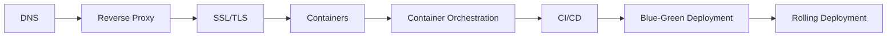

# Module 6: Infrastructure

The plumbing that keeps everything running.

> **Think like this:** *"How does a browser find my server? Who stands in front of my app? How do changes reach production without waking users at 3 AM?"*

## Topics

| # | Topic | One-line mental model | Read time |
|---|-------|----------------------|-----------|
| 35 | [DNS](./35-dns.md) | "How does a domain find a server?" | ~12 min |
| 36 | [Reverse Proxy](./36-reverse-proxy.md) | "Who stands in front of my application?" | ~12 min |
| 37 | [SSL/TLS](./37-ssl-tls.md) | "How is communication protected?" | ~12 min |
| 38 | [Containers](./38-containers.md) | "Can software run the same everywhere?" | ~12 min |
| 39 | [Container Orchestration](./39-container-orchestration.md) | "Who manages thousands of containers?" | ~12 min |
| 40 | [CI/CD](./40-ci-cd.md) | "How do changes reach production safely?" | ~12 min |
| 41 | [Blue-Green Deployment](./41-blue-green-deployment.md) | "Can deployment happen without downtime?" | ~12 min |
| 42 | [Rolling Deployment](./42-rolling-deployment.md) | "Can changes be released gradually?" | ~12 min |

## Suggested Learning Order

These eight concepts stack on each other:



1. **DNS** — translate domain names to IP addresses; the first hop in every request
2. **Reverse Proxy** — sit in front of app servers; route, terminate TLS, cache, protect
3. **SSL/TLS** — encrypt data in transit; non-negotiable for production
4. **Containers** — package app + dependencies into a portable unit
5. **Container Orchestration** — schedule, scale, and heal thousands of containers
6. **CI/CD** — automate build, test, and deploy with gates and rollbacks
7. **Blue-Green Deployment** — two identical environments; instant traffic switch
8. **Rolling Deployment** — replace instances gradually; less infra, slower rollback

## Module Simulation

After finishing all 8 topics, run this scenario (answers at bottom of each topic doc):

> **Tuesday 6 PM.** You launch a new travel platform feature: "Instant Visa Status." Traffic spikes 5×. A developer pushes a bad config. One availability zone has a network blip. Users in Mumbai report "site not loading" while Delhi works fine. Nykaa's sale is live. Amazon just deployed a pricing change globally.

Trace the failure through each layer. Where does DNS send users? What does the reverse proxy do when backends are unhealthy? Is TLS the problem or a symptom? Would containers have prevented the config drift? How would Kubernetes reschedule failed pods? What would CI/CD have caught before deploy? Would blue-green or rolling have made rollback faster?

## PDFs

Generated PDFs live in [pdf/](./pdf/). Regenerate:

```bash
python3 md_to_pdf.py --dir learning/module-06-infrastructure --force
```

## Next Module

**[Module 7: Product Thinking](../module-07-product-thinking/)** — PMF, Jobs To Be Done, North Star Metric, and Conversion Funnel — build the right thing, not just build things right.
