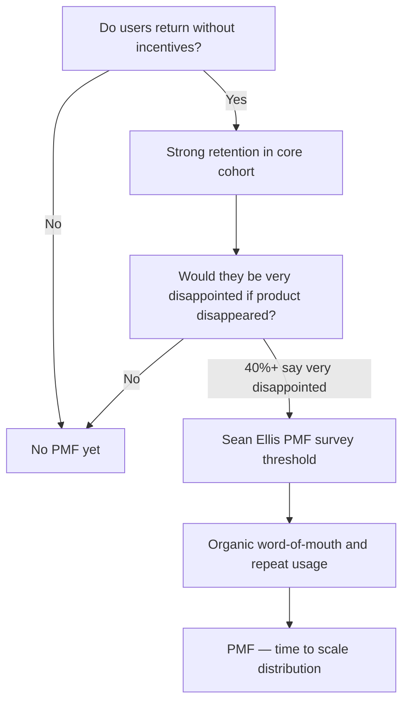

# 43. Product Market Fit

> **Think:** *"Do people actually need this?"*

---

## The 4 Questions

| Question | Answer |
|----------|--------|
| **What problem does it solve?** | Building without demand — teams ship features nobody wants, burn runway, and scale broken products. PMF is the moment when a product satisfies strong market demand and users pull it out of your hands. |
| **What happens if I ignore it?** | You scale prematurely: more servers for a product nobody retains, more ads for a funnel that leaks, more engineers building the wrong roadmap. Cash burns, morale drops, you confuse "growth" with "traction." |
| **Where would I use it?** | Before raising a big round, before hiring a large team, before choosing between "add features" vs "fix core value," when retention is flat but traffic is up, when deciding pivot vs persevere. |
| **What companies use it?** | Airbnb (realized photos mattered more than more listings), Slack (teams that tried it wouldn't leave), Instagram (pivoted from Burbn check-in app to photo sharing), MakeMyTrip (package deals for Indian family travel), Nykaa (beauty-first before expanding categories). |

---

## Mental Movie (60 seconds)

You've built a travel platform. Beautiful UI. Fast search. Payment works. You run ads — traffic doubles.

**Without PMF:** 10,000 visitors/month. 50 bookings. Users search, compare, leave. They say "nice site" but book on MakeMyTrip. You add a loyalty program, a chatbot, a blog. Bookings stay at 50. You're scaling a leaky bucket.

**With PMF signals:** Users who book come back within 90 days without a discount. They refer friends unprompted. Support tickets are "how do I book more?" not "how does this work?" When you throttle ads, bookings don't collapse — organic demand holds. *That's* pull.

PMF isn't a launch day. It's a phase shift: from pushing the product to the market, to the market pulling the product from you.

---

## How It Works

**Product Market Fit** means you've built something a meaningful segment of customers wants badly enough to choose you repeatedly — and tell others.

Marc Andreessen's shorthand: *"You can always feel when product market fit isn't happening. The customers aren't quite getting value, word of mouth isn't spreading, usage isn't growing fast, press reviews are 'nice,' sales cycles are long. You can always feel when product market fit is happening. Customers are buying as fast as you can make product, money piles up, you're hiring sales and support as fast as you can."*

### The PMF Spectrum

```
No PMF          Searching PMF              Strong PMF
    |-------------------|------------------------|
  "Cool demo"     "Some users love it"    "Can't keep up with demand"
  High churn      Mixed retention         High retention in core segment
  Push marketing  Iterate on feedback     Organic growth + referrals
```

### Common Signals (and Anti-Signals)



**Key ingredients:**
1. **A defined segment** — "everyone who travels" is not a segment; "working parents booking 4-night domestic packages under ₹40K" is
2. **A painful job** — inconvenience or cost high enough that they'll switch behavior
3. **Retention over acquisition** — PMF shows up in cohort curves, not vanity traffic
4. **Pull, not push** — users seek you out or stay without constant discounts
5. **Willingness to tolerate imperfection** — they use you despite bugs because the core value is real

---

## Real-World Examples

### Your Travel Platform

**Scenario:** You launch with flight + hotel search for Indian domestic trips. Month 3 data:

| Metric | Value |
|--------|-------|
| Monthly visitors | 80,000 |
| Bookings | 320 (0.4% conversion) |
| 30-day repeat booking rate | 2% |
| NPS | 28 |
| Top support ticket | "Prices higher than MakeMyTrip" |

**PMF diagnosis:** No fit in current form. Users visit but don't stay. You're a comparison layer, not a destination.

**Pivot signal:** Interviews reveal 40 users (honeymoon planners) book repeatedly because you bundle "surprise room decoration + airport pickup" — a job competitors don't serve. Double down on that segment. Ignore generic search for now.

**Without PMF awareness:** You'd hire 5 engineers to rebuild search speed. Faster search for users who don't care = wasted quarters.

### Nykaa

**Scenario:** Early Nykaa (2012–2014) — beauty e-commerce in India.

Before PMF: generic online store, low trust in buying lipstick online, high return anxiety.

PMF moment: authentic product content, shade matching, trusted brands, easy returns. Women who tried it **reordered** — not because of discounts, but because they finally had reliable access to brands unavailable locally.

**Lesson:** PMF came from solving "I can't find authentic beauty products I trust" — not from having the most SKUs.

### Amazon

**Scenario:** Amazon's early years (1995–1997) — books only.

Bezos didn't start with "everything store." Books had huge selection advantage over physical stores, standardized SKUs, easy shipping. Cohort retention and repeat purchase proved demand before expanding categories.

**Lesson:** PMF in one wedge (books) funded expansion. "Everything store" before book PMF would have been fatal complexity.

---

## When To Use It

| Use PMF thinking when... | Example |
|--------------------------|---------|
| Deciding whether to scale marketing or fix product | 10× traffic, same bookings → fix product first |
| Choosing pivot vs persevere | 6 months flat retention in target segment |
| Prioritizing roadmap | Build what retained users ask for, not what churned users clicked |
| Fundraising narrative | Investors want evidence of pull, not just a demo |
| Hiring decisions | Don't scale sales/support before core value is proven |

## When NOT To Use It

| Skip PMF obsession when... | Why |
|----------------------------|-----|
| You're validating a hypothesis in week 1 | You need *any* signal, not 40% "very disappointed" |
| You're in a regulated launch window | Ship compliant MVP, measure after |
| The market is winner-take-all and speed matters | Network effects (see Module 8) may require land-grab — but still measure retention |
| You're optimizing a known product with proven fit | PMF is a pre-scale question; post-PMF is execution and moats |
| Perfect data isn't available | Use qualitative interviews + small cohort metrics, don't wait for statistical purity |

---

## PMF vs Related Concepts

| Concept | Difference |
|---------|-----------|
| **Jobs To Be Done** | JTBD explains *why* users hire you; PMF measures *whether* enough users hire you repeatedly |
| **North Star Metric** | NSM tracks value delivery; PMF asks if that value is wanted by a viable market |
| **Conversion Funnel** | Funnel finds leaks; PMF asks if fixing leaks matters — or if the product itself is wrong |
| **Vanity metrics** | Downloads, page views, signups — PMF cares about retention and repeat value |

**Rule of thumb:** If retention in your core segment is flat or falling, you don't have a growth problem — you have a PMF problem. No amount of infrastructure fixes that.

---

## Application Checklist

- [ ] Define your core segment (who specifically loves this?)
- [ ] Run Sean Ellis survey: "How disappointed would you be if this product no longer existed?" (target 40%+ "very disappointed" in core users)
- [ ] Plot retention cohorts (D1, D7, D30) — flattening curve = signal
- [ ] Interview 10–15 retained users: what did you do before us? why did you switch?
- [ ] Interview 10–15 churned users: what was missing?
- [ ] Separate organic/referral bookings from paid — does demand hold without ads?
- [ ] Document "before PMF" vs "after PMF" behaviors so the team knows which mode you're in

---

## Problem Simulation

**Situation:** Your travel platform, 8 months post-launch:

1. ₹2Cr spent on performance marketing
2. 200K monthly visitors (up from 20K)
3. 800 monthly bookings (0.4% conversion, unchanged)
4. 45% of bookings are first-time users using a 15% discount code
5. Without discount, repeat booking rate is 4% at 90 days
6. NPS among discount users: 35. NPS among full-price repeat bookers: 72.
7. CEO wants to raise Series A and hire 30 people

**Questions:**
1. Do you have product market fit? Why or why not?
2. Should you raise and scale marketing?
3. What's the most likely root cause — product, pricing, or positioning?
4. What would you do in the next 90 days?

<details>
<summary>Answers</summary>

1. **No PMF in the broad market.** Discount-driven acquisition with 4% repeat at full price means the core value isn't compelling enough for most users. The 72 NPS full-price repeat cohort is a *segment* with fit — not the whole product.
2. **No** — scaling marketing pours water into a leaky bucket. You'd burn runway acquiring users who don't stick. Exception: if you narrow to the high-NPS segment and prove retention there first.
3. **Positioning + product for the wrong segment.** You're marketing to deal-seekers who compare on price. The users with PMF signals want something else (likely convenience, bundling, or trust) — find and narrow to them.
4. **90-day plan:** (a) Stop broad discount campaigns, (b) Interview all full-price repeat bookers — find the job, (c) Rebuild landing page and product for that segment only, (d) Measure retention without discounts, (e) Hit 40% "very disappointed" in that cohort before scaling spend.

</details>

---

## Key Takeaway

Product market fit is the difference between "we built something" and "we built something people need." Before you scale infrastructure, team, or ads — prove that a real segment pulls your product back repeatedly.

**Next:** [44 — Jobs To Be Done](./44-jobs-to-be-done.md) — *what job* are those users hiring your product for?
