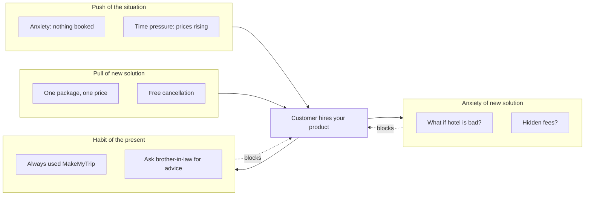

# 44. Jobs To Be Done

> **Think:** *"What job is the customer hiring my product for?"*

---

## The 4 Questions

| Question | Answer |
|----------|--------|
| **What problem does it solve?** | Feature-first thinking — teams build what they *can* build instead of what customers *need*. JTBD reframes demand: people don't buy products, they hire them to make progress in a specific circumstance. |
| **What happens if I ignore it?** | Feature bloat, misaligned marketing ("best flight search!"), competitors copy your UI but win on the job, roadmap debates with no customer anchor, high traffic and low conversion because you're solving the wrong struggle. |
| **Where would I use it?** | Product discovery, positioning, pricing, onboarding design, competitive analysis, deciding what NOT to build, writing landing page copy, prioritizing between two "good" features. |
| **What companies use it?** | Intercom (JTBD-driven onboarding), Airbnb ("belong anywhere" = job of feeling local, not renting a bed), Uber ("get a ride in 5 minutes" = job of reliable urban mobility), Nykaa ("look good with authentic products" = job of trusted beauty access), MakeMyTrip ("stress-free family vacation" = job, not flight search). |

---

## Mental Movie (60 seconds)

A user opens your travel app at 11 PM. They're not thinking *"I need a metasearch engine with filters."*

They're thinking: *"My in-laws are visiting next month. I need a 4-night Goa trip — flights, kid-friendly hotel, no surprises — booked before tomorrow's family call so I look responsible."*

**Without JTBD:** You optimize search speed, add 12 new filters, A/B test button colors. Conversion barely moves. User still books on MakeMyTrip because MakeMyTrip shows "family packages with free cancellation" on the homepage.

**With JTBD:** You redesign around the job: *"Book a stress-free family trip in under 10 minutes."* One-tap package, kid-friendly filter default, price-locked for 24 hours, WhatsApp share for spouse approval. Conversion jumps — not because search is faster, but because you hired for the right job.

Customers don't want a drill. They want a hole. Actually — they want a shelf on the wall to feel proud of their home.

---

## How It Works

**Jobs To Be Done (JTBD)** is a lens: when a customer "hires" your product, they're trying to make progress in a specific **situation**, against **forces** that push and pull them.

### The Job Statement

```
When [situation], I want to [motivation], so I can [expected outcome].
```

**Example (travel):**
```
When my family vacation is 6 weeks away and I haven't booked anything,
I want to lock in flights + hotel + transfers in one sitting,
so I can stop worrying and focus on work until the trip.
```

### Forces of Progress



**Key ingredients:**
1. **Situation, not persona** — "busy mom" is a persona; "booking 48 hours before school holidays start" is a situation
2. **Functional + emotional + social jobs** — book a trip (functional), feel in control (emotional), impress in-laws (social)
3. **Competition is any alternative** — MakeMyTrip, a travel agent, or "do nothing and panic later"
4. **Outcomes over features** — "free cancellation" serves the job of risk reduction, not checkbox parity
5. **Non-consumption** — sometimes the biggest competitor is the user giving up and not booking at all

### Functional vs Emotional vs Social

| Job type | Travel platform example |
|----------|-------------------------|
| **Functional** | Get DEL→GOA flights + 3-night hotel under ₹35K |
| **Emotional** | Feel confident nothing will go wrong |
| **Social** | Be the person who "handled the family trip" |

---

## Real-World Examples

### Your Travel Platform

**Scenario:** Analytics show users spend 12 minutes comparing flights, then abandon.

**Feature thinking:** "Add price alerts and flexible date calendar."

**JTBD interview reveals:**
- *"I wasn't sure if the hotel was near the beach or the highway."*
- *"My wife needed to approve — I couldn't share a clean summary."*
- *"I got scared the price would jump if I waited, but I wasn't ready to pay."*

**Redesign for the job:**
```
Job: "Get spouse-aligned, risk-free vacation booking"
→ Package card with map, hotel video, total price locked 24h
→ "Share with family" WhatsApp link with one-page summary
→ Pay ₹999 to hold, pay rest in 3 days
```

Conversion improves because you addressed **anxiety** and **social approval** — not search filters.

### Nykaa

**Scenario:** User buys skincare during a sale.

**Surface job:** Buy serum at discount.

**Deeper JTBD:**
```
When my skin breaks out before a wedding,
I want products I trust are authentic and right for my skin type,
so I can look good in photos without a dermatologist visit.
```

Nykaa serves this with: authentic brand partnerships, shade/skin quizzes, influencer tutorials, easy returns, and "Nykaa-approved" trust signals — not just "lowest price."

**Competitor isn't only Purplle** — it's the local chemist, the cousin who studies abroad, or skipping makeup entirely.

### Amazon

**Scenario:** One-Click ordering.

**Job Amazon hired for:**
```
When I remember I need batteries while putting kids to bed,
I want to order in 10 seconds without finding my wallet,
so I can go back to sleep knowing they'll arrive tomorrow.
```

One-Click isn't a feature — it's the entire job compressed. Amazon Prime, same-day delivery, and "Buy Again" all serve variations of *"get what I need with zero friction when I'm busy."*

---

## When To Use It

| Use JTBD when... | Example |
|------------------|---------|
| Roadmap feels like random feature requests | Cluster requests by job, not by loud customer |
| Marketing copy doesn't convert | Lead with the outcome, not the tech |
| Competitor has worse UX but wins | They're hired for a different job (price? trust? speed?) |
| Deciding build vs partner | If the job is "stress-free trip," partner for cabs instead of building |
| Onboarding has high drop-off | User signed up but the job isn't clear in first 60 seconds |

## When NOT To Use It

| Skip JTBD when... | Why |
|-------------------|-----|
| Job is obvious and commoditized | Generic utility bill payment — speed and reliability are the job; interviews add little |
| You're fixing a clear technical bug | Checkout is broken — fix it, don't interview |
| Market is dictated by regulation | Compliance features aren't chosen by customer jobs |
| You need quantitative funnel data first | JTBD explains *why*; funnel (Topic 46) shows *where* — use both |
| Analysis paralysis on wording | A rough job hypothesis beats months of framework debate — test it |

---

## JTBD vs Related Concepts

| Concept | Difference |
|---------|-----------|
| **Product Market Fit** | PMF asks if enough people want the product; JTBD explains what progress they're seeking |
| **User personas** | Personas describe *who*; JTBD describes *why in this moment* |
| **User stories** | "As a user I want X" is often a feature in disguise; JTBD starts from struggle and outcome |
| **North Star Metric** | NSM measures value delivered; JTBD defines what value means to the customer |
| **Conversion Funnel** | Funnel shows drop-off steps; JTBD explains the forces causing drop-off |

**Rule of thumb:** If you can't finish "When ___, I want ___, so I can ___" for your top segment, you're not ready to prioritize features.

---

## Application Checklist

- [ ] Identify 3–5 situations where customers switch to or from your product
- [ ] Interview using timeline: "Walk me through the last time you booked a trip — what triggered it?"
- [ ] Map push, pull, anxiety, and habit forces for each situation
- [ ] Write job statements — separate functional, emotional, social
- [ ] List all "competitors" including non-consumption (spreadsheets, WhatsApp groups, doing nothing)
- [ ] Audit homepage and onboarding: do they promise the job or list features?
- [ ] Tie each roadmap item to a job it serves — cut orphans

---

## Problem Simulation

**Situation:** Your travel platform's top 3 requested features from surveys:

1. More international destinations
2. Crypto payment support
3. AI trip planner chatbot

Meanwhile:
- 70% of bookings are domestic weekend trips (DEL/BLR/BOM ↔ GOA/JAIPUR)
- Biggest drop-off is between "selected hotel" and "enter passenger details" (55% abandon)
- Exit surveys: "Not sure if this is the right hotel" (38%), "Need to check with family" (31%)

**Questions:**
1. What job are users likely hiring you for — based on data, not requests?
2. Which of the 3 requested features best serves that job?
3. What would you build instead of all three?
4. How would you rewrite the homepage headline?

<details>
<summary>Answers</summary>

1. **Domestic short-trip booking with confidence** — likely couples/friends/families planning quick getaways. The struggle is *decision confidence* and *alignment with others*, not payment method or destination breadth.
2. **None of them directly.** Crypto serves a tiny niche. International expansion dilutes focus. AI chatbot might help *if* it reduces hotel-selection anxiety — but it's a bet, not the obvious job.
3. **Hotel confidence + family alignment:** verified reviews with photos, "compare side-by-side" share link, 24h price lock, "popular with families" tags, simplified passenger form (save profiles). Maybe a lightweight "help me choose" quiz — not a full AI planner.
4. Example headline: *"Book your weekend getaway in one go — flights, hotel, and peace of mind."* Sub: *"Price-locked packages. Share with family. Free cancellation on select trips."* — leads with the job, not features.

</details>

---

## Key Takeaway

Features are what you ship. Jobs are why customers care. Design for the struggle they're escaping and the progress they're seeking — not the feature list your competitor has.

**Next:** [45 — North Star Metric](./45-north-star-metric.md) — once you know the job, what's the one number that proves you're delivering it?
