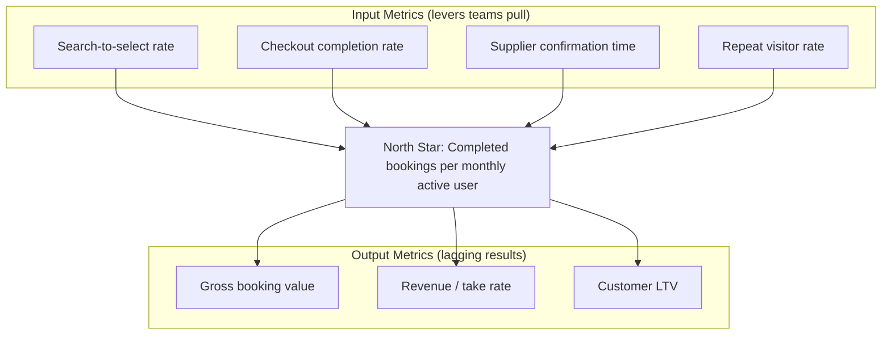

# 45. North Star Metric

> **Think:** *"What single metric matters most?"*

---

## The 4 Questions

| Question | Answer |
|----------|--------|
| **What problem does it solve?** | Misaligned teams — engineering optimizes uptime, marketing optimizes clicks, product optimizes features, everyone hits their KPIs but the business doesn't grow. A North Star Metric (NSM) is the one number that best captures core value delivered to customers. |
| **What happens if I ignore it?** | Local optima: faster search but fewer bookings, more signups but worse retention, higher revenue per user but destroyed trust. Teams argue from different dashboards. You win battles and lose the war. |
| **Where would I use it?** | Company/team goal setting, quarterly OKRs, experiment prioritization, dashboard design, deciding whether to ship a feature, investor updates, killing projects that don't move the needle. |
| **What companies use it?** | Airbnb (nights booked), Spotify (time spent listening), Facebook (DAU), Amazon (purchases per month), Uber (trips completed), Slack (messages sent by teams), MakeMyTrip (bookings completed), Nykaa (orders delivered). |

---

## Mental Movie (60 seconds)

All-hands meeting. Three teams report green KPIs:

- **Engineering:** API latency down 40% ✅
- **Marketing:** Cost per click down 25% ✅
- **Product:** Shipped 14 features this quarter ✅

Revenue is flat. Bookings are flat. The CEO asks: *"What are we actually optimizing for?"*

**Without a North Star:** Each team celebrates their metric. Nobody owns the outcome. The next quarter, engineering caches harder, marketing buys cheaper junk traffic, product ships a crypto wallet nobody asked for.

**With a North Star:** The company agrees: **"Completed trips booked per active user per month."** Every debate reframes:
- Latency matters *if* it increases booking completion
- Cheaper clicks matter *if* they convert to completed bookings
- Features ship *only if* they move completed trips

One number. One direction. The team pulls together instead of apart.

---

## How It Works

A **North Star Metric** is the single measure that reflects:
1. **Value to the customer** — they got what they came for
2. **Value to the business** — revenue and growth follow naturally when #1 is true

It's not the only metric you track. It's the **compass** — input metrics feed it; output metrics (revenue, margin) follow it.

### Good vs Bad North Stars

| Good NSM | Why it works |
|----------|--------------|
| Nights booked (Airbnb) | Customer got a place to stay; platform earns on each night |
| Trips completed (Uber) | Rider got where they needed; driver earned; platform took a cut |
| Orders delivered (Nykaa) | Customer received product; not just "added to cart" |

| Bad NSM | Why it fails |
|---------|--------------|
| Page views | Easy to game; no value delivered |
| Registered users | Vanity; says nothing about usage |
| Revenue (alone) | Can be bought with discounts; lags and confuses cause/effect |
| App downloads | Install ≠ use |

### NSM Architecture

**Key ingredients:**
1. **Customer value first** — if the NSM goes up, customers are genuinely better off
2. **Leading, not lagging** — moves before revenue, so you can steer in real time
3. **Actionable** — teams can identify levers that influence it
4. **Hard to game** — can't inflate with discounts alone without hurting margin (pair with guardrail metrics)
5. **One per company** — sub-teams may have supporting metrics, but the compass is shared

### Guardrail Metrics

Every NSM needs guardrails — metrics you refuse to destroy while optimizing the star:

| North Star | Guardrails |
|------------|------------|
| Completed bookings / MAU | Cancellation rate, support tickets per booking, gross margin per booking |
| Time spent listening (Spotify) | Churn rate, artist payout fairness |
| Messages sent (Slack) | Paid seat conversion, admin satisfaction |

---

## Real-World Examples

### Your Travel Platform

**Scenario:** Leadership debates Q3 focus.

| Option | Team advocate | NSM impact |
|--------|---------------|------------|
| Add 50 new hotel suppliers | Supply team | Unclear — more inventory ≠ more completed bookings |
| Reduce checkout from 5 steps to 2 | Product | Direct — removes funnel leak |
| 20% off all packages | Marketing | Spikes bookings but hurts margin guardrail |
| Fix supplier timeout failures | Engineering | Direct — failed confirmations = incomplete bookings |

**North Star:** `Completed package bookings per monthly active searcher`

**Supporting input metrics:**
- Search → package view rate
- Package view → checkout start rate
- Checkout start → payment success rate
- Payment success → supplier confirmation rate (within 10 min)

**Decision:** Engineering fixes supplier timeouts (biggest leak at 78% → confirmation). Marketing pauses blanket discounts. Product simplifies checkout in parallel.

### Nykaa

**North Star candidate:** `Delivered orders per monthly active beauty shopper`

Why not "GMV" alone? GMV can be inflated with discounts and returns. **Delivered** means the customer received value. Why "per active shopper"? Growth isn't just new users — it's deepening engagement with beauty routines (repeat purchase).

**Input metrics:** product discovery rate, cart add rate, payment success, delivery success, return rate (guardrail).

**Lesson:** Nykaa's expansion into fashion only makes sense if it doesn't *dilute* the beauty NSM — or if they define a new NSM for a new job.

### Amazon

**North Star (simplified):** `Purchases per active customer per month`

Everything ladders up:
- Prime → more frequent purchases (reduced friction per order)
- One-Click → lower effort per purchase
- Recommendations → discovery of next purchase
- Faster delivery → confidence to buy more categories

**Bezos quote mindset:** "We don't make money when we sell things. We make money when we help customers make purchase decisions they feel good about." The NSM encodes that — purchases reflect delivered value, not ad clicks.

---

## When To Use It

| Use a North Star when... | Example |
|--------------------------|---------|
| Teams optimize conflicting goals | Eng wants reliability; growth wants volume — NSM resolves |
| Prioritizing experiments | A/B test winner = variant with higher NSM, not higher clicks |
| Communicating to investors | "We grew NSM 22% QoQ" beats a feature laundry list |
| Scaling post-PMF | You know *what* to scale because the compass is clear |
| Killing sacred cows | Feature has users but doesn't move NSM → deprioritize |

## When NOT To Use It

| Skip NSM obsession when... | Why |
|----------------------------|-----|
| Pre-PMF, still searching for core value | NSM will change every month — focus on learning, not one number |
| Two-sided marketplace early days | May need separate NSMs per side (riders vs drivers) until balance emerges |
| NSM becomes a target to game | Goodhart's Law: "When a measure becomes a target, it ceases to be a good measure" |
| You pick revenue as NSM without guardrails | Teams discount aggressively, destroy margin |
| Company has unrelated business lines | One NSM may not fit — use one per business unit |

---

## North Star vs Related Concepts

| Concept | Difference |
|---------|-----------|
| **OKRs** | OKRs are goal-setting framework; NSM is the one metric OKRs should ultimately serve |
| **KPIs** | KPIs are many; NSM is the one compass — KPIs are inputs or guardrails |
| **Product Market Fit** | PMF is a state; NSM is how you measure ongoing value delivery post-fit |
| **Conversion Funnel** | Funnel decomposes the journey; NSM is the outcome at the bottom |
| **Jobs To Be Done** | JTBD defines the job; NSM measures how well you're hired for it |

**Rule of thumb:** If a proposed feature doesn't have a plausible path to moving the North Star (or a key input metric), it's a distraction until PMF is proven.

---

## Application Checklist

- [ ] Write the job your customer hires you for (JTBD)
- [ ] Draft 3 candidate NSMs — test each: "If this goes up, are customers better off?"
- [ ] Pick one NSM; define 3–5 input metrics that drive it
- [ ] Define 2–3 guardrail metrics (margin, churn, support load)
- [ ] Map current roadmap items to NSM impact — score high/medium/low/none
- [ ] Put NSM on the home dashboard everyone sees weekly
- [ ] Review quarterly: does NSM still fit the business stage?

---

## Problem Simulation

**Situation:** Your travel platform leadership picks a North Star debate:

| Candidate | Advocate |
|-----------|----------|
| A. Monthly active users (MAU) | Growth team — "We need scale!" |
| B. Gross booking value (GBV) | Finance — "Revenue is what matters!" |
| C. Completed bookings per MAU | Product — "Value per user!" |
| D. Average search speed (ms) | Engineering — "We're world-class!" |

Current data:
- MAU up 60% YoY (heavy ad spend)
- GBV up 15% YoY (average order value flat, bookings up slightly)
- Completed bookings per MAU **down** 18% YoY
- Search speed improved 45%
- Cancellation rate up from 8% to 14% (supplier failures + user regret)
- Support tickets per booking up 40%

**Questions:**
1. Which NSM should the company choose? Why?
2. What's actually going wrong despite "growth"?
3. Name two input metrics and two guardrails for your chosen NSM.
4. Marketing proposes a 30% discount campaign to boost MAU. Approve or reject?

Answers

1. **C — Completed bookings per MAU.** It captures customer value (finished trip) and engagement quality. MAU alone ignores whether anyone books. GBV alone can be gamed with expensive trips or discounts. Search speed is an input, not an outcome.
2. **Leaky acquisition + broken fulfillment.** Ads bring low-intent users (MAU up, bookings/MAU down). Supplier failures and regret drive cancellations and support load. Engineering optimized latency while confirmation reliability degraded.
3. **Inputs:** checkout completion rate, supplier confirmation rate within SLA. **Guardrails:** cancellation rate, support tickets per booking, gross margin per booking.
4. **Reject** (or heavily constrain). Discounts may spike MAU and short-term GBV but won't fix bookings/MAU if the core job isn't served. Worse — attracts deal-seekers who churn. Fix confirmation reliability and funnel leaks first; then scale acquisition.

---

## Key Takeaway

A North Star Metric is not a dashboard decoration. It's the single question that aligns every team: *"Did we deliver more core value to customers this week?"* Pick the star, define the guardrails, and let everything else orbit.

**Next:** [46 — Conversion Funnel](./46-conversion-funnel.md) — decompose the journey and find where value leaks before it reaches your North Star.
