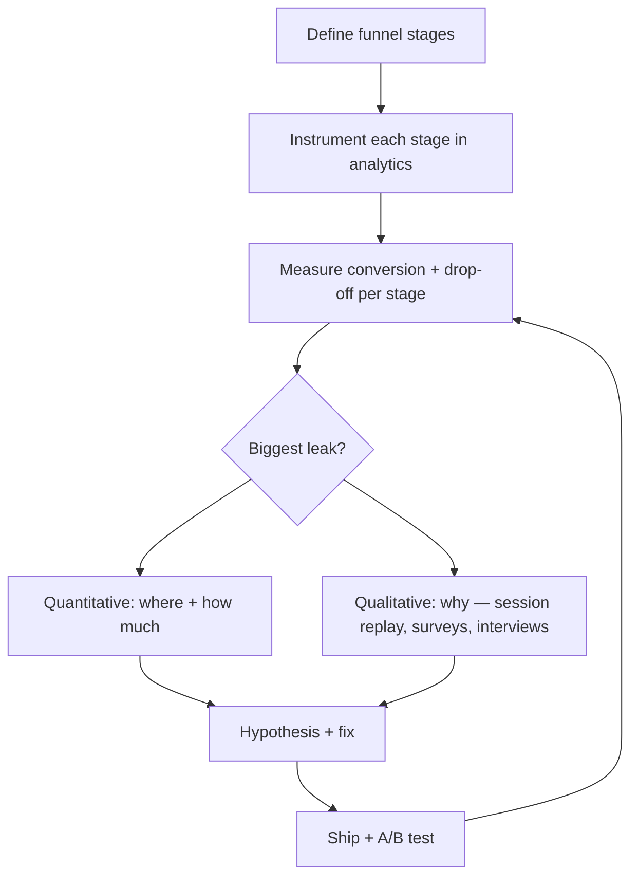

# 46. Conversion Funnel

> **Think:** *"Where are users dropping off?"*

---

## The 4 Questions

| Question | Answer |
|----------|--------|
| **What problem does it solve?** | Blind optimization — teams guess what to fix, ship random improvements, and celebrate traffic while conversions flatline. A funnel maps every step from first touch to completed action and quantifies where users leave. |
| **What happens if I ignore it?** | You rebuild search when checkout is broken, run ads into a leaky bucket, A/B test button colors on the wrong step, and burn engineering cycles on features users never reach because they dropped off three steps earlier. |
| **Where would I use it?** | Onboarding flows, checkout, signup, booking, search-to-purchase, B2B sales pipelines, content → trial → paid, any multi-step journey where the outcome matters. |
| **What companies use it?** | Amazon (1-Click exists because checkout drop-off was catastrophic), Airbnb (search → listing view → book → stay), Nykaa (browse → cart → pay → deliver), MakeMyTrip (search → select → traveler details → pay → confirm), every growth team with an analytics stack (Mixpanel, Amplitude, GA4). |

---

## Mental Movie (60 seconds)

10,000 users land on your travel platform homepage this week.

```
10,000  visit homepage
 3,200  search for a trip        (68% dropped — never searched)
 1,600  view a package           (50% dropped — search but no click)
   800  start checkout           (50% dropped — saw package, didn't commit)
   400  enter payment details    (50% dropped — checkout abandonment)
   280  payment succeeds         (30% dropped — payment failures)
   210  booking confirmed        (25% dropped — supplier timeout)
```

**Without funnel thinking:** CEO says "We need more traffic!" Marketing doubles ad spend. Next week: 20,000 visits, 420 confirmed bookings. CAC doubles. Still broken.

**With funnel thinking:** The biggest absolute leak is homepage → search (6,800 users). But the biggest *recoverable* leak might be checkout → payment (400 started, 120 didn't pay) — fixable with saved cards and UPI. One week of checkout work beats one quarter of ads.

Find the leak. Fix the biggest one. Measure again. Repeat.

---

## How It Works

A **conversion funnel** is a staged model of the user journey. Each stage has:
- **Volume** — how many users enter
- **Conversion rate** — % who advance to next stage
- **Drop-off rate** — % who leave
- **Time** — how long between stages (optional but powerful)

### Basic Funnel Shape

```
Stage 1 ████████████████████  10,000  (100%)
Stage 2 ██████                  3,200  (32%)   ← 68% drop
Stage 3 ███                     1,600  (16%)
Stage 4 ██                        800  (8%)
Stage 5 █                         400  (4%)
Stage 6 ▌                         280  (2.8%)
Stage 7 ▌                         210  (2.1%)  ← North Star event
```

### Funnel + Diagnosis Loop



**Key ingredients:**
1. **Clear stage definitions** — "started checkout" must mean the same thing in code and analytics
2. **Consistent cohorts** — compare same traffic source, device, segment
3. **Absolute vs relative drops** — 50% drop at step 2 with 10,000 users beats 80% drop at step 6 with 100 users
4. **Segment the funnel** — mobile vs desktop, new vs returning, organic vs paid often tell different stories
5. **Connect to NSM** — funnel bottom should be your North Star event (completed booking, not "clicked pay")

---

## Real-World Examples

### Your Travel Platform

**Scenario:** Funnel for domestic package bookings (last 30 days):

| Stage | Users | Step conversion | Cumulative |
|-------|------:|----------------:|-----------:|
| Homepage visit | 50,000 | — | 100% |
| Search executed | 18,000 | 36% | 36% |
| Package detail viewed | 9,000 | 50% | 18% |
| Checkout started | 3,600 | 40% | 7.2% |
| Payment attempted | 2,520 | 70% | 5.0% |
| Booking confirmed | 1,890 | 75% | 3.8% |

**Analysis:**
- **Homepage → Search (64% drop):** Value prop unclear? Slow load? Wrong audience from ads?
- **Package view → Checkout (60% drop):** Price shock? Missing trust signals? No price lock?
- **Payment → Confirmed (25% drop):** Supplier API failures — engineering problem, not marketing

**Priority:** Fix supplier confirmation (directly impacts NSM and NPS). In parallel, add "total price includes taxes" on package cards to reduce checkout abandonment.

### Nykaa

**Scenario:** Beauty purchase funnel during a sale.

| Stage | Insight |
|-------|---------|
| Browse → Product page | High traffic, good CTR on hero products |
| Product page → Add to cart | Drop when shade/size unclear — **JTBD anxiety** |
| Cart → Payment | Drop when delivery ETA > 5 days |
| Payment → Delivered | Drop from payment failures + address issues |

Nykaa attacked cart abandonment with: saved addresses, multiple payment options (UPI, COD), delivery date promises, and cart recovery push notifications.

**Lesson:** The funnel isn't linear psychology — each drop has a *reason*. Quantify the drop, then interview users at that step.

### Amazon

**Scenario:** Amazon's famous checkout obsession.

Early e-commerce funnels lost 60–70% of users at checkout (account creation, shipping cost surprise, payment friction). Amazon's response:
- **1-Click ordering** — eliminate repeated entry
- **Prime** — remove shipping cost surprise
- **Saved payment methods** — reduce payment step friction
- **Guest checkout** (eventually industry-wide pressure) — remove account wall

Each innovation targeted a **specific funnel stage**, not "make the site better overall."

---

## When To Use It

| Use funnel analysis when... | Example |
|-----------------------------|---------|
| Traffic grows but outcomes don't | 2× visitors, same bookings — find the leak |
| Prioritizing product vs marketing | Leak at step 2 → product/onboarding; leak at step 1 → targeting |
| Measuring experiment impact | A/B test must move the stage you targeted, not just clicks |
| Diagnosing channel quality | Paid traffic converts 0.5%, organic 4% — funnel by source |
| Post-PMF scaling | Optimize the machine before pouring more in the top |

## When NOT To Use It

| Skip funnel obsession when... | Why |
|-------------------------------|-----|
| Pre-PMF with 50 users/week | Sample size too small; qualitative beats quantitative |
| Funnel stages aren't instrumented | Garbage in — you'll optimize fiction |
| You optimize micro-steps while the product is wrong | PMF problem masquerading as funnel problem |
| Single-step product | Messaging app — it's retention, not funnel |
| You chase 100% conversion | Some drop-off is healthy (wrong audience self-selects out) |

---

## Conversion Funnel vs Related Concepts

| Concept | Difference |
|---------|-----------|
| **North Star Metric** | NSM is the outcome; funnel explains how users get there (or don't) |
| **Jobs To Be Done** | JTBD explains *why* users drop; funnel shows *where* |
| **Product Market Fit** | No funnel fix saves a product nobody wants — check PMF first |
| **A/B testing** | A/B tests validate funnel fixes; funnel tells you what to test |
| **CAC / LTV** | Funnel conversion directly impacts CAC efficiency (Module 8) |

**Rule of thumb:** Fix the **largest recoverable leak** closest to the money — usually the bottom of the funnel has higher intent and better ROI than top-of-funnel tweaks.

---

## Application Checklist

- [ ] Define 5–8 funnel stages from first touch to North Star event
- [ ] Instrument each stage (same event names in code and analytics)
- [ ] Build funnel dashboard with step conversion + cumulative conversion
- [ ] Segment by device, source, new/returning, and core JTBD segment
- [ ] For top 2 drop-off stages: session replays + 5 user interviews each
- [ ] Prioritize fixes by: (drop-off %) × (stage volume) × (feasibility)
- [ ] A/B test one stage at a time — don't change checkout and homepage simultaneously
- [ ] Re-measure weekly; watch for leaks shifting downstream ("waterbed effect")

---

## Problem Simulation

**Situation:** Your travel platform runs a funnel experiment after Module 7 learnings.

**Before (March):**
| Stage | Users | Step conv. |
|-------|------:|-----------:|
| Visit | 40,000 | — |
| Search | 14,000 | 35% |
| Package view | 7,000 | 50% |
| Checkout start | 2,100 | 30% |
| Payment success | 1,470 | 70% |
| Confirmed booking | 1,030 | 70% |

**Changes made (April):**
- Redesigned homepage with "Weekend getaways under ₹15K" (JTBD-aligned)
- Added UPI + saved cards at checkout
- Fixed supplier timeout bug (circuit breaker from Module 1)

**After (April):**
| Stage | Users | Step conv. |
|-------|------:|-----------:|
| Visit | 40,000 | — |
| Search | 20,000 | 50% |
| Package view | 8,000 | 40% |
| Checkout start | 3,200 | 40% |
| Payment success | 2,880 | 90% |
| Confirmed booking | 2,592 | 90% |

**Questions:**
1. Which change likely caused which improvement?
2. Package view step conversion *fell* (50% → 40%). Is that bad?
3. What's the new overall conversion (visit → confirmed)?
4. NSM is "confirmed bookings per MAU." MAU was 25,000 in March, 28,000 in April. Did NSM improve?
5. What would you investigate next?

<details>
<summary>Answers</summary>

1. **Homepage → Search (35%→50%):** JTBD-aligned homepage. **Payment success (70%→90%):** UPI + saved cards. **Confirmed (70%→90%):** supplier timeout fix (circuit breaker). Checkout start (30%→40%) may be combined effect of better packages + trust.
2. **Not necessarily bad.** More users entered package view (7K→8K) from a larger search pool. The *absolute* package viewers increased. Step conversion can fall if search quality is broader — check time-on-page and checkout start (which rose 2,100→3,200). Net: good.
3. **March:** 1,030 / 40,000 = **2.58%**. **April:** 2,592 / 40,000 = **6.48%** — 2.5× improvement.
4. **March NSM:** 1,030 / 25,000 = **4.1%**. **April NSM:** 2,592 / 28,000 = **9.3%** — more than doubled. Strong signal you're delivering more value per active user.
5. **Next investigations:** (a) Why do 50% of visitors still not search? (b) Segment funnel by traffic source — is paid still leaky? (c) Guardrails: cancellation rate, margin per booking, support tickets. (d) Double down on what's working before scaling ad spend.

</details>

---

## Key Takeaway

A funnel turns "users aren't converting" into "340 users abandoned at payment because UPI wasn't available." That's an engineering ticket, not a strategy debate. Measure the stages, fix the biggest leak, connect it to your North Star — then repeat.

**Next:** [Module 8 — Business Thinking](../module-08-business-thinking/) — your funnel converts users; now ask whether each customer is worth more than they cost to acquire.
