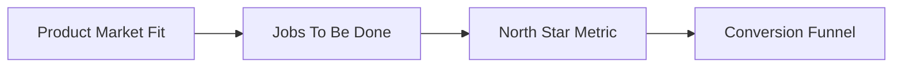

# Module 7: Product Thinking

Build the right thing, not just build things right.

> **Think like this:** *"Do people actually need this? What job are they hiring us for? What single metric proves we're delivering value? Where are they dropping off?"*

## Topics

| # | Topic | One-line mental model | Read time |
|---|-------|----------------------|-----------|
| 43 | [Product Market Fit](./43-product-market-fit.md) | "Do people actually need this?" | ~12 min |
| 44 | [Jobs To Be Done](./44-jobs-to-be-done.md) | "What job is the customer hiring my product for?" | ~12 min |
| 45 | [North Star Metric](./45-north-star-metric.md) | "What single metric matters most?" | ~12 min |
| 46 | [Conversion Funnel](./46-conversion-funnel.md) | "Where are users dropping off?" | ~12 min |

## Suggested Learning Order

These four concepts stack on each other:



1. **Product Market Fit** — validate that real demand exists before you scale
2. **Jobs To Be Done** — understand *why* customers choose you, not just *what* they click
3. **North Star Metric** — align the team on the one number that measures value delivered
4. **Conversion Funnel** — find and fix the biggest leaks between awareness and action

## Module Simulation

After finishing all 4 topics, run this scenario (answers at bottom of each topic doc):

> **Monday 10 AM.** Your travel platform has 50K monthly visitors but only 200 bookings. Nykaa just launched a "travel-size beauty kit" bundle for vacationers. Amazon's "Book flights + hotels" widget appears in search results for "Goa trip." Your CEO says: "We need more features." Your CTO says: "We need better infrastructure." Your growth lead says: "We need more ads."

Use PMF to decide if the problem is demand or product. Use JTBD to reframe what you're building. Use the North Star to pick what to optimize. Use the funnel to find where users actually leave.

## PDFs

Generated PDFs live in [pdf/](./pdf/). Regenerate:

```bash
python3 md_to_pdf.py --dir learning/module-07-product-thinking --force
```

## Previous Module

**[Module 6: Infrastructure](../module-06-infrastructure/)** — DNS, reverse proxy, SSL/TLS, containers, orchestration, and CI/CD.

## Next Module

**[Module 8: Business Thinking](../module-08-business-thinking/)** — CAC, LTV, churn, and network effects — the numbers behind sustainable products.
